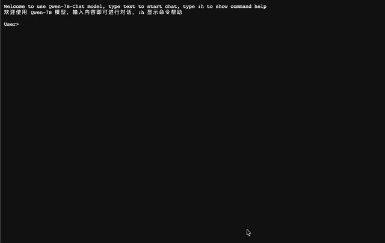

<p align="left">
    <a href="README_CN.md">中文</a>&nbsp ｜ &nbspEnglish&nbsp ｜ &nbsp<a href="README_JA.md">日本語</a> ｜ &nbsp<a href="README_FR.md">Français</a>
</p>
<br><br>

<p align="center">
    
<p>
<br>

<p align="center">
        🤗 <a href="https://huggingface.co/Qwen">Hugging Face</a>&nbsp&nbsp | &nbsp&nbsp🤖 <a href="https://modelscope.cn/organization/qwen">ModelScope</a>&nbsp&nbsp | &nbsp&nbsp 📑 <a href="https://arxiv.org/abs/2309.16609">Paper</a> &nbsp&nbsp ｜ &nbsp&nbsp🖥️ <a href="https://modelscope.cn/studios/qwen/Qwen-14B-Chat-Demo/summary">Demo</a>
<br>
<a href="assets/wechat.png">WeChat (微信)</a>&nbsp&nbsp ｜ &nbsp&nbsp DingTalk (钉钉) &nbsp&nbsp | &nbsp&nbsp<a href="https://discord.gg/z3GAxXZ9Ce">Discord</a>&nbsp&nbsp
</p>
<br><br>

|     |                                                              Qwen-Chat                                                               |                                                                Qwen-Chat (Int4)                                                                |                        Qwen-Chat (Int8)                         |                                                            Qwen                                                            |
|-----|:------------------------------------------------------------------------------------------------------------------------------------:|:----------------------------------------------------------------------------------------------------------------------------------------------:|:---------------------------------------------------------------:|:--------------------------------------------------------------------------------------------------------------------------:|
| 7B  |  <a href="https://modelscope.cn/models/qwen/Qwen-7B-Chat/summary">🤖</a>  <a href="https://huggingface.co/Qwen/Qwen-7B-Chat">🤗</a>  |  <a href="https://modelscope.cn/models/qwen/Qwen-7B-Chat-Int4/summary">🤖</a>  <a href="https://huggingface.co/Qwen/Qwen-7B-Chat-Int4">🤗</a>  | <a href="https://modelscope.cn/models/qwen/Qwen-7B-Chat-Int8/summary">🤖</a>  <a href="https://huggingface.co/Qwen/Qwen-7B-Chat-Int8">🤗</a>  |  <a href="https://modelscope.cn/models/qwen/Qwen-7B/summary">🤖</a>  <a href="https://huggingface.co/Qwen/Qwen-7B">🤗</a>  |
| 14B | <a href="https://modelscope.cn/models/qwen/Qwen-14B-Chat/summary">🤖</a>  <a href="https://huggingface.co/Qwen/Qwen-14B-Chat">🤗</a> | <a href="https://modelscope.cn/models/qwen/Qwen-14B-Chat-Int4/summary">🤖</a>  <a href="https://huggingface.co/Qwen/Qwen-14B-Chat-Int4">🤗</a> | <a href="https://modelscope.cn/models/qwen/Qwen-14B-Chat-Int8/summary">🤖</a>  <a href="https://huggingface.co/Qwen/Qwen-14B-Chat-Int8">🤗</a> | <a href="https://modelscope.cn/models/qwen/Qwen-14B/summary">🤖</a>  <a href="https://huggingface.co/Qwen/Qwen-14B">🤗</a> |


We opensource our **Qwen** series, now including **Qwen**, the base language models, namely **Qwen-7B** and **Qwen-14B**, as well as **Qwen-Chat**, the chat models, namely **Qwen-7B-Chat** and **Qwen-14B-Chat**. Links are on the above table. Click them and check the model cards. Also, we release the **[technical report](https://arxiv.org/abs/2309.16609)**. Please click the paper link and check it out!

In brief, we have strong base language models, which have been stably pretrained for up to 3 trillion tokens of multilingual data with a wide coverage of domains, languages (with a focus on Chinese and English), etc. They are able to achieve competitive performance on benchmark datasets. Additionally, we have chat models that are aligned with human preference based on SFT and RLHF (not released yet), which are able to chat, create content, extract information, summarize, translate, code, solve math problems, and so on, and are able to use tools, play as agents, or even play as code interpreters, etc.

In this repo, you can figure out:

* Quickstart with Qwen, and enjoy the simple inference.
* Details about the quantization models, including GPTQ and KV cache quantization.
* Statistics of inference performance, including speed and memory.
* Tutorials on finetuning, including full-parameter tuning, LoRA, and Q-LoRA.
* Instructions on deployment, with the example of vLLM and FastChat.
* Instructions on building demos, including WebUI, CLI demo, etc.
* Introduction to DashScope API service, as well as the instructions on building an OpenAI-style API for your model.
* Information about Qwen for tool use, agent, and code interpreter
* Statistics of long-context understanding evaluation
* License agreement
* ...

Also, if you meet problems, turn to [FAQ](FAQ.md) for help first. Still feeling struggled? Feel free to shoot us issues (better in English so that more people can understand you)! If you would like to help us, send us pull requests with no hesitation! We are always excited about PR! 

Would like to chat with us or date us coffee time? Welcome to our Discord or WeChat! 
<br><br>

## News and Updates

* 2023.10.17 We release the Int8 quantized model **Qwen-7B-Chat-Int8** and **Qwen-14B-Chat-Int8**. 
* 2023.9.25 🔥 We release **Qwen-14B** and **Qwen-14B-Chat** on ModelScope and Hugging Face, along with [qwen.cpp](https://github.com/QwenLM/qwen.cpp) and [Qwen-Agent](https://github.com/QwenLM/Qwen-Agent). Codes and checkpoints of **Qwen-7B** and **Qwen-7B-Chat** are also updated. **PLEASE PULL THE LATEST VERSION!**
    - Compared to **Qwen-7B** (original), **Qwen-7B** uses more training tokens, increasing from 2.2T tokens to 2.4T tokens, while the context length extends from 2048 to 8192. The Chinese knowledge and coding ability of **Qwen-7B** have been further improved.
* 2023.9.12 We now support finetuning on the Qwen-7B models, including full-parameter finetuning, LoRA and Q-LoRA.
* 2023.8.21 We release the Int4 quantized model for Qwen-7B-Chat, **Qwen-7B-Chat-Int4**, which requires low memory costs but achieves improved inference speed. Besides, there is no significant performance degradation on the benchmark evaluation.
* 2023.8.3 We release both **Qwen-7B** and **Qwen-7B-Chat** on ModelScope and Hugging Face. We also provide a technical memo for more details about the model, including training details and model performance.
<br>

## Performance

Qwen-14B and Qwen-7B (this is the new version trained with more tokens and the context length is extended from 2048 to 8192) outperform the baseline models of similar model sizes on a series of benchmark datasets, e.g., MMLU, C-Eval, GSM8K, MATH, HumanEval, MBPP, BBH, etc., which evaluate the models' capabilities on natural language understanding, mathematic problem solving, coding, etc. However, even Qwen-14B still significantly fall behind GPT-3.5, let alone GPT-4. See the results below. 

<p align="left">
    
<p>
<br>

| Model              |   MMLU   |  C-Eval  |  GSM8K   |   MATH   | HumanEval |   MBPP   |   BBH    |  CMMLU   |
|:-------------------|:--------:|:--------:|:--------:|:--------:|:---------:|:--------:|:--------:|:--------:|
|                    |  5-shot  |  5-shot  |  8-shot  |  4-shot  |  0-shot   |  3-shot  |  3-shot  |  5-shot  |
| LLaMA2-7B          |   46.8   |   32.5   |   16.7   |   3.3    |   12.8    |   20.8   |   38.2   |   31.8   |
| LLaMA2-13B         |   55.0   |   41.4   |   29.6   |   5.0    |   18.9    |   30.3   |   45.6   |   38.4   |
| LLaMA2-34B         |   62.6   |    -     |   42.2   |   6.2    |   22.6    |   33.0   |   44.1   |    -     |
| ChatGLM2-6B        |   47.9   |   51.7   |   32.4   |   6.5    |     -     |    -     |   33.7   |    -     |
| InternLM-7B        |   51.0   |   53.4   |   31.2   |   6.3    |   10.4    |   14.0   |   37.0   |   51.8   |
| InternLM-20B       |   62.1   |   58.8   |   52.6   |   7.9    |   25.6    |   35.6   |   52.5   |   59.0   |
| Baichuan2-7B       |   54.7   |   56.3   |   24.6   |   5.6    |   18.3    |   24.2   |   41.6   |   57.1   |
| Baichuan2-13B      |   59.5   |   59.0   |   52.8   |   10.1   |   17.1    |   30.2   |   49.0   |   62.0   |
| Qwen-7B (original) |   56.7   |   59.6   |   51.6   |   10.4   |   24.4    |   31.2   |   40.6   |   58.8   |
| **Qwen-7B**        |   58.2   |   63.5   |   51.7   |   11.6   |   29.9    |   31.6   |   45.0   |   62.2   |
| **Qwen-14B**       | **66.3** | **72.1** | **61.3** | **24.8** | **32.3**  | **40.8** | **53.4** | **71.0** |

For all compared models, we report the best scores between their official reported results and [OpenCompass](https://opencompass.org.cn/leaderboard-llm). 

For more experimental results (detailed model performance on more benchmark datasets) and details, please refer to our technical report by clicking [here](https://qianwen-res.oss-cn-beijing.aliyuncs.com/QWEN_TECHNICAL_REPORT.pdf).
<br><br>

## Requirements

* python 3.8 and above
* pytorch 1.12 and above, 2.0 and above are recommended
* transformers 4.32 and above
* CUDA 11.4 and above are recommended (this is for GPU users, flash-attention users, etc.)
<br>

## Quickstart

Below, we provide simple examples to show how to use Qwen-Chat with 🤖 ModelScope and 🤗 Transformers.

Before running the code, make sure you have setup the environment and installed the required packages. Make sure you meet the above requirements, and then install the dependent libraries.

```bash
pip install -r requirements.txt
```

If your device supports fp16 or bf16, we recommend installing [flash-attention](https://github.com/Dao-AILab/flash-attention) (**we support flash attention 2 now.**) for higher efficiency and lower memory usage. (**flash-attention is optional and the project can run normally without installing it**)

```bash
git clone https://github.com/Dao-AILab/flash-attention
cd flash-attention && pip install .
# Below are optional. Installing them might be slow.
# pip install csrc/layer_norm
# pip install csrc/rotary
```

Now you can start with ModelScope or Transformers.

### 🤗 Transformers

To use Qwen-Chat for the inference, all you need to do is to input a few lines of codes as demonstrated below. Remember to pass in the correct model names or paths, such as "Qwen/Qwen-7B-Chat" and "Qwen/Qwen-14B-Chat". However, **please make sure that you are using the latest code.**

```python
from transformers import AutoModelForCausalLM, AutoTokenizer
from transformers.generation import GenerationConfig

# Model names: "Qwen/Qwen-7B-Chat", "Qwen/Qwen-14B-Chat"
tokenizer = AutoTokenizer.from_pretrained("Qwen/Qwen-7B-Chat", trust_remote_code=True)

# use bf16
# model = AutoModelForCausalLM.from_pretrained("Qwen/Qwen-7B-Chat", device_map="auto", trust_remote_code=True, bf16=True).eval()
# use fp16
# model = AutoModelForCausalLM.from_pretrained("Qwen/Qwen-7B-Chat", device_map="auto", trust_remote_code=True, fp16=True).eval()
# use cpu only
# model = AutoModelForCausalLM.from_pretrained("Qwen/Qwen-7B-Chat", device_map="cpu", trust_remote_code=True).eval()
# use auto mode, automatically select precision based on the device.
model = AutoModelForCausalLM.from_pretrained(
    "Qwen/Qwen-7B-Chat",
    device_map="auto",
    trust_remote_code=True
).eval()

# Specify hyperparameters for generation. But if you use transformers>=4.32.0, there is no need to do this.
# model.generation_config = GenerationConfig.from_pretrained("Qwen/Qwen-7B-Chat", trust_remote_code=True)

# 1st dialogue turn
response, history = model.chat(tokenizer, "你好", history=None)
print(response)
# 你好！很高兴为你提供帮助。

# 2nd dialogue turn
response, history = model.chat(tokenizer, "给我讲一个年轻人奋斗创业最终取得成功的故事。", history=history)
print(response)
# 这是一个关于一个年轻人奋斗创业最终取得成功的故事。
# 故事的主人公叫李明，他来自一个普通的家庭，父母都是普通的工人。从小，李明就立下了一个目标：要成为一名成功的企业家。
# 为了实现这个目标，李明勤奋学习，考上了大学。在大学期间，他积极参加各种创业比赛，获得了不少奖项。他还利用课余时间去实习，积累了宝贵的经验。
# 毕业后，李明决定开始自己的创业之路。他开始寻找投资机会，但多次都被拒绝了。然而，他并没有放弃。他继续努力，不断改进自己的创业计划，并寻找新的投资机会。
# 最终，李明成功地获得了一笔投资，开始了自己的创业之路。他成立了一家科技公司，专注于开发新型软件。在他的领导下，公司迅速发展起来，成为了一家成功的科技企业。
# 李明的成功并不是偶然的。他勤奋、坚韧、勇于冒险，不断学习和改进自己。他的成功也证明了，只要努力奋斗，任何人都有可能取得成功。

# 3rd dialogue turn
response, history = model.chat(tokenizer, "给这个故事起一个标题", history=history)
print(response)
# 《奋斗创业：一个年轻人的成功之路》
```

Running Qwen pretrained base model is also simple.

<details>
  <summary>Running Qwen</summary>

```python
from transformers import AutoModelForCausalLM, AutoTokenizer
from transformers.generation import GenerationConfig

# Model names: "Qwen/Qwen-7B", "Qwen/Qwen-14B" 
tokenizer = AutoTokenizer.from_pretrained("Qwen/Qwen-7B", trust_remote_code=True)
# use bf16
# model = AutoModelForCausalLM.from_pretrained("Qwen/Qwen-7B", device_map="auto", trust_remote_code=True, bf16=True).eval()
# use fp16
# model = AutoModelForCausalLM.from_pretrained("Qwen/Qwen-7B", device_map="auto", trust_remote_code=True, fp16=True).eval()
# use cpu only
# model = AutoModelForCausalLM.from_pretrained("Qwen/Qwen-7B", device_map="cpu", trust_remote_code=True).eval()
# use auto mode, automatically select precision based on the device.
model = AutoModelForCausalLM.from_pretrained(
    "Qwen/Qwen-7B",
    device_map="auto",
    trust_remote_code=True
).eval()

# Specify hyperparameters for generation. But if you use transformers>=4.32.0, there is no need to do this.
# model.generation_config = GenerationConfig.from_pretrained("Qwen/Qwen-7B", trust_remote_code=True)

inputs = tokenizer('蒙古国的首都是乌兰巴托（Ulaanbaatar）\n冰岛的首都是雷克雅未克（Reykjavik）\n埃塞俄比亚的首都是', return_tensors='pt')
inputs = inputs.to(model.device)
pred = model.generate(**inputs)
print(tokenizer.decode(pred.cpu()[0], skip_special_tokens=True))
# 蒙古国的首都是乌兰巴托（Ulaanbaatar）\n冰岛的首都是雷克雅未克（Reykjavik）\n埃塞俄比亚的首都是亚的斯亚贝巴（Addis Ababa）...
```

</details>

In the event of a network issue while attempting to download model checkpoints and codes from HuggingFace, an alternative approach is to initially fetch the checkpoint from ModelScope and then load it from the local directory as outlined below:

```python
from modelscope import snapshot_download
from transformers import AutoModelForCausalLM, AutoTokenizer

# Downloading model checkpoint to a local dir model_dir
# model_dir = snapshot_download('qwen/Qwen-7B')
# model_dir = snapshot_download('qwen/Qwen-7B-Chat')
# model_dir = snapshot_download('qwen/Qwen-14B')
model_dir = snapshot_download('qwen/Qwen-14B-Chat')

# Loading local checkpoints
# trust_remote_code is still set as True since we still load codes from local dir instead of transformers
tokenizer = AutoTokenizer.from_pretrained(model_dir, trust_remote_code=True)
model = AutoModelForCausalLM.from_pretrained(
    model_dir,
    device_map="auto",
    trust_remote_code=True
).eval()
```

### 🤖 ModelScope

ModelScope is an opensource platform for Model-as-a-Service (MaaS), which provides flexible and cost-effective model service to AI developers. Similarly, you can run the models with ModelScope as shown below:

```python
from modelscope import AutoModelForCausalLM, AutoTokenizer
from modelscope import GenerationConfig

# Model names: "qwen/Qwen-7B-Chat", "qwen/Qwen-14B-Chat"
tokenizer = AutoTokenizer.from_pretrained("qwen/Qwen-7B-Chat", trust_remote_code=True)
model = AutoModelForCausalLM.from_pretrained("qwen/Qwen-7B-Chat", device_map="auto", trust_remote_code=True, fp16=True).eval()
model.generation_config = GenerationConfig.from_pretrained("Qwen/Qwen-7B-Chat", trust_remote_code=True) # 可指定不同的生成长度、top_p等相关超参

response, history = model.chat(tokenizer, "你好", history=None)
print(response)
response, history = model.chat(tokenizer, "浙江的省会在哪里？", history=history) 
print(response)
response, history = model.chat(tokenizer, "它有什么好玩的景点", history=history)
print(response)
```

### Batch Inference
Qwen supports batch inference. With flash-attention enabled, using batch inference can bring a 40% speedup. The example code is shown below:
```python
import torch
from transformers import AutoModelForCausalLM, AutoTokenizer
from transformers import GenerationConfig
from qwen_generation_utils import make_context, decode_tokens, get_stop_words_ids

tokenizer = AutoTokenizer.from_pretrained(
    './',
    pad_token='<|extra_0|>',
    eos_token='<|endoftext|>',
    padding_side='left',
    trust_remote_code=True
)
model = AutoModelForCausalLM.from_pretrained(
    './',
    pad_token_id=tokenizer.pad_token_id,
    device_map="auto",
    trust_remote_code=True
).eval()
model.generation_config = GenerationConfig.from_pretrained('./', pad_token_id=tokenizer.pad_token_id)

all_raw_text = ["我想听你说爱我。", "今天我想吃点啥，甜甜的，推荐下", "我马上迟到了，怎么做才能不迟到"]
batch_raw_text = []
for q in all_raw_text:
    raw_text, _ = make_context(
        tokenizer,
        q,
        system="You are a helpful assistant.",
        max_window_size=model.generation_config.max_window_size,
        chat_format=model.generation_config.chat_format,
    )
    batch_raw_text.append(raw_text)

batch_input_ids = tokenizer(batch_raw_text, padding='longest')
batch_input_ids = torch.LongTensor(batch_input_ids['input_ids']).to(model.device)
batch_out_ids = model.generate(
    batch_input_ids,
    return_dict_in_generate=False,
    generation_config=model.generation_config
)
padding_lens = [batch_input_ids[i].eq(tokenizer.pad_token_id).sum().item() for i in range(batch_input_ids.size(0))]

batch_response = [
    decode_tokens(
        batch_out_ids[i][padding_lens[i]:],
        tokenizer,
        raw_text_len=len(batch_raw_text[i]),
        context_length=(batch_input_ids[i].size(0)-padding_lens[i]),
        chat_format="chatml",
        verbose=False,
        errors='replace'
    ) for i in range(len(all_raw_text))
]
print(batch_response)

response, _ = model.chat(tokenizer, "我想听你说爱我。", history=None)
print(response)

response, _ = model.chat(tokenizer, "今天我想吃点啥，甜甜的，推荐下", history=None)
print(response)

response, _ = model.chat(tokenizer, "我马上迟到了，怎么做才能不迟到", history=None)
print(response)
```

### CPU

To deploy our models on CPU, we strongly advise you to use [qwen.cpp](https://github.com/QwenLM/qwen.cpp), which is a pure C++ implementation of Qwen and tiktoken. Check the repo for more details!

Also, it is also simple to directly run the model on CPU, which requires your specification of device:

```python
model = AutoModelForCausalLM.from_pretrained("Qwen/Qwen-7B-Chat", device_map="cpu", trust_remote_code=True).eval()
```

However, it is likely that you suffer from extremely low inference efficiency.

### Multiple GPUs

If you suffer from lack of GPU memory and you would like to run the model on more than 1 GPU, you can directly use the default loading method, which is now supported by Transformers. The previous method based on `utils.py` is deprecated.

However, though this method is simple, the efficiency of the native pipeline parallelism is low. We advise you to use vLLM with FastChat and please read the section for deployment.
<br><br>

## Quantization

### GPTQ

We provide a solution based on [AutoGPTQ](https://github.com/PanQiWei/AutoGPTQ), and release the Int4 quantized models, which achieve nearly lossless model effects but improved performance on both memory costs and inference speed.

Here we demonstrate how to use our provided quantized models for inference. Before you start, make sure you meet the requirements of auto-gptq (e.g., torch 2.0 and above, transformers 4.32.0 and above, etc.) and install the required packages:

```bash
pip install auto-gptq optimum
```

If you meet problems installing `auto-gptq`, we advise you to check out the official [repo](https://github.com/PanQiWei/AutoGPTQ) to find a wheel.

Then you can load the quantized model easily and run inference as same as usual:

```python
# Model names: "Qwen/Qwen-7B-Chat-Int4", "Qwen/Qwen-14B-Chat-Int4"
model = AutoModelForCausalLM.from_pretrained(
    "Qwen/Qwen-7B-Chat-Int4",
    device_map="auto",
    trust_remote_code=True
).eval()
response, history = model.chat(tokenizer, "Hi", history=None)
```

We illustrate the model performance of both BF16, Int8 and Int4 models on the benchmark, and we find that the quantized model does not suffer from significant performance degradation. Results are shown below:

| Quantization         | MMLU | CEval (val) | GSM8K | Humaneval |
|----------------------|:----:|:-----------:|:-----:|:---------:|
| Qwen-7B-Chat (BF16)  | 55.8 |    59.7     | 50.3  |   37.2    |
| Qwen-7B-Chat (Int8)  | 55.4 |    59.4     | 48.3  |   34.8    |
| Qwen-7B-Chat (Int4)  | 55.1 |    59.2     | 49.7  |   29.9    |
| Qwen-14B-Chat (BF16) | 64.6 |    69.8     | 60.1  |   43.9    |
| Qwen-14B-Chat (Int8) | 63.6 |    68.6     | 60.0	 |   48.2    |
| Qwen-14B-Chat (Int4) | 63.3 |    69.0     | 59.8  |   45.7    |

### Quantization of KV cache

> NOTE: Please be aware that due to the internal mechanism of Hugging Face, the support files for this functionality 
> (i.e., `cache_autogptq_cuda_256.cpp` and `cache_autogptq_cuda_kernel_245.cu`) may be missing. Please manually download
> them from the Hugging Face Hub and place them into the same folder as the other module files.

Attention KV cache can be quantized and compressed for storage, to get a higher sample throughput. The parameters of 'use_cache_quantization' and 'use_cache_kernel' are provided to control kv-cache-quantization behavior
When use_cache_quantization=True and use_cache_kernel=True, kv-cache-quantization will be enabled.
The specific use method is as follows:
```python
model = AutoModelForCausalLM.from_pretrained(
    "Qwen/Qwen-7B-Chat",
     device_map="auto",
     trust_remote_code=True,
     use_cache_quantization=True,
     use_cache_kernel=True,
     use_flash_attn=False
)
```
Attention:
Currently, kv-cache-quantization and flash attn cannot be turned on at the same time.
If you enable kv cache quantization and use_flash_attn at the same time (use_flash_attn=True, use_cache_quantization=True, use_cache_kernel=True), use_flash_attn is disabled by default(use_flash_attn=false).

We have verified that the use of the quantized int8-kvcache model does not suffer from significant performance degradation in downstream evaluation. In addition, we evaluate its performance focusing on the memory footprint. 
The profiling runs on a single A100-SXM4-80G GPU with PyTorch 2.0.1 and CUDA 11.4. 
We use BF16 models, and generate 1024 tokens (seq-length=1024) by default, and oom indicates out of memory.

With kv-cache quantization turned on, we can run a larger batch size(bs).

| USE KVCache |  bs=1  |  bs=4  | bs=16  | bs=32  | bs=64  | bs=100 |
|-------------|:------:|:------:|:------:|:------:|:------:|:------:|
| no          | 16.3GB | 24.1GB | 31.7GB | 48.7GB |  oom   |  oom   |
| yes         | 15.5GB | 17.2GB | 22.3GB | 30.2GB | 48.2GB | 72.4GB |

With kv-cache quantization turned on, the model can save more memory when generate longer seq-length (sl, number of tokens generated) at infer.

| USE KVCache | sl=512 | sl=1024 | sl=2048 | sl=4096 | sl=8192 |
|-------------|:------:|:-------:|:-------:|:-------:|:-------:|
| no          | 15.2GB | 16.3GB  | 17.6GB  | 19.5GB  | 23.2GB  |
| yes         |  15GB  | 15.5GB  | 15.8GB  | 16.6GB  | 17.6GB  |

The model which turn on the kv-cache quantization will convert the format of layer-past from float to int8, meanwhile the quantianted layer-past will also store quantiantion parameters of current value.
Specific steps are as follows:
1、Quantize key/value
```
    qv,scale,zero_point=quantize_cache_v(v)
```
2、Store into layer_past

Following is the format of quantized layer_past:
```
    layer_past=((q_key,key_scale,key_zero_point),
                (q_value,value_scale,value_zero_point))
```
Bascial format of layer_past:
```
    layer_past=(key,value)
```
If you want to use the attention KV which is quantized, 
you can use the dequantization operation to convert the int8 key/value back to the float format as following:
```
    v=dequantize_cache_torch(qv,scale,zero_point)
```
<br>


## Inference Performance

This section provides the statistics of speed and memory of models in different precisions. The speed and memory profiling are conducted using [this script](https://qianwen-res.oss-cn-beijing.aliyuncs.com/profile.py). 

### Speed

We measured the average inference speed (tokens/s) of generating 2048 and 8192 tokens with the models in the precision of BF16, Int8, and Int4 under the condition of using flash attention v1, v2, or not using it. 

<table>
    <tr>
      <th rowspan="2">Model Size</th><th rowspan="2">Precision</th><th rowspan="2">FlashAttn</th><th colspan="2" align="center">Sequence Length</th>
    </tr>
    <tr>
        <th align="center">2048</th><th align="center">8192</th>
    </tr>
    </tr>
    </tr>
    <tr>
        <th rowspan="9">7B</th><td align="center" rowspan="3">BF16</td><td align="center">v2</td><td align="center">40.93</td><td align="center">36.14</td>
    </tr>
    <tr>
        <td align="center">v1</td><td align="center">40.75</td><td align="center">35.34
    </tr>
    <tr>
        <td align="center">Disabled</td><td align="center">37.55</td><td align="center">33.56
    </tr>
    <tr>
        <td align="center" rowspan="3">Int8</td><td align="center">v2</td><td align="center">37.47</td><td align="center">32.54</td>
    </tr>
    <tr>
        <td align="center">v1</td><td align="center">37.51</td><td align="center">32.39
    </tr>
    <tr>
        <td align="center">Disabled</td><td align="center">37.84</td><td align="center">32.65
    </tr>
    <tr>
        <td align="center" rowspan="3">Int4</td><td align="center">v2</td><td align="center">50.09</td><td align="center">38.61</td>
    </tr>
    <tr>
        <td align="center">v1</td><td align="center">45.98</td><td align="center">36.47
    </tr>
    <tr>
        <td align="center">Disabled</td><td align="center">48.12</td><td align="center">36.70
    </tr>
    <tr>
        <th rowspan="9">14B</th><td align="center" rowspan="3">BF16</td><td align="center">v2</td><td align="center">32.88</td><td align="center">24.87</td>
    </tr>
    <tr>
        <td align="center">v1</td><td align="center">32.76</td><td align="center">28.89
    </tr>
    <tr>
        <td align="center">Disabled</td><td align="center">29.32</td><td align="center">22.91
    </tr>
    <tr>
        <td align="center" rowspan="3">Int8</td><td align="center">v2</td><td align="center">29.28</td><td align="center">24.22</td>
    </tr>
    <tr>
        <td align="center">v1</td><td align="center">28.31</td><td align="center">23.87
    </tr>
    <tr>
        <td align="center">Disabled</td><td align="center">31.12</td><td align="center">24.60
    </tr>
    <tr>
        <td align="center" rowspan="3">Int4</td><td align="center">v2</td><td align="center">38.72</td><td align="center">27.33</td>
    </tr>
    <tr>
        <td align="center">v1</td><td align="center">37.81</td><td align="center">26.46
    </tr>
    <tr>
        <td align="center">Disabled</td><td align="center">37.65</td><td align="center">26.00
    </tr>
</table>


In detail, the setting of profiling is encoding 2048 tokens and generating 8192 new tokens. The profiling runs on a single A100-SXM4-80G GPU with PyTorch 2.0.1 and CUDA 11.8. The inference speed is averaged over the encoded and generated tokens.

Note: The generation speed of the Int4/Int8 models mentioned above is provided by the autogptq library. The current speed of the model loaded using ``AutoModelForCausalLM.from_pretrained`` will be approximately 20% slower. We have reported this issue to the HuggingFace team and will update it promptly if a solution is available.

### GPU Memory Usage

We also profile the peak GPU memory usage for encoding 2048 tokens as context (and generating single token) and generating 8192 tokens (with single token as context) under BF16, Int8 or Int4 quantization level, respectively. The results (GB) are shown below.

<table>
    <tr>
      <th rowspan="2">Model Size</th><th rowspan="2">Precision</th><th colspan="2" align="center">Sequence Length</th>
    </tr>
    <tr>
        <th align="center">2048</th><th align="center">8192</th>
    </tr>
    </tr>
    </tr>
    <tr>
        <th rowspan="3">7B</th><td align="center">BF16</td><td align="center">16.99</td><td align="center">22.53</td>
    </tr>
    <tr>
        <td align="center">Int8</td><td align="center">11.20</td><td align="center">16.62
    </tr>
    <tr>
        <td align="center">Int4</td><td align="center">8.21</td><td align="center">13.63</td>
    </tr>
    <tr>
        <th rowspan="3">14B</th><td align="center">BF16</td><td align="center">30.15</td><td align="center">38.94</td>
    </tr>
    <tr>
        <td align="center">Int8</td><td align="center">18.81</td><td align="center">27.54
    </tr>
    <tr>
        <td align="center">Int4</td><td align="center">13.01</td><td align="center">21.79</td>
    </tr>
</table>
<br>


## Finetuning

### Usage
Now we provide the official training script, `finetune.py`, for users to finetune the pretrained model for downstream applications in a simple fashion. Additionally, we provide shell scripts to launch finetuning with no worries. This script supports the training with [DeepSpeed](https://github.com/microsoft/DeepSpeed) and [FSDP](https://engineering.fb.com/2021/07/15/open-source/fsdp/). The shell scripts that we provide use DeepSpeed (Note: this may have conflicts with the latest version of pydantic) and Peft. You can install them by:
```bash
pip install peft deepspeed
```

To prepare your training data, you need to put all the samples into a list and save it to a json file. Each sample is a dictionary consisting of an id and a list for conversation. Below is a simple example list with 1 sample:
```json
[
  {
    "id": "identity_0",
    "conversations": [
      {
        "from": "user",
        "value": "你好"
      },
      {
        "from": "assistant",
        "value": "我是一个语言模型，我叫通义千问。"
      }
    ]
  }
]
```

After data preparation, you can use the provided shell scripts to run finetuning. Remember to specify the path to the data file, `$DATA`.

The finetuning scripts allow you to perform:
- Full-parameter finetuning
- LoRA
- Q-LoRA

Full-parameter finetuning requires updating all parameters in the whole training process. To launch your training, run the following script:

```bash
# Distributed training. We do not provide single-GPU training script as the insufficient GPU memory will break down the training.
sh finetune/finetune_ds.sh
```

Remember to specify the correct model name or path, the data path, as well as the output directory in the shell scripts. Another thing to notice is that we use DeepSpeed ZeRO 3 in this script. If you want to make changes, just remove the argument `--deepspeed` or make changes in the DeepSpeed configuration json file based on your requirements. Additionally, this script supports mixed-precision training, and thus you can use `--bf16 True` or `--fp16 True`. Remember to use DeepSpeed when you use fp16 due to mixed precision training. 
Empirically we advise you to use bf16 to make your training consistent with our pretraining and alignment if your machine supports bf16, and thus we use it by default.

Similarly, to run LoRA, use another script to run as shown below. Before you start, make sure that you have installed `peft`. Also, you need to specify your paths to your model, data, and output. We advise you to use absolute path for your pretrained model. This is because LoRA only saves the adapter and the absolute path in the adapter configuration json file is used for finding out the pretrained model to load. Also, this script support both bf16 and fp16.

```bash
# Single GPU training
sh finetune/finetune_lora_single_gpu.sh
# Distributed training
sh finetune/finetune_lora_ds.sh
```

In comparison with full-parameter finetuning, LoRA ([paper](https://arxiv.org/abs/2106.09685)) only updates the parameters of adapter layers but keeps the original large language model layers frozen. This allows much fewer memory costs and thus fewer computation costs. 

Note that if you use LoRA to finetune the base language model, e.g., Qwen-7B, instead of chat models, e.g., Qwen-7B-Chat, the script automatically switches the embedding and output layer as trainable parameters. This is because the base language model has no knowledge of special tokens brought by ChatML format. Thus these layers should be updated for the model to understand and predict the tokens. Or in another word, if your training brings in special tokens in LoRA, you should set the layers to trainable parameters by setting `modules_to_save` inside the code. Also, if we have these parameters trainable, it is not available to use ZeRO 3, and this is why we use ZeRO 2 in the script by default. If you do not have new trainable parameters, you can switch to ZeRO 3 by changing the DeepSpeed configuration file. Additionally, we find that there is a significant gap between the memory footprint of LoRA with and without these trainable parameters. Therefore, if you have trouble with memory, we advise you to LoRA finetune the chat models. Check the profile below for more information. 

If you still suffer from insufficient memory, you can consider Q-LoRA ([paper](https://arxiv.org/abs/2305.14314)), which uses the quantized large language model and other techniques such as paged attention to allow even fewer memory costs. 

Note: to run single-GPU Q-LoRA training, you may need to install `mpi4py` through `pip` or `conda`.

To run Q-LoRA, directly run the following script:

```bash
# Single GPU training
sh finetune/finetune_qlora_single_gpu.sh
# Distributed training
sh finetune/finetune_qlora_ds.sh
```

For Q-LoRA, we advise you to load our provided quantized model, e.g., Qwen-7B-Chat-Int4. You **SHOULD NOT** use the bf16 models. Different from full-parameter finetuning and LoRA, only fp16 is supported for Q-LoRA. For single-GPU training, we have to use deepspeed for mixed-precision training due to our observation of errors caused by torch amp. Besides, for Q-LoRA, the troubles with the special tokens in LoRA still exist. However, as we only provide the Int4 models for chat models, which means the language model has learned the special tokens of ChatML format, you have no worry about the layers. Note that the layers of the Int4 model should not be trainable, and thus if you introduce special tokens in your training, Q-LoRA might not work.

> NOTE: Please be aware that due to the internal mechanisms of Hugging Face, certain non-Python files (e.g., `*.cpp` and `*.cu`) 
> may be missing from the saved checkpoint. You may need to manually copy them to the directory containing other files.

Different from full-parameter finetuning, the training of both LoRA and Q-LoRA only saves the adapter parameters. Suppose your training starts from Qwen-7B, you can load the finetuned model for inference as shown below:

```python
from peft import AutoPeftModelForCausalLM

model = AutoPeftModelForCausalLM.from_pretrained(
    path_to_adapter, # path to the output directory
    device_map="auto",
    trust_remote_code=True
).eval()
```

If you want to merge the adapters and save the finetuned model as a standalone model (you can only do this with LoRA, and you CANNOT merge the parameters from Q-LoRA), you can run the following codes:

```python
from peft import AutoPeftModelForCausalLM

model = AutoPeftModelForCausalLM.from_pretrained(
    path_to_adapter, # path to the output directory
    device_map="auto",
    trust_remote_code=True
).eval()

merged_model = model.merge_and_unload()
# max_shard_size and safe serialization are not necessary. 
# They respectively work for sharding checkpoint and save the model to safetensors
merged_model.save_pretrained(new_model_directory, max_shard_size="2048MB", safe_serialization=True)
```

The `new_model_directory` directory will contain the merged model weights and module files. Please note that `*.cu` and `*.cpp` files may be missing in the saved files. If you wish to use the KV cache functionality, please manually copy them. Besides, the tokenizer files are not saved in the new directory in this step. You can copy the tokenizer files or use the following code
```python
from transformers import AutoTokenizer

tokenizer = AutoTokenizer.from_pretrained(
    path_to_adapter, # path to the output directory
    trust_remote_code=True
)

tokenizer.save_pretrained(new_model_directory)
```


Note: For multi-GPU training, you need to specify the proper hyperparameters for distributed training based on your machine. Besides, we advise you to specify your maximum sequence length with the argument `--model_max_length`, based on your consideration of data, memory footprint, and training speed.


### Profiling of Memory and Speed
We profile the GPU memory and training speed of both LoRA (LoRA (emb) refers to training the embedding and output layer, while LoRA has no trainable embedding and output layer) and Q-LoRA in the setup of single-GPU training. In this test, we experiment on a single A100-SXM4-80G GPU, and we use CUDA 11.8 and Pytorch 2.0. Flash attention 2 is applied. We uniformly use a batch size of 1 and gradient accumulation of 8. We profile the memory (GB) and speed (s/iter) of inputs of different lengths, namely 256, 512, 1024, 2048, 4096, and 8192. We also report the statistics of full-parameter finetuning with Qwen-7B on 2 A100 GPUs. We only report the statistics of 256, 512, and 1024 tokens due to the limitation of GPU memory. The statistics are listed below:

<table>
    <tr>
      <th rowspan="2">Model Size</th><th rowspan="2">Method</th><th colspan="6" align="center">Sequence Length</th>
    </tr>
    <tr>
        <th align="center">256</th><th align="center">512</th><th align="center">1024</th><th align="center">2048</th><th align="center">4096</th><th align="center">8192</th>
    </tr>
    </tr>
    </tr>
    <tr>
        <th rowspan="4">7B</th><td>LoRA</td><td align="center">20.1G / 1.2s/it</td><td align="center">20.4G / 1.5s/it</td><td align="center">21.5G / 2.8s/it</td><td align="center">23.8G / 5.2s/it</td><td align="center">29.7G / 10.1s/it</td><td align="center">36.6G / 21.3s/it</td>
    </tr>
    <tr>
        <td>LoRA (emb)</td><td align="center">33.7G / 1.4s/it</td><td align="center">34.1G / 1.6s/it</td><td align="center">35.2G / 2.9s/it</td><td align="center">35.1G / 5.3s/it</td><td align="center">39.2G / 10.3s/it</td><td align="center">48.5G / 21.7s/it</td>
    </tr>
    <tr>
        <td>Q-LoRA</td><td align="center">11.5G / 3.0s/it</td><td align="center">11.5G / 3.0s/it</td><td align="center">12.3G / 3.5s/it</td><td align="center">13.9G / 7.0s/it</td><td align="center">16.9G / 11.6s/it</td><td align="center">23.5G / 22.3s/it</td>
    </tr>
    <tr>
        <td>Full-parameter</td><td align="center">139.2G / 4.0s/it</td><td align="center">148.0G / 4.0s/it</td><td align="center">162.0G / 4.5s/it</td><td align="center">-</td><td align="center">-</td><td align="center">-</td>
    </tr>
    <tr>
        <th rowspan="3">14B</th><td>LoRA</td><td align="center">34.6G / 1.6s/it</td><td align="center">35.1G / 2.4s/it</td><td align="center">35.3G / 4.4s/it</td><td align="center">37.4G / 8.4s/it</td><td align="center">42.5G / 17.0s/it</td><td align="center">55.2G / 36.0s/it</td>
    </tr>
    <tr>
        <td>LoRA (emb)</td><td align="center">51.2 / 1.7s/it</td><td align="center">51.1G / 2.6s/it</td><td align="center">51.5G / 4.6s/it</td><td align="center">54.1G / 8.6s/it</td><td align="center">56.8G / 17.2s/it</td><td align="center">67.7G / 36.3s/it</td>
    </tr>
    <tr>
        <td>Q-LoRA</td><td align="center">18.7G / 5.3s/it</td><td align="center">18.4G / 6.3s/it</td><td align="center">18.9G / 8.2s/it</td><td align="center">19.9G / 11.8s/it</td><td align="center">23.0G / 20.1s/it</td><td align="center">27.9G / 38.3s/it</td>
    </tr>
</table>
<br>

## Deployment

### vLLM 
For deployment and fast inference, we suggest using vLLM with FastChat. Install the packages first:
```bash
pip install vllm
pip install "fschat[model_worker,webui]"
```
Or you can install them from source by `git clone` and `pip install -e .`. We advise you to read their documents if you meet problems in installation. 

To run Qwen with vLLM and FastChat, you need to first launch a controller by:
```bash
python -m fastchat.serve.controller
```

Then you can launch the model worker, which means loading your model for inference. For single GPU inference, you can directly run:
```bash
python -m fastchat.serve.vllm_worker --model-path $model_path --trust-remote-code
```
However, if you hope to run the model on multiple GPUs for faster inference or larger memory, you can use tensor parallelism supported by vLLM. Suppose you run the model on 4 GPUs, the command is shown below:
```bash
python -m fastchat.serve.vllm_worker --model-path $model_path --trust-remote-code --tensor-parallel-size 4
```

After launching your model worker, you can launch a web demo or an OpenAI API as you like. For web demo, run the following command:
```bash
python -m fastchat.serve.gradio_web_server
```
For OpenAI API, check the documentation of our OpenAI API for installation first. Then run the command:
```bash
python -m fastchat.serve.openai_api_server --host localhost --port 8000
```
<br>

## Demo

### Web UI

We provide code for users to build a web UI demo (thanks to @wysaid). Before you start, make sure you install the following packages:

```
pip install -r requirements_web_demo.txt
```

Then run the command below and click on the generated link:

```bash
python web_demo.py
```

<p align="center">
    <br>
    
    <br>
<p>

### CLI Demo

We provide a CLI demo example in `cli_demo.py`, which supports streaming output for the generation. Users can interact with Qwen-7B-Chat by inputting prompts, and the model returns model outputs in the streaming mode. Run the command below:

```bash
python cli_demo.py
```

<p align="center">
    <br>
    
    <br>
<p>
<br>

## API

The most simple way to use Qwen through APIs is DashScope API service through Alibaba Cloud. We give an introduction to the usage. Additionally, we provide a script for you to deploy an OpenAI-style API on your own servers.

### DashScope
DashScope is the large language model API service provided by Alibaba Cloud, which now supports Qwen. Note that the models behind DashScope are in-house versions temporarily without details provided. The services include `qwen-turbo` and `qwen-plus`, where the former one runs faster and the latter achieves better performance. For more information, visit the documentation [here](https://dashscope.aliyun.com).

Please head to the official website [link](https://help.aliyun.com/zh/dashscope/developer-reference/activate-dashscope-and-create-an-api-key?spm=a2c4g.11186623.0.0.6c2774fahtfXdn) to create a DashScope account and obtain the API key (AK). We recommend setting the AK with an environment variable:
```bash
export DASHSCOPE_API_KEY="YOUR_DASHSCOPE_API_KEY"
```
Then please install the packages and click [here](https://help.aliyun.com/zh/dashscope/developer-reference/install-dashscope-sdk) for the documentation. If you use Python, you can install DashScope with pip:
```bash
pip install dashscope
```
If you use JAVA SDK, you can install it in this way:
```xml
<!-- https://mvnrepository.com/artifact/com.alibaba/dashscope-sdk-java -->
<dependency>
    <groupId>com.alibaba</groupId>
    <artifactId>dashscope-sdk-java</artifactId>
    <version>the-latest-version</version>
</dependency>
```
The simplest way to use DashScope is the usage with messages, which is similar to OpenAI API. The example is demonstrated below:
```python
import random
from http import HTTPStatus
from dashscope import Generation


def call_with_messages():
    messages = [{'role': 'system', 'content': 'You are a helpful assistant.'},
                {'role': 'user', 'content': '如何做西红柿鸡蛋？'}]
    gen = Generation()
    response = gen.call(
        Generation.Models.qwen_turbo,
        messages=messages,
        seed=random.randint(1, 10000),  # set the random seed, optional, default to 1234 if not set
        result_format='message',  # set the result to be "message" format.
    )
    return response


if __name__ == '__main__':
    response = call_with_messages()
    if response.status_code == HTTPStatus.OK:
        print(response)
    else:
        print('Request id: %s, Status code: %s, error code: %s, error message: %s' % (
            response.request_id, response.status_code,
            response.code, response.message
        ))
```
For more usages, please visit the official website for more details.

### OpenAI API

We provide methods to deploy local API based on OpenAI API (thanks to @hanpenggit). Before you start, install the required packages:

```bash
pip install fastapi uvicorn openai "pydantic>=2.3.0" sse_starlette
```

Then run the command to deploy your API:

```bash
python openai_api.py
```

You can change your arguments, e.g., `-c` for checkpoint name or path, `--cpu-only` for CPU deployment, etc. If you meet problems launching your API deployment, updating the packages to the latest version can probably solve them.

Using the API is also simple. See the example below:

```python
import openai
openai.api_base = "http://localhost:8000/v1"
openai.api_key = "none"

# create a request activating streaming response
for chunk in openai.ChatCompletion.create(
    model="Qwen",
    messages=[
        {"role": "user", "content": "你好"}
    ],
    stream=True 
    # Specifying stop words in streaming output format is not yet supported and is under development.
):
    if hasattr(chunk.choices[0].delta, "content"):
        print(chunk.choices[0].delta.content, end="", flush=True)

# create a request not activating streaming response
response = openai.ChatCompletion.create(
    model="Qwen",
    messages=[
        {"role": "user", "content": "你好"}
    ],
    stream=False,
    stop=[] # You can add custom stop words here, e.g., stop=["Observation:"] for ReAct prompting.
)
print(response.choices[0].message.content)
```

<p align="center">
    <br>
    
    <br>
<p>

**Function calling** is also supported (but only when `stream=False` for the moment). See the [example usage](examples/function_call_examples.py) here.
<br><br>


## Tool Usage

Qwen-Chat has been optimized for tool usage and function calling capabilities. Users can develop agents, LangChain applications, and even augment Qwen with a Python Code Interpreter.

We provide documentation on how to implement tool calls based on the principle of ReAct Prompting, please refer to [the ReAct example](examples/react_prompt.md). Based on this principle, we provide support for function calling in [openai_api.py](openai_api.py).

We have tested the model's tool calling capabilities on our open-source Chinese evaluation benchmark and found that Qwen-Chat consistently performs well:

<table>
    <tr>
        <th colspan="4" align="center">Chinese Tool-Use Benchmark</th>
    </tr>
    <tr>
        <th align="center">Model</th><th align="center">Tool Selection (Acc.↑)</th><th align="center">Tool Input (Rouge-L↑)</th><th align="center">False Positive Error↓</th>
    </tr>
    <tr>
        <td>GPT-4</td><td align="center">95%</td><td align="center">0.90</td><td align="center">15.0%</td>
    </tr>
    <tr>
        <td>GPT-3.5</td><td align="center">85%</td><td align="center">0.88</td><td align="center">75.0%</td>
    </tr>
    <tr>
        <td>Qwen-7B-Chat</td><td align="center">98%</td><td align="center">0.91</td><td align="center">7.3%</td>
    </tr>
    <tr>
        <td>Qwen-14B-Chat</td><td align="center">98%</td><td align="center">0.93</td><td align="center">2.4%</td>
    </tr>
</table>

To assess Qwen's ability to use the Python Code Interpreter for tasks such as mathematical problem solving, data visualization, and other general-purpose tasks such as file handling and web scraping, we have created and open-sourced a benchmark specifically designed for evaluating these capabilities. You can find the benchmark at this [link](https://github.com/QwenLM/Qwen-Agent/tree/main/benchmark).

We have observed that Qwen performs well in terms of code executability and result accuracy when generating code:

<table>
    <tr>
        <th colspan="4" align="center">Executable Rate of Generated Code (%)</th>
    </tr>
    <tr>
        <th align="center">Model</th><th align="center">Math↑</th><th align="center">Visualization↑</th><th align="center">General↑</th>
    </tr>
    <tr>
        <td>GPT-4</td><td align="center">91.9</td><td align="center">85.9</td><td align="center">82.8</td>
    </tr>
    <tr>
        <td>GPT-3.5</td><td align="center">89.2</td><td align="center">65.0</td><td align="center">74.1</td>
    </tr>
    <tr>
        <td>LLaMA2-7B-Chat</td>
        <td align="center">41.9</td>
        <td align="center">33.1</td>
        <td align="center">24.1 </td>
    </tr>
    <tr>
        <td>LLaMA2-13B-Chat</td>
        <td align="center">50.0</td>
        <td align="center">40.5</td>
        <td align="center">48.3 </td>
    </tr>
    <tr>
        <td>CodeLLaMA-7B-Instruct</td>
        <td align="center">85.1</td>
        <td align="center">54.0</td>
        <td align="center">70.7 </td>
    </tr>
    <tr>
        <td>CodeLLaMA-13B-Instruct</td>
        <td align="center">93.2</td>
        <td align="center">55.8</td>
        <td align="center">74.1 </td>
    </tr>
    <tr>
        <td>InternLM-7B-Chat-v1.1</td>
        <td align="center">78.4</td>
        <td align="center">44.2</td>
        <td align="center">62.1 </td>
    </tr>
    <tr>
        <td>InternLM-20B-Chat</td>
        <td align="center">70.3</td>
        <td align="center">44.2</td>
        <td align="center">65.5 </td>
    </tr>
    <tr>
        <td>Qwen-7B-Chat</td>
        <td align="center">82.4</td>
        <td align="center">64.4</td>
        <td align="center">67.2 </td>
    </tr>
    <tr>
        <td>Qwen-14B-Chat</td>
        <td align="center">89.2</td>
        <td align="center">84.1</td>
        <td align="center">65.5</td>
    </tr>
</table>

<table>
    <tr>
        <th colspan="4" align="center">Accuracy of Code Execution Results (%)</th>
    </tr>
    <tr>
        <th align="center">Model</th><th align="center">Math↑</th><th align="center">Visualization-Hard↑</th><th align="center">Visualization-Easy↑</th>
    </tr>
    <tr>
        <td>GPT-4</td><td align="center">82.8</td><td align="center">66.7</td><td align="center">60.8</td>
    </tr>
    <tr>
        <td>GPT-3.5</td><td align="center">47.3</td><td align="center">33.3</td><td align="center">55.7</td>
    </tr>
    <tr>
        <td>LLaMA2-7B-Chat</td>
        <td align="center">3.9</td>
        <td align="center">14.3</td>
        <td align="center">39.2 </td>
    </tr>
    <tr>
        <td>LLaMA2-13B-Chat</td>
        <td align="center">8.3</td>
        <td align="center">8.3</td>
        <td align="center">40.5 </td>
    </tr>
    <tr>
        <td>CodeLLaMA-7B-Instruct</td>
        <td align="center">14.3</td>
        <td align="center">26.2</td>
        <td align="center">60.8 </td>
    </tr>
    <tr>
        <td>CodeLLaMA-13B-Instruct</td>
        <td align="center">28.2</td>
        <td align="center">27.4</td>
        <td align="center">62.0 </td>
    </tr>
    <tr>
        <td>InternLM-7B-Chat-v1.1</td>
        <td align="center">28.5</td>
        <td align="center">4.8</td>
        <td align="center">40.5 </td>
    </tr>
    <tr>
        <td>InternLM-20B-Chat</td>
        <td align="center">34.6</td>
        <td align="center">21.4</td>
        <td align="center">45.6 </td>
    </tr>
    <tr>
        <td>Qwen-7B-Chat</td>
        <td align="center">41.9</td>
        <td align="center">40.5</td>
        <td align="center">54.4 </td>
    </tr>
    <tr>
        <td>Qwen-14B-Chat</td>
        <td align="center">58.4</td>
        <td align="center">53.6</td>
        <td align="center">59.5</td>
    </tr>
</table>

<p align="center">
    <br>
    
    <br>
<p>

In addition, we also provide experimental results demonstrating that our model is capable of acting as a HuggingFace Agent. For more information, please refer to the [example documentation](examples/transformers_agent.md). The model's performance on the evaluation dataset provided by Hugging Face is as follows:

<table>
    <tr>
        <th colspan="4" align="center">HuggingFace Agent Benchmark- Run Mode</th>
    </tr>
    <tr>
        <th align="center">Model</th><th align="center">Tool Selection↑</th><th align="center">Tool Used↑</th><th align="center">Code↑</th>
    </tr>
    <tr>
        <td>GPT-4</td><td align="center">100</td><td align="center">100</td><td align="center">97.4</td>
    </tr>
    <tr>
        <td>GPT-3.5</td><td align="center">95.4</td><td align="center">96.3</td><td align="center">87.0</td>
    </tr>
    <tr>
        <td>StarCoder-Base-15B</td><td align="center">86.1</td><td align="center">87.0</td><td align="center">68.9</td>
    </tr>
    <tr>
        <td>StarCoder-15B</td><td align="center">87.0</td><td align="center">88.0</td><td align="center">68.9</td>
    </tr>
    <tr>
        <td>Qwen-7B-Chat</td><td align="center">87.0</td><td align="center">87.0</td><td align="center">71.5</td>
    </tr>
    <tr>
        <td>Qwen-14B-Chat</td><td align="center">93.5</td><td align="center">94.4</td><td align="center">87.0</td>
    </tr>
</table>

<table>
    <tr>
        <th colspan="4" align="center">HuggingFace Agent Benchmark - Chat Mode</th>
    </tr>
    <tr>
        <th align="center">Model</th><th align="center">Tool Selection↑</th><th align="center">Tool Used↑</th><th align="center">Code↑</th>
    </tr>
    <tr>
        <td>GPT-4</td><td align="center">97.9</td><td align="center">97.9</td><td align="center">98.5</td>
    </tr>
    <tr>
        <td>GPT-3.5</td><td align="center">97.3</td><td align="center">96.8</td><td align="center">89.6</td>
    </tr>
    <tr>
        <td>StarCoder-Base-15B</td><td align="center">97.9</td><td align="center">97.9</td><td align="center">91.1</td>
    </tr>
    <tr>
        <td>StarCoder-15B</td><td align="center">97.9</td><td align="center">97.9</td><td align="center">89.6</td>
    </tr>
    <tr>
        <td>Qwen-7B-Chat</td><td align="center">94.7</td><td align="center">94.7</td><td align="center">85.1</td>
    </tr>
    <tr>
        <td>Qwen-14B-Chat</td><td align="center">97.9</td><td align="center">97.9</td><td align="center">95.5</td>
    </tr>
</table>

<br>

## Long-Context Understanding

To extend the context length and break the bottleneck of training sequence length, we introduce several techniques, including NTK-aware interpolation, window attention, and LogN attention scaling, to extend the context length of Qwen-7B/14B from 2k to over 8K tokens, and Qwen-7B from 8k to 32k tokens. We conduct language modeling experiments on the arXiv dataset with the PPL evaluation and find that Qwen can reach outstanding performance in the scenario of long context. Results are demonstrated below:

<table>
    <tr>
        <th rowspan="2">Model</th><th colspan="6" align="center">Sequence Length</th>
    </tr>
    <tr>
        <th align="center">1024</th><th align="center">2048</th><th align="center">4096</th><th align="center">8192</th><th align="center">16384</th><th align="center">32768</th>
    </tr>
     <tr>
        <td>Qwen-7B (original)</td><td align="center">4.23</td><td align="center">3.78</td><td align="center">39.35</td><td align="center">469.81</td><td align="center">2645.09</td><td align="center">-</td>
    </tr>
    <tr>
        <td>+ dynamic_ntk</td><td align="center">4.23</td><td align="center">3.78</td><td align="center">3.59</td><td align="center">3.66</td><td align="center">5.71</td><td align="center">-</td>
    </tr>
    <tr>
        <td>+ dynamic_ntk + logn</td><td align="center">4.23</td><td align="center">3.78</td><td align="center">3.58</td><td align="center">3.56</td><td align="center">4.62</td><td align="center">-</td>
    </tr>
    <tr>
        <td>+ dynamic_ntk + logn + window_attn</td><td align="center">4.23</td><td align="center">3.78</td><td align="center">3.58</td><td align="center">3.49</td><td align="center">4.32</td><td align="center">-</td>
    </tr>
    <tr>
    <tr>
        <td>Qwen-7B</td><td align="center"><b>4.23</b></td><td align="center"><b>3.81</b></td><td align="center"><b>3.52</b></td><td align="center"><b>3.31</b></td><td align="center">7.27</td><td align="center">181.49</td>
    </tr>
    <tr>
        <td>+ dynamic_ntk + logn + window_attn</td><td align="center"><b>4.23</b></td><td align="center"><b>3.81</b></td><td align="center"><b>3.52</b></td><td align="center"><b>3.33</b></td><td align="center"><b>3.22</b></td><td align="center"><b>3.17</b></td>
    </tr>
    <tr>
        <td>Qwen-14B</td><td align="center"><b>-</b></td><td align="center"><b>3.46</b></td><td align="center">22.79</td><td align="center">334.65</td><td align="center">3168.35</td><td align="center">-</td>
    </tr>
    <tr>
        <td>+ dynamic_ntk + logn + window_attn</td><td align="center"><b>-</b></td><td align="center"><b>3.46</b></td><td align="center"><b>3.29</b></td><td align="center"><b>3.18</b></td><td align="center">3.42</td><td align="center">-</td>
    </tr>
</table>


## Tokenizer

Our tokenizer based on tiktoken is different from other tokenizers, e.g., sentencepiece tokenizer. You need to pay attention to special tokens, especially in finetuning. For more detailed information on the tokenizer and related use in fine-tuning, please refer to the [documentation](tokenization_note.md).
<br><br>

## Reproduction

For your reproduction of the model performance on benchmark datasets, we provide scripts for you to reproduce the results. Check [eval/EVALUATION.md](eval/EVALUATION.md) for more information. Note that the reproduction may lead to slight differences from our reported results.
<br><br>

## FAQ

If you meet problems, please refer to [FAQ](FAQ.md) and the issues first to search a solution before you launch a new issue.
<br><br>

## Citation
If you find our work helpful, feel free to give us a cite.

```
@article{qwen,
  title={Qwen Technical Report},
  author={Jinze Bai and Shuai Bai and Yunfei Chu and Zeyu Cui and Kai Dang and Xiaodong Deng and Yang Fan and Wenbin Ge and Yu Han and Fei Huang and Binyuan Hui and Luo Ji and Mei Li and Junyang Lin and Runji Lin and Dayiheng Liu and Gao Liu and Chengqiang Lu and Keming Lu and Jianxin Ma and Rui Men and Xingzhang Ren and Xuancheng Ren and Chuanqi Tan and Sinan Tan and Jianhong Tu and Peng Wang and Shijie Wang and Wei Wang and Shengguang Wu and Benfeng Xu and Jin Xu and An Yang and Hao Yang and Jian Yang and Shusheng Yang and Yang Yao and Bowen Yu and Hongyi Yuan and Zheng Yuan and Jianwei Zhang and Xingxuan Zhang and Yichang Zhang and Zhenru Zhang and Chang Zhou and Jingren Zhou and Xiaohuan Zhou and Tianhang Zhu},
  journal={arXiv preprint arXiv:2309.16609},
  year={2023}
}
```
<br>

## License Agreement

Researchers and developers are free to use the codes and model weights of both Qwen and Qwen-Chat. We also allow their commercial use. Check our license at [LICENSE](LICENSE) for more details. If you have requirements for commercial use, please fill out the form ([7B](https://dashscope.console.aliyun.com/openModelApply/qianwen), [14B](https://dashscope.console.aliyun.com/openModelApply/Qwen-14B-Chat)) to apply.
<br><br>

## Contact Us

If you are interested to leave a message to either our research team or product team, join our Discord or WeChat groups! Also, feel free to send an email to qianwen_opensource@alibabacloud.com.

