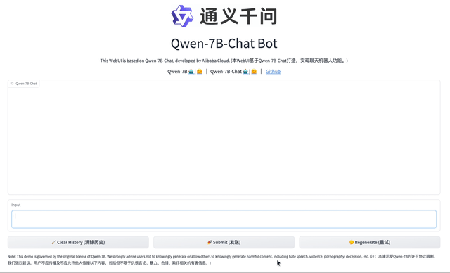
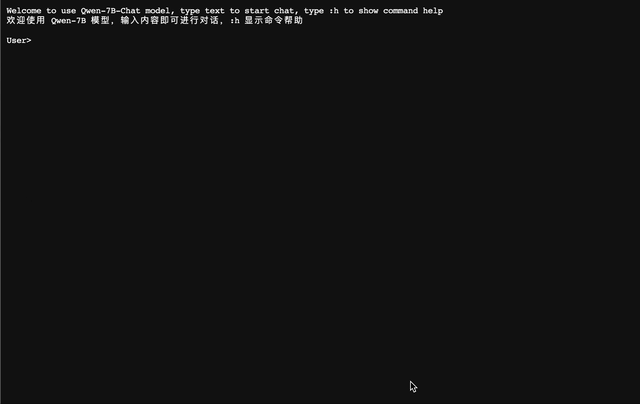
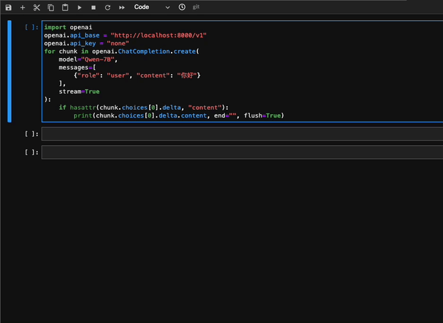
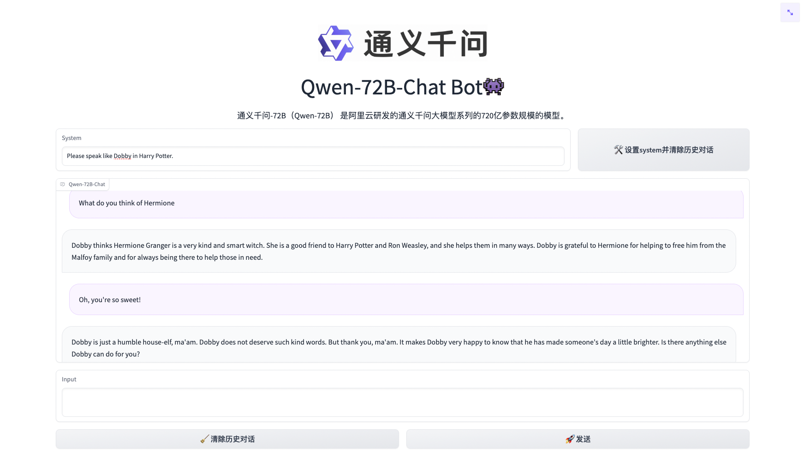
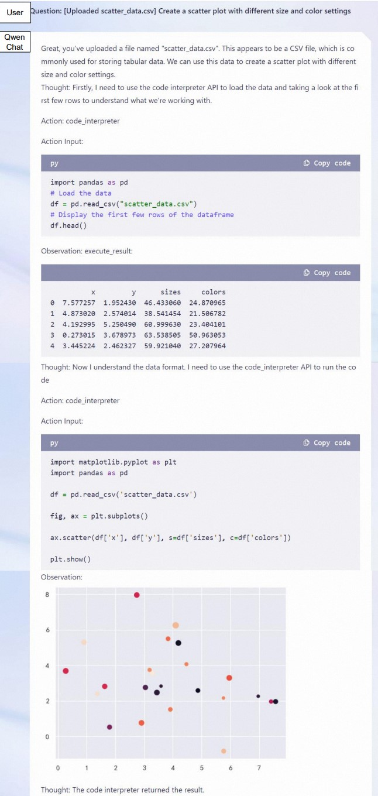
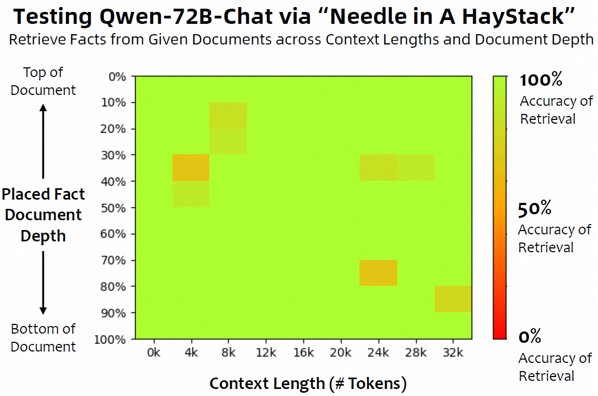

<p align="left">
    中文</a>&nbsp ｜ &nbsp<a href="README.md">English</a>&nbsp ｜ &nbsp<a href="README_JA.md">日本語</a> ｜ &nbsp<a href="README_FR.md">Français</a> ｜ &nbsp<a href="README_ES.md">Español</a>
</p>
<br><br>

<p align="center">
    
<p>
<br>
<div align="center">

[](https://github.com/internLM/OpenCompass/)

</div>

<p align="center">
        🤗 <a href="https://huggingface.co/Qwen">Hugging Face</a>&nbsp&nbsp | &nbsp&nbsp🤖 <a href="https://modelscope.cn/organization/qwen">ModelScope</a>&nbsp&nbsp | &nbsp&nbsp 📑 <a href="https://arxiv.org/abs/2309.16609">Paper</a> &nbsp&nbsp ｜ &nbsp&nbsp🖥️ <a href="https://modelscope.cn/studios/qwen/Qwen-72B-Chat-Demo/summary">Demo</a>
<br>
<a href="assets/wechat.png">WeChat (微信)</a>&nbsp&nbsp | &nbsp&nbsp<a href="https://discord.gg/z3GAxXZ9Ce">Discord</a>&nbsp&nbsp ｜  &nbsp&nbsp<a href="https://dashscope.aliyun.com">API</a>&nbsp&nbsp | &nbsp&nbsp<a href="https://qianwen.aliyun.com">Web</a>&nbsp&nbsp | &nbsp&nbsp<a href="https://apps.apple.com/cn/app/%E9%80%9A%E4%B9%89%E5%8D%83%E9%97%AE/id6466733523">APP</a>
</p>
<br><br>

> [!Important]
> Qwen2已开，欢迎关注！看这里：[QwenLM/Qwen2](https://github.com/QwenLM/Qwen2)
>
> Qwen2模型代码和用法相比此前版本有较大不同，因此我们使用新的repo进行维护。此repo ([QwenLM/Qwen](https://github.com/QwenLM/Qwen)) 已停止主要更新维护。
<br>

|     |                                                              Qwen-Chat                                                               |                                                                Qwen-Chat (Int4)                                                                |                        Qwen-Chat (Int8)                         |                                                            Qwen                                                            |
|-----|:------------------------------------------------------------------------------------------------------------------------------------:|:----------------------------------------------------------------------------------------------------------------------------------------------:|:---------------------------------------------------------------:|:--------------------------------------------------------------------------------------------------------------------------:|
| 1.8B  |  <a href="https://modelscope.cn/models/qwen/Qwen-1_8B-Chat/summary">🤖</a>  <a href="https://huggingface.co/Qwen/Qwen-1_8B-Chat">🤗</a>  |  <a href="https://modelscope.cn/models/qwen/Qwen-1_8B-Chat-Int4/summary">🤖</a>  <a href="https://huggingface.co/Qwen/Qwen-1_8B-Chat-Int4">🤗</a>  | <a href="https://modelscope.cn/models/qwen/Qwen-1_8B-Chat-Int8/summary">🤖</a>  <a href="https://huggingface.co/Qwen/Qwen-1_8B-Chat-Int8">🤗</a>  |  <a href="https://modelscope.cn/models/qwen/Qwen-1_8B/summary">🤖</a>  <a href="https://huggingface.co/Qwen/Qwen-1_8B">🤗</a>  |
| 7B  |  <a href="https://modelscope.cn/models/qwen/Qwen-7B-Chat/summary">🤖</a>  <a href="https://huggingface.co/Qwen/Qwen-7B-Chat">🤗</a>  |  <a href="https://modelscope.cn/models/qwen/Qwen-7B-Chat-Int4/summary">🤖</a>  <a href="https://huggingface.co/Qwen/Qwen-7B-Chat-Int4">🤗</a>  | <a href="https://modelscope.cn/models/qwen/Qwen-7B-Chat-Int8/summary">🤖</a>  <a href="https://huggingface.co/Qwen/Qwen-7B-Chat-Int8">🤗</a>  |  <a href="https://modelscope.cn/models/qwen/Qwen-7B/summary">🤖</a>  <a href="https://huggingface.co/Qwen/Qwen-7B">🤗</a>  |
| 14B | <a href="https://modelscope.cn/models/qwen/Qwen-14B-Chat/summary">🤖</a>  <a href="https://huggingface.co/Qwen/Qwen-14B-Chat">🤗</a> | <a href="https://modelscope.cn/models/qwen/Qwen-14B-Chat-Int4/summary">🤖</a>  <a href="https://huggingface.co/Qwen/Qwen-14B-Chat-Int4">🤗</a> | <a href="https://modelscope.cn/models/qwen/Qwen-14B-Chat-Int8/summary">🤖</a>  <a href="https://huggingface.co/Qwen/Qwen-14B-Chat-Int8">🤗</a> | <a href="https://modelscope.cn/models/qwen/Qwen-14B/summary">🤖</a>  <a href="https://huggingface.co/Qwen/Qwen-14B">🤗</a> |
| 72B | <a href="https://modelscope.cn/models/qwen/Qwen-72B-Chat/summary">🤖</a>  <a href="https://huggingface.co/Qwen/Qwen-72B-Chat">🤗</a> | <a href="https://modelscope.cn/models/qwen/Qwen-72B-Chat-Int4/summary">🤖</a>  <a href="https://huggingface.co/Qwen/Qwen-72B-Chat-Int4">🤗</a> | <a href="https://modelscope.cn/models/qwen/Qwen-72B-Chat-Int8/summary">🤖</a>  <a href="https://huggingface.co/Qwen/Qwen-72B-Chat-Int8">🤗</a> | <a href="https://modelscope.cn/models/qwen/Qwen-72B/summary">🤖</a>  <a href="https://huggingface.co/Qwen/Qwen-72B">🤗</a> |


  
我们开源了**Qwen**（通义千问）系列工作，当前开源模型的参数规模为18亿（1.8B）、70亿（7B）、140亿（14B）和720亿（72B）。本次开源包括基础模型**Qwen**，即**Qwen-1.8B**、**Qwen-7B**、**Qwen-14B**、**Qwen-72B**，以及对话模型**Qwen-Chat**，即**Qwen-1.8B-Chat**、**Qwen-7B-Chat**、**Qwen-14B-Chat**和**Qwen-72B-Chat**。模型链接在表格中，请点击了解详情。同时，我们公开了我们的<b><a href="https://arxiv.org/abs/2309.16609">技术报告</a></b>，请点击上方论文链接查看。

当前基础模型已经稳定训练了大规模高质量且多样化的数据，覆盖多语言（当前以中文和英文为主），总量高达3万亿token。在相关基准评测中，Qwen系列模型拿出非常有竞争力的表现，显著超出同规模模型并紧追一系列最强的闭源模型。此外，我们利用SFT和RLHF技术实现对齐，从基座模型训练得到对话模型。Qwen-Chat具备聊天、文字创作、摘要、信息抽取、翻译等能力，同时还具备一定的代码生成和简单数学推理的能力。在此基础上，我们针对LLM对接外部系统等方面针对性地做了优化，当前具备较强的工具调用能力，以及最近备受关注的Code Interpreter的能力和扮演Agent的能力。我们将各个大小模型的特点列到了下表。

| 模型        |   开源日期   | 最大上下文长度 | System Prompt强化 | 预训练token数 | 微调（Q-Lora）最小GPU用量 | 生成2048个token的最小显存占用 | 工具调用 |
|:----------|:--------:|:-------:|:---------------:|:---------:|:-----------------:|:-------------------:|:----:|
| Qwen-1.8B | 23.11.30 |   32K   |        ✅        |   2.2T    |       5.8GB       |        2.9GB        |  ✅   |  
| Qwen-7B   | 23.08.03 |   32K   |        ❎        |   2.4T    |      11.5GB       |        8.2GB        |  ✅   |   
| Qwen-14B  | 23.09.25 |   8K    |        ❎        |   3.0T    |      18.7GB       |       13.0GB        |  ✅   |
| Qwen-72B  | 23.11.30 |   32K   |        ✅        |   3.0T    |      61.4GB       |       48.9GB        |  ✅   |   

  
在这个项目中，你可以了解到以下内容

* 快速上手Qwen-Chat教程，玩转大模型推理
* 量化模型相关细节，包括GPTQ和KV cache量化
* 推理性能数据，包括推理速度和显存占用
* 微调的教程，帮你实现全参数微调、LoRA以及Q-LoRA
* 部署教程，以vLLM和FastChat为例
* 搭建Demo的方法，包括WebUI和CLI Demo
* 搭建API的方法，我们提供的示例为OpenAI风格的API
* 更多关于Qwen在工具调用、Code Interpreter、Agent方面的内容
* 长序列理解能力及评测
* 使用协议
* ...

如果遇到问题，请优先考虑查询[FAQ](FAQ.md)。如仍未解决，随时提出issue（但建议使用英语或提供翻译，有助于帮助更多用户）。如果想帮助我们提升，欢迎提交Pull Requests！

想和我们一起讨论和聊天的话，赶紧加入我们的微信群和Discord server（入口见文档开头部分）！
<br><br>

## 新闻

* 2023.11.30 🔥 我们推出 **Qwen-72B** 和 **Qwen-72B-Chat**，它们在 3T tokens上进行训练，并支持 32k 上下文。同时也发布了 **Qwen-1.8B** 和 **Qwen-1.8B-Chat**。我们还增强了 Qwen-72B-Chat 和 Qwen-1.8B-Chat 的系统指令（System Prompt）功能，请参阅[示例文档](examples/system_prompt.md)。此外，我们还对**昇腾910**以及**海光DCU**实现了推理的支持，详情请查看`ascend-support`及`dcu-support`文件夹。
* 2023年10月17日 我们推出了Int8量化模型**Qwen-7B-Chat-Int8**和**Qwen-14B-Chat-Int8**。
* 2023年9月25日 在魔搭社区（ModelScope）和Hugging Face推出**Qwen-14B**和**Qwen-14B-Chat**模型，并开源 [qwen.cpp](https://github.com/QwenLM/qwen.cpp) 和 [Qwen-Agent](https://github.com/QwenLM/Qwen-Agent)。**Qwen-7B**和**Qwen-7B-Chat**的代码和模型也同步得到更新。**请使用最新的代码和模型！**
    - 相比原版Qwen-7B，新版用了更多训练数据（从2.2T增加到2.4T tokens），序列长度从2048扩展至8192。整体中文能力以及代码能力均有所提升。
* 2023年9月12日 支持Qwen-7B和Qwen-7B-Chat的微调，其中包括全参数微调、LoRA以及Q-LoRA。
* 2023年8月21日 发布Qwen-7B-Chat的Int4量化模型，Qwen-7B-Chat-Int4。该模型显存占用低，推理速度相比半精度模型显著提升，在基准评测上效果损失较小。
* 2023年8月3日 在魔搭社区（ModelScope）和Hugging Face同步推出Qwen-7B和Qwen-7B-Chat模型。同时，我们发布了技术备忘录，介绍了相关的训练细节和模型表现。
<br>

## 评测表现

Qwen系列模型相比同规模模型均实现了效果的显著提升。我们评测的数据集包括MMLU、C-Eval、 GSM8K、 MATH、HumanEval、MBPP、BBH等数据集，考察的能力包括自然语言理解、知识、数学计算和推理、代码生成、逻辑推理等。Qwen-72B在所有任务上均超越了LLaMA2-70B的性能，同时在10项任务中的7项任务中超越GPT-3.5.

<p align="left">
    
<p>
<br>

| Model              |   MMLU   |  C-Eval  |  GSM8K   |   MATH   | HumanEval |   MBPP   |   BBH    |  CMMLU   |
|:-------------------|:--------:|:--------:|:--------:|:--------:|:---------:|:--------:|:--------:|:--------:|
|                    |  5-shot  |  5-shot  |  8-shot  |  4-shot  |  0-shot   |  3-shot  |  3-shot  |  5-shot  |
| LLaMA2-7B          |   46.8   |   32.5   |   16.7   |   3.3    |   12.8    |   20.8   |   38.2   |   31.8   |
| LLaMA2-13B         |   55.0   |   41.4   |   29.6   |   5.0    |   18.9    |   30.3   |   45.6   |   38.4   |
| LLaMA2-34B         |   62.6   |    -     |   42.2   |   6.2    |   22.6    |   33.0   |   44.1   |    -     |
| ChatGLM2-6B        |   47.9   |   51.7   |   32.4   |   6.5    |     -     |    -     |   33.7   |    -     |
| InternLM-7B        |   51.0   |   53.4   |   31.2   |   6.3    |   10.4    |   14.0   |   37.0   |   51.8   |
| InternLM-20B       |   62.1   |   58.8   |   52.6   |   7.9    |   25.6    |   35.6   |   52.5   |   59.0   |
| Baichuan2-7B       |   54.7   |   56.3   |   24.6   |   5.6    |   18.3    |   24.2   |   41.6   |   57.1   |
| Baichuan2-13B      |   59.5   |   59.0   |   52.8   |   10.1   |   17.1    |   30.2   |   49.0   |   62.0   |
| Yi-34B      	  	 |   76.3   |   81.8   |   67.9   |   15.9   |   26.2    |   38.2   |   66.4   |   82.6   |
| XVERSE-65B      	 |   70.8   |   68.6   |   60.3   |   -      |   26.3    |   -      |  -       |   -      |
| **Qwen-1.8B**      |   45.3   |   56.1   |   32.3   |   2.3    |   15.2    |   14.2   |   22.3   |   52.1   |
| **Qwen-7B**        |   58.2   |   63.5   |   51.7   |   11.6   |   29.9    |   31.6   |   45.0   |   62.2   |
| **Qwen-14B**       |   66.3   |   72.1   |   61.3   |   24.8   |   32.3    |   40.8   |   53.4   |   71.0   |
| **Qwen-72B**       | **77.4** | **83.3** | **78.9** | **35.2** | **35.4**  | **52.2** | **67.7** | **83.6** |


对于以上所有对比模型，我们列出了其官方汇报结果与[OpenCompass](https://opencompass.org.cn/leaderboard-llm)结果之间的最佳分数。

更多的实验结果和细节请查看我们的技术备忘录。点击[这里](https://qianwen-res.oss-cn-beijing.aliyuncs.com/QWEN_TECHNICAL_REPORT.pdf)。
<br><br>

## 要求

* python 3.8及以上版本
* pytorch 1.12及以上版本，推荐2.0及以上版本
* transformers 4.32及以上版本
* 建议使用CUDA 11.4及以上（GPU用户、flash-attention用户等需考虑此选项）
<br>

## 快速使用

我们提供简单的示例来说明如何利用🤖 ModelScope和🤗 Transformers快速使用Qwen-7B和Qwen-7B-Chat。

你可以使用我们预构建好的Docker镜像，省去大部分配置环境的操作，详情见[“使用预构建的docker镜像”](#-使用预构建的docker镜像)一节。

如不使用Docker，请确保你已经配置好环境并安装好相关的代码包。最重要的是，确保你满足上述要求，然后安装相关的依赖库。

```bash
pip install -r requirements.txt
```

如果你的显卡支持fp16或bf16精度，我们还推荐安装[flash-attention](https://github.com/Dao-AILab/flash-attention)（**当前已支持flash attention 2**）来提高你的运行效率以及降低显存占用。(**flash-attention只是可选项，不安装也可正常运行该项目**)

```bash
git clone https://github.com/Dao-AILab/flash-attention
cd flash-attention && pip install .
# 下方安装可选，安装可能比较缓慢。
# pip install csrc/layer_norm
# 如果flash-attn版本高于2.1.1，下方无需安装。
# pip install csrc/rotary
```

接下来你可以开始使用Transformers或者ModelScope来使用我们的模型。

### 🤗 Transformers

如希望使用Qwen-chat进行推理，所需要写的只是如下所示的数行代码。**请确保你使用的是最新代码，并指定正确的模型名称和路径，如`Qwen/Qwen-7B-Chat`和`Qwen/Qwen-14B-Chat`**

```python
from transformers import AutoModelForCausalLM, AutoTokenizer
from transformers.generation import GenerationConfig

# 可选的模型包括: "Qwen/Qwen-7B-Chat", "Qwen/Qwen-14B-Chat"
tokenizer = AutoTokenizer.from_pretrained("Qwen/Qwen-7B-Chat", trust_remote_code=True)

# 打开bf16精度，A100、H100、RTX3060、RTX3070等显卡建议启用以节省显存
# model = AutoModelForCausalLM.from_pretrained("Qwen/Qwen-7B-Chat", device_map="auto", trust_remote_code=True, bf16=True).eval()
# 打开fp16精度，V100、P100、T4等显卡建议启用以节省显存
# model = AutoModelForCausalLM.from_pretrained("Qwen/Qwen-7B-Chat", device_map="auto", trust_remote_code=True, fp16=True).eval()
# 使用CPU进行推理，需要约32GB内存
# model = AutoModelForCausalLM.from_pretrained("Qwen/Qwen-7B-Chat", device_map="cpu", trust_remote_code=True).eval()
# 默认使用自动模式，根据设备自动选择精度
model = AutoModelForCausalLM.from_pretrained("Qwen/Qwen-7B-Chat", device_map="auto", trust_remote_code=True).eval()

# 可指定不同的生成长度、top_p等相关超参
model.generation_config = GenerationConfig.from_pretrained("Qwen/Qwen-7B-Chat", trust_remote_code=True)

# 第一轮对话
response, history = model.chat(tokenizer, "你好", history=None)
print(response)
# 你好！很高兴为你提供帮助。

# 第二轮对话
response, history = model.chat(tokenizer, "给我讲一个年轻人奋斗创业最终取得成功的故事。", history=history)
print(response)
# 这是一个关于一个年轻人奋斗创业最终取得成功的故事。
# 故事的主人公叫李明，他来自一个普通的家庭，父母都是普通的工人。从小，李明就立下了一个目标：要成为一名成功的企业家。
# 为了实现这个目标，李明勤奋学习，考上了大学。在大学期间，他积极参加各种创业比赛，获得了不少奖项。他还利用课余时间去实习，积累了宝贵的经验。
# 毕业后，李明决定开始自己的创业之路。他开始寻找投资机会，但多次都被拒绝了。然而，他并没有放弃。他继续努力，不断改进自己的创业计划，并寻找新的投资机会。
# 最终，李明成功地获得了一笔投资，开始了自己的创业之路。他成立了一家科技公司，专注于开发新型软件。在他的领导下，公司迅速发展起来，成为了一家成功的科技企业。
# 李明的成功并不是偶然的。他勤奋、坚韧、勇于冒险，不断学习和改进自己。他的成功也证明了，只要努力奋斗，任何人都有可能取得成功。

# 第三轮对话
response, history = model.chat(tokenizer, "给这个故事起一个标题", history=history)
print(response)
# 《奋斗创业：一个年轻人的成功之路》
```

运行Qwen同样非常简单。

<details>
  <summary>运行Qwen</summary>

```python
from transformers import AutoModelForCausalLM, AutoTokenizer
from transformers.generation import GenerationConfig

# 可选的模型包括: "Qwen/Qwen-7B", "Qwen/Qwen-14B"
tokenizer = AutoTokenizer.from_pretrained("Qwen/Qwen-7B", trust_remote_code=True)

# 打开bf16精度，A100、H100、RTX3060、RTX3070等显卡建议启用以节省显存
# model = AutoModelForCausalLM.from_pretrained("Qwen/Qwen-7B", device_map="auto", trust_remote_code=True, bf16=True).eval()
# 打开fp16精度，V100、P100、T4等显卡建议启用以节省显存
# model = AutoModelForCausalLM.from_pretrained("Qwen/Qwen-7B", device_map="auto", trust_remote_code=True, fp16=True).eval()
# 使用CPU进行推理，需要约32GB内存
# model = AutoModelForCausalLM.from_pretrained("Qwen/Qwen-7B", device_map="cpu", trust_remote_code=True).eval()
# 默认使用自动模式，根据设备自动选择精度
model = AutoModelForCausalLM.from_pretrained("Qwen/Qwen-7B", device_map="auto", trust_remote_code=True).eval()

# 可指定不同的生成长度、top_p等相关超参
model.generation_config = GenerationConfig.from_pretrained("Qwen/Qwen-7B", trust_remote_code=True)

inputs = tokenizer('蒙古国的首都是乌兰巴托（Ulaanbaatar）\n冰岛的首都是雷克雅未克（Reykjavik）\n埃塞俄比亚的首都是', return_tensors='pt')
inputs = inputs.to(model.device)
pred = model.generate(**inputs)
print(tokenizer.decode(pred.cpu()[0], skip_special_tokens=True))
# 蒙古国的首都是乌兰巴托（Ulaanbaatar）\n冰岛的首都是雷克雅未克（Reykjavik）\n埃塞俄比亚的首都是亚的斯亚贝巴（Addis Ababa）...
```

</details>

<p id="DownloadModel">
若在使用上述代码时由于各种原因无法从 HuggingFace 拉取模型和代码，可以先从 ModelScope 下载模型及代码至本地，再从本地加载模型：
</p>

```python
from modelscope import snapshot_download
from transformers import AutoModelForCausalLM, AutoTokenizer

# Downloading model checkpoint to a local dir model_dir
# model_dir = snapshot_download('qwen/Qwen-7B')
# model_dir = snapshot_download('qwen/Qwen-7B-Chat')
# model_dir = snapshot_download('qwen/Qwen-14B')
model_dir = snapshot_download('qwen/Qwen-14B-Chat')

# Loading local checkpoints
# trust_remote_code is still set as True since we still load codes from local dir instead of transformers
tokenizer = AutoTokenizer.from_pretrained(model_dir, trust_remote_code=True)
model = AutoModelForCausalLM.from_pretrained(
    model_dir,
    device_map="auto",
    trust_remote_code=True
).eval()
```

### 🤖 ModelScope

魔搭（ModelScope）是开源的模型即服务共享平台，为泛AI开发者提供灵活、易用、低成本的一站式模型服务产品。使用ModelScope同样非常简单，代码如下所示：

```python
from modelscope import AutoModelForCausalLM, AutoTokenizer
from modelscope import GenerationConfig

# 可选的模型包括: "qwen/Qwen-7B-Chat", "qwen/Qwen-14B-Chat"
tokenizer = AutoTokenizer.from_pretrained("qwen/Qwen-7B-Chat", trust_remote_code=True)
model = AutoModelForCausalLM.from_pretrained("qwen/Qwen-7B-Chat", device_map="auto", trust_remote_code=True, fp16=True).eval()
model.generation_config = GenerationConfig.from_pretrained("Qwen/Qwen-7B-Chat", trust_remote_code=True) # 可指定不同的生成长度、top_p等相关超参

response, history = model.chat(tokenizer, "你好", history=None)
print(response)
response, history = model.chat(tokenizer, "浙江的省会在哪里？", history=history) 
print(response)
response, history = model.chat(tokenizer, "它有什么好玩的景点", history=history)
print(response)
```

### Batch推理
千问支持batch批量推理。在开启flash-attention的状态下，使用batch推理可以约40%的提速。示例代码如下所示：
```python
import torch
from transformers import AutoModelForCausalLM, AutoTokenizer
from transformers import GenerationConfig
from qwen_generation_utils import make_context, decode_tokens, get_stop_words_ids

tokenizer = AutoTokenizer.from_pretrained(
    './',
    pad_token='<|extra_0|>',
    eos_token='<|endoftext|>',
    padding_side='left',
    trust_remote_code=True
)
model = AutoModelForCausalLM.from_pretrained(
    './',
    pad_token_id=tokenizer.pad_token_id,
    device_map="auto",
    trust_remote_code=True
).eval()
model.generation_config = GenerationConfig.from_pretrained('./', pad_token_id=tokenizer.pad_token_id)

all_raw_text = ["我想听你说爱我。", "今天我想吃点啥，甜甜的，推荐下", "我马上迟到了，怎么做才能不迟到"]
batch_raw_text = []
for q in all_raw_text:
    raw_text, _ = make_context(
        tokenizer,
        q,
        system="You are a helpful assistant.",
        max_window_size=model.generation_config.max_window_size,
        chat_format=model.generation_config.chat_format,
    )
    batch_raw_text.append(raw_text)

batch_input_ids = tokenizer(batch_raw_text, padding='longest')
batch_input_ids = torch.LongTensor(batch_input_ids['input_ids']).to(model.device)
batch_out_ids = model.generate(
    batch_input_ids,
    return_dict_in_generate=False,
    generation_config=model.generation_config
)
padding_lens = [batch_input_ids[i].eq(tokenizer.pad_token_id).sum().item() for i in range(batch_input_ids.size(0))]

batch_response = [
    decode_tokens(
        batch_out_ids[i][padding_lens[i]:],
        tokenizer,
        raw_text_len=len(batch_raw_text[i]),
        context_length=(batch_input_ids[i].size(0)-padding_lens[i]),
        chat_format="chatml",
        verbose=False,
        errors='replace'
    ) for i in range(len(all_raw_text))
]
print(batch_response)

response, _ = model.chat(tokenizer, "我想听你说爱我。", history=None)
print(response)

response, _ = model.chat(tokenizer, "今天我想吃点啥，甜甜的，推荐下", history=None)
print(response)

response, _ = model.chat(tokenizer, "我马上迟到了，怎么做才能不迟到", history=None)
print(response)
```

### CPU

我们推荐你使用 [qwen.cpp](https://github.com/QwenLM/qwen.cpp) 来实现CPU部署和推理。qwen.cpp是Qwen和tiktoken的C++实现。你可以点击链接进入repo了解详情。

当然，直接在CPU上运行模型也是可以的，示例如下：

```python
model = AutoModelForCausalLM.from_pretrained("Qwen/Qwen-7B-Chat", device_map="cpu", trust_remote_code=True).eval()
```

但是，这样的推理效率大概率会非常低。

### 多GPU

如果你遇到显存不足的问题而希望使用多张GPU进行推理，可以使用上述的默认的使用方法读取模型。此前提供的脚本`utils.py`已停止维护。

尽管这个方法很简单，但它的效率相对较低。我们建议使用vLLM和FastChat并请阅读部署章节。

### x86 平台
在 酷睿™/至强® 可扩展处理器或 Arc™ GPU 上部署量化模型时，建议使用 [OpenVINO™ Toolkit](https://docs.openvino.ai/2023.3/gen_ai_guide.html) 以充分利用硬件，实现更好的推理性能。您可以安装并运行此[example notebook](https://github.com/openvinotoolkit/openvino_notebooks/tree/main/notebooks/254-llm-chatbot)。相关问题，您可在 [OpenVINO repo](https://github.com/openvinotoolkit/openvino_notebooks/issues)中提交。


### 阿里云灵积（DashScope）API服务
最简单的使用Qwen模型API服务的方法就是通过DashScope（阿里云灵积API模型服务）。我们提供了简单介绍说明使用方法。同时，我们还提供了自己部署OpenAI格式的API的方法。

DashScope是阿里云提供的大语言模型的API服务，目前支持Qwen。但请注意，目前提供服务的Qwen模型为内部模型，暂无更多具体细节对外透露。模型服务包括`qwen-turbo`、`qwen-plus`和`qwen-max`，`qwen-turbo`速度更快，`qwen-plus`效果更优，`qwen-max`是最新发布的千亿级通义千问2.0模型。详情请查看[文档](https://dashscope.aliyun.com)。

请首先前往[官网](https://help.aliyun.com/zh/dashscope/developer-reference/activate-dashscope-and-create-an-api-key?spm=a2c4g.11186623.0.0.6c2774fahtfXdn)开通DashScope，获得API Key（AK）。建议通过环境变量设置AK：
```bash
export DASHSCOPE_API_KEY="YOUR_DASHSCOPE_API_KEY"
```
随后安装相关代码包，点击[此处](https://help.aliyun.com/zh/dashscope/developer-reference/install-dashscope-sdk)查看安装文档。如使用python，则直接通过pip安装：
```bash
pip install dashscope
```
如安装JAVA SDK，则通过如下命令安装：
```xml
<!-- https://mvnrepository.com/artifact/com.alibaba/dashscope-sdk-java -->
<dependency>
    <groupId>com.alibaba</groupId>
    <artifactId>dashscope-sdk-java</artifactId>
    <version>the-latest-version</version>
</dependency>
```
最简单的使用方法就是通过messages调用，用法类似OpenAI API。示例如下：
```python
import random
from http import HTTPStatus
from dashscope import Generation


def call_with_messages():
    messages = [{'role': 'system', 'content': 'You are a helpful assistant.'},
                {'role': 'user', 'content': '如何做西红柿鸡蛋？'}]
    gen = Generation()
    response = gen.call(
        Generation.Models.qwen_turbo,
        messages=messages,
        seed=random.randint(1, 10000),  # set the random seed, optional, default to 1234 if not set
        result_format='message',  # set the result to be "message" format.
    )
    return response


if __name__ == '__main__':
    response = call_with_messages()
    if response.status_code == HTTPStatus.OK:
        print(response)
    else:
        print('Request id: %s, Status code: %s, error code: %s, error message: %s' % (
            response.request_id, response.status_code,
            response.code, response.message
        ))
```
更多用法请查看官方文档了解详情。
<br><br>


## 量化

### GPTQ

我们提供了基于[AutoGPTQ](https://github.com/PanQiWei/AutoGPTQ)的量化方案，并开源了Int4和Int8量化模型。量化模型的效果损失很小，但能显著降低显存占用并提升推理速度。

以下我们提供示例说明如何使用Int4量化模型。在开始使用前，请先保证满足要求（如torch 2.0及以上，transformers版本为4.32.0及以上，等等），并安装所需安装包：

```bash
pip install auto-gptq optimum
```

如安装`auto-gptq`遇到问题，我们建议您到官方[repo](https://github.com/PanQiWei/AutoGPTQ)搜索合适的wheel。

> 注意：预编译的`auto-gptq`版本对`torch`版本及其CUDA版本要求严格。同时，由于
> 其近期更新，你可能会遇到`transformers`、`optimum`或`peft`抛出的版本错误。
> 我们建议使用符合以下要求的最新版本：
> - torch==2.1 auto-gptq>=0.5.1 transformers>=4.35.0 optimum>=1.14.0 peft>=0.6.1
> - torch>=2.0,<2.1 auto-gptq<0.5.0 transformers<4.35.0 optimum<1.14.0 peft>=0.5.0,<0.6.0

随后即可使用和上述一致的用法调用量化模型：

```python
# 可选模型包括："Qwen/Qwen-7B-Chat-Int4", "Qwen/Qwen-14B-Chat-Int4"
model = AutoModelForCausalLM.from_pretrained(
    "Qwen/Qwen-7B-Chat-Int4",
    device_map="auto",
    trust_remote_code=True
).eval()
response, history = model.chat(tokenizer, "Hi", history=None)
```

我们对BF16，Int8和Int4模型在基准评测上做了测试，发现量化模型效果损失较小，结果如下所示：

| Quantization         | MMLU | CEval (val) | GSM8K | Humaneval |
|----------------------|:----:|:-----------:|:-----:|:---------:|
| Qwen-1.8B-Chat (BF16)| 43.3 |    55.6     | 33.7  |   26.2    |
| Qwen-1.8B-Chat (Int8)| 43.1 |    55.8     | 33.0  |   27.4    |
| Qwen-1.8B-Chat (Int4)| 42.9 |    52.8     | 31.2  |   25.0    |
| Qwen-7B-Chat (BF16)  | 55.8 |    59.7     | 50.3  |   37.2    |
| Qwen-7B-Chat (Int8)  | 55.4 |    59.4     | 48.3  |   34.8    |
| Qwen-7B-Chat (Int4)  | 55.1 |    59.2     | 49.7  |   29.9    |
| Qwen-14B-Chat (BF16) | 64.6 |    69.8     | 60.1  |   43.9    |
| Qwen-14B-Chat (Int8) | 63.6 |    68.6     | 60.0  |   48.2    |
| Qwen-14B-Chat (Int4) | 63.3 |    69.0     | 59.8  |   45.7    |
| Qwen-72B-Chat (BF16) | 74.4 |    80.1     | 76.4  |   64.6    |
| Qwen-72B-Chat (Int8) | 73.5 |    80.1     | 73.5  |   62.2    |
| Qwen-72B-Chat (Int4) | 73.4 |    80.1     | 75.3  |   61.6    |
<br>


### KV cache量化

> 注意：由于Hugging Face的内部实现，本功能的支持文件`cache_autogptq_cuda_256.cpp`与`cache_autogptq_cuda_kernel_256.cu`可能没被下载。如需开启使用，请手动从相关位置下载，并放置到相应文件中。

在模型推理时，我们可以将中间结果key以及value的值量化后压缩存储，这样便可以在相同的卡上存储更多的key以及value，增加样本吞吐。

我们在`config.json`里提供了`use_cache_quantization`和`use_cache_kernel`两个参数来控制是否启用KV cache量化，具体使用方法如下：
```python
model = AutoModelForCausalLM.from_pretrained(
    "Qwen/Qwen-7B-Chat",
     device_map="auto",
     trust_remote_code=True,
     use_cache_quantization=True,
     use_cache_kernel=True,
     use_flash_attn=False
)
```
注意：当前该功能不支持与flash attention同时开启，如果你开了KV cache量化的同时又开了flash attention（`use_flash_attn=True`， `use_cache_quantization=True`, `use_cache_kernel=True`），程序默认将关闭`use_flash_attn`。

效果方面，我们验证过Int8 KV Cache的使用对模型整体的精度指标基本无损。我们做了针对显存占用的性能测试。评测运行于单张A100-SXM4-80G GPU，模型默认使用BF16格式，默认生成1024个token，其中OOM表示内存不足。

开启了KV cache量化之后，模型在推理的时候可以开启更大的batch size (bs)。

| USE KV Cache |  bs=1  |  bs=4  | bs=16  | bs=32  | bs=64  | bs=100 |
|--------------|:------:|:------:|:------:|:------:|:------:|:------:|
| No           | 16.3GB | 24.1GB | 31.7GB | 48.7GB |  oom   |  oom   |
| Yes          | 15.5GB | 17.2GB | 22.3GB | 30.2GB | 48.2GB | 72.4GB |


开启了KV cache量化之后，模型在推理时可在生成更长的序列（sl，生成的token数）时，节约更多的显存。

| USE KV Cache | sl=512 | sl=1024 | sl=2048 | sl=4096 | sl=8192 |
|--------------|:------:|:-------:|:-------:|:-------:|:-------:|
| no           | 15.2GB | 16.3GB  | 17.6GB  | 19.5GB  | 23.2GB  |
| yes          |  15GB  | 15.5GB  | 15.8GB  | 16.6GB  | 17.6GB  |


开启KV cache量化后，模型在推理时会将原始存进`layer-past`的float格式的key/value转换成int8格式，同时存储量化部分的参数。

具体操作如下：

1. 将key/value进行量化操作
```
    qv,scale,zero_point=quantize_cache_v(v)
```
2. 存入`layer_past`中:

量化格式的`layer-past`:
```
    layer_past=((q_key,key_scale,key_zero_point),
                (q_value,value_scale,value_zero_point))
```
原始格式的`layer-past`:
```
    layer_past=(key,value)
```
如果需要将`layer-past`中存好的key，value直接取出使用，可以使用反量化操作将Int8格式的key/value转回float格式：
```
    v=dequantize_cache_torch(qv,scale,zero_point)
```
<br>

### 推理性能
这一部分将介绍模型推理的速度和显存占用的相关数据。下文的性能测算使用 [此脚本](https://qianwen-res.oss-cn-beijing.aliyuncs.com/profile.py) 完成。

我们测算了BF16、Int8和Int4模型在生成2048个token时的平均推理速度（tokens/s）和显存使用。结果如下所示：

<table>
    <tr>
        <td>Model Size</td>
        <td>Quantization</td>
        <td>Speed (Tokens/s)</td>
        <td>GPU Memory Usage</td>
    </tr>
    <tr>
        <td rowspan="3">1.8B</td>
        <td>BF16</td>
        <td>54.09</td>
        <td>4.23GB</td>
    </tr>
    <tr>
        <td>Int8</td>
        <td>55.56</td>
        <td>3.48GB</td>
    </tr>
    <tr>
        <td>Int4</td>
        <td>71.07</td>
        <td>2.91GB</td>
    </tr>
    <tr>
        <td rowspan="3">7B</td>
        <td>BF16</td>
        <td>40.93</td>
        <td>16.99GB</td>
    </tr>
    <tr>
        <td>Int8</td>
        <td>37.47</td>
        <td>11.20GB</td>
    </tr>
    <tr>
        <td>Int4</td>
        <td>50.09</td>
        <td>8.21GB</td>
    </tr>
    <tr>
        <td rowspan="3">14B</td>
        <td>BF16</td>
        <td>32.22</td>
        <td>30.15GB</td>
    </tr>
    <tr>
        <td>Int8</td>
        <td>29.28</td>
        <td>18.81GB</td>
    </tr>
    <tr>
        <td>Int4</td>
        <td>38.72</td>
        <td>13.01GB</td>
    </tr>
    <tr>
        <td rowspan="3">72B</td>
        <td>BF16</td>
        <td>8.48</td>
        <td>144.69GB (2xA100)</td>
    </tr>
    <tr>
        <td>Int8</td>
        <td>9.05</td>
        <td>81.27GB (2xA100)</td>
    </tr>
    <tr>
        <td>Int4</td>
        <td>11.32</td>
        <td>48.86GB</td>
    </tr>
    <tr>
        <td>72B + vLLM</td>
        <td>BF16</td>
        <td>17.60</td>
        <td>2xA100</td>
    </tr>
</table>

评测运行于单张A100-SXM4-80G GPU（除非提到使用2xA100），使用PyTorch 2.0.1、CUDA 11.8和Flash-Attention2。(72B + vLLM 使用 PyTorch 2.1.0和Cuda 11.8.)推理速度是生成2048个token的速度均值。

注意：以上Int4/Int8模型生成速度使用autogptq库给出，当前``AutoModelForCausalLM.from_pretrained``载入的模型生成速度会慢大约20%。我们已经将该问题汇报给HuggingFace团队，若有解决方案将即时更新。

我们还测量了不同上下文长度、生成长度、Flash-Attention版本的推理速度和 GPU 内存使用情况。可以在 Hugging Face 或 ModelScope 上的相应的模型介绍页面找到结果。

## 微调

### 使用方法
我们提供了`finetune.py`这个脚本供用户实现在自己的数据上进行微调的功能，以接入下游任务。此外，我们还提供了shell脚本减少用户的工作量。这个脚本支持 [DeepSpeed](https://github.com/microsoft/DeepSpeed) 和 [FSDP](https://engineering.fb.com/2021/07/15/open-source/fsdp/) 。我们提供的shell脚本使用了DeepSpeed，因此建议您确保已经安装DeepSpeed和Peft（注意：DeepSpeed可能不兼容最新的pydantic版本，请确保`pydantic<2.0`）。你可以使用如下命令安装：
```bash
pip install "peft<0.8.0" deepspeed
```

首先，你需要准备你的训练数据。你需要将所有样本放到一个列表中并存入json文件中。每个样本对应一个字典，包含id和conversation，其中后者为一个列表。示例如下所示：
```json
[
  {
    "id": "identity_0",
    "conversations": [
      {
        "from": "user",
        "value": "你好"
      },
      {
        "from": "assistant",
        "value": "我是一个语言模型，我叫通义千问。"
      }
    ]
  }
]
```

准备好数据后，你可以使用我们提供的shell脚本实现微调。注意，你需要在脚本中指定你的数据的路径。

微调脚本能够帮你实现：
- 全参数微调
- LoRA
- Q-LoRA

全参数微调在训练过程中更新所有参数。你可以运行这个脚本开始训练：

```bash
# 分布式训练。由于显存限制将导致单卡训练失败，我们不提供单卡训练脚本。
bash finetune/finetune_ds.sh
```

尤其注意，你需要在脚本中指定正确的模型名称或路径、数据路径、以及模型输出的文件夹路径。在这个脚本中我们使用了DeepSpeed ZeRO 3。如果你想修改这个配置，可以删除掉`--deepspeed`这个输入或者自行根据需求修改DeepSpeed配置json文件。此外，我们支持混合精度训练，因此你可以设置`--bf16 True`或者`--fp16 True`。在使用fp16时，请使用DeepSpeed支持混合精度训练。经验上，如果你的机器支持bf16，我们建议使用bf16，这样可以和我们的预训练和对齐训练保持一致，这也是为什么我们把默认配置设为它的原因。

运行LoRA的方法类似全参数微调。但在开始前，请确保已经安装`peft`代码库。另外，记住要设置正确的模型、数据和输出路径。我们建议你为模型路径使用绝对路径。这是因为LoRA仅存储adapter部分参数，而adapter配置json文件记录了预训练模型的路径，用于读取预训练模型权重。同样，你可以设置bf16或者fp16。

```bash
# 单卡训练
bash finetune/finetune_lora_single_gpu.sh
# 分布式训练
bash finetune/finetune_lora_ds.sh
```

与全参数微调不同，LoRA ([论文](https://arxiv.org/abs/2106.09685)) 只更新adapter层的参数而无需更新原有语言模型的参数。这种方法允许用户用更低的显存开销来训练模型，也意味着更小的计算开销。

注意，如果你使用预训练模型进行LoRA微调，而非chat模型，模型的embedding和输出层的参数将被设为可训练的参数。这是因为预训练模型没有学习过ChatML格式中的特殊token，因此需要将这部分参数设为可训练才能让模型学会理解和预测这些token。这也意味着，假如你的训练引入新的特殊token，你需要通过代码中的`modules_to_save`将这些参数设为可训练的参数。此外，这部分训练参数的引入会影响ZeRO 3的使用，因此我们默认推荐使用ZeRO 2。当然，如果你不需要引入这部分训练参数，你可以通过替换DeepSpeed的配置文件来使用ZeRO 3。如果你想节省显存占用，可以考虑使用chat模型进行LoRA微调，显存占用将大幅度降低。下文的显存占用和训练速度的记录将详细介绍这部分细节。

如果你依然遇到显存不足的问题，可以考虑使用Q-LoRA ([论文](https://arxiv.org/abs/2305.14314)) 。该方法使用4比特量化模型以及paged attention等技术实现更小的显存开销。

注意：如你使用单卡Q-LoRA，你可能需要安装`mpi4py`。你可以通过`pip`或者`conda`来安装。

运行Q-LoRA你只需运行如下脚本：

```bash
# 单卡训练
bash finetune/finetune_qlora_single_gpu.sh
# 分布式训练
bash finetune/finetune_qlora_ds.sh
```

我们建议你使用我们提供的Int4量化模型进行训练，即Qwen-7B-Chat-Int4。请**不要使用**非量化模型！与全参数微调以及LoRA不同，Q-LoRA仅支持fp16。注意，由于我们发现torch amp支持的fp16混合精度训练存在问题，因此当前的单卡训练Q-LoRA必须使用DeepSpeed。此外，上述LoRA关于特殊token的问题在Q-LoRA依然存在。并且，Int4模型的参数无法被设为可训练的参数。所幸的是，我们只提供了Chat模型的Int4模型，因此你不用担心这个问题。但是，如果你执意要在Q-LoRA中引入新的特殊token，很抱歉，我们无法保证你能成功训练。

> 注意：由于Hugging Face的内部实现，模型在保存时，一些非Python文件未保存（例如`*.cpp`与`*.cu`），如需要支持相关功能，请手动复制有关文件。

与全参数微调不同，LoRA和Q-LoRA的训练只需存储adapter部分的参数。假如你需要使用LoRA训练后的模型，你需要使用如下方法。假设你使用Qwen-7B训练模型，你可以用如下代码读取模型：

```python
from peft import AutoPeftModelForCausalLM

model = AutoPeftModelForCausalLM.from_pretrained(
    path_to_adapter, # path to the output directory
    device_map="auto",
    trust_remote_code=True
).eval()
```

> 注意: 如果`peft>=0.8.0`，加载模型同时会尝试加载tokenizer，但peft内部未相应设置`trust_remote_code=True`，导致`ValueError: Tokenizer class QWenTokenizer does not exist or is not currently imported.`要避过这一问题，你可以降级`peft<0.8.0`或将tokenizer相关文件移到其它文件夹。


如果你觉得这样一步到位的方式让你很不安心或者影响你接入下游应用，你可以选择先合并并存储模型（LoRA支持合并，Q-LoRA不支持），再用常规方式读取你的新模型，示例如下：

```python
from peft import AutoPeftModelForCausalLM

model = AutoPeftModelForCausalLM.from_pretrained(
    path_to_adapter, # path to the output directory
    device_map="auto",
    trust_remote_code=True
).eval()

merged_model = model.merge_and_unload()
# max_shard_size and safe serialization are not necessary. 
# They respectively work for sharding checkpoint and save the model to safetensors
merged_model.save_pretrained(new_model_directory, max_shard_size="2048MB", safe_serialization=True)
```

`new_model_directory`目录将包含合并后的模型参数与相关模型代码。请注意`*.cu`和`*.cpp`文件可能没被保存，请手动复制。另外，`merge_and_unload`仅保存模型，并未保存tokenizer，如有需要，请复制相关文件或使用以以下代码保存
```python
from transformers import AutoTokenizer
tokenizer = AutoTokenizer.from_pretrained(
    path_to_adapter, # path to the output directory
    trust_remote_code=True
)
tokenizer.save_pretrained(new_model_directory)
```


注意：分布式训练需要根据你的需求和机器指定正确的分布式训练超参数。此外，你需要根据你的数据、显存情况和训练速度预期，使用`--model_max_length`设定你的数据长度。

### 量化微调后模型

这一小节用于量化全参/LoRA微调后的模型。（注意：你不需要量化Q-LoRA模型因为它本身就是量化过的。）
如果你需要量化LoRA微调后的模型，请先根据上方说明去合并你的模型权重。

我们推荐使用[auto_gptq](https://github.com/PanQiWei/AutoGPTQ)去量化你的模型。

```bash
pip install auto-gptq optimum
```

注意: 当前AutoGPTQ有个bug，可以在该[issue](https://github.com/PanQiWei/AutoGPTQ/issues/370)查看。这里有个[修改PR](https://github.com/PanQiWei/AutoGPTQ/pull/495)，你可以使用该分支从代码进行安装。

首先，准备校准集。你可以重用微调你的数据，或者按照微调相同的方式准备其他数据。

第二步，运行以下命令：

```bash
python run_gptq.py \
    --model_name_or_path $YOUR_LORA_MODEL_PATH \
    --data_path $DATA \
    --out_path $OUTPUT_PATH \
    --bits 4 # 4 for int4; 8 for int8
```

这一步需要使用GPU，根据你的校准集大小和模型大小，可能会消耗数个小时。

接下来, 将原模型中所有 `*.py`, `*.cu`, `*.cpp` 文件和 `generation_config.json` 文件复制到输出模型目录下。同时，使用官方对应版本的量化模型的 `config.json` 文件覆盖输出模型目录下的文件
(例如, 如果你微调了 `Qwen-7B-Chat`和`--bits 4`, 那么你可以从 [Qwen-7B-Chat-Int4](https://huggingface.co/Qwen/Qwen-7B-Chat-Int4/blob/main/config.json) 仓库中找到对应的`config.json` )。
并且，你需要将 ``gptq.safetensors`` 重命名为 ``model.safetensors``。

最后，像官方量化模型一样测试你的模型。例如：

```python
from transformers import AutoModelForCausalLM, AutoTokenizer
from transformers.generation import GenerationConfig

tokenizer = AutoTokenizer.from_pretrained("/path/to/your/model", trust_remote_code=True)

model = AutoModelForCausalLM.from_pretrained(
    "/path/to/your/model",
    device_map="auto",
    trust_remote_code=True
).eval()

response, history = model.chat(tokenizer, "你好", history=None)
print(response)
```

### 多机微调

我们提供的脚本支持多机微调，可以参考[脚本](./finetune/finetune_lora_ds.sh)中的注释，在每个节点上正确设置相应的参数并启动训练脚本。关于多机分布式训练的更多信息，请参考[torchrun](https://pytorch.org/docs/stable/elastic/run.html)。

注意： DeepSpeed ZeRO 3 对节点间通信速率的要求远大于 ZeRO 2，在多机微调的情况下会大幅降低训练速度。因此，我们不建议在多机微调的情况下使用 DeepSpeed ZeRO 3 配置。

### 显存占用及训练速度

下面记录7B和14B模型在单GPU使用LoRA（LoRA (emb)指的是embedding和输出层参与训练，而LoRA则不优化这部分参数）和QLoRA时处理不同长度输入的显存占用和训练速度的情况。本次评测运行于单张A100-SXM4-80G GPU，使用CUDA 11.8和Pytorch 2.0，并使用了flash attention 2。我们统一使用batch size为1，gradient accumulation为8的训练配置，记录输入长度分别为256、512、1024、2048、4096和8192的显存占用（GB）和训练速度（s/iter）。我们还使用2张A100测了Qwen-7B的全参数微调。受限于显存大小，我们仅测试了256、512和1024token的性能。

对于 Qwen-7B，我们额外测试了多机微调的性能。我们在两台服务器上运行评测，每台服务器包含两张A100-SXM4-80G GPU，其余配置与Qwen-7B的其他评测相同。多机微调的结果在表中以 LoRA (multinode) 标示。

对于 Qwen-72B，我们测试了两种方案：1）使用4个 A100-SXM4-80G GPUs，通过 Lora + DeepSpeed ZeRO 3 微调和2）使用单张A100-SXM4-80G GPU，通过 QLora (int4) 微调。请注意，使用 LoRA (emb) 微调和不带 DeepSpeed ZeRO 3 的 LoRA 微调在4个A100-SXM4-80G GPUs 上都会出现OOM（你可以通过将`--deepspeed finetune/ds_config_zero3.json`参数传给[`finetune/finetune_lora_ds.sh`](finetune/finetune_lora_ds.sh)来打开 DeepSpeed ZeRO 3 配置）。

具体数值如下所示：


<table>
    <tr>
      <th rowspan="2">Model Size</th><th rowspan="2">Method</th><th rowspan="2">#Nodes</th><th rowspan="2">#GPUs per node</th><th colspan="6" align="center">Sequence Length</th>
    </tr>
    <tr>
        <th align="center">256</th><th align="center">512</th><th align="center">1024</th><th align="center">2048</th><th align="center">4096</th><th align="center">8192</th>
    </tr>
    <tr>
        <th rowspan="4">1.8B</th><td>LoRA</td>
        <td>1</td><td>1</td>
        <td align="center">6.7G / 1.0s/it</td><td align="center">7.4G / 1.0s/it</td><td align="center">8.4G / 1.1s/it</td><td align="center">11.0G / 1.7s/it</td><td align="center">16.2G / 3.3s/it</td><td align="center">21.8G / 6.8s/it</td>
    </tr>
    <tr>
        <td>LoRA (emb)</td>
        <td>1</td><td>1</td>
        <td align="center">13.7G / 1.0s/it</td><td align="center">14.0G / 1.0s/it</td><td align="center">14.0G / 1.1s/it</td><td align="center">15.1G / 1.8s/it</td><td align="center">19.7G / 3.4s/it</td><td align="center">27.7G / 7.0s/it</td>
    </tr>
    <tr>
        <td>Q-LoRA</td>
        <td>1</td><td>1</td>
        <td align="center">5.8G / 1.4s/it</td><td align="center">6.0G / 1.4s/it</td><td align="center">6.6G / 1.4s/it</td><td align="center">7.8G / 2.0s/it</td><td align="center">10.2G / 3.4s/it</td><td align="center">15.8G / 6.5s/it</td>
    </tr>
    <tr>
        <td>Full-parameter</td>
        <td>1</td><td>1</td>
        <td align="center">43.5G / 2.1s/it</td><td align="center">43.5G / 2.2s/it</td><td align="center">43.5G / 2.2s/it</td><td align="center">43.5G / 2.3s/it</td><td align="center">47.1G / 2.8s/it</td><td align="center">48.3G / 5.6s/it</td>
    </tr>
    <tr>
        <th rowspan="5">7B</th>
        <td>LoRA</td>
        <td>1</td><td>1</td>
        <td align="center">20.1G / 1.2s/it</td><td align="center">20.4G / 1.5s/it</td><td align="center">21.5G / 2.8s/it</td><td align="center">23.8G / 5.2s/it</td><td align="center">29.7G / 10.1s/it</td><td align="center">36.6G / 21.3s/it</td>
    </tr>
    <tr>
        <td>LoRA (emb)</td>
        <td>1</td><td>1</td>
        <td align="center">33.7G / 1.4s/it</td><td align="center">34.1G / 1.6s/it</td><td align="center">35.2G / 2.9s/it</td><td align="center">35.1G / 5.3s/it</td><td align="center">39.2G / 10.3s/it</td><td align="center">48.5G / 21.7s/it</td>
    </tr>
    <tr>
        <td>Q-LoRA</td>
        <td>1</td><td>1</td>
        <td align="center">11.5G / 3.0s/it</td><td align="center">11.5G / 3.0s/it</td><td align="center">12.3G / 3.5s/it</td><td align="center">13.9G / 7.0s/it</td><td align="center">16.9G / 11.6s/it</td><td align="center">23.5G / 22.3s/it</td>
    </tr>
    <tr>
        <td>Full-parameter</td>
<td>1</td><td>2</td>
<td align="center">139.2G / 4.0s/it</td><td align="center">148.0G / 4.0s/it</td><td align="center">162.0G / 4.5s/it</td><td align="center">-</td><td align="center">-</td><td align="center">-</td>
    </tr>
    <tr>
        <td>LoRA (multinode)</td>
        <td>2</td><td>2</td>
        <td align="center">74.7G / 2.09s/it</td><td align="center">77.6G / 3.16s/it</td><td align="center">84.9G / 5.17s/it</td><td align="center">95.1G / 9.25s/it</td><td align="center">121.1G / 18.1s/it</td><td align="center">155.5G / 37.4s/it</td>
    </tr>
    <tr>
        <th rowspan="3">14B</th>
        <td>LoRA</td>
        <td>1</td><td>1</td>
        <td align="center">34.6G / 1.6s/it</td><td align="center">35.1G / 2.4s/it</td><td align="center">35.3G / 4.4s/it</td><td align="center">37.4G / 8.4s/it</td><td align="center">42.5G / 17.0s/it</td><td align="center">55.2G / 36.0s/it</td>
    </tr>
    <tr>
        <td>LoRA (emb)</td>
        <td>1</td><td>1</td>
        <td align="center">51.2 / 1.7s/it</td><td align="center">51.1G / 2.6s/it</td><td align="center">51.5G / 4.6s/it</td><td align="center">54.1G / 8.6s/it</td><td align="center">56.8G / 17.2s/it</td><td align="center">67.7G / 36.3s/it</td>
    </tr>
    <tr>
        <td>Q-LoRA</td>
        <td>1</td><td>1</td>
        <td align="center">18.7G / 5.3s/it</td><td align="center">18.4G / 6.3s/it</td><td align="center">18.9G / 8.2s/it</td><td align="center">19.9G / 11.8s/it</td><td align="center">23.0G / 20.1s/it</td><td align="center">27.9G / 38.3s/it</td>
    </tr>
    <tr>
        <th rowspan="2">72B</th>
        <td>LoRA + Deepspeed Zero3</td>
        <td>1</td><td>4</td>
        <td align="center">215.4G / 17.6s/it</td><td align="center">217.7G / 20.5s/it</td><td align="center">222.6G / 29.4s/it</td><td align="center">228.8G / 45.7s/it</td><td align="center">249.0G / 83.4s/it</td><td align="center">289.2G / 161.5s/it</td>
    </tr>
    <tr>
        <td>Q-LoRA</td>
        <td>1</td><td>1</td>
        <td align="center">61.4G / 27.4s/it</td><td align="center">61.4G / 31.5s/it</td><td align="center">62.9G / 41.4s/it</td><td align="center">64.1G / 59.5s/it</td><td align="center">68.0G / 97.7s/it</td><td align="center">75.6G / 179.8s/it</td>
    </tr>
</table>

<br>

## 部署

### vLLM
如希望部署及加速推理，我们建议你使用vLLM。

如果你使用**CUDA 12.1和PyTorch 2.1**，可以直接使用以下命令安装vLLM。

```bash
pip install vllm
```

否则请参考vLLM官方的[安装说明](https://docs.vllm.ai/en/latest/getting_started/installation.html)。

#### vLLM + 类Transformer接口

请下载[接口封装代码](examples/vllm_wrapper.py)到当前文件夹，并执行以下命令进行多轮对话交互。（注意：该方法当前只支持``model.chat()``接口。）

```python
from vllm_wrapper import vLLMWrapper

model = vLLMWrapper('Qwen/Qwen-7B-Chat', tensor_parallel_size=1)

response, history = model.chat(query="你好", history=None)
print(response)
response, history = model.chat(query="给我讲一个年轻人奋斗创业最终取得成功的故事。", history=history)
print(response)
response, history = model.chat(query="给这个故事起一个标题", history=history)
print(response)
```

#### vLLM + 网页Demo / 类OpenAI API

你可以使用FastChat去搭建一个网页Demo或类OpenAI API服务器。首先，请安装FastChat：

```bash
pip install "fschat[model_worker,webui]"
```

使用vLLM和FastChat运行Qwen之前，首先启动一个controller：
```bash
python -m fastchat.serve.controller
```

然后启动model worker读取模型。如使用单卡推理，运行如下命令：
```bash
python -m fastchat.serve.vllm_worker --model-path $model_path --trust-remote-code --dtype bfloat16
# python -m fastchat.serve.vllm_worker --model-path $model_path --trust-remote-code --dtype float16 # 运行int4模型
```
然而，如果你希望使用多GPU加速推理或者增大显存，你可以使用vLLM支持的模型并行机制。假设你需要在4张GPU上运行你的模型，命令如下所示：
```bash
python -m fastchat.serve.vllm_worker --model-path $model_path --trust-remote-code --tensor-parallel-size 4 --dtype bfloat16
# python -m fastchat.serve.vllm_worker --model-path $model_path --trust-remote-code --tensor-parallel-size 4 --dtype float16 # 运行int4模型
```

启动model worker后，你可以启动一个：

* Web UI Demo
```bash
python -m fastchat.serve.gradio_web_server
```

* OpenAI API

使用OpenAI API前，请阅读我们的API章节配置好环境，然后运行如下命令：
```bash
python -m fastchat.serve.openai_api_server --host localhost --port 8000
```

然而，如果你觉得使用vLLM和FastChat比较困难，你也可以尝试以下我们提供的最简单的方式部署Web Demo、CLI Demo和OpenAI API。
<br>


### Web UI

我们提供了Web UI的demo供用户使用 (感谢 @wysaid 支持)。在开始前，确保已经安装如下代码库：

```bash
pip install -r requirements_web_demo.txt
```

随后运行如下命令，并点击生成链接：

```bash
python web_demo.py
```

<p align="center">
    <br>
    
    <br>
<p>

### 交互式Demo

我们提供了一个简单的交互式Demo示例，请查看`cli_demo.py`。当前模型已经支持流式输出，用户可通过输入文字的方式和Qwen-7B-Chat交互，模型将流式输出返回结果。运行如下命令：

```bash
python cli_demo.py
```

<p align="center">
    <br>
    
    <br>
<p>
<br>

### API

我们提供了OpenAI API格式的本地API部署方法（感谢@hanpenggit）。在开始之前先安装必要的代码库：

```bash
pip install fastapi uvicorn "openai<1.0" pydantic sse_starlette
```

随后即可运行以下命令部署你的本地API：

```bash
python openai_api.py
```

你也可以修改参数，比如`-c`来修改模型名称或路径, `--cpu-only`改为CPU部署等等。如果部署出现问题，更新上述代码库往往可以解决大多数问题。

使用API同样非常简单，示例如下：

```python
import openai
openai.api_base = "http://localhost:8000/v1"
openai.api_key = "none"

# 使用流式回复的请求
for chunk in openai.ChatCompletion.create(
    model="Qwen",
    messages=[
        {"role": "user", "content": "你好"}
    ],
    stream=True
    # 流式输出的自定义stopwords功能尚未支持，正在开发中
):
    if hasattr(chunk.choices[0].delta, "content"):
        print(chunk.choices[0].delta.content, end="", flush=True)

# 不使用流式回复的请求
response = openai.ChatCompletion.create(
    model="Qwen",
    messages=[
        {"role": "user", "content": "你好"}
    ],
    stream=False,
    stop=[] # 在此处添加自定义的stop words 例如ReAct prompting时需要增加： stop=["Observation:"]。
)
print(response.choices[0].message.content)
```

<p align="center">
    <br>
    
    <br>
<p>

该接口也支持函数调用（**Function Calling**），但暂时仅限 `stream=False` 时能生效。用法见[函数调用示例](examples/function_call_examples.py)。
<br><br>

## 🐳 使用预构建的Docker镜像

为简化部署流程，我们提供了预配置好相应环境的Docker镜像：[qwenllm/qwen](https://hub.docker.com/r/qwenllm/qwen)，只需安装驱动、下载模型文件即可启动Demo、部署OpenAI API以及进行微调。

### 准备操作

1. 根据需要使用的镜像版本，安装相应版本的Nvidia驱动：
  - `qwenllm/qwen:cu117`（**推荐**）：`>= 515.48.07`
  - `qwenllm/qwen:cu114`（不支持flash-attention）：`>= 470.82.01`
  - `qwenllm/qwen:cu121`：`>= 530.30.02`
  - `qwenllm/qwen:latest`：与`qwenllm/qwen:cu117`相同

2. 安装并配置[docker](https://docs.docker.com/engine/install/)和[nvidia-container-toolkit](https://docs.nvidia.com/datacenter/cloud-native/container-toolkit/latest/install-guide.html)：

```bash
# 配置docker
sudo systemctl start docker
# 测试docker是否安装正确
sudo docker run hello-world

# 配置nvidia-container-toolkit
sudo nvidia-ctk runtime configure --runtime=docker
sudo systemctl restart docker
# 测试nvidia-container-toolkit是否安装正确
sudo docker run --rm --runtime=nvidia --gpus all ubuntu nvidia-smi
```

3. 下载模型及代码至本地（参考[此处说明](#DownloadModel)）

### 部署

下面我们以Qwen-7B-Chat为例。在启动Web Demo或者部署API前，请先参照下方代码完成配置工作：

```bash
IMAGE_NAME=qwenllm/qwen:cu117
PORT=8901
CHECKPOINT_PATH=/path/to/Qwen-7B-Chat   # 下载到本地的模型及代码路径
```

如下脚本可以帮你部署:

* OpenAI API
```bash
bash docker/docker_openai_api.sh -i ${IMAGE_NAME} -c ${CHECKPOINT_PATH} --port ${PORT}
```

* Web UI
```bash
bash docker/docker_web_demo.sh -i ${IMAGE_NAME} -c ${CHECKPOINT_PATH} --port ${PORT}
```

* 交互式Demo
```bash
bash docker/docker_cli_demo.sh -i ${IMAGE_NAME} -c ${CHECKPOINT_PATH}
```

这些命令将自动下载所需镜像以及后台启动Web UI Demo。你可以打开`http://localhost:${PORT}` 来使用该Demo。

如果输出如下内容，则说明Demo启动成功：

```text
Successfully started web demo. Open '...' to try!
Run `docker logs ...` to check demo status.
Run `docker rm -f ...` to stop and remove the demo.
```

如果你想查看Demo的状态，你可以使用这个命令来展示输出结果：`docker logs qwen`。

你可以使用这个命令`docker rm -f qwen`来停止服务并删除容器。

### 微调

使用预配置好的Docker镜像进行微调的方法与[上一章](#微调)基本一致（我们已经在镜像中安装了相关依赖）：

以下是一个单卡LoRA微调的示例：
```bash
IMAGE_NAME=qwenllm/qwen:cu117
CHECKPOINT_PATH=/path/to/Qwen-7B                # 下载的模型和代码路径
#CHECKPOINT_PATH=/path/to/Qwen-7B-Chat-Int4     # 下载的模型和代码路径 (Q-LoRA)
DATA_PATH=/path/to/data/root                    # 准备微调数据放在 ${DATA_PATH}/example.json
OUTPUT_PATH=/path/to/output/checkpoint          # 微调输出路径

# 默认使用主机所有GPU
DEVICE=all
# 如果需要指定用于训练的GPU，按照以下方式设置device（注意：内层的引号不可省略）
#DEVICE='"device=0,1,2,3"'

mkdir -p ${OUTPUT_PATH}

# 单卡LoRA微调
docker run --gpus ${DEVICE} --rm --name qwen \
    --mount type=bind,source=${CHECKPOINT_PATH},target=/data/shared/Qwen/Qwen-7B \
    --mount type=bind,source=${DATA_PATH},target=/data/shared/Qwen/data \
    --mount type=bind,source=${OUTPUT_PATH},target=/data/shared/Qwen/output_qwen \
    --shm-size=2gb \
    -it ${IMAGE_NAME} \
    bash finetune/finetune_lora_single_gpu.sh -m /data/shared/Qwen/Qwen-7B/ -d /data/shared/Qwen/data/example.json
```

如需修改为单卡Q-LoRA微调示例，只要修改`docker run`中的bash命令：
```bash
bash finetune/finetune_qlora_single_gpu.sh -m /data/shared/Qwen/Qwen-7B-Chat-Int4/ -d /data/shared/Qwen/data/example.json
```
<br>

## 🔥 系统指令 (System Prompt)
Qwen-1.8-Chat 和 Qwen-72B-Chat 通义千问在多样且存在多轮复杂交互的系统指令上进行了充分训练，使模型可以跟随多样的系统指令，实现上下文(in-context)中的模型定制化，进一步提升了通义千问的可扩展性。

通过系统指令，Qwen-Chat能够实现**角色扮演**，**语言风格迁移**，**任务设定**，和**行为设定**等能力。




更多关于系统指令的介绍信息可以参考[示例文档](examples/system_prompt.md).


## 工具调用

Qwen-Chat针对工具使用、函数调用能力进行了优化。用户可以开发基于Qwen的Agent、LangChain应用、甚至Code Interpreter。

我们提供了文档说明如何根据ReAct Prompting的原理实现工具调用，请参见[ReAct示例](examples/react_prompt.md)。基于该原理，我们在 [openai_api.py](openai_api.py) 里提供了函数调用（Function Calling）的支持。
我们在已开源的中文[评测数据集](eval/EVALUATION.md)上测试模型的工具调用能力，并发现Qwen-Chat能够取得稳定的表现：

<table>
    <tr>
        <th colspan="4" align="center">中文工具调用评测基准（版本 20231206）</th>
    </tr>
    <tr>
        <th align="center">Model</th><th align="center">Tool Selection (Acc.↑)</th><th align="center">Tool Input (Rouge-L↑)</th><th align="center">False Positive Error↓</th>
    </tr>
    <tr>
        <td>GPT-4</td><td align="center">98.0%</td><td align="center">0.953</td><td align="center">23.9%</td>
    </tr>
    <tr>
        <td>GPT-3.5</td><td align="center">74.5%</td><td align="center">0.807</td><td align="center">80.6%</td>
    </tr>
    <tr>
        <td>Qwen-1_8B-Chat</td><td align="center">85.0%</td><td align="center">0.839</td><td align="center">27.6%</td>
    </tr>
    <tr>
        <td>Qwen-7B-Chat</td><td align="center">95.5%</td><td align="center">0.900</td><td align="center">11.6%</td>
    </tr>
    <tr>
        <td>Qwen-14B-Chat</td><td align="center">96.9%</td><td align="center">0.917</td><td align="center">5.6%</td>
    </tr>
    <tr>
        <td>Qwen-72B-Chat</td><td align="center">98.2%</td><td align="center">0.927</td><td align="center">1.1%</td>
    </tr>
</table>

为了考察Qwen使用Python Code Interpreter完成数学解题、数据可视化、及文件处理与爬虫等任务的能力，我们专门建设并开源了一个评测这方面能力的[评测基准](https://github.com/QwenLM/Qwen-Agent/tree/main/benchmark)。
我们发现Qwen在生成代码的可执行率、结果正确性上均表现较好：

<table>
    <tr>
        <th colspan="5" align="center">Code Interpreter Benchmark (Version 20231206)</th>
    </tr>
    <tr>
        <th rowspan="2" align="center">Model</th>
        <th colspan="3" align="center">代码执行结果正确性 (%)</th>
        <th colspan="1" align="center">生成代码的可执行率 (%)</th>
    </tr>
    <tr>
        <th align="center">Math↑</th><th align="center">Visualization-Hard↑</th><th align="center">Visualization-Easy↑</th><th align="center">General↑</th>
    </tr>
    <tr>
        <td>GPT-4</td>
        <td align="center">82.8</td>
        <td align="center">66.7</td>
        <td align="center">60.8</td>
        <td align="center">82.8</td>
    </tr>
    <tr>
        <td>GPT-3.5</td>
        <td align="center">47.3</td>
        <td align="center">33.3</td>
        <td align="center">55.7</td>
        <td align="center">74.1</td>
    </tr>
    <tr>
        <td>LLaMA2-13B-Chat</td>
        <td align="center">8.3</td>
        <td align="center">1.2</td>
        <td align="center">15.2</td>
        <td align="center">48.3</td>
    </tr>
    <tr>
        <td>CodeLLaMA-13B-Instruct</td>
        <td align="center">28.2</td>
        <td align="center">15.5</td>
        <td align="center">21.5</td>
        <td align="center">74.1</td>
    </tr>
    <tr>
        <td>InternLM-20B-Chat</td>
        <td align="center">34.6</td>
        <td align="center">10.7</td>
        <td align="center">25.1</td>
        <td align="center">65.5</td>
    </tr>
    <tr>
        <td>ChatGLM3-6B</td>
        <td align="center">54.2</td>
        <td align="center">4.8</td>
        <td align="center">15.2</td>
        <td align="center">67.1</td>
    </tr>
    <tr>
        <td>Qwen-1.8B-Chat</td>
        <td align="center">25.6</td>
        <td align="center">21.4</td>
        <td align="center">22.8</td>
        <td align="center">65.5</td>
    </tr>
    <tr>
        <td>Qwen-7B-Chat</td>
        <td align="center">41.9</td>
        <td align="center">23.8</td>
        <td align="center">38.0</td>
        <td align="center">67.2</td>
    </tr>
    <tr>
        <td>Qwen-14B-Chat</td>
        <td align="center">58.4</td>
        <td align="center">31.0</td>
        <td align="center">45.6</td>
        <td align="center">65.5</td>
    </tr>
    <tr>
        <td>Qwen-72B-Chat</td>
        <td align="center">72.7</td>
        <td align="center">41.7</td>
        <td align="center">43.0</td>
        <td align="center">82.8</td>
    </tr>
</table>

<p align="center">
    <br>
    
    <br>
<p>

<br>

## 长文本理解

我们引入了NTK插值、窗口注意力、LogN注意力缩放等技术来提升模型的上下文长度并突破训练序列长度的限制，原生长度为2K的Qwen-14B可以扩展到8K的序列长度，而原生长度8K的Qwen-1.8B/7B能够在32K长序列的设置下取得不错的表现。

对于Qwen-72B，我们基于RoPE采用更大的旋转Base来适应更长的上下文。Qwen-72B支持32K的上下文长度。

通过arXiv数据集上的语言模型实验，发现 Qwen 在长上下文场景下可以达到出色的性能。结果如下：

<table>
    <tr>
        <th rowspan="2">Model</th><th colspan="6" align="center">Sequence Length</th>
    </tr>
    <tr>
        <th align="center">1024</th><th align="center">2048</th><th align="center">4096</th><th align="center">8192</th><th align="center">16384</th><th align="center">32768</th>
    </tr>
     <tr>
        <td>Qwen-7B (original)</td><td align="center">4.23</td><td align="center">3.78</td><td align="center">39.35</td><td align="center">469.81</td><td align="center">2645.09</td><td align="center">-</td>
    </tr>
    <tr>
        <td>+ dynamic_ntk</td><td align="center">4.23</td><td align="center">3.78</td><td align="center">3.59</td><td align="center">3.66</td><td align="center">5.71</td><td align="center">-</td>
    </tr>
    <tr>
            <td>Qwen-1.8B</td><td align="center"><b>5.00</b></td><td align="center"><b>4.48</b></td><td align="center"><b>4.13</b></td><td align="center"><b>3.89</b></td><td align="center">17.42</td><td align="center">433.85</td>
    </tr>
    <tr>
        <td>+ dynamic_ntk + logn + window_attn</td><td align="center"><b>5.00</b></td><td align="center"><b>4.48</b></td><td align="center"><b>4.14</b></td><td align="center"><b>3.93</b></td><td align="center"><b>3.82</b></td><td align="center"><b>3.83</b></td>
    </tr>
    <tr>
        <td>Qwen-7B</td><td align="center"><b>4.23</b></td><td align="center"><b>3.81</b></td><td align="center"><b>3.52</b></td><td align="center"><b>3.31</b></td><td align="center">7.27</td><td align="center">181.49</td>
    </tr>
    <tr>
        <td>+ dynamic_ntk</td><td align="center"><b>4.23</b></td><td align="center"><b>3.81</b></td><td align="center"><b>3.52</b></td><td align="center"><b>3.31</b></td><td align="center"><b>3.23</b></td><td align="center">3.33</td>
    </tr>
    <tr>
        <td>+ dynamic_ntk + logn + window_attn</td><td align="center"><b>4.23</b></td><td align="center"><b>3.81</b></td><td align="center"><b>3.52</b></td><td align="center"><b>3.33</b></td><td align="center"><b>3.22</b></td><td align="center"><b>3.17</b></td>
    </tr>
    <tr>
        <td>Qwen-14B</td><td align="center"><b>-</b></td><td align="center"><b>3.46</b></td><td align="center">22.79</td><td align="center">334.65</td><td align="center">3168.35</td><td align="center">-</td>
    </tr>
    <tr>
        <td>+ dynamic_ntk + logn + window_attn</td><td align="center"><b>-</b></td><td align="center"><b>3.46</b></td><td align="center"><b>3.29</b></td><td align="center"><b>3.18</b></td><td align="center">3.42</td><td align="center">-</td>
    </tr>
    <tr>
        <td>Qwen-72B</td><td align="center"><b>-</b></td><td align="center"><b>-</b></td><td align="center">-</td><td align="center"><b>2.83</b></td><td align="center"><b>2.73</b></td><td align="center"><b>2.72</b></td>
    </tr>
</table>

进一步，我们为了验证Qwen-72B-Chat在长文本任务上的能力，在[L-Eval](https://arxiv.org/abs/2307.11088)客观题上进行了测试，评分结果如下：

| Model             | Input Length | Average   |  Coursera  |    GSM     |   QuALITY  |    TOEFL   |   CodeU    |  SFcition  |
|:------------------|:------------:|:---------:|:----------:|:----------:|:----------:|:----------:|:----------:|:----------:|
| ChatGPT-3.5-16k   |     16K      |   60.73   | **63.51**  | **84.00**  |   61.38    |    78.43   | **12.22**  |    64.84   |
| **Qwen-72B-Chat** |     32K      | **62.30** |   58.13    |   76.00    | **77.22**  |  **86.24** |    6.66    |  **69.53** |


我们进一步进行了“大海捞针”实验（想法来自于[@Greg Kamradt](https://twitter.com/GregKamradt/status/1727018183608193393)），测试模型在不同长度的输入下，是否能检索到文章不同位置的信息，结果如下：



以上结果说明，Qwen-72B-Chat可以能准确检索到32K以内的输入长度中放在各种位置的信息，证明了其具有优秀的长文本处理能力。

## Tokenizer

> 注：作为术语的“tokenizer”在中文中尚无共识的概念对应，本文档采用英文表达以利说明。

基于tiktoken的tokenizer有别于其他分词器，比如sentencepiece tokenizer。尤其在微调阶段，需要特别注意特殊token的使用。关于tokenizer的更多信息，以及微调时涉及的相关使用，请参阅[文档](tokenization_note_zh.md)。
<br><br>

## 复现

我们提供了评测脚本以供复现我们的实验结果。注意，由于内部代码和开源代码存在少许差异，评测结果可能与汇报结果存在细微的结果不一致。请阅读[eval/EVALUATION.md](eval/EVALUATION.md)了解更多信息。
<br><br>

## FAQ

如遇到问题，敬请查阅[FAQ](FAQ_zh.md)以及issue区，如仍无法解决再提交issue。
<br><br>

## 引用
如果你觉得我们的工作对你有帮助，欢迎引用！

```
@article{qwen,
  title={Qwen Technical Report},
  author={Jinze Bai and Shuai Bai and Yunfei Chu and Zeyu Cui and Kai Dang and Xiaodong Deng and Yang Fan and Wenbin Ge and Yu Han and Fei Huang and Binyuan Hui and Luo Ji and Mei Li and Junyang Lin and Runji Lin and Dayiheng Liu and Gao Liu and Chengqiang Lu and Keming Lu and Jianxin Ma and Rui Men and Xingzhang Ren and Xuancheng Ren and Chuanqi Tan and Sinan Tan and Jianhong Tu and Peng Wang and Shijie Wang and Wei Wang and Shengguang Wu and Benfeng Xu and Jin Xu and An Yang and Hao Yang and Jian Yang and Shusheng Yang and Yang Yao and Bowen Yu and Hongyi Yuan and Zheng Yuan and Jianwei Zhang and Xingxuan Zhang and Yichang Zhang and Zhenru Zhang and Chang Zhou and Jingren Zhou and Xiaohuan Zhou and Tianhang Zhu},
  journal={arXiv preprint arXiv:2309.16609},
  year={2023}
}
```
<br>

## 使用协议

<https://github.com/QwenLM/Qwen>中的源代码采用[Apache 2.0协议](./LICENSE)授权，您可在该仓库根目录找到协议全文。

研究人员与开发者可使用Qwen和Qwen-Chat或进行二次开发。对于商业使用，请查看模型各自的LICENSE。

- Qwen-72B、Qwen-14B和Qwen-7B采用[Tongyi Qianwen LICENSE AGREEMENT](./Tongyi%20Qianwen%20LICENSE%20AGREEMENT)授权，您可在相应模型的HuggingFace或ModelScope仓库找到协议原文。如需商用，您只需遵循使用协议进行商用即可，我们欢迎您填写问卷([72B](https://dashscope.console.aliyun.com/openModelApply/Qwen-72B-Chat)、[14B](https://dashscope.console.aliyun.com/openModelApply/Qwen-14B-Chat)、[7B](https://dashscope.console.aliyun.com/openModelApply/qianwen))。

- Qwen-1.8B采用[Tongyi Qianwen RESEARCH LICENSE AGREEMENT](./Tongyi%20Qianwen%20RESEARCH%20LICENSE%20AGREEMENT)授权，您可在相应模型的HuggingFace或ModelScope仓库找到协议原文。如需商用，请联系我们。

<br><br>

## 联系我们

如果你想给我们的研发团队和产品团队留言，欢迎加入我们的微信群和Discord server。当然也可以通过邮件（qianwen_opensource@alibabacloud.com）联系我们。

