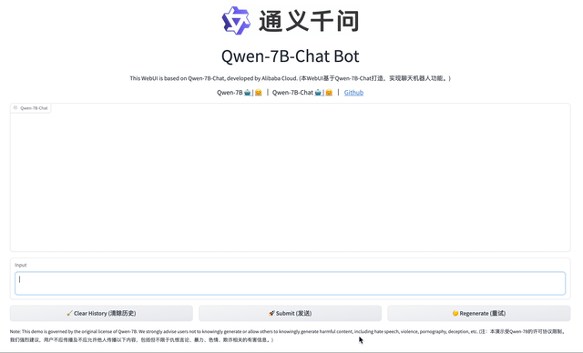

<p align="left">
        中文</a>&nbsp ｜ &nbsp<a href="README.md">English</a>&nbsp ｜ &nbsp<a href="README_JA.md">日本語</a>
</p>
<br><br>

<p align="center">
    
<p>
<br>

<p align="center">
        🤗 <a href="https://huggingface.co/Qwen">Hugging Face</a>&nbsp&nbsp | &nbsp&nbsp🤖 <a href="https://modelscope.cn/models/qwen">魔搭社区<a>&nbsp&nbsp | &nbsp&nbsp 📑 <a href="https://qianwen-res.oss-cn-beijing.aliyuncs.com/QWEN_TECHNICAL_REPORT.pdf">论文</a> &nbsp&nbsp ｜ &nbsp&nbsp🖥️ <a href="https://modelscope.cn/studios/qwen/Qwen-7B-Chat-Demo/summary">Demo</a>
<br>
<a href="assets/wechat.png">微信</a>&nbsp&nbsp ｜ &nbsp&nbsp 钉钉 &nbsp&nbsp | &nbsp&nbsp<a href="https://discord.gg/z3GAxXZ9Ce">Discord</a>&nbsp&nbsp
</p>
<br><br>

|     |                                                              Qwen-Chat                                                               |                                                                Qwen-Chat (Int4)                                                                |                                                            Qwen                                                            |
|-----|:------------------------------------------------------------------------------------------------------------------------------------:|:----------------------------------------------------------------------------------------------------------------------------------------------:|:--------------------------------------------------------------------------------------------------------------------------:|
| 7B  |  <a href="https://modelscope.cn/models/qwen/Qwen-7B-Chat/summary">🤖 <a>  <a href="https://huggingface.co/Qwen/Qwen-7B-Chat">🤗</a>  |  <a href="https://modelscope.cn/models/qwen/Qwen-7B-Chat-Int4/summary">🤖 <a>  <a href="https://huggingface.co/Qwen/Qwen-7B-Chat-Int4">🤗</a>  |  <a href="https://modelscope.cn/models/qwen/Qwen-7B/summary">🤖 <a>  <a href="https://huggingface.co/Qwen/Qwen-7B">🤗</a>  |
| 14B | <a href="https://modelscope.cn/models/qwen/Qwen-14B-Chat/summary">🤖 <a>  <a href="https://huggingface.co/Qwen/Qwen-14B-Chat">🤗</a> | <a href="https://modelscope.cn/models/qwen/Qwen-14B-Chat-Int4/summary">🤖 <a>  <a href="https://huggingface.co/Qwen/Qwen-14B-Chat-Int4">🤗</a> | <a href="https://modelscope.cn/models/qwen/Qwen-14B/summary">🤖 <a>  <a href="https://huggingface.co/Qwen/Qwen-14B">🤗</a> |

我们开源了**Qwen**（通义千问）系列工作，当前开源模型的参数规模为70亿（7B）和140亿（14B）。本次开源包括基础模型**Qwen**，即**Qwen-7B**和**Qwen-14B**，以及对话模型**Qwen-Chat**，即**Qwen-7B-Chat**和**Qwen-14B-Chat**。模型链接在表格中，请点击了解详情。同时，我们公开了我们的**[技术报告](https://qianwen-res.oss-cn-beijing.aliyuncs.com/QWEN_TECHNICAL_REPORT.pdf)**，请点击上方论文链接查看。

当前基础模型已经稳定训练了大规模高质量且多样化的数据，覆盖多语言（当前绝以中文和英文为主），总量高达3万亿token。在相关基准评测中，Qwen系列模型拿出非常有竞争力的表现，显著超出同规模模型并紧追一系列最强的闭源模型。此外，我们利用SFT和RLHF技术实现对齐，从基座模型训练得到对话模型。Qwen-Chat具备聊天、文字创作、摘要、信息抽取、翻译等能力，同时还具备一定的代码生成和简单数学推理的能力。在此基础上，我们针对LLM对接外部系统等方面针对性地做了优化，当前具备较强的工具调用能力，以及最近备受关注的Code Interpreter的能力和扮演Agent的能力。

在这个项目中，你可以了解到以下内容

* 快速上手Qwen-Chat教程，玩转大模型推理.
* 量化模型相关细节，包括用法、显存占用、推理性能等。这部分还提供了和非量化模型的对比。
* 微调的教程，帮你实现全参数微调、LoRA以及Q-LoRA。
* 搭建Demo的方法，包括WebUI和CLI Demo
* 更多关于Qwen在工具调用、Code Interpreter、Agent方面的内容
* 长序列理解能力及评测
* 使用协议
* ...

如果遇到问题，请优先考虑查询[FAQ](FAQ.md)。如仍未解决，随时提出issue（但建议使用英语或提供翻译，有助于帮助更多用户）。如果想帮助我们提升，欢迎提交Pull Requests！

想和我们一起讨论和聊天的话，赶紧加入我们的微信群和Discord server（入口见文档开头部分）！
<br><br>

## 新闻


* 2023年9月25日 🔥 在魔搭社区（ModelScope）和Hugging Face推出**Qwen-14B**和**Qwen-14B-Cha**t模型，并同步更新**Qwen-7B**和**Qwen-7B-Chat**模型。相比原版Qwen-7B，新版用了更多训练数据（2.4T token），序列长度从2048扩展至8192。整体中文能力以及代码能力提升较多。**请确保你使用的是最新的代码和模型！**
* 2023年9月12日 支持Qwen-7B和Qwen-7B-Chat的微调，其中包括全参数微调、LoRA以及Q-LoRA。
* 2023年8月21日 发布Qwen-7B-Chat的Int4量化模型，Qwen-7B-Chat-Int4。该模型显存占用低，推理速度相比半精度模型显著提升，在基准评测上效果损失较小。
* 2023年8月3日 在魔搭社区（ModelScope）和Hugging Face同步推出Qwen-7B和Qwen-7B-Chat模型。同时，我们发布了技术备忘录，介绍了相关的训练细节和模型表现。
<br>

## 评测表现

Qwen-14B及Qwen-7B (最新版本使用更大量的token进行预训练)相比同规模模型均实现了效果的显著提升。我们评测的数据集包括MMLU、C-Eval、 GSM8K、 MATH、HumanEval、MBPP、BBH等数据集，考察的能力包括自然语言理解、知识、数学计算和推理、代码生成、逻辑推理等。当然，即便Qwen-14B相比GPT-3.5和GPT-4仍有差距。 

<p align="left">
    
<p>
<br>

| Model                  |   MMLU   |  C-Eval  |  GSM8K   |   MATH   | HumanEval |   MBPP    |   BBH    |  CMMLU   |
|:-----------------------|:--------:|:--------:|:--------:|:--------:|:---------:|:---------:|:--------:|:--------:|
|                        |  5-shot  |  5-shot  |  8-shot  |  4-shot  |  0-shot   |  3-shot   |  3-shot  |  5-shot  |
| LLaMA2-7B              |   46.8   |   32.5   |   16.7   |   3.3    |   12.8    |   20.8    |   38.2   |   31.8   |
| LLaMA2-13B             |   55.0   |   41.4   |   29.6   |   5.0    |   18.9    |   30.3    |   45.6   |   38.4   |
| LLaMA2-34B             |   62.6   |    -     |   42.2   |   6.2    |   22.6    |   33.0    |   44.1   |    -     |
| ChatGLM2-6B            |   47.9   |   51.7   |   32.4   |   6.5    |     -     |     -     |   33.7   |    -     |
| InternLM-7B            |   51.0   |   53.4   |   31.2   |   6.3    |   10.4    |   14.0    |   37.0   |   51.8   |
| InternLM-20B           |   62.1   |   58.8   |   52.6   |   7.9    |   25.6    |   35.6    |   52.5   |   59.0   |
| Baichuan2-7B           |   54.7   |   56.3   |   24.6   |   5.6    |   18.3    |   24.2    |   41.6   |   57.1   |
| Baichuan2-13B          |   59.5   |   59.0   |   52.8   |   10.1   |   17.1    |   30.2    |   49.0   |   62.0   |
| **Qwen-7B (original)** |   56.7   |   59.6   |   51.6   |     10.4     |   24.4    |   31.2    |   40.6   |   58.8   |
| **Qwen-7B**            |   58.2   |   63.5   |   51.7   |   11.6   |   29.9    |   31.6    |   45.0   |   62.2   |
| **Qwen-14B**           | **66.3** | **72.1** | **61.3** | **24.8** | **32.3**  | **40.8**  | **53.4** | **71.0** |


对于以上所有对比模型，我们列出了其官方汇报结果与[OpenCompass](https://opencompass.org.cn/leaderboard-llm)结果之间的最佳分数。

更多的实验结果和细节请查看我们的技术备忘录。点击[这里](https://qianwen-res.oss-cn-beijing.aliyuncs.com/QWEN_TECHNICAL_REPORT.pdf)。
<br><br>

## 要求

* python 3.8及以上版本
* pytorch 1.12及以上版本，推荐2.0及以上版本
* 建议使用CUDA 11.4及以上（GPU用户、flash-attention用户等需考虑此选项）
<br>

## 快速使用

我们提供简单的示例来说明如何利用🤖 ModelScope和🤗 Transformers快速使用Qwen-7B和Qwen-7B-Chat。

在开始前，请确保你已经配置好环境并安装好相关的代码包。最重要的是，确保你满足上述要求，然后安装相关的依赖库。

```bash
pip install -r requirements.txt
```

如果你的显卡支持fp16或bf16精度，我们还推荐安装[flash-attention](https://github.com/Dao-AILab/flash-attention)来提高你的运行效率以及降低显存占用。(**flash-attention只是可选项，不安装也可正常运行该项目**)

```bash
git clone -b v1.0.8 https://github.com/Dao-AILab/flash-attention
cd flash-attention && pip install .
# 下方安装可选，安装可能比较缓慢。
# pip install csrc/layer_norm
# pip install csrc/rotary
```

接下来你可以开始使用Transformers或者ModelScope来使用我们的模型。

#### 🤗 Transformers

如希望使用Qwen-chat进行推理，所需要写的只是如下所示的数行代码。**请确保你使用的是最新代码，并指定正确的模型名称和路径，如`Qwen/Qwen-7B-Chat`和`Qwen/Qwen-14B-Chat`**

```python
from transformers import AutoModelForCausalLM, AutoTokenizer
from transformers.generation import GenerationConfig

# 可选的模型包括: "Qwen/Qwen-7B-Chat", "Qwen/Qwen-14B-Chat"
tokenizer = AutoTokenizer.from_pretrained("Qwen/Qwen-7B-Chat", trust_remote_code=True)

# 打开bf16精度，A100、H100、RTX3060、RTX3070等显卡建议启用以节省显存
# model = AutoModelForCausalLM.from_pretrained("Qwen/Qwen-7B-Chat", device_map="auto", trust_remote_code=True, bf16=True).eval()
# 打开fp16精度，V100、P100、T4等显卡建议启用以节省显存
# model = AutoModelForCausalLM.from_pretrained("Qwen/Qwen-7B-Chat", device_map="auto", trust_remote_code=True, fp16=True).eval()
# 使用CPU进行推理，需要约32GB内存
# model = AutoModelForCausalLM.from_pretrained("Qwen/Qwen-7B-Chat", device_map="cpu", trust_remote_code=True).eval()
# 默认使用自动模式，根据设备自动选择精度
model = AutoModelForCausalLM.from_pretrained("Qwen/Qwen-7B-Chat", device_map="auto", trust_remote_code=True).eval()

# 可指定不同的生成长度、top_p等相关超参
model.generation_config = GenerationConfig.from_pretrained("Qwen/Qwen-7B-Chat", trust_remote_code=True)

# 第一轮对话
response, history = model.chat(tokenizer, "你好", history=None)
print(response)
# 你好！很高兴为你提供帮助。

# 第二轮对话
response, history = model.chat(tokenizer, "给我讲一个年轻人奋斗创业最终取得成功的故事。", history=history)
print(response)
# 这是一个关于一个年轻人奋斗创业最终取得成功的故事。
# 故事的主人公叫李明，他来自一个普通的家庭，父母都是普通的工人。从小，李明就立下了一个目标：要成为一名成功的企业家。
# 为了实现这个目标，李明勤奋学习，考上了大学。在大学期间，他积极参加各种创业比赛，获得了不少奖项。他还利用课余时间去实习，积累了宝贵的经验。
# 毕业后，李明决定开始自己的创业之路。他开始寻找投资机会，但多次都被拒绝了。然而，他并没有放弃。他继续努力，不断改进自己的创业计划，并寻找新的投资机会。
# 最终，李明成功地获得了一笔投资，开始了自己的创业之路。他成立了一家科技公司，专注于开发新型软件。在他的领导下，公司迅速发展起来，成为了一家成功的科技企业。
# 李明的成功并不是偶然的。他勤奋、坚韧、勇于冒险，不断学习和改进自己。他的成功也证明了，只要努力奋斗，任何人都有可能取得成功。

# 第三轮对话
response, history = model.chat(tokenizer, "给这个故事起一个标题", history=history)
print(response)
# 《奋斗创业：一个年轻人的成功之路》
```

运行Qwen同样非常简单。

<details>
  <summary>运行Qwen</summary>

```python
from transformers import AutoModelForCausalLM, AutoTokenizer
from transformers.generation import GenerationConfig

# 可选的模型包括: "Qwen/Qwen-7B", "Qwen/Qwen-14B"
tokenizer = AutoTokenizer.from_pretrained("Qwen/Qwen-7B", trust_remote_code=True)

# 打开bf16精度，A100、H100、RTX3060、RTX3070等显卡建议启用以节省显存
# model = AutoModelForCausalLM.from_pretrained("Qwen/Qwen-7B", device_map="auto", trust_remote_code=True, bf16=True).eval()
# 打开fp16精度，V100、P100、T4等显卡建议启用以节省显存
# model = AutoModelForCausalLM.from_pretrained("Qwen/Qwen-7B", device_map="auto", trust_remote_code=True, fp16=True).eval()
# 使用CPU进行推理，需要约32GB内存
# model = AutoModelForCausalLM.from_pretrained("Qwen/Qwen-7B", device_map="cpu", trust_remote_code=True).eval()
# 默认使用自动模式，根据设备自动选择精度
model = AutoModelForCausalLM.from_pretrained("Qwen/Qwen-7B", device_map="auto", trust_remote_code=True).eval()

# 可指定不同的生成长度、top_p等相关超参
model.generation_config = GenerationConfig.from_pretrained("Qwen/Qwen-7B", trust_remote_code=True)

inputs = tokenizer('蒙古国的首都是乌兰巴托（Ulaanbaatar）\n冰岛的首都是雷克雅未克（Reykjavik）\n埃塞俄比亚的首都是', return_tensors='pt')
inputs = inputs.to(model.device)
pred = model.generate(**inputs)
print(tokenizer.decode(pred.cpu()[0], skip_special_tokens=True))
# 蒙古国的首都是乌兰巴托（Ulaanbaatar）\n冰岛的首都是雷克雅未克（Reykjavik）\n埃塞俄比亚的首都是亚的斯亚贝巴（Addis Ababa）...
```

</details>

#### 🤖 ModelScope

魔搭（ModelScope）是开源的模型即服务共享平台，为泛AI开发者提供灵活、易用、低成本的一站式模型服务产品。使用ModelScope同样非常简单，代码如下所示：

```python
from modelscope import AutoModelForCausalLM, AutoTokenizer
from modelscope import GenerationConfig

# 可选的模型包括: "qwen/Qwen-7B-Chat", "qwen/Qwen-14B-Chat"
tokenizer = AutoTokenizer.from_pretrained("qwen/Qwen-7B-Chat", revision='v1.0.5', trust_remote_code=True)
model = AutoModelForCausalLM.from_pretrained("qwen/Qwen-7B-Chat", revision='v1.0.5', device_map="auto", trust_remote_code=True, fp16=True).eval()
model.generation_config = GenerationConfig.from_pretrained("Qwen/Qwen-7B-Chat", revision='v1.0.5', trust_remote_code=True) # 可指定不同的生成长度、top_p等相关超参

response, history = model.chat(tokenizer, "你好", history=None)
print(response)
response, history = model.chat(tokenizer, "浙江的省会在哪里？", history=history) 
print(response)
response, history = model.chat(tokenizer, "它有什么好玩的景点", history=history)
print(response)
```
<br>

## 量化

### 用法

**请注意：我们更新量化方案为基于[AutoGPTQ](https://github.com/PanQiWei/AutoGPTQ)的量化，提供Int4量化模型，包括Qwen-7B-Chat [Click here](https://huggingface.co/Qwen/Qwen-7B-Chat-Int4)和Qwen-14B-Chat [Click here](https://huggingface.co/Qwen/Qwen-14B-Chat-Int4)。该方案在模型评测效果几乎无损，且存储需求更低，推理速度更优。**

以下我们提供示例说明如何使用Int4量化模型。在开始使用前，请先保证满足要求（如torch 2.0及以上，transformers版本为4.32.0及以上，等等），并安装所需安装包：

```bash
pip install auto-gptq optimum
```

如安装`auto-gptq`遇到问题，我们建议您到官方[repo](https://github.com/PanQiWei/AutoGPTQ)搜索合适的wheel。

随后即可使用和上述一致的用法调用量化模型：

```python
# 可选模型包括："Qwen/Qwen-7B-Chat-Int4", "Qwen/Qwen-14B-Chat-Int4"
model = AutoModelForCausalLM.from_pretrained(
    "Qwen/Qwen-7B-Chat-Int4",
    device_map="auto",
    trust_remote_code=True
).eval()
response, history = model.chat(tokenizer, "Hi", history=None)
```
### 效果评测

我们对BF16和Int4模型在基准评测上做了测试，发现量化模型效果损失较小，结果如下所示：

| Quantization         | MMLU | CEval (val) | GSM8K | Humaneval |
|----------------------|:----:|:-----------:|:-----:|:---------:|
| Qwen-7B-Chat (BF16)  | 53.9 |    54.2     | 41.1  |   24.4    |
| Qwen-7B-Chat (Int4)  | 52.6 |    52.9     | 38.1  |   23.8    |
| Qwen-14B-Chat (BF16) | 64.6 |    69.8     | 61.0  |   43.9    |
| Qwen-14B-Chat (Int4) | 63.3 |    69.0     | 59.8  |   45.7    |

### 推理速度

我们测算了BF16和Int4模型生成2048和8192个token的平均推理速度（tokens/s）。如图所示：

| Quantization         | Speed (2048 tokens) | Speed (8192 tokens) |
|----------------------|:-------------------:|:-------------------:|
| Qwen-7B-Chat (BF16)  |        30.34        |        29.32        |
| Qwen-7B-Chat (Int4)  |        43.56        |        33.92        |
| Qwen-14B-Chat (BF16) |        30.70        |        21.73        |
| Qwen-14B-Chat (Int4) |        37.11        |        26.11        |

具体而言，我们记录在长度为1的上下文的条件下生成8192个token的性能。评测运行于单张A100-SXM4-80G GPU，使用PyTorch 2.0.1和CUDA 11.4。推理速度是生成8192个token的速度均值。

### 显存使用

我们还测算了BF16和Int4模型编码2048个token及生成8192个token的峰值显存占用情况。结果如下所示：

| Quantization         | Peak Usage for Encoding 2048 Tokens | Peak Usage for Generating 8192 Tokens |
|----------------------|:-----------------------------------:|:-------------------------------------:|
| Qwen-7B-Chat (BF16)  |               17.66GB               |                22.58GB                |
| Qwen-7B-Chat (Int4)  |               8.21GB                |                13.62GB                |
| Qwen-14B-Chat (BF16) |               30.15GB                 |                38.94GB                  |
| Qwen-14B-Chat (Int4) |               13.00GB                 |                21.79GB                  |

上述性能测算使用[此脚本](https://qianwen-res.oss-cn-beijing.aliyuncs.com/profile.py)完成。
<br><br>


## 微调

我们提供了`finetune.py`这个脚本供用户实现在自己的数据上进行微调的功能，以接入下游任务。此外，我们还提供了shell脚本减少用户的工作量。这个脚本支持 [DeepSpeed](https://github.com/microsoft/DeepSpeed) 和 [FSDP](https://engineering.fb.com/2021/07/15/open-source/fsdp/) 。我们提供的shell脚本使用了DeepSpeed，因此建议您确保已经安装DeepSpeed。

首先，你需要准备你的训练数据。你需要将所有样本放到一个列表中并存入json文件中。每个样本对应一个字典，包含id和conversation，其中后者为一个列表。示例如下所示：
```json
[
  {
    "id": "identity_0",
    "conversations": [
      {
        "from": "user",
        "value": "你好",
      },
      {
        "from": "assistant",
        "value": "我是一个语言模型，我叫通义千问。"
      }
    ]
  }
]
```

准备好数据后，你可以使用我们提供的shell脚本实现微调。注意，你需要在脚本中指定你的数据的路径。

微调脚本能够帮你实现：
- 全参数微调
- LoRA
- Q-LoRA

全参数微调在训练过程中更新所有参数。你可以运行这个脚本开始训练：

```bash
# 分布式训练。由于显存限制将导致单卡训练失败，我们不提供单卡训练脚本。
sh finetune/finetune_ds.sh
```

尤其注意，你需要在脚本中指定正确的模型名称或路径、数据路径、以及模型输出的文件夹路径。在这个脚本中我们使用了DeepSpeed ZeRO 3。如果你想修改这个配置，可以删除掉`--deepspeed`这个输入或者自行根据需求修改DeepSpeed配置json文件。此外，我们支持混合精度训练，因此你可以设置`--bf16 True`或者`--fp16 True`。经验上，如果你的机器支持bf16，我们建议使用bf16，这样可以和我们的预训练和对齐训练保持一致，这也是为什么我们把默认配置设为它的原因。

运行LoRA的方法类似全参数微调。但在开始前，请确保已经安装`peft`代码库。另外，记住要设置正确的模型、数据和输出路径。我们建议你为模型路径使用绝对路径。这是因为LoRA仅存储adapter部分参数，而adapter配置json文件记录了预训练模型的路径，用于读取预训练模型权重。同样，你可以设置bf16或者fp16。

```bash
# 单卡训练
sh finetune/finetune_lora_single_gpu.sh
# 分布式训练
sh finetune/finetune_lora_ds.sh
```

与全参数微调不同，LoRA ([论文](https://arxiv.org/abs/2106.09685)) 只更新adapter层的参数而无需更新原有语言模型的参数。这种方法允许用户用更低的显存开销来训练模型，也意味着更小的计算开销。然而，如果你依然遇到显存不足的问题，可以考虑使用Q-LoRA ([论文](https://arxiv.org/abs/2305.14314))。该方法使用4比特量化模型以及paged attention等技术实现更小的显存开销。运行Q-LoRA你只需运行如下脚本：

```bash
# 单卡训练
sh finetune/finetune_qlora_single_gpu.sh
# 分布式训练
sh finetune/finetune_qlora_ds.sh
```

我们建议你使用我们提供的Int4量化模型进行训练，即Qwen-7B-Chat-Int4。然而，与全参数微调以及LoRA不同，Q-LoRA仅支持fp16。

与全参数微调不同，LoRA和Q-LoRA的训练只需存储adapter部分的参数。假如你需要使用LoRA训练后的模型，你需要使用如下方法。假设你使用Qwen-7B训练模型，你可以用如下代码读取模型：

```python
from peft import AutoPeftModelForCausalLM

model = AutoPeftModelForCausalLM.from_pretrained(
    path_to_adapter, # path to the output directory
    device_map="auto",
    trust_remote_code=True
).eval()
```

上述shell脚本使用`torchrun`来运行单GPU和多GPU训练。分布式训练需要根据你的需求和机器指定正确的分布式训练超参数。
<br><br>

## Demo

### Web UI

我们提供了Web UI的demo供用户使用 (感谢 @wysaid 支持)。在开始前，确保已经安装如下代码库：

```bash
pip install -r requirements_web_demo.txt
```

随后运行如下命令，并点击生成链接：

```bash
python web_demo.py
```

<p align="center">
    <br>
    
    <br>
<p>

### 交互式Demo

我们提供了一个简单的交互式Demo示例，请查看`cli_demo.py`。当前模型已经支持流式输出，用户可通过输入文字的方式和Qwen-7B-Chat交互，模型将流式输出返回结果。运行如下命令：

```
python cli_demo.py
```

<p align="center">
    <br>
    
    <br>
<p>
<br>

## API

我们提供了OpenAI API格式的本地API部署方法（感谢@hanpenggit）。在开始之前先安装必要的代码库：

```bash
pip install fastapi uvicorn openai pydantic sse_starlette
```

随后即可运行以下命令部署你的本地API：

```bash
python openai_api.py
```

你也可以修改参数，比如`-c`来修改模型名称或路径, `--cpu-only`改为CPU部署等等。如果部署出现问题，更新上述代码库往往可以解决大多数问题。

使用API同样非常简单，示例如下：

```python
import openai
openai.api_base = "http://localhost:8000/v1"
openai.api_key = "none"

# 使用流式回复的请求
for chunk in openai.ChatCompletion.create(
    model="Qwen",
    messages=[
        {"role": "user", "content": "你好"}
    ],
    stream=True
    # 流式输出的自定义stopwords功能尚未支持，正在开发中
):
    if hasattr(chunk.choices[0].delta, "content"):
        print(chunk.choices[0].delta.content, end="", flush=True)

# 不使用流式回复的请求
response = openai.ChatCompletion.create(
    model="Qwen",
    messages=[
        {"role": "user", "content": "你好"}
    ],
    stream=False,
    stop=[] # 在此处添加自定义的stop words 例如ReAct prompting时需要增加： stop=["Observation:"]。
)
print(response.choices[0].message.content)
```

<p align="center">
    <br>
    
    <br>
<p>

该接口也支持函数调用（Function Calling），但暂时仅限 `stream=False` 时能生效。用法见[函数调用示例](examples/function_call_examples.py)。
<br><br>

## 部署

在CPU上运行非常简单，使用方法如下所示：

```python
model = AutoModelForCausalLM.from_pretrained("Qwen/Qwen-7B-Chat", device_map="cpu", trust_remote_code=True).eval()
```

如果你遇到显存不足的问题而希望使用多张GPU进行推理，可以使用提供的脚本`utils.py`:

```python
from utils import load_model_on_gpus
model = load_model_on_gpus('Qwen/Qwen-7B-Chat', num_gpus=2)
```

你即可使用2张GPU进行推理。
<br><br>

## 工具调用

Qwen-Chat针对工具使用、函数调用能力进行了优化。用户可以开发基于Qwen的Agent、LangChain应用、甚至Code Interpreter。

我们提供了文档说明如何根据ReAct Prompting的原理实现工具调用，请参见[ReAct示例](examples/react_prompt.md)。基于该原理，我们在 [openai_api.py](openai_api.py) 里提供了函数调用（Function Calling）的支持。
我们在已开源的中文[评测数据集](eval/EVALUATION.md)上测试模型的工具调用能力，并发现Qwen-Chat能够取得稳定的表现：

<table>
    <tr>
        <th colspan="4" align="center">中文工具调用评测基准</th>
    </tr>
    <tr>
        <th align="center">Model</th><th align="center">Tool Selection (Acc.↑)</th><th align="center">Tool Input (Rouge-L↑)</th><th align="center">False Positive Error↓</th>
    </tr>
    <tr>
        <td>GPT-4</td><td align="center">95%</td><td align="center">0.90</td><td align="center">15.0%</td>
    </tr>
    <tr>
        <td>GPT-3.5</td><td align="center">85%</td><td align="center">0.88</td><td align="center">75.0%</td>
    </tr>
    <tr>
        <td>Qwen-7B-Chat</td><td align="center">98%</td><td align="center">0.91</td><td align="center">7.3%</td>
    </tr>
    <tr>
        <td>Qwen-14B-Chat</td><td align="center">98%</td><td align="center">0.93</td><td align="center">2.4%</td>
    </tr>
</table>

为了考察Qwen使用Python Code Interpreter完成数学解题、数据可视化、及文件处理与爬虫等任务的能力，我们专门建设并开源了一个评测这方面能力的[评测基准](https://github.com/QwenLM/Qwen-Agent/tree/main/benchmark)。
我们发现Qwen在生成代码的可执行率、结果正确性上均表现较好：

<table>
    <tr>
        <th colspan="4" align="center">生成代码的可执行率 (%)</th>
    </tr>
    <tr>
        <th align="center">Model</th><th align="center">Math↑</th><th align="center">Visualization↑</th><th align="center">General↑</th>
    </tr>
    <tr>
        <td>GPT-4</td><td align="center">91.9</td><td align="center">85.9</td><td align="center">82.8</td>
    </tr>
    <tr>
        <td>GPT-3.5</td><td align="center">89.2</td><td align="center">65.0</td><td align="center">74.1</td>
    </tr>
    <tr>
        <td>LLaMA2-7B-Chat</td>
        <td align="center">41.9</td>
        <td align="center">33.1</td>
        <td align="center">24.1 </td>
    </tr>
    <tr>
        <td>LLaMA2-13B-Chat</td>
        <td align="center">50.0</td>
        <td align="center">40.5</td>
        <td align="center">48.3 </td>
    </tr>
    <tr>
        <td>CodeLLaMA-7B-Instruct</td>
        <td align="center">85.1</td>
        <td align="center">54.0</td>
        <td align="center">70.7 </td>
    </tr>
    <tr>
        <td>CodeLLaMA-13B-Instruct</td>
        <td align="center">93.2</td>
        <td align="center">55.8</td>
        <td align="center">74.1 </td>
    </tr>
    <tr>
        <td>InternLM-7B-Chat-v1.1</td>
        <td align="center">78.4</td>
        <td align="center">44.2</td>
        <td align="center">62.1 </td>
    </tr>
    <tr>
        <td>InternLM-20B-Chat</td>
        <td align="center">70.3</td>
        <td align="center">44.2</td>
        <td align="center">65.5 </td>
    </tr>
    <tr>
        <td>Qwen-7B-Chat</td>
        <td align="center">82.4</td>
        <td align="center">64.4</td>
        <td align="center">67.2 </td>
    </tr>
    <tr>
        <td>Qwen-14B-Chat</td>
        <td align="center">89.2</td>
        <td align="center">84.1</td>
        <td align="center">65.5</td>
    </tr>
</table>

<table>
    <tr>
        <th colspan="4" align="center">代码执行结果的正确率 (%)</th>
    </tr>
    <tr>
        <th align="center">Model</th><th align="center">Math↑</th><th align="center">Visualization-Hard↑</th><th align="center">Visualization-Easy↑</th>
    </tr>
    <tr>
        <td>GPT-4</td><td align="center">82.8</td><td align="center">66.7</td><td align="center">60.8</td>
    </tr>
    <tr>
        <td>GPT-3.5</td><td align="center">47.3</td><td align="center">33.3</td><td align="center">55.7</td>
    </tr>
    <tr>
        <td>LLaMA2-7B-Chat</td>
        <td align="center">3.9</td>
        <td align="center">14.3</td>
        <td align="center">39.2 </td>
    </tr>
    <tr>
        <td>LLaMA2-13B-Chat</td>
        <td align="center">8.3</td>
        <td align="center">8.3</td>
        <td align="center">40.5 </td>
    </tr>
    <tr>
        <td>CodeLLaMA-7B-Instruct</td>
        <td align="center">14.3</td>
        <td align="center">26.2</td>
        <td align="center">60.8 </td>
    </tr>
    <tr>
        <td>CodeLLaMA-13B-Instruct</td>
        <td align="center">28.2</td>
        <td align="center">27.4</td>
        <td align="center">62.0 </td>
    </tr>
    <tr>
        <td>InternLM-7B-Chat-v1.1</td>
        <td align="center">28.5</td>
        <td align="center">4.8</td>
        <td align="center">40.5 </td>
    </tr>
    <tr>
        <td>InternLM-20B-Chat</td>
        <td align="center">34.6</td>
        <td align="center">21.4</td>
        <td align="center">45.6 </td>
    </tr>
    <tr>
        <td>Qwen-7B-Chat</td>
        <td align="center">41.9</td>
        <td align="center">40.5</td>
        <td align="center">54.4 </td>
    </tr>
    <tr>
        <td>Qwen-14B-Chat</td>
        <td align="center">58.4</td>
        <td align="center">53.6</td>
        <td align="center">59.5</td>
    </tr>
</table>

<p align="center">
    <br>
    
    <br>
<p>

此外，我们还提供了实验结果表明我们的模型具备扮演HuggingFace Agent的能力，详见[示例文档](examples/transformers_agent.md)了解更多信息。模型在Hugging Face提供的评测数据集上表现如下：

<table>
    <tr>
        <th colspan="4" align="center">HuggingFace Agent评测基准 - Run模式</th>
    </tr>
    <tr>
        <th align="center">Model</th><th align="center">Tool Selection↑</th><th align="center">Tool Used↑</th><th align="center">Code↑</th>
    </tr>
    <tr>
        <td>GPT-4</td><td align="center">100</td><td align="center">100</td><td align="center">97.4</td>
    </tr>
    <tr>
        <td>GPT-3.5</td><td align="center">95.4</td><td align="center">96.3</td><td align="center">87.0</td>
    </tr>
    <tr>
        <td>StarCoder-Base-15B</td><td align="center">86.1</td><td align="center">87.0</td><td align="center">68.9</td>
    </tr>
    <tr>
        <td>StarCoder-15B</td><td align="center">87.0</td><td align="center">88.0</td><td align="center">68.9</td>
    </tr>
    <tr>
        <td>Qwen-7B-Chat</td><td align="center">87.0</td><td align="center">87.0</td><td align="center">71.5</td>
    </tr>
    <tr>
        <td>Qwen-14B-Chat</td><td align="center">93.5</td><td align="center">94.4</td><td align="center">87.0</td>
    </tr>
</table>

<table>
    <tr>
        <th colspan="4" align="center">HuggingFace Agent评测基准 - Chat模式</th>
    </tr>
    <tr>
        <th align="center">Model</th><th align="center">Tool Selection↑</th><th align="center">Tool Used↑</th><th align="center">Code↑</th>
    </tr>
    <tr>
        <td>GPT-4</td><td align="center">97.9</td><td align="center">97.9</td><td align="center">98.5</td>
    </tr>
    <tr>
        <td>GPT-3.5</td><td align="center">97.3</td><td align="center">96.8</td><td align="center">89.6</td>
    </tr>
    <tr>
        <td>StarCoder-Base-15B</td><td align="center">97.9</td><td align="center">97.9</td><td align="center">91.1</td>
    </tr>
    <tr>
        <td>StarCoder-15B</td><td align="center">97.9</td><td align="center">97.9</td><td align="center">89.6</td>
    </tr>
    <tr>
        <td>Qwen-7B-Chat</td><td align="center">94.7</td><td align="center">94.7</td><td align="center">85.1</td>
    </tr>
    <tr>
        <td>Qwen-14B-Chat</td><td align="center">97.9</td><td align="center">97.9</td><td align="center">95.5</td>
    </tr>
</table>

<br>

## 长文本理解

我们引入了NTK插值、窗口注意力、LogN注意力缩放等技术来提升模型的上下文长度并突破训练序列长度的限制。通过arXiv数据集上的语言模型实验，我们的原生长度为2K的Qwen-7B/14B在8K的序列长度下依然表现不错，而原生长度扩展到8K的Qwen-7B能够在32K长序列的设置下取得不错的表现。

<table>
    <tr>
        <th rowspan="2">Model</th><th colspan="6" align="center">Sequence Length</th>
    </tr>
    <tr>
        <th align="center">1024</th><th align="center">2048</th><th align="center">4096</th><th align="center">8192</th><th align="center">16384</th><th align="center">32768</th>
    </tr>
     <tr>
        <td>Qwen-7B (original)</td><td align="center">4.23</td><td align="center">3.78</td><td align="center">39.35</td><td align="center">469.81</td><td align="center">2645.09</td><td align="center">-</td>
    </tr>
    <tr>
        <td>+ dynamic_ntk</td><td align="center">4.23</td><td align="center">3.78</td><td align="center">3.59</td><td align="center">3.66</td><td align="center">5.71</td><td align="center">-</td>
    </tr>
    <tr>
        <td>+ dynamic_ntk + logn</td><td align="center">4.23</td><td align="center">3.78</td><td align="center">3.58</td><td align="center">3.56</td><td align="center">4.62</td><td align="center">-</td>
    </tr>
    <tr>
        <td>+ dynamic_ntk + logn + window_attn</td><td align="center">4.23</td><td align="center">3.78</td><td align="center">3.58</td><td align="center">3.49</td><td align="center">4.32</td><td align="center">-</td>
    </tr>
    <tr>
    <tr>
        <td>Qwen-7B</td><td align="center"><b>4.23</b></td><td align="center"><b>3.81</b></td><td align="center"><b>3.52</b></td><td align="center"><b>3.31</b></td><td align="center">7.27</td><td align="center">181.49</td>
    </tr>
    <tr>
        <td>+ dynamic_ntk</td><td align="center"><b>4.23</b></td><td align="center"><b>3.81</b></td><td align="center"><b>3.52</b></td><td align="center"><b>3.31</b></td><td align="center"><b>3.23</b></td><td align="center">3.33</td>
    </tr>
    <tr>
        <td>+ dynamic_ntk + logn + window_attn</td><td align="center"><b>4.23</b></td><td align="center"><b>3.81</b></td><td align="center"><b>3.52</b></td><td align="center"><b>3.33</b></td><td align="center"><b>3.22</b></td><td align="center"><b>3.17</b></td>
    </tr>
    <tr>
        <td>Qwen-14B</td><td align="center"><b>-</b></td><td align="center"><b>3.46</b></td><td align="center">22.79</td><td align="center">334.65</td><td align="center">3168.35</td><td align="center">-</td>
    </tr>
    <tr>
        <td>+ dynamic_ntk + logn + window_attn</td><td align="center"><b>-</b></td><td align="center"><b>3.46</b></td><td align="center"><b>3.29</b></td><td align="center"><b>3.18</b></td><td align="center">3.42</td><td align="center">-</td>
    </tr>
</table>

## Tokenization

> 注：作为术语的“tokenization”在中文中尚无共识的概念对应，本文档采用英文表达以利说明。

基于tiktoken的tokenizer有别于其他分词器，比如sentencepiece tokenizer。尤其在微调阶段，需要特别注意特殊token的使用。关于tokenizer的更多信息，以及微调时涉及的相关使用，请参阅[文档](tokenization_note_zh.md)。
<br><br>

## 复现

我们提供了评测脚本以供复现我们的实验结果。注意，由于内部代码和开源代码存在少许差异，评测结果可能与汇报结果存在细微的结果不一致。请阅读[eval/EVALUATION.md](eval/EVALUATION.md)了解更多信息。
<br><br>

## FAQ

如遇到问题，敬请查阅[FAQ](FAQ_zh.md)以及issue区，如仍无法解决再提交issue。
<br><br>

## 使用协议

研究人员与开发者可使用Qwen和Qwen-Chat或进行二次开发。我们同样允许商业使用，具体细节请查看[LICENSE](LICENSE)。如需商用，请填写[问卷](https://dashscope.console.aliyun.com/openModelApply/qianwen)申请。
<br><br>

## 联系我们

如果你想给我们的研发团队和产品团队留言，欢迎加入我们的微信群和Discord server。当然也可以通过邮件（qianwen_opensource@alibabacloud.com）联系我们。

