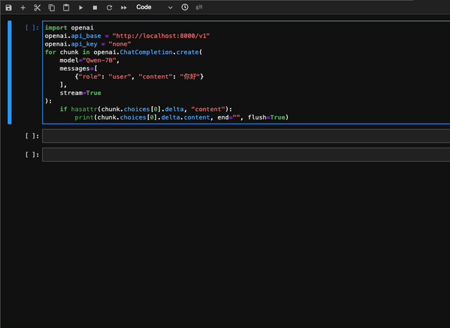

<p align="left">
    <a href="README_CN.md">中文</a>&nbsp ｜ &nbsp<a href="README.md">English</a>&nbsp ｜ &nbsp<a href="README_JA.md">日本語</a> ｜ &nbsp<a href="README_FR.md">Français</a> ｜ &nbspEspañol
</p>
<br><br>

<p align="center">
    
<p>
<br>

<p align="center">
        🤗 <a href="https://huggingface.co/Qwen">Hugging Face</a>&nbsp&nbsp | &nbsp&nbsp🤖 <a href="https://modelscope.cn/organization/qwen">ModelScope</a>&nbsp&nbsp | &nbsp&nbsp 📑 <a href="https://arxiv.org/abs/2309.16609">Paper</a> &nbsp&nbsp ｜ &nbsp&nbsp🖥️ <a href="https://modelscope.cn/studios/qwen/Qwen-72B-Chat-Demo/summary">Demo</a>
<br>
<a href="assets/wechat.png">WeChat (微信)</a>&nbsp&nbsp | &nbsp&nbsp<a href="https://discord.gg/z3GAxXZ9Ce">Discord</a>&nbsp&nbsp ｜  &nbsp&nbsp<a href="https://dashscope.aliyun.com">API</a> 
</p>
<br><br>

> [!Important]
> ¡Qwen2 está aquí! Estás invitado a seguir [QwenLM/Qwen2](https://github.com/QwenLM/Qwen2) y compartir tu experiencia allí.
>
> Este repositorio ([QwenLM/Qwen](https://github.com/QwenLM/Qwen)) ya no se mantiene activamente, debido a diferencias sustanciales en la base de código.
<br>


|     |                                                              Qwen-Chat                                                               |                                                                Qwen-Chat (Int4)                                                                |                        Qwen-Chat (Int8)                         |                                                            Qwen                                                            |
|-----|:------------------------------------------------------------------------------------------------------------------------------------:|:----------------------------------------------------------------------------------------------------------------------------------------------:|:---------------------------------------------------------------:|:--------------------------------------------------------------------------------------------------------------------------:|
| 1.8B  |  <a href="https://modelscope.cn/models/qwen/Qwen-1_8B-Chat/summary">🤖</a>  <a href="https://huggingface.co/Qwen/Qwen-1_8B-Chat">🤗</a>  |  <a href="https://modelscope.cn/models/qwen/Qwen-1_8B-Chat-Int4/summary">🤖</a>  <a href="https://huggingface.co/Qwen/Qwen-1_8B-Chat-Int4">🤗</a>  | <a href="https://modelscope.cn/models/qwen/Qwen-1_8B-Chat-Int8/summary">🤖</a>  <a href="https://huggingface.co/Qwen/Qwen-1_8B-Chat-Int8">🤗</a>  |  <a href="https://modelscope.cn/models/qwen/Qwen-1_8B/summary">🤖</a>  <a href="https://huggingface.co/Qwen/Qwen-1_8B">🤗</a>  |
| 7B  |  <a href="https://modelscope.cn/models/qwen/Qwen-7B-Chat/summary">🤖</a>  <a href="https://huggingface.co/Qwen/Qwen-7B-Chat">🤗</a>  |  <a href="https://modelscope.cn/models/qwen/Qwen-7B-Chat-Int4/summary">🤖</a>  <a href="https://huggingface.co/Qwen/Qwen-7B-Chat-Int4">🤗</a>  | <a href="https://modelscope.cn/models/qwen/Qwen-7B-Chat-Int8/summary">🤖</a>  <a href="https://huggingface.co/Qwen/Qwen-7B-Chat-Int8">🤗</a>  |  <a href="https://modelscope.cn/models/qwen/Qwen-7B/summary">🤖</a>  <a href="https://huggingface.co/Qwen/Qwen-7B">🤗</a>  |
| 14B | <a href="https://modelscope.cn/models/qwen/Qwen-14B-Chat/summary">🤖</a>  <a href="https://huggingface.co/Qwen/Qwen-14B-Chat">🤗</a> | <a href="https://modelscope.cn/models/qwen/Qwen-14B-Chat-Int4/summary">🤖</a>  <a href="https://huggingface.co/Qwen/Qwen-14B-Chat-Int4">🤗</a> | <a href="https://modelscope.cn/models/qwen/Qwen-14B-Chat-Int8/summary">🤖</a>  <a href="https://huggingface.co/Qwen/Qwen-14B-Chat-Int8">🤗</a> | <a href="https://modelscope.cn/models/qwen/Qwen-14B/summary">🤖</a>  <a href="https://huggingface.co/Qwen/Qwen-14B">🤗</a> |
| 72B | <a href="https://modelscope.cn/models/qwen/Qwen-72B-Chat/summary">🤖</a>  <a href="https://huggingface.co/Qwen/Qwen-72B-Chat">🤗</a> | <a href="https://modelscope.cn/models/qwen/Qwen-72B-Chat-Int4/summary">🤖</a>  <a href="https://huggingface.co/Qwen/Qwen-72B-Chat-Int4">🤗</a> | <a href="https://modelscope.cn/models/qwen/Qwen-72B-Chat-Int8/summary">🤖</a>  <a href="https://huggingface.co/Qwen/Qwen-72B-Chat-Int8">🤗</a> | <a href="https://modelscope.cn/models/qwen/Qwen-72B/summary">🤖</a>  <a href="https://huggingface.co/Qwen/Qwen-72B">🤗</a> |


Abrimos nuestra serie **Qwen**, que ahora incluye **Qwen**, los modelos de lenguaje, es decir **Qwen-7B** y **Qwen-14B**, así como **Qwen-Chat**, los modelos de chat, es decir **Qwen-7B-Chat** y **Qwen-14B-Chat**. Los enlaces se encuentran en la tabla anterior. Haz clic en ellos y comprueba las fichas de los modelos. Además, publicamos el **[informe técnico](https://arxiv.org/abs/2309.16609)**. Haz clic en el enlace y compruébalo.

En resumen, disponemos de modelos lingüísticos sólidos, que han sido preentrenados de forma estable para hasta 3 billones de tokens de datos multilingües con una amplia cobertura de dominios, idiomas (con especial atención al chino y al inglés), etc. Son capaces de lograr un rendimiento competitivo en conjuntos de datos de referencia. Además, disponemos de modelos de chat alineados con las preferencias humanas basados en SFT y RLHF (aún no publicados), que son capaces de chatear, crear contenidos, extraer información, resumir, traducir, codificar, resolver problemas matemáticos, etc., y son capaces de utilizar herramientas, jugar como agentes o incluso jugar como intérpretes de código, etc.

| Modelo    | Fecha de Publicación | Longitud Máx. | Mejora del Sistema de Avisos | # de Fichas Preentrenadas | Uso Mínimo de Memoria GPU de Finetuning (Q-Lora) | Uso Mínimo de la GPU para Generar 2048 Tokens (Int4) | Uso de Herramientas |
|:----------|:--------------------:|:-------------:|:----------------------------:|:-------------------------:|:------------------------------------------------:|:----------------------------------------------------:|:-------------------:|
| Qwen-1.8B |       23.11.30       |      32K      |              ✅               |           2.2T            |                      5.8GB                       |                        2.9GB                         |          ✅          |  
| Qwen-7B   |       23.08.03       |      32K      |              ❎               |           2.4T            |                      11.5GB                      |                        8.2GB                         |          ✅          |   
| Qwen-14B  |       23.09.25       |      8K       |              ❎               |           3.0T            |                      18.7GB                      |                        13.0GB                        |          ✅          |
| Qwen-72B  |       23.11.30       |      32K      |              ✅               |           3.0T            |                      61.4GB                      |                        48.9GB                        |          ✅          |   

En este repo, usted puede averiguar:

* Inicio rápido con Qwen, y disfrute de la simple inferencia.
* Detalles sobre los modelos de cuantificación, incluyendo GPTQ y cuantización de caché KV.
* Estadísticas de rendimiento de la inferencia, incluyendo velocidad y memoria.
* Tutoriales sobre ajuste fino, incluyendo ajuste de parámetros completos, LoRA y Q-LoRA.
* Instrucciones de despliegue, con el ejemplo de vLLM y FastChat.
* Instrucciones para construir demos, incluyendo WebUI, CLI demo, etc.
* Introducción al servicio API de DashScope, así como instrucciones para crear una API de estilo OpenAI para tu modelo.
* Información sobre Qwen para el uso de herramientas, agente e intérprete de código.
* Estadísticas de la evaluación de la comprensión del contexto largo
* Acuerdo de licencia
* ...

Además, si tienes problemas, consulta primero [FAQ](FAQ.md) para obtener ayuda. ¿Sigues teniendo problemas? No dudes en plantearnos tus problemas (mejor en inglés para que te entienda más gente). Si quieres ayudarnos, ¡envíanos pull requests sin dudarlo! ¡Siempre nos entusiasman los PR!

¿Quieres charlar con nosotros o quedar para tomar un café? ¡Bienvenido a nuestro Discord o WeChat!
<br><br>

## Noticias y Actualizaciones

* 2023.11.30 🔥 Lanzamos **Qwen-72B** y **Qwen-72B-Chat**, que están entrenados en tokens 3T y soportan 32k contextos, junto con **Qwen-1.8B**, y **Qwen-1.8B-Chat**, en ModelScope y Hugging Face. También hemos reforzado las capacidades de System Prompt de Qwen-72B-Chat y Qwen-1.8B-Chat, ver [documentación de ejemplo](examples/system_prompt.md). Adicionalmente, soporta la inferencia en **Ascend 910** y **Hygon DCU**. Consulta `ascend-support` y `dcu-support` para más detalles.
* 2023.10.17 Publicamos el modelo cuantizado Int8 **Qwen-7B-Chat-Int8** y **Qwen-14B-Chat-Int8**.
* 2023.9.25 Publicamos **Qwen-14B** y **Qwen-14B-Chat** en ModelScope y Hugging Face, junto con [qwen.cpp](https://github.com/QwenLM/qwen.cpp) y [Qwen-Agent](https://github.com/QwenLM/Qwen-Agent). También se actualizan los códigos y pesos de **Qwen-7B** y **Qwen-7B-Chat**. **POR FAVOR, DESCARGA LA ÚLTIMA VERSIÓN!**
    - En comparación con **Qwen-7B** (original), **Qwen-7B** utiliza más tokens de entrenamiento, pasando de 2,2T tokens a 2,4T tokens, mientras que la longitud del contexto se amplía de 2048 a 8192. El conocimiento del chino y la capacidad de codificación de **Qwen-7B** se han mejorado aún más.
* 2023.9.12 Ahora es posible el ajuste fino de los modelos Qwen-7B, incluido el ajuste fino de parámetros completos, LoRA y Q-LoRA.
* 2023.8.21 Publicamos el modelo cuantizado Int4 para Qwen-7B-Chat, **Qwen-7B-Chat-Int4**, que requiere bajos costes de memoria pero consigue mejorar la velocidad de inferencia. Además, no se produce una degradación significativa del rendimiento en la evaluación comparativa.
* 2023.8.3 Publicamos **Qwen-7B** y **Qwen-7B-Chat** en ModelScope y Hugging Face. También proporcionamos una nota técnica para más detalles sobre el modelo, incluidos los detalles de entrenamiento y el rendimiento del modelo.
<br>

## Rendimiento

Los modelos Qwen superan a los modelos de referencia de tamaños de modelo similares en una serie de conjuntos de datos de referencia, como MMLU, C-Eval, GSM8K, MATH, HumanEval, MBPP, BBH, etc., que evalúan las capacidades de los modelos en comprensión del lenguaje natural, resolución de problemas matemáticos, codificación, etc. Qwen-72B obtiene mejores resultados que LLaMA2-70B en todas las tareas y supera a GPT-3.5 en 7 de cada 10 tareas.

<p align="left">
    
<p>
<br>

| Model             |   MMLU   |  C-Eval  |  GSM8K   |   MATH   | HumanEval |   MBPP   |   BBH    |  CMMLU   |
|:------------------|:--------:|:--------:|:--------:|:--------:|:---------:|:--------:|:--------:|:--------:|
|                   |  5-shot  |  5-shot  |  8-shot  |  4-shot  |  0-shot   |  3-shot  |  3-shot  |  5-shot  |
| LLaMA2-7B         |   46.8   |   32.5   |   16.7   |   3.3    |   12.8    |   20.8   |   38.2   |   31.8   |
| LLaMA2-13B        |   55.0   |   41.4   |   29.6   |   5.0    |   18.9    |   30.3   |   45.6   |   38.4   |
| LLaMA2-34B        |   62.6   |    -     |   42.2   |   6.2    |   22.6    |   33.0   |   44.1   |    -     |
| ChatGLM2-6B       |   47.9   |   51.7   |   32.4   |   6.5    |     -     |    -     |   33.7   |    -     |
| InternLM-7B       |   51.0   |   53.4   |   31.2   |   6.3    |   10.4    |   14.0   |   37.0   |   51.8   |
| InternLM-20B      |   62.1   |   58.8   |   52.6   |   7.9    |   25.6    |   35.6   |   52.5   |   59.0   |
| Baichuan2-7B      |   54.7   |   56.3   |   24.6   |   5.6    |   18.3    |   24.2   |   41.6   |   57.1   |
| Baichuan2-13B     |   59.5   |   59.0   |   52.8   |   10.1   |   17.1    |   30.2   |   49.0   |   62.0   |
| Yi-34B      	  	  |   76.3   |   81.8   |   67.9   |   15.9   |   26.2    |   38.2   |   66.4   |   82.6   |
| XVERSE-65B      	 |   70.8   |   68.6   |   60.3   |    -     |   26.3    |    -     |    -     |    -     |
| **Qwen-1.8B**     |   45.3   |   56.1   |   32.3   |   2.3    |   15.2    |   14.2   |   22.3   |   52.1   |
| **Qwen-7B**       |   58.2   |   63.5   |   51.7   |   11.6   |   29.9    |   31.6   |   45.0   |   62.2   |
| **Qwen-14B**      |   66.3   |   72.1   |   61.3   |   24.8   |   32.3    |   40.8   |   53.4   |   71.0   |
| **Qwen-72B**      | **77.4** | **83.3** | **78.9** | **35.2** | **35.4**  | **52.2** | **67.7** | **83.6** |

Para todos los modelos comparados, presentamos las mejores puntuaciones entre sus resultados oficiales y [OpenCompass](https://opencompass.org.cn/leaderboard-llm).

Para más resultados experimentales (rendimiento detallado del modelo en más conjuntos de datos de referencia) y detalles, consulte nuestro informe técnico haciendo clic [aquí](https://qianwen-res.oss-cn-beijing.aliyuncs.com/QWEN_TECHNICAL_REPORT.pdf).
<br><br>

## Requisitos

* python 3.8 y superior
* pytorch 1.12 y superior, se recomienda 2.0 y superior
* transformers 4.32 y superiores
* Se recomienda CUDA 11.4 y superior (esto es para usuarios de GPU, usuarios de flash-attention, etc.)
<br>

## Inicio rápido

A continuación, proporcionamos ejemplos sencillos para mostrar cómo utilizar Qwen-Chat con 🤖 ModelScope y 🤗 Transformers.

Puedes usar nuestras imágenes docker pre-construidas para saltarte la mayoría de los pasos de configuración del entorno, mira la Sección ["Usando Imágenes Docker Pre-construidas"](#-docker) para más detalles. 

Si no utiliza Docker, asegúrese de haber configurado el entorno e instalado los paquetes necesarios. Asegúrese de que cumple los requisitos anteriores y, a continuación, instale las bibliotecas dependientes.

```bash
pip install -r requirements.txt
```

Si tu dispositivo soporta fp16 o bf16, te recomendamos instalar [flash-attention](https://github.com/Dao-AILab/flash-attention) (**ahora soportamos flash attention 2.**) para una mayor eficiencia y un menor uso de memoria. (**flash-attention es opcional y el proyecto puede ejecutarse normalmente sin instalarlo**)

```bash
git clone https://github.com/Dao-AILab/flash-attention
cd flash-attention && pip install .
# Below are optional. Installing them might be slow.
# pip install csrc/layer_norm
# pip install csrc/rotary
```

Ahora puedes empezar con ModelScope o Transformers.

### 🤗 Transformers

Para utilizar Qwen-Chat para la inferencia, todo lo que tienes que hacer es introducir unas pocas líneas de código como se demuestra a continuación. Recuerda introducir los nombres o rutas correctos de los modelos, como "Qwen/Qwen-7B-Chat" y "Qwen/Qwen-14B-Chat". Sin embargo, **por favor, asegúrese de que está utilizando el código más reciente.**

```python
from transformers import AutoModelForCausalLM, AutoTokenizer
from transformers.generation import GenerationConfig

# Model names: "Qwen/Qwen-7B-Chat", "Qwen/Qwen-14B-Chat"
tokenizer = AutoTokenizer.from_pretrained("Qwen/Qwen-7B-Chat", trust_remote_code=True)

# use bf16
# model = AutoModelForCausalLM.from_pretrained("Qwen/Qwen-7B-Chat", device_map="auto", trust_remote_code=True, bf16=True).eval()
# use fp16
# model = AutoModelForCausalLM.from_pretrained("Qwen/Qwen-7B-Chat", device_map="auto", trust_remote_code=True, fp16=True).eval()
# use cpu only
# model = AutoModelForCausalLM.from_pretrained("Qwen/Qwen-7B-Chat", device_map="cpu", trust_remote_code=True).eval()
# use auto mode, automatically select precision based on the device.
model = AutoModelForCausalLM.from_pretrained(
    "Qwen/Qwen-7B-Chat",
    device_map="auto",
    trust_remote_code=True
).eval()

# Specify hyperparameters for generation. But if you use transformers>=4.32.0, there is no need to do this.
# model.generation_config = GenerationConfig.from_pretrained("Qwen/Qwen-7B-Chat", trust_remote_code=True)

# 1st dialogue turn
response, history = model.chat(tokenizer, "你好", history=None)
print(response)
# 你好！很高兴为你提供帮助。

# 2nd dialogue turn
response, history = model.chat(tokenizer, "给我讲一个年轻人奋斗创业最终取得成功的故事。", history=history)
print(response)
# 这是一个关于一个年轻人奋斗创业最终取得成功的故事。
# 故事的主人公叫李明，他来自一个普通的家庭，父母都是普通的工人。从小，李明就立下了一个目标：要成为一名成功的企业家。
# 为了实现这个目标，李明勤奋学习，考上了大学。在大学期间，他积极参加各种创业比赛，获得了不少奖项。他还利用课余时间去实习，积累了宝贵的经验。
# 毕业后，李明决定开始自己的创业之路。他开始寻找投资机会，但多次都被拒绝了。然而，他并没有放弃。他继续努力，不断改进自己的创业计划，并寻找新的投资机会。
# 最终，李明成功地获得了一笔投资，开始了自己的创业之路。他成立了一家科技公司，专注于开发新型软件。在他的领导下，公司迅速发展起来，成为了一家成功的科技企业。
# 李明的成功并不是偶然的。他勤奋、坚韧、勇于冒险，不断学习和改进自己。他的成功也证明了，只要努力奋斗，任何人都有可能取得成功。

# 3rd dialogue turn
response, history = model.chat(tokenizer, "给这个故事起一个标题", history=history)
print(response)
# 《奋斗创业：一个年轻人的成功之路》
```

Ejecutar Qwen, el modelo lingüístico base, también es sencillo.

<details>
  <summary>Ejecutar Qwen</summary>

```python
from transformers import AutoModelForCausalLM, AutoTokenizer
from transformers.generation import GenerationConfig

# Model names: "Qwen/Qwen-7B", "Qwen/Qwen-14B" 
tokenizer = AutoTokenizer.from_pretrained("Qwen/Qwen-7B", trust_remote_code=True)
# use bf16
# model = AutoModelForCausalLM.from_pretrained("Qwen/Qwen-7B", device_map="auto", trust_remote_code=True, bf16=True).eval()
# use fp16
# model = AutoModelForCausalLM.from_pretrained("Qwen/Qwen-7B", device_map="auto", trust_remote_code=True, fp16=True).eval()
# use cpu only
# model = AutoModelForCausalLM.from_pretrained("Qwen/Qwen-7B", device_map="cpu", trust_remote_code=True).eval()
# use auto mode, automatically select precision based on the device.
model = AutoModelForCausalLM.from_pretrained(
    "Qwen/Qwen-7B",
    device_map="auto",
    trust_remote_code=True
).eval()

# Specify hyperparameters for generation. But if you use transformers>=4.32.0, there is no need to do this.
# model.generation_config = GenerationConfig.from_pretrained("Qwen/Qwen-7B", trust_remote_code=True)

inputs = tokenizer('蒙古国的首都是乌兰巴托（Ulaanbaatar）\n冰岛的首都是雷克雅未克（Reykjavik）\n埃塞俄比亚的首都是', return_tensors='pt')
inputs = inputs.to(model.device)
pred = model.generate(**inputs)
print(tokenizer.decode(pred.cpu()[0], skip_special_tokens=True))
# 蒙古国的首都是乌兰巴托（Ulaanbaatar）\n冰岛的首都是雷克雅未克（Reykjavik）\n埃塞俄比亚的首都是亚的斯亚贝巴（Addis Ababa）...
```

</details>

En caso de que se produzca un problema de red al intentar descargar puntos de control y códigos de modelos desde Hugging Face, un método alternativo consiste en obtener inicialmente el punto de control desde ModelScope y luego cargarlo desde el directorio local como se indica a continuación:

```python
from modelscope import snapshot_download
from transformers import AutoModelForCausalLM, AutoTokenizer

# Downloading model checkpoint to a local dir model_dir
# model_dir = snapshot_download('qwen/Qwen-7B', revision='v1.1.4')
# model_dir = snapshot_download('qwen/Qwen-7B-Chat', revision='v1.1.4')
# model_dir = snapshot_download('qwen/Qwen-14B', revision='v1.0.4')
model_dir = snapshot_download('qwen/Qwen-14B-Chat', revision='v1.0.4')

# Loading local checkpoints
# trust_remote_code is still set as True since we still load codes from local dir instead of transformers
tokenizer = AutoTokenizer.from_pretrained(model_dir, trust_remote_code=True)
model = AutoModelForCausalLM.from_pretrained(
    model_dir,
    device_map="auto",
    trust_remote_code=True
).eval()
```

### 🤖 ModelScope

ModelScope es una plataforma de código abierto para Model-as-a-Service (MaaS), que proporciona un servicio de modelos flexible y rentable a los desarrolladores de IA. Del mismo modo, puede ejecutar los modelos con ModelScope como se muestra a continuación:

```python
from modelscope import AutoModelForCausalLM, AutoTokenizer
from modelscope import GenerationConfig

# Model names: "qwen/Qwen-7B-Chat", "qwen/Qwen-14B-Chat"
tokenizer = AutoTokenizer.from_pretrained("qwen/Qwen-7B-Chat", revision='v1.0.5', trust_remote_code=True)
model = AutoModelForCausalLM.from_pretrained("qwen/Qwen-7B-Chat", revision='v1.0.5', device_map="auto", trust_remote_code=True, fp16=True).eval()
model.generation_config = GenerationConfig.from_pretrained("Qwen/Qwen-7B-Chat", revision='v1.0.5', trust_remote_code=True) # 可指定不同的生成长度、top_p等相关超参

response, history = model.chat(tokenizer, "你好", history=None)
print(response)
response, history = model.chat(tokenizer, "浙江的省会在哪里？", history=history) 
print(response)
response, history = model.chat(tokenizer, "它有什么好玩的景点", history=history)
print(response)
```

### Inferencia por lotes
Qwen admite la inferencia por lotes. Con la atención flash activada, el uso de la inferencia por lotes puede suponer un aumento de velocidad del 40%. El código de ejemplo se muestra a continuación:

```python
import torch
from transformers import AutoModelForCausalLM, AutoTokenizer
from transformers import GenerationConfig
from qwen_generation_utils import make_context, decode_tokens, get_stop_words_ids

tokenizer = AutoTokenizer.from_pretrained(
    './',
    pad_token='<|extra_0|>',
    eos_token='<|endoftext|>',
    padding_side='left',
    trust_remote_code=True
)
model = AutoModelForCausalLM.from_pretrained(
    './',
    pad_token_id=tokenizer.pad_token_id,
    device_map="auto",
    trust_remote_code=True
).eval()
model.generation_config = GenerationConfig.from_pretrained('./', pad_token_id=tokenizer.pad_token_id)

all_raw_text = ["我想听你说爱我。", "今天我想吃点啥，甜甜的，推荐下", "我马上迟到了，怎么做才能不迟到"]
batch_raw_text = []
for q in all_raw_text:
    raw_text, _ = make_context(
        tokenizer,
        q,
        system="You are a helpful assistant.",
        max_window_size=model.generation_config.max_window_size,
        chat_format=model.generation_config.chat_format,
    )
    batch_raw_text.append(raw_text)

batch_input_ids = tokenizer(batch_raw_text, padding='longest')
batch_input_ids = torch.LongTensor(batch_input_ids['input_ids']).to(model.device)
batch_out_ids = model.generate(
    batch_input_ids,
    return_dict_in_generate=False,
    generation_config=model.generation_config
)
padding_lens = [batch_input_ids[i].eq(tokenizer.pad_token_id).sum().item() for i in range(batch_input_ids.size(0))]

batch_response = [
    decode_tokens(
        batch_out_ids[i][padding_lens[i]:],
        tokenizer,
        raw_text_len=len(batch_raw_text[i]),
        context_length=(batch_input_ids[i].size(0)-padding_lens[i]),
        chat_format="chatml",
        verbose=False,
        errors='replace'
    ) for i in range(len(all_raw_text))
]
print(batch_response)

response, _ = model.chat(tokenizer, "我想听你说爱我。", history=None)
print(response)

response, _ = model.chat(tokenizer, "今天我想吃点啥，甜甜的，推荐下", history=None)
print(response)

response, _ = model.chat(tokenizer, "我马上迟到了，怎么做才能不迟到", history=None)
print(response)
```

### CPU

Para desplegar nuestros modelos en la CPU, le recomendamos encarecidamente que utilice [qwen.cpp](https://github.com/QwenLM/qwen.cpp), que es una implementación C++ pura de Qwen y tiktoken. Comprueba el repositorio para más detalles.

Además, también es sencillo ejecutar directamente el modelo en la CPU, lo que requiere que especifiques el dispositivo:

```python
model = AutoModelForCausalLM.from_pretrained("Qwen/Qwen-7B-Chat", device_map="cpu", trust_remote_code=True).eval()
```

Pero es probable que sufra una eficacia de inferencia extremadamente baja.

### Múltiples GPU

Si sufres de falta de memoria en la GPU y quieres ejecutar el modelo en más de 1 GPU, puedes utilizar directamente el método de carga por defecto, que ahora es soportado por Transformers. El método anterior basado en `utils.py` está obsoleto.

Sin embargo, aunque este método es sencillo, la eficiencia del paralelismo del pipeline nativo es baja. Le aconsejamos que utilice vLLM con FastChat y por favor lea la sección para el despliegue.

### DashScope

La forma más sencilla de utilizar Qwen a través de APIs es el servicio DashScope API a través de Alibaba Cloud. Damos una introducción al uso. Además, proporcionamos un script para que despliegues una API estilo OpenAI en tus propios servidores.

DashScope es el gran servicio de API de modelos lingüísticos proporcionado por Alibaba Cloud, que ahora es compatible con Qwen. Tenga en cuenta que los modelos detrás de DashScope son versiones internas temporalmente sin detalles proporcionados. Los servicios incluyen `qwen-turbo` y `qwen-plus`, donde el primero se ejecuta más rápido y el segundo consigue un mejor rendimiento. Para más información, visita la documentación [aquí](https://dashscope.aliyun.com).

Dirígete al sitio web oficial [enlace](https://help.aliyun.com/zh/dashscope/developer-reference/activate-dashscope-and-create-an-api-key?spm=a2c4g.11186623.0.0.6c2774fahtfXdn) para crear una cuenta DashScope y obtener la clave API (AK). Recomendamos configurar la AK con una variable de entorno:
```bash
export DASHSCOPE_API_KEY="YOUR_DASHSCOPE_API_KEY"
```
A continuación, instala los paquetes y haz clic [aquí](https://help.aliyun.com/zh/dashscope/developer-reference/install-dashscope-sdk) para consultar la documentación. Si utilizas Python, puedes instalar DashScope con pip:
```bash
pip install dashscope
```
Si utiliza JAVA SDK, puede instalarlo de esta forma:
```xml
<!-- https://mvnrepository.com/artifact/com.alibaba/dashscope-sdk-java -->
<dependency>
    <groupId>com.alibaba</groupId>
    <artifactId>dashscope-sdk-java</artifactId>
    <version>the-latest-version</version>
</dependency>
```
La forma más sencilla de utilizar DashScope es el uso con mensajes, que es similar a la API OpenAI. El ejemplo se muestra a continuación:
```python
import random
from http import HTTPStatus
from dashscope import Generation


def call_with_messages():
    messages = [{'role': 'system', 'content': 'You are a helpful assistant.'},
                {'role': 'user', 'content': '如何做西红柿鸡蛋？'}]
    gen = Generation()
    response = gen.call(
        Generation.Models.qwen_turbo,
        messages=messages,
        seed=random.randint(1, 10000),  # set the random seed, optional, default to 1234 if not set
        result_format='message',  # set the result to be "message" format.
    )
    return response


if __name__ == '__main__':
    response = call_with_messages()
    if response.status_code == HTTPStatus.OK:
        print(response)
    else:
        print('Request id: %s, Status code: %s, error code: %s, error message: %s' % (
            response.request_id, response.status_code,
            response.code, response.message
        ))
```
Para más usos, visite el sitio web oficial.
<br><br>

## Cuantización

### GPTQ

Proporcionamos una solución basada en [AutoGPTQ](https://github.com/PanQiWei/AutoGPTQ), y liberamos los modelos cuantificados Int4 e Int8, que consiguen efectos de modelo casi sin pérdidas pero un rendimiento mejorado tanto en costes de memoria como en velocidad de inferencia.

Aquí demostramos cómo utilizar los modelos cuantizados que proporcionamos para la inferencia. Antes de empezar, asegúrese de que cumple los requisitos de auto-gptq (por ejemplo, torch 2.0 y superior, transformers 4.32.0 y superior, etc.) e instale los paquetes necesarios:

```bash
pip install auto-gptq optimum
```

Si tiene problemas para instalar `auto-gptq`, le aconsejamos que consulte el [repo] oficial (https://github.com/PanQiWei/AutoGPTQ) para encontrar una rueda.

> Nota: Los paquetes `auto-gptq` precompilados dependen en gran medida de la versión de `torch` y de su versión CUDA. Además, debido a la reciente actualización 
> también puede encontrar errores de versión no soportada de `transformers`, `optimum`, o `peft`.
> Recomendamos utilizar las últimas versiones que cumplan los siguientes requisitos:
> - torch==2.1 auto-gptq>=0.5.1 transformers>=4.35.0 optimum>=1.14.0 peft>=0.6.1
> - antorcha>=2.0,<2.1 auto-gptq<0.5.0 transformadores<4.35.0 óptimo<1.14.0 peft>=0.5.0,<0.6.0

A continuación, puede cargar el modelo cuantizado fácilmente y ejecutar la inferencia como de costumbre:

```python
# Model names: "Qwen/Qwen-7B-Chat-Int4", "Qwen/Qwen-14B-Chat-Int4"
model = AutoModelForCausalLM.from_pretrained(
    "Qwen/Qwen-7B-Chat-Int4",
    device_map="auto",
    trust_remote_code=True
).eval()
response, history = model.chat(tokenizer, "Hi", history=None)
```

Ilustramos el rendimiento de los modelos BF16, Int8 e Int4 en la prueba de referencia, y observamos que el modelo cuantizado no sufre una degradación significativa del rendimiento. Los resultados se muestran a continuación:

| Quantization         | MMLU | CEval (val) | GSM8K | Humaneval |
|----------------------|:----:|:-----------:|:-----:|:---------:|
| Qwen-1.8B-Chat (BF16)| 43.3 |    55.6     | 33.7  |   26.2    |
| Qwen-1.8B-Chat (Int8)| 43.1 |    55.8     | 33.0  |   27.4    |
| Qwen-1.8B-Chat (Int4)| 42.9 |    52.8     | 31.2  |   25.0    |
| Qwen-7B-Chat (BF16)  | 55.8 |    59.7     | 50.3  |   37.2    |
| Qwen-7B-Chat (Int8)  | 55.4 |    59.4     | 48.3  |   34.8    |
| Qwen-7B-Chat (Int4)  | 55.1 |    59.2     | 49.7  |   29.9    |
| Qwen-14B-Chat (BF16) | 64.6 |    69.8     | 60.1  |   43.9    |
| Qwen-14B-Chat (Int8) | 63.6 |    68.6     | 60.0  |   48.2    |
| Qwen-14B-Chat (Int4) | 63.3 |    69.0     | 59.8  |   45.7    |
| Qwen-72B-Chat (BF16) | 74.4 |    80.1     | 76.4  |   64.6    |
| Qwen-72B-Chat (Int8) | 73.5 |    80.1     | 73.5  |   62.2    |
| Qwen-72B-Chat (Int4) | 73.4 |    80.1     | 75.3  |   61.6    |

### Cuantización de la caché KV

> NOTA: Por favor, ten en cuenta que debido al mecanismo interno de Hugging Face, los archivos de soporte para esta funcionalidad
> (es decir, `cache_autogptq_cuda_256.cpp` y `cache_autogptq_cuda_kernel_256.cu`). 
> Por favor, descárguelos manualmente del Hugging Face Hub y colóquelos en la misma carpeta que los demás archivos del módulo.

La caché KV de atención puede cuantificarse y comprimirse para su almacenamiento, con el fin de obtener un mayor rendimiento de la muestra. Los argumentos `use_cache_quantization` y `use_cache_kernel` en `config.json` se proporcionan para habilitar la cuantización de la caché KV. 
El método de uso específico es el siguiente:

```python
model = AutoModelForCausalLM.from_pretrained(
    "Qwen/Qwen-7B-Chat",
     device_map="auto",
     trust_remote_code=True,
     use_cache_quantization=True,
     use_cache_kernel=True,
     use_flash_attn=False
)
```
Atención: Actualmente, la cuantización de caché KV y flash attention no se pueden utilizar al mismo tiempo.
Si habilita la cuantización de caché KV y flash attention al mismo tiempo (`use_flash_attn=True`, `use_cache_quantization=True`, `use_cache_kernel=True`), `use_flash_attn` está deshabilitado por defecto (`use_flash_attn=false`).

Hemos comprobado que el uso del modelo int8-kvcache cuantizado no sufre una degradación significativa del rendimiento en la evaluación posterior. A continuación, nos centraremos en el análisis de su huella de memoria en diferentes condiciones. 
El perfil se ejecuta en una única GPU A100-SXM4-80G con PyTorch 2.0.1 y CUDA 11.4. 
Utilizamos modelos BF16 para generar 1024 tokens por defecto, y "OOM" indica error de memoria insuficiente.

Con la cuantización de la caché KV, el modelo puede inferir con un tamaño de lote (bs) mayor.

| Utilizar la caché KV |  bs=1  |  bs=4  | bs=16  | bs=32  | bs=64  | bs=100 |
|----------------------|:------:|:------:|:------:|:------:|:------:|:------:|
| No                   | 16.3GB | 24.1GB | 31.7GB | 48.7GB |  OOM   |  OOM   |
| Yes                  | 15.5GB | 17.2GB | 22.3GB | 30.2GB | 48.2GB | 72.4GB |

Con la cuantización kv-cache activada, el modelo puede ahorrar más memoria cuando genera seq-length más largos (sl, número de tokens generados) en infer.

| Utilizar la caché KV | sl=512 | sl=1024 | sl=2048 | sl=4096 | sl=8192 |
|----------------------|:------:|:-------:|:-------:|:-------:|:-------:|
| No                   | 15.2GB | 16.3GB  | 17.6GB  | 19.5GB  | 23.2GB  |
| Yes                  |  15GB  | 15.5GB  | 15.8GB  | 16.6GB  | 17.6GB  |

El modelo con cuantificación de caché KV convertirá el formato de `layer_past` de float a int8, y mientras tanto el `layer-past` cuantificado también almacenará los parámetros de cuantificación.

Los pasos específicos son los siguientes

1. Cuantificar clave/valor
```
    qv,scale,zero_point=quantize_cache_v(v)
```
2. Almacenar en layer_past

A continuación se muestra el formato de `layer_past` cuantificado:
```
    layer_past=((q_key,key_scale,key_zero_point),
                (q_value,value_scale,value_zero_point))
```
A continuación se muestra el formato original de `layer_past`:
```
    layer_past=(key,value)
```
Si desea utilizar la atención KV que se cuantiza, 
puede utilizar la operación de decuantización para convertir la clave/valor int8 de nuevo al formato float de la siguiente manera:
```
    v=dequantize_cache_torch(qv,scale,zero_point)
```
<br>


## Rendimiento de Inferencia

Esta sección proporciona las estadísticas de velocidad y memoria de los modelos en diferentes precisiones. Los perfiles de velocidad y memoria se realizan utilizando [este script](https://qianwen-res.oss-cn-beijing.aliyuncs.com/profile.py).

Medimos la velocidad media de inferencia (tokens/s) y el uso de memoria de la GPU al generar 2048 con los modelos en BF16, Int8 e Int4.

<table>
    <tr>
        <td>Model Size</td>
        <td>Quantization</td>
        <td>Speed (Tokens/s)</td>
        <td>GPU Memory Usage</td>
    </tr>
    <tr>
        <td rowspan="3">1.8B</td>
        <td>BF16</td>
        <td>54.09</td>
        <td>4.23GB</td>
    </tr>
    <tr>
        <td>Int8</td>
        <td>55.56</td>
        <td>3.48GB</td>
    </tr>
    <tr>
        <td>Int4</td>
        <td>71.07</td>
        <td>2.91GB</td>
    </tr>
    <tr>
        <td rowspan="3">7B</td>
        <td>BF16</td>
        <td>40.93</td>
        <td>16.99GB</td>
    </tr>
    <tr>
        <td>Int8</td>
        <td>37.47</td>
        <td>11.20GB</td>
    </tr>
    <tr>
        <td>Int4</td>
        <td>50.09</td>
        <td>8.21GB</td>
    </tr>
    <tr>
        <td rowspan="3">14B</td>
        <td>BF16</td>
        <td>32.22</td>
        <td>30.15GB</td>
    </tr>
    <tr>
        <td>Int8</td>
        <td>29.28</td>
        <td>18.81GB</td>
    </tr>
    <tr>
        <td>Int4</td>
        <td>38.72</td>
        <td>13.01GB</td>
    </tr>
    <tr>
        <td rowspan="3">72B</td>
        <td>BF16</td>
        <td>8.48</td>
        <td>144.69GB (2xA100)</td>
    </tr>
    <tr>
        <td>Int8</td>
        <td>9.05</td>
        <td>81.27GB (2xA100)</td>
    </tr>
    <tr>
        <td>Int4</td>
        <td>11.32</td>
        <td>48.86GB</td>
    </tr>
    <tr>
        <td>72B + vLLM</td>
        <td>BF16</td>
        <td>17.60</td>
        <td>2xA100</td>
    </tr>
</table>

El perfil se ejecuta en una única GPU A100-SXM4-80G (salvo que se mencione 2xA100) con PyTorch 2.0.1, CUDA 11.8 y Flash-Attention 2. (72B + vLLM utiliza PyTorch 2.1.0 y Cuda 11.8.) La velocidad de inferencia se promedia sobre los tokens codificados y generados.

Nota: La velocidad de generación de los modelos Int4/Int8 mencionados anteriormente es proporcionada por la librería autogptq. La velocidad actual del modelo cargado utilizando ``AutoModelForCausalLM.from_pretrained`` será aproximadamente un 20% más lenta. Hemos informado de este problema al equipo de HuggingFace y lo actualizaremos rápidamente si se encuentra una solución.

También medimos la velocidad de inferencia y el uso de memoria de la GPU con diferentes configuraciones de contexto y longitudes de generación, versión Flash-Attention. Puedes encontrar los resultados en las modelcards correspondientes en Hugging Face o ModelScope.


## Finetuning

### Utilización
Ahora proporcionamos el script de entrenamiento oficial, `finetune.py`, para que los usuarios puedan ajustar el modelo preentrenado para aplicaciones posteriores de forma sencilla. Además, proporcionamos scripts de shell para lanzar el ajuste fino sin preocupaciones. Este script soporta el entrenamiento con [DeepSpeed](https://github.com/microsoft/DeepSpeed) y [FSDP](https://engineering.fb.com/2021/07/15/open-source/fsdp/). Los shell scripts que proporcionamos utilizan DeepSpeed (Nota: esto puede tener conflictos con la última versión de pydantic y debe utilizar make sure `pydantic<2.0`) y Peft. Puede instalarlos de la siguiente manera:
```bash
pip install "peft<0.8.0" deepspeed
```

Para preparar tus datos de entrenamiento, necesitas poner todas las muestras en una lista y guardarla en un archivo json. Cada muestra es un diccionario que consiste en un id y una lista para la conversación. A continuación se muestra una lista de ejemplo simple con 1 muestra:
```json
[
  {
    "id": "identity_0",
    "conversations": [
      {
        "from": "user",
        "value": "你好"
      },
      {
        "from": "assistant",
        "value": "我是一个语言模型，我叫通义千问。"
      }
    ]
  }
]
```

Una vez preparados los datos, puede utilizar los scripts de shell suministrados para ejecutar el ajuste fino. Recuerde especificar la ruta al archivo de datos, `$DATA`.

Los guiones de finetuning permiten realizar:
- Finetuning de todos los parámetros
- LoRA
- Q-LoRA

Full-parameter finetuning requires updating all parameters in the whole training process. To launch your training, run the following script:

```bash
# Entrenamiento distribuido. No proporcionamos un script de entrenamiento para una sola GPU, ya que la insuficiente memoria de la GPU interrumpiría el entrenamiento.
bash finetune/finetune_ds.sh
```

Recuerde especificar el nombre correcto del modelo o ruta, la ruta de datos, así como el directorio de salida en los scripts de shell. Otra cosa a notar es que usamos DeepSpeed ZeRO 3 en este script. Si desea realizar cambios, basta con eliminar el argumento `--deepspeed` o realizar cambios en el archivo json de configuración de DeepSpeed en función de sus necesidades. Además, este script soporta entrenamiento de precisión mixta, por lo que puedes usar `--bf16 True` o `--fp16 True`. Recuerde utilizar DeepSpeed cuando utilice fp16 debido al entrenamiento de precisión mixta. 
Empíricamente le aconsejamos que utilice bf16 para que su entrenamiento sea coherente con nuestro preentrenamiento y alineación si su máquina soporta bf16, y por lo tanto lo utilizamos por defecto.

Para ejecutar LoRA, utilice otro script para ejecutar como se muestra a continuación. Antes de empezar, asegúrese de que ha instalado `peft`. Además, es necesario especificar las rutas a su modelo, los datos y la salida. Le aconsejamos que utilice la ruta absoluta para su modelo pre-entrenado. Esto se debe a que LoRA sólo guarda el adaptador y la ruta absoluta en el archivo json de configuración del adaptador se utiliza para encontrar el modelo preentrenado para cargar. Además, este script soporta tanto bf16 como fp16.

```bash
# Single GPU training
bash finetune/finetune_lora_single_gpu.sh
# Distributed training
bash finetune/finetune_lora_ds.sh
```

En comparación con el ajuste fino de parámetros completos, LoRA ([artículo](https://arxiv.org/abs/2106.09685)) sólo actualiza los parámetros de las capas adaptadoras, pero mantiene congeladas las grandes capas originales del modelo de lenguaje. Esto permite muchos menos costes de memoria y, por tanto, de computación.

Tenga en cuenta que si utiliza LoRA para ajustar el modelo de lenguaje base, por ejemplo, Qwen-7B, en lugar de los modelos de chat, por ejemplo, Qwen-7B-Chat, el script cambia automáticamente la incrustación y la capa de salida como parámetros entrenables. Esto se debe a que el modelo de lenguaje base no tiene conocimiento de los tokens especiales que aporta el formato ChatML. Por lo tanto, estas capas deben actualizarse para que el modelo comprenda y prediga los tokens. O en otras palabras, si tu entrenamiento trae tokens especiales en LoRA, deberías poner las capas como parámetros entrenables poniendo `modules_to_save` dentro del código. Además, si tenemos estos parámetros entrenables, no está disponible para usar ZeRO 3, y es por esto que usamos ZeRO 2 en el script por defecto. Si no tenemos nuevos parámetros entrenables, podemos cambiar a ZeRO 3 cambiando el fichero de configuración de DeepSpeed. Además, encontramos que hay una brecha significativa entre la huella de memoria de LoRA con y sin estos parámetros entrenables. Por lo tanto, si usted tiene problemas con la memoria, le aconsejamos LoRA finetune los modelos de chat. Compruebe el perfil de abajo para obtener más información.

Si sigue sufriendo de memoria insuficiente, puede considerar Q-LoRA ([artículo](https://arxiv.org/abs/2305.14314)), que utiliza el modelo de lenguaje cuantizado de gran tamaño y otras técnicas como la atención paginada para permitir incluso menos costes de memoria.

Nota: para ejecutar el entrenamiento Q-LoRA con una sola GPU, puede que necesites instalar `mpi4py` a través de `pip` o `conda`.

Para ejecutar Q-LoRA, ejecute directamente el siguiente script:

```bash
# Entrenamiento con una sola GPU
bash finetune/finetune_qlora_single_gpu.sh
# Entrenamiento distribuida
bash finetune/finetune_qlora_ds.sh
```

Para Q-LoRA, le aconsejamos que cargue nuestro modelo cuantizado proporcionado, por ejemplo, Qwen-7B-Chat-Int4. **NO DEBE** utilizar los modelos bf16. A diferencia del finetuning de parámetros completos y LoRA, sólo fp16 es compatible con Q-LoRA. Para el entrenamiento con una sola GPU, tenemos que utilizar DeepSpeed para el entrenamiento de precisión mixta debido a nuestra observación de errores causados por el amplificador de antorcha. Además, para Q-LoRA, los problemas con los tokens especiales en LoRA siguen existiendo. Sin embargo, como sólo proporcionamos los modelos Int4 para los modelos de chat, lo que significa que el modelo lingüístico ha aprendido los tokens especiales del formato ChatML, no hay que preocuparse por las capas. Ten en cuenta que las capas del modelo Int4 no deben ser entrenables, por lo que si introduces tokens especiales en tu entrenamiento, Q-LoRA podría no funcionar.

> NOTA: Tenga en cuenta que debido a los mecanismos internos de Hugging Face, ciertos archivos que no son de Python (por ejemplo, `*.cpp` y `*.cu`) pueden faltar en el punto de control guardado. 
> pueden faltar en el punto de control guardado. Es posible que tenga que copiarlos manualmente en el directorio que contiene otros archivos.

A diferencia del finetuning de parámetros completo, el entrenamiento de LoRA y Q-LoRA sólo guarda los parámetros del adaptador. Supongamos que su entrenamiento comienza desde Qwen-7B, puede cargar el modelo ajustado para la inferencia como se muestra a continuación:

```python
from peft import AutoPeftModelForCausalLM

model = AutoPeftModelForCausalLM.from_pretrained(
    path_to_adapter, # path to the output directory
    device_map="auto",
    trust_remote_code=True
).eval()
```

Si quieres fusionar los adaptadores y guardar el modelo ajustado como un modelo independiente (sólo puedes hacer esto con LoRA, y NO puedes fusionar los parámetros desde Q-LoRA), puedes ejecutar los siguientes códigos:

```python
from peft import AutoPeftModelForCausalLM

model = AutoPeftModelForCausalLM.from_pretrained(
    path_to_adapter, # path to the output directory
    device_map="auto",
    trust_remote_code=True
).eval()

merged_model = model.merge_and_unload()
# max_shard_size and safe serialization are not necessary. 
# They respectively work for sharding checkpoint and save the model to safetensors
merged_model.save_pretrained(new_model_directory, max_shard_size="2048MB", safe_serialization=True)
```

Nota: Para el entrenamiento multi-GPU, es necesario especificar los hiperparámetros adecuados para el entrenamiento distribuido basado en su máquina. Además, le aconsejamos que especifique la longitud máxima de la secuencia con el argumento `--model_max_length`, en función de los datos, el espacio de memoria y la velocidad de entrenamiento.


### Perfiles de Memoria y Velocidad
Perfilamos la memoria de la GPU y la velocidad de entrenamiento tanto de LoRA (LoRA (emb) se refiere al entrenamiento de la capa de incrustación y salida, mientras que LoRA no tiene capa de incrustación y salida entrenables) como de Q-LoRA en la configuración de entrenamiento en una sola GPU. En esta prueba, experimentamos con una única GPU A100-SXM4-80G, y utilizamos CUDA 11.8 y Pytorch 2.0. Se aplica Flash attention 2. Utilizamos uniformemente un tamaño de lote de 1 y una acumulación de gradiente de 8. Perfilamos la memoria (GB) y la velocidad (s/iter) de entradas de distintas longitudes, a saber, 256, 512, 1024, 2048, 4096 y 8192. También presentamos las estadísticas del ajuste fino de todos los parámetros con Qwen-7B en 2 GPU A100. Sólo se presentan las estadísticas de 256, 512 y 1024 tokens debido a la limitación de memoria de la GPU. 

Para Qwen-72B, experimentamos de dos formas: 1) Ajuste fino de Lora + DeepSpeed ZeRO 3 en 4 GPUs A100-SXM4-80G y 2) Ajuste fino de QLora (int4) en una sola GPU A100-SXM4-80G. Ten en cuenta que la OOM se produce en 4 GPUs A100-SXM4-80G tanto con ajuste fino LoRA (emb) como con ajuste fino LoRA sin Deepspeed ZeRO 3 (puedes pasar `--deepspeed finetune/ds_config_zero3.json` a [`finetune/finetune_lora_ds.sh`](finetune/finetune_lora_ds.sh) para activar DeepSpeed ZeRO 3).

Las estadísticas se enumeran a continuación:

<table>
    <tr>
      <th rowspan="2">Model Size</th><th rowspan="2">Method</th><th colspan="6" align="center">Sequence Length</th>
    </tr>
    <tr>
        <th align="center">256</th><th align="center">512</th><th align="center">1024</th><th align="center">2048</th><th align="center">4096</th><th align="center">8192</th>
    </tr>
    </tr>
    </tr>
		<tr>
        <th rowspan="4">1.8B</th><td>LoRA</td><td align="center">6.7G / 1.0s/it</td><td align="center">7.4G / 1.0s/it</td><td align="center">8.4G / 1.1s/it</td><td align="center">11.0G / 1.7s/it</td><td align="center">16.2G / 3.3s/it</td><td align="center">21.8G / 6.8s/it</td>
    </tr>
    <tr>
        <td>LoRA (emb)</td><td align="center">13.7G / 1.0s/it</td><td align="center">14.0G / 1.0s/it</td><td align="center">14.0G / 1.1s/it</td><td align="center">15.1G / 1.8s/it</td><td align="center">19.7G / 3.4s/it</td><td align="center">27.7G / 7.0s/it</td>
    </tr>
    <tr>
        <td>Q-LoRA</td><td align="center">5.8G / 1.4s/it</td><td align="center">6.0G / 1.4s/it</td><td align="center">6.6G / 1.4s/it</td><td align="center">7.8G / 2.0s/it</td><td align="center">10.2G / 3.4s/it</td><td align="center">15.8G / 6.5s/it</td>
    </tr>
    <tr>
        <td>Full-parameter</td><td align="center">43.5G / 2.1s/it</td><td align="center">43.5G / 2.2s/it</td><td align="center">43.5G / 2.2s/it</td><td align="center">43.5G / 2.3s/it</td><td align="center">47.1G / 2.8s/it</td><td align="center">48.3G / 5.6s/it</td>
    </tr>
    <tr>
        <th rowspan="4">7B</th><td>LoRA</td><td align="center">20.1G / 1.2s/it</td><td align="center">20.4G / 1.5s/it</td><td align="center">21.5G / 2.8s/it</td><td align="center">23.8G / 5.2s/it</td><td align="center">29.7G / 10.1s/it</td><td align="center">36.6G / 21.3s/it</td>
    </tr>
    <tr>
        <td>LoRA (emb)</td><td align="center">33.7G / 1.4s/it</td><td align="center">34.1G / 1.6s/it</td><td align="center">35.2G / 2.9s/it</td><td align="center">35.1G / 5.3s/it</td><td align="center">39.2G / 10.3s/it</td><td align="center">48.5G / 21.7s/it</td>
    </tr>
    <tr>
        <td>Q-LoRA</td><td align="center">11.5G / 3.0s/it</td><td align="center">11.5G / 3.0s/it</td><td align="center">12.3G / 3.5s/it</td><td align="center">13.9G / 7.0s/it</td><td align="center">16.9G / 11.6s/it</td><td align="center">23.5G / 22.3s/it</td>
    </tr>
    <tr>
        <td>Full-parameter</td><td align="center">139.2G / 4.0s/it</td><td align="center">148.0G / 4.0s/it</td><td align="center">162.0G / 4.5s/it</td><td align="center">-</td><td align="center">-</td><td align="center">-</td>
    </tr>
    <tr>
        <th rowspan="3">14B</th><td>LoRA</td><td align="center">34.6G / 1.6s/it</td><td align="center">35.1G / 2.4s/it</td><td align="center">35.3G / 4.4s/it</td><td align="center">37.4G / 8.4s/it</td><td align="center">42.5G / 17.0s/it</td><td align="center">55.2G / 36.0s/it</td>
    </tr>
    <tr>
        <td>LoRA (emb)</td><td align="center">51.2 / 1.7s/it</td><td align="center">51.1G / 2.6s/it</td><td align="center">51.5G / 4.6s/it</td><td align="center">54.1G / 8.6s/it</td><td align="center">56.8G / 17.2s/it</td><td align="center">67.7G / 36.3s/it</td>
    </tr>
    <tr>
        <td>Q-LoRA</td><td align="center">18.7G / 5.3s/it</td><td align="center">18.4G / 6.3s/it</td><td align="center">18.9G / 8.2s/it</td><td align="center">19.9G / 11.8s/it</td><td align="center">23.0G / 20.1s/it</td><td align="center">27.9G / 38.3s/it</td>
    </tr>
	<tr>
        <th rowspan="2">72B</th><td>LoRA + Deepspeed Zero3</td><td align="center">215.4G / 17.6s/it</td><td align="center">217.7G / 20.5s/it</td><td align="center">222.6G / 29.4s/it</td><td align="center">228.8G / 45.7s/it</td><td align="center">249.0G / 83.4s/it</td><td align="center">289.2G / 161.5s/it</td>
    </tr>
    <tr>
        <td>Q-LoRA</td><td align="center">61.4G / 27.4s/it</td><td align="center">61.4G / 31.5s/it</td><td align="center">62.9G / 41.4s/it</td><td align="center">64.1G / 59.5s/it</td><td align="center">68.0G / 97.7s/it</td><td align="center">75.6G / 179.8s/it</td>
    </tr>
</table>
<br>

## Despliegue

### vLLM 
Para el despliegue y la inferencia rápida, sugerimos utilizar vLLM con FastChat. Instale primero los paquetes:
```bash
pip install vllm fastchat
```
O puede instalarlos desde el código fuente mediante `git clone` y `pip install -e .`. Le aconsejamos que lea sus documentos si encuentra problemas en la instalación.

Para ejecutar Qwen con vLLM y FastChat, primero necesitas lanzar un controlador por:
```bash
python -m fastchat.serve.controller
```

A continuación, puede iniciar el model worker, lo que significa cargar su modelo para la inferencia. Para la inferencia de una sola GPU, puede ejecutar directamente:

```bash
python -m fastchat.serve.vllm_worker --model-path $model_path --trust-remote-code
```
Sin embargo, si desea ejecutar el modelo en varias GPU para acelerar la inferencia o disponer de más memoria, puede utilizar el paralelismo tensorial soportado por vLLM. Supongamos que ejecutas el modelo en 4 GPUs, el comando se muestra a continuación:
```bash
python -m fastchat.serve.vllm_worker --model-path $model_path --trust-remote-code --tensor-parallel-size 4
```

Después de lanzar tu model worker, puedes lanzar:

* Web UI Demo
```bash
python -m fastchat.serve.gradio_web_server
```

* API OpenAI
```bash
python -m fastchat.serve.openai_api_server --host localhost --port 8000
```

### Interfaz Web

Proporcionamos código para que los usuarios construyan una web UI demo (gracias a @wysaid). Antes de empezar, asegúrate de instalar los siguientes paquetes:
```
pip install -r requirements_web_demo.txt
```

A continuación, ejecute el siguiente comando y haga clic en el enlace generado:

```bash
python web_demo.py
```

<p align="center">
    <br>
    
    <br>
<p>

Sin embargo, si le resulta difícil utilizar vLLM y FastChat, puede probar los métodos más sencillos que le proporcionamos para desplegar una demo web, una demo CLI y una API.

### Demo CLI

Proporcionamos un ejemplo de demostración CLI en `cli_demo.py`, que soporta la salida de streaming para la generación. Los usuarios pueden interactuar con Qwen-7B-Chat introduciendo mensajes, y el modelo devuelve los resultados del modelo en modo streaming. Ejecute el siguiente comando:

```bash
python cli_demo.py
```

<p align="center">
    <br>
    
    <br>
<p>
<br>

### API

Proporcionamos métodos para desplegar la API local basada en la API de OpenAI (gracias a @hanpenggit). Antes de empezar, instala los paquetes necesarios:

```bash
pip install fastapi uvicorn "openai<1.0" pydantic sse_starlette
```

A continuación, ejecute el comando para desplegar su API:

```bash
python openai_api.py
```

Puede cambiar sus argumentos, por ejemplo, `-c` para el nombre o la ruta del punto de control, `--cpu-only` para el despliegue en CPU, etc. Si tienes problemas al iniciar el despliegue de tu API, probablemente puedas solucionarlos actualizando los paquetes a la última versión.

Utilizar la API también es sencillo. Vea el siguiente ejemplo:

```python
import openai
openai.api_base = "http://localhost:8000/v1"
openai.api_key = "none"

# create a request activating streaming response
for chunk in openai.ChatCompletion.create(
    model="Qwen",
    messages=[
        {"role": "user", "content": "你好"}
    ],
    stream=True 
    # Specifying stop words in streaming output format is not yet supported and is under development.
):
    if hasattr(chunk.choices[0].delta, "content"):
        print(chunk.choices[0].delta.content, end="", flush=True)

# create a request not activating streaming response
response = openai.ChatCompletion.create(
    model="Qwen",
    messages=[
        {"role": "user", "content": "你好"}
    ],
    stream=False,
    stop=[] # You can add custom stop words here, e.g., stop=["Observation:"] for ReAct prompting.
)
print(response.choices[0].message.content)
```

<p align="center">
    <br>
    
    <br>
<p>

**Function calling** también está soportada (pero sólo cuando `stream=False` por el momento). Ver el [ejemplo de uso](examples/function_call_examples.py) aquí.
<br><br>

## 🐳 Docker

Para simplificar el proceso de despliegue, proporcionamos imágenes Docker con entornos preconstruidos: [qwenllm/qwen](https://hub.docker.com/r/qwenllm/qwen). Solo tienes que instalar el controlador y descargar los archivos del modelo para lanzar demos, desplegar la API de OpenAI y ajustar el modelo.

### Preparación

1. Instale la versión correcta del controlador Nvidia en función de la imagen que vaya a utilizar:
  - `qwenllm/qwen:cu117` (**recomendado**): `>= 515.48.07`
  - `qwenllm/qwen:cu114` (w/o flash-attention): `>= 470.82.01`
  - `qwenllm/qwen:cu121`: `>= 530.30.02`
  - `qwenllm/qwen:latest`: igual que `qwenllm/qwen:cu117`

2. Instale y configure [docker](https://docs.docker.com/engine/install/) y [nvidia-container-toolkit](https://docs.nvidia.com/datacenter/cloud-native/container-toolkit/latest/install-guide.html):

```bash
# configure docker
sudo systemctl start docker
# test if docker is correctly installed
sudo docker run hello-world

# configure nvidia-container-toolkit
sudo nvidia-ctk runtime configure --runtime=docker
sudo systemctl restart docker
# test if nvidia-container-toolkit is correctly installed
sudo docker run --rm --runtime=nvidia --gpus all ubuntu nvidia-smi
```

3. Descargue los checkpoints y los códigos del modelo a su entorno (véase [aquí](#DownloadModel)).

### Despliegue

Aquí usamos Qwen-7B-Chat como ejemplo. Antes de lanzar una demo web o API, puede establecer la configuración como se muestra a continuación:

```bash
IMAGE_NAME=qwenllm/qwen:cu117
PORT=8901
CHECKPOINT_PATH=/path/to/Qwen-7B-Chat   # Path to downloaded model checkpoints and codes
```
Los siguientes scripts pueden ayudarte a construir:

* API OpenAI
```bash
bash docker/docker_openai_api.sh -i ${IMAGE_NAME} -c ${CHECKPOINT_PATH} --port ${PORT}
```

* Interfaz Web
```bash
bash docker/docker_web_demo.sh -i ${IMAGE_NAME} -c ${CHECKPOINT_PATH} --port ${PORT}
```

* Demo CLI
```bash
bash docker/docker_cli_demo.sh -i ${IMAGE_NAME} -c ${CHECKPOINT_PATH}
```

Los comandos anteriores descargarán automáticamente la imagen requerida y lanzarán una demo Web UI en segundo plano (el servicio se reiniciará automáticamente). Puede abrir `http://localhost:${PORT}` en el host para utilizar la demo.

La demostración se ha iniciado correctamente si ve la siguiente salida:

```text
Successfully started web demo. Open '...' to try!
Run `docker logs ...` to check demo status.
Run `docker rm -f ...` to stop and remove the demo.
```

Si quieres comprobar el estado de la demo, puedes usar `docker logs qwen` para mostrar los resultados.

Puede utilizar `docker rm -f qwen` para detener el servicio y eliminar el contenedor.


### Finetuning

El método de finetuning utilizando la imagen Docker pre-construida es básicamente el mismo que [el capítulo anterior](#Finetuning) (ya hemos instalado dependencias en la imagen):

A continuación se muestra un ejemplo de LoRA de GPU única:
```bash
IMAGE_NAME=qwenllm/qwen:cu117
CHECKPOINT_PATH=/path/to/Qwen-7B                # Path to downloaded model checkpoints and codes
#CHECKPOINT_PATH=/path/to/Qwen-7B-Chat-Int4     # Path to downloaded model checkpoints and codes (Q-LoRA)
DATA_PATH=/path/to/data/root                    # Prepare finetune data at ${DATA_PATH}/example.json
OUTPUT_PATH=/path/to/output/checkpoint          # Path to finetune outputs

# Use all host devices by default
DEVICE=all
# If you need to specify GPUs for training, set device as follow (NOTE: internal quotation marks cannot be omitted)
#DEVICE='"device=0,1,2,3"'

mkdir -p ${OUTPUT_PATH}

# Single-GPU LoRA finetuning
docker run --gpus ${DEVICE} --rm --name qwen \
    --mount type=bind,source=${CHECKPOINT_PATH},target=/data/shared/Qwen/Qwen-7B \
    --mount type=bind,source=${DATA_PATH},target=/data/shared/Qwen/data \
    --mount type=bind,source=${OUTPUT_PATH},target=/data/shared/Qwen/output_qwen \
    --shm-size=2gb \
    -it ${IMAGE_NAME} \
    bash finetune/finetune_lora_single_gpu.sh -m /data/shared/Qwen/Qwen-7B/ -d /data/shared/Qwen/data/example.json
```

Para realizar un cambio a Q-LoRA de una sola GPU, por ejemplo, basta con modificar el comando bash dentro de `docker run`:
```bash
bash finetune/finetune_qlora_single_gpu.sh -m /data/shared/Qwen/Qwen-7B-Chat-Int4/ -d /data/shared/Qwen/data/example.json
```
<br>

## 🔥 Indicaciones del sistema
Qwen-1.8-Chat y Qwen-72B-Chat han sido completamente entrenados en diversas indicaciones del sistema con múltiples rondas de interacciones complejas, para que puedan seguir una variedad de indicaciones del sistema y realizar la personalización del modelo en contexto, mejorando aún más la escalabilidad de Qwen-chat.

Gracias a las instrucciones del sistema, Qwen-Chat puede realizar **juegos de rol**, **transferencia de estilos de lenguaje**, **configuración de tareas** y **configuración de comportamientos**.


Para más información, consulta la [documentación de ejemplo](examples/system_prompt.md).


## Uso de Herramientas

Qwen-Chat ha sido optimizado para el uso de herramientas y capacidades de llamada a funciones. Los usuarios pueden desarrollar agentes, aplicaciones LangChain e incluso aumentar Qwen con un intérprete de código Python.

Proporcionamos documentación sobre cómo implementar llamadas a herramientas basadas en el principio de ReAct Prompting, por favor consulte [the ReAct example](examples/react_prompt.md). Basándonos en este principio, proporcionamos soporte para llamadas a funciones en [openai_api.py](openai_api.py).

Hemos probado las capacidades de llamada de la herramienta del modelo en nuestro punto de referencia de evaluación chino de código abierto y hemos descubierto que Qwen-Chat obtiene siempre buenos resultados:

<table>
    <tr>
        <th colspan="4" align="center">Chinese Tool-Use Benchmark (Version 20231206)</th>
    </tr>
    <tr>
        <th align="center">Model</th><th align="center">Tool Selection (Acc.↑)</th><th align="center">Tool Input (Rouge-L↑)</th><th align="center">False Positive Error↓</th>
    </tr>
    <tr>
        <td>GPT-4</td><td align="center">98.0%</td><td align="center">0.953</td><td align="center">23.9%</td>
    </tr>
    <tr>
        <td>GPT-3.5</td><td align="center">74.5%</td><td align="center">0.807</td><td align="center">80.6%</td>
    </tr>
    <tr>
        <td>Qwen-1_8B-Chat</td><td align="center">85.0%</td><td align="center">0.839</td><td align="center">27.6%</td>
    </tr>
    <tr>
        <td>Qwen-7B-Chat</td><td align="center">95.5%</td><td align="center">0.900</td><td align="center">11.6%</td>
    </tr>
    <tr>
        <td>Qwen-14B-Chat</td><td align="center">96.9%</td><td align="center">0.917</td><td align="center">5.6%</td>
    </tr>
    <tr>
        <td>Qwen-72B-Chat</td><td align="center">98.2%</td><td align="center">0.927</td><td align="center">1.1%</td>
    </tr>
</table>

Para evaluar la capacidad de Qwen para utilizar el intérprete de código Python en tareas como la resolución de problemas matemáticos, la visualización de datos y otras tareas de propósito general como el manejo de archivos y el web scraping, hemos creado y puesto a disposición del público un benchmark específicamente diseñado para evaluar estas capacidades. Puede encontrar el punto de referencia en este [enlace](https://github.com/QwenLM/Qwen-Agent/tree/main/benchmark).

Hemos observado que Qwen funciona bien en términos de ejecutabilidad del código y precisión de los resultados al generar código:

<table>
    <tr>
        <th colspan="5" align="center">Code Interpreter Benchmark (Version 20231206)</th>
    </tr>
    <tr>
        <th rowspan="2" align="center">Model</th>
        <th colspan="3" align="center">Accuracy of Code Execution Results (%)</th>
        <th colspan="1" align="center">Executable Rate of Code (%)</th>
    </tr>
    <tr>
        <th align="center">Math↑</th><th align="center">Visualization-Hard↑</th><th align="center">Visualization-Easy↑</th><th align="center">General↑</th>
    </tr>
    <tr>
        <td>GPT-4</td>
        <td align="center">82.8</td>
        <td align="center">66.7</td>
        <td align="center">60.8</td>
        <td align="center">82.8</td>
    </tr>
    <tr>
        <td>GPT-3.5</td>
        <td align="center">47.3</td>
        <td align="center">33.3</td>
        <td align="center">55.7</td>
        <td align="center">74.1</td>
    </tr>
    <tr>
        <td>LLaMA2-13B-Chat</td>
        <td align="center">8.3</td>
        <td align="center">1.2</td>
        <td align="center">15.2</td>
        <td align="center">48.3</td>
    </tr>
    <tr>
        <td>CodeLLaMA-13B-Instruct</td>
        <td align="center">28.2</td>
        <td align="center">15.5</td>
        <td align="center">21.5</td>
        <td align="center">74.1</td>
    </tr>
    <tr>
        <td>InternLM-20B-Chat</td>
        <td align="center">34.6</td>
        <td align="center">10.7</td>
        <td align="center">25.1</td>
        <td align="center">65.5</td>
    </tr>
    <tr>
        <td>ChatGLM3-6B</td>
        <td align="center">54.2</td>
        <td align="center">4.8</td>
        <td align="center">15.2</td>
        <td align="center">67.1</td>
    </tr>
    <tr>
        <td>Qwen-1.8B-Chat</td>
        <td align="center">25.6</td>
        <td align="center">21.4</td>
        <td align="center">22.8</td>
        <td align="center">65.5</td>
    </tr>
    <tr>
        <td>Qwen-7B-Chat</td>
        <td align="center">41.9</td>
        <td align="center">23.8</td>
        <td align="center">38.0</td>
        <td align="center">67.2</td>
    </tr>
    <tr>
        <td>Qwen-14B-Chat</td>
        <td align="center">58.4</td>
        <td align="center">31.0</td>
        <td align="center">45.6</td>
        <td align="center">65.5</td>
    </tr>
    <tr>
        <td>Qwen-72B-Chat</td>
        <td align="center">72.7</td>
        <td align="center">41.7</td>
        <td align="center">43.0</td>
        <td align="center">82.8</td>
    </tr>
</table>

<p align="center">
    <br>
    
    <br>
<p>

<br>

## Comprensión del Contexto Largo

Para ampliar la longitud del contexto y romper el cuello de botella de la longitud de la secuencia de entrenamiento, introducimos varias técnicas, como la interpolación NTK, la atención de ventana y el escalado de atención LogN, para ampliar la longitud del contexto de Qwen-14B de 2K a más de 8K tokens, y Qwen-1.8B/7B de 8K a 32K tokens. 

Para Qwen-72B, adaptamos RoPE a contextos más largos con una base rotatoria mayor. Qwen-72B admite una longitud máxima de contexto de 32K tokens.

Realizamos experimentos de modelado lingüístico en el conjunto de datos arXiv con la evaluación PPL y descubrimos que Qwen puede alcanzar un rendimiento sobresaliente en el escenario de contextos largos. Los resultados se muestran a continuación:

<table>
    <tr>
        <th rowspan="2">Model</th><th colspan="6" align="center">Sequence Length</th>
    </tr>
    <tr>
        <th align="center">1024</th><th align="center">2048</th><th align="center">4096</th><th align="center">8192</th><th align="center">16384</th><th align="center">32768</th>
    </tr>
     <tr>
        <td>Qwen-7B (original)</td><td align="center">4.23</td><td align="center">3.78</td><td align="center">39.35</td><td align="center">469.81</td><td align="center">2645.09</td><td align="center">-</td>
    </tr>
    <tr>
        <td>+ dynamic_ntk</td><td align="center">4.23</td><td align="center">3.78</td><td align="center">3.59</td><td align="center">3.66</td><td align="center">5.71</td><td align="center">-</td>
    </tr>
    <tr>
        <td>+ dynamic_ntk + logn</td><td align="center">4.23</td><td align="center">3.78</td><td align="center">3.58</td><td align="center">3.56</td><td align="center">4.62</td><td align="center">-</td>
    </tr>
    <tr>
        <td>+ dynamic_ntk + logn + window_attn</td><td align="center">4.23</td><td align="center">3.78</td><td align="center">3.58</td><td align="center">3.49</td><td align="center">4.32</td><td align="center">-</td>
    </tr>
    <tr>
    <tr>
        <td>Qwen-1.8B</td><td align="center"><b>5.00</b></td><td align="center"><b>4.48</b></td><td align="center"><b>4.13</b></td><td align="center"><b>3.89</b></td><td align="center">17.42</td><td align="center">433.85</td>
    </tr>
    <tr>
        <td>+ dynamic_ntk + logn + window_attn</td><td align="center"><b>5.00</b></td><td align="center"><b>4.48</b></td><td align="center"><b>4.14</b></td><td align="center"><b>3.93</b></td><td align="center"><b>3.82</b></td><td align="center"><b>3.83</b></td>
    </tr>
    <tr>
        <td>Qwen-7B</td><td align="center"><b>4.23</b></td><td align="center"><b>3.81</b></td><td align="center"><b>3.52</b></td><td align="center"><b>3.31</b></td><td align="center">7.27</td><td align="center">181.49</td>
    </tr>
    <tr>
        <td>+ dynamic_ntk + logn + window_attn</td><td align="center"><b>4.23</b></td><td align="center"><b>3.81</b></td><td align="center"><b>3.52</b></td><td align="center"><b>3.33</b></td><td align="center"><b>3.22</b></td><td align="center"><b>3.17</b></td>
    </tr>
    <tr>
        <td>Qwen-14B</td><td align="center"><b>-</b></td><td align="center"><b>3.46</b></td><td align="center">22.79</td><td align="center">334.65</td><td align="center">3168.35</td><td align="center">-</td>
    </tr>
    <tr>
        <td>+ dynamic_ntk + logn + window_attn</td><td align="center"><b>-</b></td><td align="center"><b>3.46</b></td><td align="center"><b>3.29</b></td><td align="center"><b>3.18</b></td><td align="center">3.42</td><td align="center">-</td>
    </tr>
    <tr>
        <td>Qwen-72B</td><td align="center"><b>-</b></td><td align="center"><b>-</b></td><td align="center">-</td><td align="center"><b>2.83</b></td><td align="center"><b>2.73</b></td><td align="center"><b>2.72</b></td>
    </tr>
    </tr>
</table>

Furthermore, to verify the ability of Qwen-72B-Chat on long text understanding, we tested it on [L-Eval](https://arxiv.org/abs/2307.11088) (closed-ended tasks). The results are as follows:

| Model             | Input Length | Average   |  Coursera  |    GSM     |   QuALITY  |    TOEFL   |   CodeU    |  SFcition  |
|:------------------|:------------:|:---------:|:----------:|:----------:|:----------:|:----------:|:----------:|:----------:|
| ChatGPT-3.5-16k   |     16K      |   60.73   | **63.51**  | **84.00**  |   61.38    |    78.43   | **12.22**  |    64.84   |
| **Qwen-72B-Chat** |     32K      | **62.30** |   58.13    |   76.00    | **77.22**  |  **86.24** |    6.66    |  **69.53** |

Hemos realizado el experimento de la "aguja en el pajar" (la idea procede de [@Greg Kamradt](https://twitter.com/GregKamradt/status/1727018183608193393)) para comprobar si el modelo puede recuperar información en distintas posiciones de las entradas de distintas longitudes, el resultado es el siguiente:


Los resultados anteriores muestran que Qwen-72B-Chat puede recuperar con precisión información situada en varias posiciones dentro de una longitud de entrada de 32K, lo que demuestra su excelente capacidad de comprensión de textos largos.


## Tokenizador

Nuestro tokenizador basado en tiktoken es diferente de otros tokenizadores, por ejemplo, el tokenizador sentencepiece. Es necesario prestar atención a los tokens especiales, especialmente en el finetuning. Para obtener información más detallada sobre el tokenizador y su uso en el ajuste fino, consulte la [documentación](tokenization_note.md).
<br><br>

## Reproducción

Para que pueda reproducir el rendimiento del modelo en conjuntos de datos de referencia, le proporcionamos secuencias de comandos para que reproduzca los resultados. Consulte [eval/EVALUATION.md](eval/EVALUATION.md) para obtener más información. Tenga en cuenta que la reproducción puede dar lugar a ligeras diferencias con respecto a nuestros resultados.
<br><br>

## FAQ

Si tiene problemas, consulte primero [FAQ](FAQ.md) y las incidencias para buscar una solución antes de lanzar una nueva incidencia.
<br><br>

## Cita
Si nuestro trabajo le resulta útil, no dude en citarnos.

```
@article{qwen,
  title={Qwen Technical Report},
  author={Jinze Bai and Shuai Bai and Yunfei Chu and Zeyu Cui and Kai Dang and Xiaodong Deng and Yang Fan and Wenbin Ge and Yu Han and Fei Huang and Binyuan Hui and Luo Ji and Mei Li and Junyang Lin and Runji Lin and Dayiheng Liu and Gao Liu and Chengqiang Lu and Keming Lu and Jianxin Ma and Rui Men and Xingzhang Ren and Xuancheng Ren and Chuanqi Tan and Sinan Tan and Jianhong Tu and Peng Wang and Shijie Wang and Wei Wang and Shengguang Wu and Benfeng Xu and Jin Xu and An Yang and Hao Yang and Jian Yang and Shusheng Yang and Yang Yao and Bowen Yu and Hongyi Yuan and Zheng Yuan and Jianwei Zhang and Xingxuan Zhang and Yichang Zhang and Zhenru Zhang and Chang Zhou and Jingren Zhou and Xiaohuan Zhou and Tianhang Zhu},
  journal={arXiv preprint arXiv:2309.16609},
  year={2023}
}
```
<br>

## Acuerdo de Licencia

El código fuente proporcionado en <https://github.com/QwenLM/Qwen> está licenciado bajo la [Licencia Apache 2.0](./LICENSE) que puede encontrarse en el directorio raíz.

Los investigadores y desarrolladores son libres de utilizar los códigos y los pesos de los modelos tanto de Qwen como de Qwen-Chat. Para su uso comercial, consulte el Acuerdo de Licencia que acompaña a cada modelo.

- Qwen-72B, Qwen-14B, y Qwen-7B están licenciados bajo el [Tongyi Qianwen LICENSE AGREEMENT](./Tongyi%20Qianwen%20LICENSE%20AGREEMENT) que se puede encontrar en el repositorio correspondiente de HuggingFace y ModelScope. Para uso comercial, rellene el formulario ([72B](https://dashscope.console.aliyun.com/openModelApply/Qwen-72B-Chat), [14B](https://dashscope.console.aliyun.com/openModelApply/Qwen-14B-Chat), y [7B](https://dashscope.console.aliyun.com/openModelApply/qianwen)) para solicitarlo.

- Qwen-1.8B está licenciado bajo el [Tongyi Qianwen RESEARCH LICENSE AGREEMENT](./Tongyi%20Qianwen%20RESEARCH%20LICENSE%20AGREEMENT) que puede encontrarse en el repositorio correspondiente de HuggingFace y ModelScope. Para uso comercial, póngase en contacto con nosotros.
<br><br>

## Contacte con Nosotros

Si estás interesado en dejar un mensaje a nuestro equipo de investigación o de producto, únete a nuestros grupos de Discord o WeChat. También puedes enviar un correo electrónico a qianwen_opensource@alibabacloud.com.

