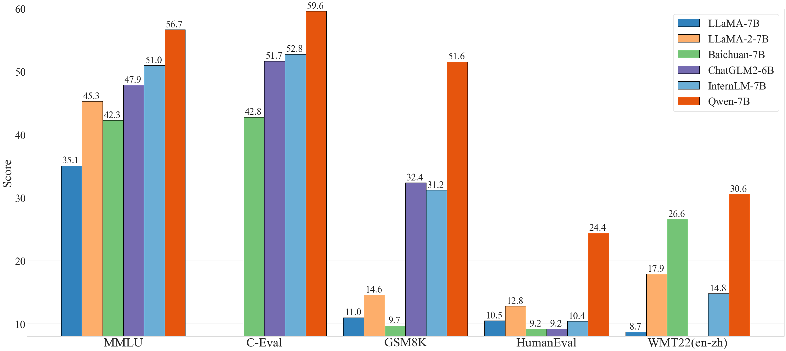

<br>

<p align="center">
    
<p>
<br>

<p align="center">
        Qwen-7B <a href="https://modelscope.cn/models/qwen/Qwen-7B/summary">🤖 <a> | <a href="https://huggingface.co/Qwen/Qwen-7B">🤗</a>&nbsp ｜ Qwen-7B-Chat <a href="https://modelscope.cn/models/qwen/Qwen-7B-Chat/summary">🤖 <a>| <a href="https://huggingface.co/Qwen/Qwen-7B-Chat">🤗</a>&nbsp ｜ &nbsp<a href="https://modelscope.cn/studios/qwen/Qwen-7B-Chat-Demo/summary">Demo</a>&nbsp ｜ &nbsp<a href="https://github.com/QwenLM/Qwen-7B/blob/main/tech_memo.md">Report</a>
</p>
<br>

<p align="center">
        <a href="README_CN.md">中文</a>&nbsp ｜ &nbsp<a href="README.md">English</a>&nbsp ｜ &nbsp日本語
</p>
<br><br>
<p align="right">
        Japanese document maintainer: Ikko Eltociear Ashimine
</p>
<br><br>

私たちは、**Qwen-7B** と **Qwen-7B-Chat** を **🤖 ModelScope** と **🤗 Hugging Face** の両方でオープンソース化しています(上部のロゴをクリックすると、コードとチェックポイントのあるリポジトリに移動します)。このレポには、Qwen-7B の簡単な紹介と、使い方の手引き、さらに詳しい情報を提供する技術メモ [link](tech_memo.md) が含まれています。

Qwen-7Bは、アリババクラウドが提唱する大規模言語モデルシリーズQwen（略称：Tongyi Qianwen）の7Bパラメータ版です。Qwen-7BはTransformerベースの大規模言語モデルであり、ウェブテキスト、書籍、コードなどを含む大量のデータで事前学習される。さらに、事前学習されたQwen-7Bをベースに、アライメント技術で学習された大規模モデルベースのAIアシスタントであるQwen-7B-Chatをリリースする。Qwen-7Bシリーズの特徴は以下の通りです:

1. **高品質な事前トレーニングデータでトレーニング**。Qwen-7B は 2.2 兆以上のトークンを含む大規模で高品質なデータセットに対して事前学習を行った。このデータセットには平文とコードが含まれ、一般的なドメインデータと専門的なドメインデータを含む幅広いドメインをカバーしている。
2. **強いパフォーマンス**。自然言語理解、数学、コーディングなどを評価する一連のベンチマークデータセットにおいて、同程度のモデルサイズのモデルと比較して、競合他社を凌駕しています。
3. **言語サポートの向上**。Qwen-7B のトークナイザは、15 万以上のトークンの語彙をベースにしており、他のトークナイザに比べて効率的です。多くの言語に対応しており、ユーザが特定の言語を理解するために Qwen-7B をさらに微調整するのに役立ちます。
4. **8K コンテキスト長をサポート**。Qwen-7B と Qwen-7B-Chat はともに 8K のコンテキスト長をサポートしており、長いコンテキストでの入力を可能にしている。
5. **プラグインのサポート**。Qwen-7B-Chat は、プラグイン関連のアライメントデータでトレーニングされているため、API、モデル、データベースなどのツールを使用することができ、エージェントとしてプレイすることができる。

## ニュース

* 2023.8.3 Qwen-7B と Qwen-7B-Chat を ModelScope と Hugging Face で公開。また、トレーニングの詳細やモデルの性能など、モデルの詳細についてはテクニカルメモを提供しています。

## パフォーマンス

一般的に、Qwen-7B は、MMLU、C-Eval、GSM8K、HumanEval、WMT22 などの自然言語理解、数学的問題解決、コーディングなどに関するモデルの能力を評価する一連のベンチマークデータセットにおいて、同程度のモデルサイズのベースラインモデルを凌駕し、さらには 13B 程度のパラメータを持つより大規模なモデルをも凌駕している。以下の結果をご覧ください。

| Model             | MMLU           |         C-Eval |          GSM8K |      HumanEval |  WMT22 (en-zh) |
| :---------------- | :------------: | :------------: | :------------: | :------------: | :------------: |
| LLaMA-7B          | 35.1           |              - |           11.0 |           10.5 |            8.7 |
| LLaMA 2-7B        | 45.3           |              - |           14.6 |           12.8 |           17.9 |
| Baichuan-7B       | 42.3           |           42.8 |            9.7 |            9.2 |           26.6 |
| ChatGLM2-6B       | 47.9           |           51.7 |           32.4 |            9.2 |              - |
| InternLM-7B       | 51.0           |           52.8 |           31.2 |           10.4 |           14.8 |
| Baichuan-13B      | 51.6           |           53.6 |           26.6 |           12.8 |           30.0 |
| LLaMA-13B         | 46.9           |           35.5 |           17.8 |           15.8 |           12.0 |
| LLaMA 2-13B       | 54.8           |              - |           28.7 |           18.3 |           24.2 |
| ChatGLM2-12B      | 56.2           |       **61.6** |           40.9 |              - |              - |
| **Qwen-7B**       | **56.7**       |           59.6 |       **51.6** |       **24.4** |       **30.6** |

<p align="center">
    
<p>
<br>

より詳細な実験結果（より多くのベンチマークデータセットでの詳細なモデル性能）や詳細については、[こちら](tech_memo.md)をクリックして技術メモを参照してください。

## 必要条件

* python 3.8 以上
* pytorch 1.12 以上、2.0 以上を推奨
* CUDA 11.4 以上を推奨（GPU ユーザー、フラッシュアテンションユーザー向けなど）

## クイックスタート

以下では、Qwen-7B と 🤖 ModelScope と 🤗 Transformers の簡単な使用例を示します。

コードを実行する前に、環境のセットアップと必要なパッケージのインストールが済んでいることを確認してください。上記の要件を満たしていることを確認してから、依存するライブラリをインストールしてください。

```bash
pip install -r requirements.txt
```

お使いのデバイスが fp16 または bf16 をサポートしている場合、[flash-attention](https://github.com/Dao-AILab/flash-attention) をインストールすることで、より高い効率とメモリ使用量を抑えることができます。(**flash-attention はオプションであり、インストールしなくてもプロジェクトは正常に実行できます**)

```bash
git clone -b v1.0.8 https://github.com/Dao-AILab/flash-attention
cd flash-attention && pip install .
# 以下はオプションです。インストールに時間がかかる場合があります。
# pip install csrc/layer_norm
# pip install csrc/rotary
```

これで ModelScope か Transformers で始めることができます。

#### 🤗 Transformers

Qwen-7B-Chat を推論に使用するには、以下のように数行のコードを入力するだけです。**最新のコードを使用していることを確認してください。**

```python
from transformers import AutoModelForCausalLM, AutoTokenizer
from transformers.generation import GenerationConfig

# 注: デフォルトの動作では、インジェクション攻撃防止機能がオフになっています。
tokenizer = AutoTokenizer.from_pretrained("Qwen/Qwen-7B-Chat", trust_remote_code=True)

# bf16 を使用
# model = AutoModelForCausalLM.from_pretrained("Qwen/Qwen-7B-Chat", device_map="auto", trust_remote_code=True, bf16=True).eval()
# fp16 を使用
# model = AutoModelForCausalLM.from_pretrained("Qwen/Qwen-7B-Chat", device_map="auto", trust_remote_code=True, fp16=True).eval()
# CPU のみ使用
# model = AutoModelForCausalLM.from_pretrained("Qwen/Qwen-7B-Chat", device_map="cpu", trust_remote_code=True).eval()
# オートモードを使用すると、デバイスに応じて自動的に精度が選択されます。
model = AutoModelForCausalLM.from_pretrained("Qwen/Qwen-7B-Chat", device_map="auto", trust_remote_code=True).eval()

# 生成のためのハイパーパラメータを指定
model.generation_config = GenerationConfig.from_pretrained("Qwen/Qwen-7B-Chat", trust_remote_code=True)

# 第一轮对话 第一回対話ターン
response, history = model.chat(tokenizer, "你好", history=None)
print(response)
# こんにちは！ お役に立ててうれしいです。

# 第二轮对话 第二回対話ターン
response, history = model.chat(tokenizer, "给我讲一个年轻人奋斗创业最终取得成功的故事。", history=history)
print(response)
# これは、自分のビジネスを始めようと奮闘し、やがて成功する若者の物語である。
# この物語の主人公は、平凡な家庭に生まれ、平凡な労働者である両親を持つ李明である。 李明は子供の頃から起業家として成功することを目標としていた。
# この目標を達成するため、李明は猛勉強して大学に入った。 大学時代には、さまざまな起業家コンテストに積極的に参加し、多くの賞を獲得した。 また、余暇を利用してインターンシップにも参加し、貴重な経験を積んだ。
# 卒業後、李明は起業を決意した。 投資先を探し始めたが、何度も断られた。 しかし、彼はあきらめなかった。 彼は懸命に働き続け、ビジネスプランを改善し、新たな投資機会を探した。
# やがて李明は投資を受けることに成功し、自分のビジネスを始めた。 彼は新しいタイプのソフトウェアの開発に焦点を当てたテクノロジー会社を設立した。 彼のリーダーシップの下、会社は急速に成長し、テクノロジー企業として成功を収めた。
# 李明の成功は偶然ではない。 彼は勤勉で、たくましく、冒険好きで、常に学び、自分を高めている。 彼の成功はまた、努力すれば誰でも成功できることを証明している。

# 第三轮对话 第三回対話ターン
response, history = model.chat(tokenizer, "给这个故事起一个标题", history=history)
print(response)
# 《起業への奮闘：ある若者の成功への道》
```

Qwen-7B の学習済みベースモデルの実行も簡単です。

<details>
  <summary>Qwen-7B の実行</summary>

```python
from transformers import AutoModelForCausalLM, AutoTokenizer
from transformers.generation import GenerationConfig

tokenizer = AutoTokenizer.from_pretrained("Qwen/Qwen-7B", trust_remote_code=True)
# bf16 を使用
# model = AutoModelForCausalLM.from_pretrained("Qwen/Qwen-7B", device_map="auto", trust_remote_code=True, bf16=True).eval()
# fp16 を使用
# model = AutoModelForCausalLM.from_pretrained("Qwen/Qwen-7B", device_map="auto", trust_remote_code=True, fp16=True).eval()
# CPU のみ使用
# model = AutoModelForCausalLM.from_pretrained("Qwen/Qwen-7B", device_map="cpu", trust_remote_code=True).eval()
# オートモードを使用すると、デバイスに応じて自動的に精度が選択されます。
model = AutoModelForCausalLM.from_pretrained("Qwen/Qwen-7B", device_map="auto", trust_remote_code=True).eval()

# 生成のためのハイパーパラメータを指定
model.generation_config = GenerationConfig.from_pretrained("Qwen/Qwen-7B", trust_remote_code=True)

inputs = tokenizer('モンゴルの首都はウランバートル（Ulaanbaatar）\nアイスランドの首都はレイキャビク（Reykjavik）\nエチオピアの首都は', return_tensors='pt')
inputs = inputs.to(model.device)
pred = model.generate(**inputs)
print(tokenizer.decode(pred.cpu()[0], skip_special_tokens=True))
# モンゴルの首都はウランバートル（Ulaanbaatar）\nアイスランドの首都はレイキャビク（Reykjavik）\nエチオピアの首都はアディスアベバ（Addis Ababa）...
```

</details>

#### 🤖 ModelScope

ModelScope は、MaaS（Model-as-a-Service） のためのオープンソースプラットフォームであり、AI 開発者に柔軟で費用対効果の高いモデルサービスを提供します。同様に、以下のように ModelScope でモデルを実行することができます:

```python
import os
from modelscope.pipelines import pipeline
from modelscope.utils.constant import Tasks
from modelscope import snapshot_download

model_id = 'QWen/qwen-7b-chat'
revision = 'v1.0.0'

model_dir = snapshot_download(model_id, revision)

pipe = pipeline(
task=Tasks.chat, model=model_dir, device_map='auto')
history = None

text = '浙江省の省都はどこですか？'
results = pipe(text, history=history)
response, history = results['response'], results['history']
print(f'Response: {response}')
text = '何がそんなに面白いのか？'
results = pipe(text, history=history)
response, history = results['response'], results['history']
print(f'Response: {response}')
```

## トークナイザー

tiktoken に基づくトークナイザーは、他のトークナイザー、例えばセンテンスピーストークナイザーとは異なります。特にファインチューニングの際には、特殊なトークンに注意を払う必要があります。トークナイザに関する詳細な情報や、ファインチューニングにおける使用方法については、[ドキュメント](tokenization_note.md)を参照してください。

## 量子化

`NF4` と `Int8` のモデルをロードする方法を示す例を提供します。手始めに、`bitsandbytes` が実装されていることを確認して下さい。`bitsandbytes` の要件は以下の通りになります:

```
**必要条件** Python >= 3.8。Linux ディストリビューション（Ubuntu、MacOS など）+ CUDA > 10.0。
```

そして、以下のコマンドを実行して `bitsandbytes` をインストールする：

```
pip install bitsandbytes
```

Windows ユーザは、[bitsandbytes-windows-webui](https://github.com/jllllll/bitsandbytes-windows-webui/releases/tag/wheels) という別のオプションを見つける必要があります。

そして、量子化の設定を `AutoModelForCausalLM.from_pretrained` に追加するだけとなります。以下の例を参照してください:

```python
from transformers import AutoModelForCausalLM, BitsAndBytesConfig

# NF4（4ビット）の量子化設定
quantization_config = BitsAndBytesConfig(
    load_in_4bit=True,
    bnb_4bit_quant_type='nf4',
    bnb_4bit_compute_dtype=torch.bfloat16
)

# Int8（8ビット）の量子化設定
quantization_config = BitsAndBytesConfig(load_in_8bit=True)

model = AutoModelForCausalLM.from_pretrained(
    args.checkpoint_path,
    device_map="cuda:0",
    quantization_config=quantization_config,
    max_memory=max_memory,
    trust_remote_code=True,
).eval()
```

この方法では、Qwen-7B を `NF4` と `Int8` でロードすることができ、メモリ使用量を節約できる。以下にモデル性能の関連統計量を示します。量子化により、有効性は若干低下するが、推論効率は大幅に向上し、メモリコストが削減されることがわかります。

| Precision   |   MMLU   |  Memory  |
| :---------: | :------: | :------: |
|   BF16      |   56.7   |   16.2G  |
|   Int8      |   52.8   |   10.1G  |
|    NF4      |   48.9   |   7.4G   |

## 

`cli_demo.py` に CLI のデモ例を用意しています。ユーザはプロンプトを入力することで Qwen-7B-Chat と対話することができ、モデルはストリーミングモードでモデルの出力を返します。

## デモ

### CLI デモ

`cli_demo.py` に CLI のデモ例を用意しています。ユーザはプロンプトを入力することで Qwen-7B-Chat と対話することができ、モデルはストリーミングモードでモデルの出力を返します。以下のコマンドを実行する：

```
python cli_demo.py
```

### ウェブ UI

ウェブUIデモを構築するためのコードを提供します（@wysiadに感謝）。始める前に、以下のパッケージがインストールされていることを確認してください：

```
pip install gradio mdtex2html
```

そして、以下のコマンドを実行し、生成されたリンクをクリックする：

```
python web_demo.py
```

## ツールの使用

Qwen-7B-Chat は、API、データベース、モデルなど、ツールの利用に特化して最適化されており、ユーザは独自の Qwen-7B ベースの LangChain、エージェント、コードインタプリタを構築することができます。ツール利用能力を評価するための評価[ベンチマーク](eval/EVALUATION.md)では、Qwen-7B は安定した性能に達しています。
[](https://)

| Model       | Tool Selection (Acc.↑) | Tool Input (Rouge-L↑)  | False Positive Error↓  |
|:------------|:----------------------:|:----------------------:|:----------------------:|
| GPT-4       | 95%                    | **0.90**               | 15%                    |
| GPT-3.5     | 85%                    | 0.88                   | 75%                    |
| **Qwen-7B** | **99%**                | 0.89                   | **9.7%**               |

ReAct プロンプトの書き方や使い方については、[ReAct の例](examples/react_prompt.md)を参照してください。ツールを使用することで、モデルがよりよいタスクを実行できるようになります。

さらに、エージェントとしての能力を示す実験結果を提供する。詳細は [Hugging Face Agent](https://huggingface.co/docs/transformers/transformers_agents) を参照。Hugging Face が提供するランモードベンチマークでの性能は以下の通りです:

| Model          | Tool Selection↑ | Tool Used↑  |   Code↑   |
|:---------------|:---------------:|:-----------:|:---------:|
|GPT-4           |     **100**     |   **100**   | **97.41** |
|GPT-3.5         |      95.37      |    96.30    |   87.04   |
|StarCoder-15.5B |      87.04      |    87.96    |   68.89   |
| **Qwen-7B**    |      90.74      |    92.59    |   74.07   |

## 長い文脈の理解

コンテキストの長さを拡張し、訓練シーケンスの長さのボトルネックを解消するために、NTK を考慮した補間、ウィンドウアテンション、LogN アテンションスケーリングなどの技術を導入し、コンテキストの長さを 8K トークン以上に拡張する。arXiv データセットを用いて PPL 評価による言語モデリング実験を行い、Qwen-7B が長いコンテキストのシナリオにおいて卓越した性能を達成できることを見出した。以下に結果を示します:

<table>
    <tr>
        <th rowspan="2">Model</th><th colspan="5" align="center">Sequence Length</th>
    </tr>
    <tr>
        <th align="center">1024</th><th align="center">2048</th><th align="center">4096</th><th align="center">8192</th><th align="center">16384</th>
    </tr>
    <tr>
        <td>Qwen-7B</td><td align="center"><b>4.23</b></td><td align="center"><b>3.78</b></td><td align="center">39.35</td><td align="center">469.81</td><td align="center">2645.09</td>
    </tr>
    <tr>
        <td>+ dynamic_ntk</td><td align="center"><b>4.23</b></td><td align="center"><b>3.78</b></td><td align="center">3.59</td><td align="center">3.66</td><td align="center">5.71</td>
    </tr>
    <tr>
        <td>+ dynamic_ntk + logn</td><td align="center"><b>4.23</b></td><td align="center"><b>3.78</b></td><td align="center"><b>3.58</b></td><td align="center">3.56</td><td align="center">4.62</td>
    </tr>
    <tr>
        <td>+ dynamic_ntk + logn + window_attn</td><td align="center"><b>4.23</b></td><td align="center"><b>3.78</b></td><td align="center"><b>3.58</b></td><td align="center"><b>3.49</b></td><td align="center"><b>4.32</b></td>
    </tr>
</table>

## 再現

ベンチマークデータセットでのモデル性能の再現のために、結果を再現するスクリプトを提供しています。詳しくは [eval/EVALUATION.md](eval/EVALUATION.md) を確認してください。なお、再現の結果、我々の報告結果と若干異なる場合がある。

## ライセンス契約

Qwen-7B と Qwen-7B-Chat のコードとモデルウェイトは、研究者や開発者が自由に使用することができます。また、商用利用も可能です。詳しくは [LICENSE](LICENSE) をご覧ください。

## お問い合わせ

研究チームまたは製品チームへのメッセージは、qianwen_opensource@alibabacloud.com までお気軽にお送りください。

