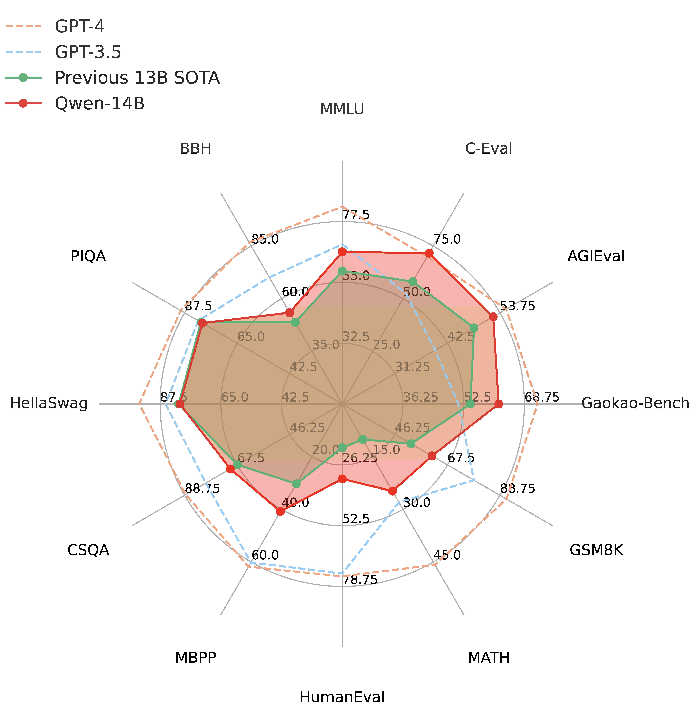

<p align="left">
    <a href="README_CN.md">中文</a>&nbsp ｜ &nbsp<a href="README.md">English</a>&nbsp ｜ &nbsp日本語 ｜ &nbsp<a href="README_FR.md">Français</a>
</p>
<br><br>

<p align="center">
    
<p>
<br>

<p align="center">
    🤗 <a href="https://huggingface.co/Qwen">Hugging Face</a>&nbsp&nbsp | &nbsp&nbsp🤖 <a href="https://modelscope.cn/organization/qwen">ModelScope</a>&nbsp&nbsp | &nbsp&nbsp 📑 <a href="https://arxiv.org/abs/2309.16609">Paper</a> &nbsp&nbsp ｜ &nbsp&nbsp🖥️ <a href="https://modelscope.cn/studios/qwen/Qwen-14B-Chat-Demo/summary">Demo</a>
<br>
<a href="assets/wechat.png">WeChat</a>&nbsp&nbsp ｜ &nbsp&nbsp DingTalk &nbsp&nbsp | &nbsp&nbsp<a href="https://discord.gg/z3GAxXZ9Ce">Discord</a>&nbsp&nbsp
</p>
<br><br>

<p align="left">
        日本語ドキュメントメンテナー: <a href="https://github.com/eltociear">Ikko Eltociear Ashimine</a> & Junyang Lin
</p>
<br>

|     |                                                              Qwen-Chat                                                               |                                                                Qwen-Chat (Int4)                                                                |                        Qwen-Chat (Int8)                         |                                                            Qwen                                                            |
|-----|:------------------------------------------------------------------------------------------------------------------------------------:|:----------------------------------------------------------------------------------------------------------------------------------------------:|:---------------------------------------------------------------:|:--------------------------------------------------------------------------------------------------------------------------:|
| 7B  |  <a href="https://modelscope.cn/models/qwen/Qwen-7B-Chat/summary">🤖</a>  <a href="https://huggingface.co/Qwen/Qwen-7B-Chat">🤗</a>  |  <a href="https://modelscope.cn/models/qwen/Qwen-7B-Chat-Int4/summary">🤖</a>  <a href="https://huggingface.co/Qwen/Qwen-7B-Chat-Int4">🤗</a>  | <a href="https://modelscope.cn/models/qwen/Qwen-7B-Chat-Int8/summary">🤖</a>  <a href="https://huggingface.co/Qwen/Qwen-7B-Chat-Int8">🤗</a>  |  <a href="https://modelscope.cn/models/qwen/Qwen-7B/summary">🤖</a>  <a href="https://huggingface.co/Qwen/Qwen-7B">🤗</a>  |
| 14B | <a href="https://modelscope.cn/models/qwen/Qwen-14B-Chat/summary">🤖</a>  <a href="https://huggingface.co/Qwen/Qwen-14B-Chat">🤗</a> | <a href="https://modelscope.cn/models/qwen/Qwen-14B-Chat-Int4/summary">🤖</a>  <a href="https://huggingface.co/Qwen/Qwen-14B-Chat-Int4">🤗</a> | <a href="https://modelscope.cn/models/qwen/Qwen-14B-Chat-Int8/summary">🤖</a>  <a href="https://huggingface.co/Qwen/Qwen-14B-Chat-Int8">🤗</a> | <a href="https://modelscope.cn/models/qwen/Qwen-14B/summary">🤖</a>  <a href="https://huggingface.co/Qwen/Qwen-14B">🤗</a> |


Qwen-7B**と**Qwen-14B**の**Qwen**シリーズと、**Qwen-7B-Chat**と**Qwen-14B-Chat**の**Qwen-Chat**シリーズをオープンソース化しました。上の表にリンクがあります。クリックしてモデルカードをご確認ください。また、テクニカルレポートも公開しました。論文リンクをクリックしてご覧ください！

簡単に説明すると、私たちは、ドメインや言語（中国語と英語を中心に）などを幅広くカバーする最大3兆トークンの多言語データに対して安定的に事前学習された強力なベース言語モデルを持っています。これらのモデルは、ベンチマークデータセットにおいて競争力のあるパフォーマンスを達成することができます。さらに、SFTとRLHFに基づく人間の嗜好に沿ったチャットモデル（まだリリースされていません）があり、チャット、コンテンツ作成、情報抽出、要約、翻訳、コーディング、数学の問題を解くなどが可能で、ツールを使ったり、エージェントとして遊んだり、コードインタプリタとして遊んだりすることもできます。

このレポでは、それを把握することができる：

* Qwenのクイックスタート。
* 量子化モデルの詳細（使用量、メモリ、推論速度など）。比較のために、BF16モデルの統計も提供します。
* フルパラメーターチューニング、LoRA、Q-LoRAを含む、微調整に関するチュートリアル。
* vLLMとFastChatを例に、デプロイメントについて説明します。
* WebUI、CLIデモなど、デモの構築に関する説明。
* あなたのモデルのためのOpenAIスタイルのAPIを構築する手順。
* ツール使用、エージェント、コードインタプリタの Qwen の詳細。
* ロングコンテクスト理解評価の統計
* ライセンス契約
* ...

また、困ったことがあれば、まずは[FAQ](FAQ.md)を参照してほしい。まだ悩んでいますか？遠慮なく私たちに問題を送ってください（より多くの人が理解できるように、英語で）！私たちを助けたいなら、遠慮なくプルリクエストを送ってください！

私たちとチャットしたいですか？私たちのDiscordまたはWeChatグループへようこそ！
<br><br>

## ニュースとアップデート

* 2023.10.17 Int8量子化モデル**Qwen-7B-Chat-Int8**と**Qwen-14B-Chat-Int8**をリリースしました。
* 2023.9.25 🔥 Qwen-14BとQwen-14B-ChatをModelScopeとHugging Faceでリリースしました。[qwen.cpp](https://github.com/QwenLM/qwen.cpp) と [Qwen-Agent](https://github.com/QwenLM/Qwen-Agent) もリリースされました。同時に、Qwen-7B と Qwen-7B-Chat も更新しました。Qwen-7B（オリジナル）と比較して、Qwen-7Bはより多くの学習トークンを使用し、2.2Tトークンから2.4Tトークンに増加し、コンテキスト長は2048から8192に拡張された。Qwen-7Bの中国語知識とコーディング能力はさらに向上しています。最新のコードとチェックポイントをお使いください！
* 2023.9.12 Qwen-7Bモデルにおいて、フルパラメーター・ファインチューニング、LoRA、Q-LoRAを含むファインチューニングをサポートしました。
* 2023.8.21 Qwen-7B-Chat 用 Int4 量子化モデル **Qwen-7B-Chat-Int4** をリリースしました。また、ベンチマーク評価においても大きな性能低下は見られませんでした。
* 2023.8.3 ModelScope と Hugging Face 上で **Qwen-7B** と **Qwen-7B-Chat** をリリースしました。また、トレーニングの詳細やモデルの性能など、モデルの詳細については技術メモを提供しています。
<br>

## 性能

Qwen-14BとQwen-7B（これは、より多くのトークンで学習され、コンテキストの長さが2048から8192に拡張された新バージョン）は、自然言語理解、数学的問題解決、コーディングなどに関するモデルの能力を評価する一連のベンチマークデータセット、例えばMMLU、C-Eval、GSM8K、MATH、HumanEval、MBPP、BBHなどにおいて、同様のモデルサイズのベースラインモデルを上回る。しかし、Qwen-14BでもGPT-4はおろかGPT-3.5にも大きく遅れをとっています。以下の結果をご覧ください。

<p align="left">
    
<p>
<br>

| Model              |   MMLU   |  C-Eval  |  GSM8K   |   MATH   | HumanEval |   MBPP   |   BBH    |  CMMLU   |
|:-------------------|:--------:|:--------:|:--------:|:--------:|:---------:|:--------:|:--------:|:--------:|
|                    |  5-shot  |  5-shot  |  8-shot  |  4-shot  |  0-shot   |  3-shot  |  3-shot  |  5-shot  |
| LLaMA2-7B          |   46.8   |   32.5   |   16.7   |   3.3    |   12.8    |   20.8   |   38.2   |   31.8   |
| LLaMA2-13B         |   55.0   |   41.4   |   29.6   |   5.0    |   18.9    |   30.3   |   45.6   |   38.4   |
| LLaMA2-34B         |   62.6   |    -     |   42.2   |   6.2    |   22.6    |   33.0   |   44.1   |    -     |
| ChatGLM2-6B        |   47.9   |   51.7   |   32.4   |   6.5    |     -     |    -     |   33.7   |    -     |
| InternLM-7B        |   51.0   |   53.4   |   31.2   |   6.3    |   10.4    |   14.0   |   37.0   |   51.8   |
| InternLM-20B       |   62.1   |   58.8   |   52.6   |   7.9    |   25.6    |   35.6   |   52.5   |   59.0   |
| Baichuan2-7B       |   54.7   |   56.3   |   24.6   |   5.6    |   18.3    |   24.2   |   41.6   |   57.1   |
| Baichuan2-13B      |   59.5   |   59.0   |   52.8   |   10.1   |   17.1    |   30.2   |   49.0   |   62.0   |
| Qwen-7B (original) |   56.7   |   59.6   |   51.6   |   10.4   |   24.4    |   31.2   |   40.6   |   58.8   |
| **Qwen-7B**        |   58.2   |   63.5   |   51.7   |   11.6   |   29.9    |   31.6   |   45.0   |   62.2   |
| **Qwen-14B**       | **66.3** | **72.1** | **61.3** | **24.8** | **32.3**  | **40.8** | **53.4** | **71.0** |


比較されたすべてのモデルについて、公式に報告された結果と[OpenCompass](https://opencompass.org.cn/leaderboard-llm) の間の最高スコアを報告します。

より詳細な実験結果（より多くのベンチマークデータセットでの詳細なモデル性能）や詳細については、[こちら](TODO)をクリックして技術メモを参照してください。
<br><br>

## 必要条件

* python 3.8 以上
* pytorch 1.12 以上、2.0 以上を推奨
* CUDA 11.4 以上を推奨（GPU ユーザー、フラッシュアテンションユーザー向けなど）
<br>

## クイックスタート

以下では、Qwen-Chat と 🤖 ModelScope と 🤗 Transformers の簡単な使用例を示します。

コードを実行する前に、環境のセットアップと必要なパッケージのインストールが済んでいることを確認してください。上記の要件を満たしていることを確認してから、依存するライブラリをインストールしてください。

```bash
pip install -r requirements.txt
```

お使いのデバイスが fp16 または bf16 をサポートしている場合、[flash-attention](https://github.com/Dao-AILab/flash-attention) （flash attention 2に対応しました）をインストールすることで、より高い効率とメモリ使用量を抑えることができます。(**flash-attention はオプションであり、インストールしなくてもプロジェクトは正常に実行できます**)

```bash
git clone https://github.com/Dao-AILab/flash-attention
cd flash-attention && pip install .
# 以下はオプションです。インストールに時間がかかる場合があります。
# pip install csrc/layer_norm
# pip install csrc/rotary
```

これで ModelScope か Transformers で始めることができます。

### 🤗 Transformers

Qwen-Chat を推論に使用するには、以下のように数行のコードを入力するだけです。**最新のコードを使用していることを確認してください。**

```python
from transformers import AutoModelForCausalLM, AutoTokenizer
from transformers.generation import GenerationConfig

# Model names："Qwen/Qwen-7B-Chat"、"Qwen/Qwen-14B-Chat"
tokenizer = AutoTokenizer.from_pretrained("Qwen/Qwen-7B-Chat", trust_remote_code=True)

# bf16 を使用
# model = AutoModelForCausalLM.from_pretrained("Qwen/Qwen-7B-Chat", device_map="auto", trust_remote_code=True, bf16=True).eval()
# fp16 を使用
# model = AutoModelForCausalLM.from_pretrained("Qwen/Qwen-7B-Chat", device_map="auto", trust_remote_code=True, fp16=True).eval()
# CPU のみ使用
# model = AutoModelForCausalLM.from_pretrained("Qwen/Qwen-7B-Chat", device_map="cpu", trust_remote_code=True).eval()
# オートモードを使用すると、デバイスに応じて自動的に精度が選択されます。
model = AutoModelForCausalLM.from_pretrained("Qwen/Qwen-7B-Chat", device_map="auto", trust_remote_code=True).eval()

# 生成のためのハイパーパラメータを指定
model.generation_config = GenerationConfig.from_pretrained("Qwen/Qwen-7B-Chat", trust_remote_code=True)

# 第一回対話ターン
response, history = model.chat(tokenizer, "你好", history=None)
print(response)
# 你好！很高兴为你提供帮助。

# 第二回対話ターン
response, history = model.chat(tokenizer, "给我讲一个年轻人奋斗创业最终取得成功的故事。", history=history)
print(response)
# 这是一个关于一个年轻人奋斗创业最终取得成功的故事。
# 故事的主人公叫李明，他来自一个普通的家庭，父母都是普通的工人。从小，李明就立下了一个目标：要成为一名成功的企业家。
# 为了实现这个目标，李明勤奋学习，考上了大学。在大学期间，他积极参加各种创业比赛，获得了不少奖项。他还利用课余时间去实习，积累了宝贵的经验。
# 毕业后，李明决定开始自己的创业之路。他开始寻找投资机会，但多次都被拒绝了。然而，他并没有放弃。他继续努力，不断改进自己的创业计划，并寻找新的投资机会。
# 最终，李明成功地获得了一笔投资，开始了自己的创业之路。他成立了一家科技公司，专注于开发新型软件。在他的领导下，公司迅速发展起来，成为了一家成功的科技企业。
# 李明的成功并不是偶然的。他勤奋、坚韧、勇于冒险，不断学习和改进自己。他的成功也证明了，只要努力奋斗，任何人都有可能取得成功。

# 第三轮对话 第三回対話ターン
response, history = model.chat(tokenizer, "给这个故事起一个标题", history=history)
print(response)
# 《奋斗创业：一个年轻人的成功之路》
```

Qwen の学習済みベースモデルの実行も簡単です。

<details>
  <summary>Qwen の実行</summary>

```python
from transformers import AutoModelForCausalLM, AutoTokenizer
from transformers.generation import GenerationConfig

# Model names："Qwen/Qwen-7B"、"Qwen/Qwen-14B"
tokenizer = AutoTokenizer.from_pretrained("Qwen/Qwen-7B", trust_remote_code=True)
# bf16 を使用
# model = AutoModelForCausalLM.from_pretrained("Qwen/Qwen-7B", device_map="auto", trust_remote_code=True, bf16=True).eval()
# fp16 を使用
# model = AutoModelForCausalLM.from_pretrained("Qwen/Qwen-7B", device_map="auto", trust_remote_code=True, fp16=True).eval()
# CPU のみ使用
# model = AutoModelForCausalLM.from_pretrained("Qwen/Qwen-7B", device_map="cpu", trust_remote_code=True).eval()
# オートモードを使用すると、デバイスに応じて自動的に精度が選択されます。
model = AutoModelForCausalLM.from_pretrained("Qwen/Qwen-7B", device_map="auto", trust_remote_code=True).eval()

# 生成のためのハイパーパラメータを指定
model.generation_config = GenerationConfig.from_pretrained("Qwen/Qwen-7B", trust_remote_code=True)

inputs = tokenizer('蒙古国的首都是乌兰巴托（Ulaanbaatar）\n冰岛的首都是雷克雅未克（Reykjavik）\n埃塞俄比亚的首都是', return_tensors='pt')
inputs = inputs.to(model.device)
pred = model.generate(**inputs)
print(tokenizer.decode(pred.cpu()[0], skip_special_tokens=True))
# 蒙古国的首都是乌兰巴托（Ulaanbaatar）\n冰岛的首都是雷克雅未克（Reykjavik）\n埃塞俄比亚的首都是亚的斯亚贝巴（Addis Ababa）...
```

</details>

HuggingFaceからモデルのチェックポイントとコードをダウンロードする際にネットワークの問題が発生した場合、ModelScopeからチェックポイントをダウンロードする方法はこちらでございます。

```python
from modelscope import snapshot_download
from transformers import AutoModelForCausalLM, AutoTokenizer

# Downloading model checkpoint to a local dir model_dir
# model_dir = snapshot_download('qwen/Qwen-7B')
# model_dir = snapshot_download('qwen/Qwen-7B-Chat')
# model_dir = snapshot_download('qwen/Qwen-14B')
model_dir = snapshot_download('qwen/Qwen-14B-Chat')

# Loading local checkpoints
# trust_remote_code is still set as True since we still load codes from local dir instead of transformers
tokenizer = AutoTokenizer.from_pretrained(model_dir, trust_remote_code=True)
model = AutoModelForCausalLM.from_pretrained(
    model_dir,
    device_map="auto",
    trust_remote_code=True
).eval()
```

### 🤖 ModelScope

ModelScope は、MaaS（Model-as-a-Service） のためのオープンソースプラットフォームであり、AI 開発者に柔軟で費用対効果の高いモデルサービスを提供します。同様に、以下のように ModelScope でモデルを実行することができます:

```python
from modelscope import AutoModelForCausalLM, AutoTokenizer
from modelscope import GenerationConfig

# Model names："Qwen/Qwen-7B-Chat"、"Qwen/Qwen-14B-Chat"
tokenizer = AutoTokenizer.from_pretrained("qwen/Qwen-7B-Chat", trust_remote_code=True)
model = AutoModelForCausalLM.from_pretrained("qwen/Qwen-7B-Chat", device_map="auto", trust_remote_code=True, fp16=True).eval()
model.generation_config = GenerationConfig.from_pretrained("Qwen/Qwen-7B-Chat", trust_remote_code=True) # 可指定不同的生成长度、top_p等相关超参

response, history = model.chat(tokenizer, "你好", history=None)
print(response)
response, history = model.chat(tokenizer, "浙江的省会在哪里？", history=history) 
print(response)
response, history = model.chat(tokenizer, "它有什么好玩的景点", history=history)
print(response)
```

### バッチ推論
Qwenはバッチ推論をサポートしている。フラッシュ・アテンションを有効にした場合、バッチ推論を使用することで40%のスピードアップが期待できる。以下にコード例を示す：
```python
import torch
from transformers import AutoModelForCausalLM, AutoTokenizer
from transformers import GenerationConfig
from qwen_generation_utils import make_context, decode_tokens, get_stop_words_ids

tokenizer = AutoTokenizer.from_pretrained(
    './',
    pad_token='<|extra_0|>',
    eos_token='<|endoftext|>',
    padding_side='left',
    trust_remote_code=True
)
model = AutoModelForCausalLM.from_pretrained(
    './',
    pad_token_id=tokenizer.pad_token_id,
    device_map="auto",
    trust_remote_code=True
).eval()
model.generation_config = GenerationConfig.from_pretrained('./', pad_token_id=tokenizer.pad_token_id)

all_raw_text = ["我想听你说爱我。", "今天我想吃点啥，甜甜的，推荐下", "我马上迟到了，怎么做才能不迟到"]
batch_raw_text = []
for q in all_raw_text:
    raw_text, _ = make_context(
        tokenizer,
        q,
        system="You are a helpful assistant.",
        max_window_size=model.generation_config.max_window_size,
        chat_format=model.generation_config.chat_format,
    )
    batch_raw_text.append(raw_text)

batch_input_ids = tokenizer(batch_raw_text, padding='longest')
batch_input_ids = torch.LongTensor(batch_input_ids['input_ids']).to(model.device)
batch_out_ids = model.generate(
    batch_input_ids,
    return_dict_in_generate=False,
    generation_config=model.generation_config
)
padding_lens = [batch_input_ids[i].eq(tokenizer.pad_token_id).sum().item() for i in range(batch_input_ids.size(0))]

batch_response = [
    decode_tokens(
        batch_out_ids[i][padding_lens[i]:],
        tokenizer,
        raw_text_len=len(batch_raw_text[i]),
        context_length=(batch_input_ids[i].size(0)-padding_lens[i]),
        chat_format="chatml",
        verbose=False,
        errors='replace'
    ) for i in range(len(all_raw_text))
]
print(batch_response)

response, _ = model.chat(tokenizer, "我想听你说爱我。", history=None)
print(response)

response, _ = model.chat(tokenizer, "今天我想吃点啥，甜甜的，推荐下", history=None)
print(response)

response, _ = model.chat(tokenizer, "我马上迟到了，怎么做才能不迟到", history=None)
print(response)
```

### CPU

Qwenとtiktokenの純粋なC++実装である [qwen.cpp](https://github.com/QwenLM/qwen.cpp) を使用することを強くお勧めします。詳細はレポを確認してください！

また、CPU上でモデルを直接実行することも簡単ですが、その場合はデバイスの指定が必要です：


```python
model = AutoModelForCausalLM.from_pretrained("Qwen/Qwen-7B-Chat", device_map="cpu", trust_remote_code=True).eval()
```

ただし、推論効率が極端に低下する可能性があります。

### 複数のGPU

GPUメモリ不足に悩まされ、1つ以上のGPUでモデルを実行したい場合、Transformersでサポートされるようになったデフォルトのロード方法を直接使うことができます。以前の `utils.py` に基づく方法は非推奨です。

しかし、この方法は簡単ですが、ネイティブ・パイプライン並列の効率は低いです。FastChatでvLLMを使用することをお勧めします。
<br><br>

## 量子化

### GPTQ

**注: [AutoGPTQ](https://github.com/PanQiWei/AutoGPTQ) に基づく新しい解決策を提供し、Qwen-Chat 用の Int4 量子化モデル[ここをクリック](https://huggingface.co/Qwen/Qwen-7B-Chat-Int4)をリリースしました。このモデルは、従来の解決策と比較して、ほぼ無損失のモデル効果を達成しつつ、メモリコストと推論速度の両方で性能が向上しています。**

ここでは、量子化されたモデルを推論に使用する方法を説明する。始める前に、auto-gptqの要件を満たしていることを確認し（例：torch 2.0以上、transformers 4.32.0以上など）、必要なパッケージをインストールしてください：

```bash
pip install auto-gptq optimum
```

auto-gptq`のインストールに問題がある場合は、公式の[repo](https://github.com/PanQiWei/AutoGPTQ)をチェックして、ホイールを見つけることをお勧めする。

そうすれば、量子化されたモデルを簡単にロードすることができ、いつもと同じように推論を実行することができる：

```python
model = AutoModelForCausalLM.from_pretrained(
    "Qwen/Qwen-7B-Chat-Int4",
    device_map="auto",
    trust_remote_code=True
).eval()
response, history = model.chat(tokenizer, "Hi", history=None)
```

ベンチマークにおける BF16 モデルと Int8、Int4 モデルの性能について説明します。その結果は以下に示します：

| Quantization         | MMLU | CEval (val) | GSM8K | Humaneval |
|----------------------|:----:|:-----------:|:-----:|:---------:|
| Qwen-7B-Chat (BF16)  | 55.8 |    59.7     | 50.3  |   37.2    |
| Qwen-7B-Chat (Int8)  | 55.4 |    59.4     | 48.3  |   34.8    |
| Qwen-7B-Chat (Int4)  | 55.1 |    59.2     | 49.7  |   29.9    |
| Qwen-14B-Chat (BF16) | 64.6 |    69.8     | 60.1  |   43.9    |
| Qwen-14B-Chat (Int8) | 63.6 |    68.6     | 60.0	 |   48.2    |
| Qwen-14B-Chat (Int4) | 63.3 |    69.0     | 59.8  |   45.7    |

### KVキャッシュ量子化

モデルの推論の時に、中間結果のKeyとValueを量子化して圧縮保存することができます。これにより、同じGPUでより多くのKeyとValueを保存することができ、サンプルのスピードを増やすことができます。

use_cache_quantizationとuse_cache_kernelという2つのパラメータを提供します。use_cache_quantizationとuse_cache_kernelを両方ONにした場合、KVキャッシュ量子化の機能が有効になります。具体的な使い方は：
```python
model = AutoModelForCausalLM.from_pretrained(
    "Qwen/Qwen-7B-Chat",
     device_map="auto",
     trust_remote_code=True,
     use_cache_quantization=True,
     use_cache_kernel=True,
     use_flash_attn=False
)
```
現在、この機能はflash attnと同時に使用することはできません。use_flash_attnをTrueにしてKVキャッシュ量子化とflash attnを同時に有効にした場合、use_flash_attnはデフォルトで無効になります。


Int8 KVキャッシュ量子化の使用によるモデルの性能の影響はほとんどありませんでした。性能評価は単一のA100-SXM4-80G GPUで実行され、モデルはデフォルトでBF16形式を使用し、生成される文章の長さは1024です。oomはメモリ不足を示します。

KVキャッシュ量子化を有効にすると、推論の時により大きなバッチサイズ（bs）を使用できるようになります。

| USE KVCache |  bs=1  |  bs=4  | bs=16  | bs=32  | bs=64  | bs=100 |
|-------------|:------:|:------:|:------:|:------:|:------:|:------:|
| no          | 16.3GB | 24.1GB | 31.7GB | 48.7GB |  oom   |  oom   |
| yes         | 15.5GB | 17.2GB | 22.3GB | 30.2GB | 48.2GB | 72.4GB |

KVキャッシュ量子化を有効にすると、推論の時により長い文章が生成できる。

| USE KVCache | sl=512 | sl=1024 | sl=2048 | sl=4096 | sl=8192 |
|-------------|:------:|:-------:|:-------:|:-------:|:-------:|
| no          | 15.2GB | 16.3GB  | 17.6GB  | 19.5GB  | 23.2GB  |
| yes         |  15GB  | 15.5GB  | 15.8GB  | 16.6GB  | 17.6GB  |


モデルがKVキャッシュ量子化を有効にした場合、モデルの推論の時には、元のfloat形式のkey/valueをint8形式のqkey/qvalueと対応する量子化パラメータに変換します。
具体的な手順は以下の通りです：
1、key/valueの量子化を行います。
```
    qv,scale,zero_point=quantize_cache_v(v)
```
2、layer_pastに保存します。
量子化されたのlayer_pastは:
```
    layer_past=((q_key,key_scale,key_zero_point),
                (q_value,value_scale,value_zero_point))
```
元のlayer_past:
```
    layer_past=(key,value)
```
layer_pastのkey、valueを使用する必要がある場合は、int8形式のkey/valueをfloat形式に戻すために、逆量子化操作を使用することができます。
```
    v=dequantize_cache_torch(qv,scale,zero_point)
```
<br>

## 推論パフォーマンス

このセクションでは、さまざまな精度のモデルのスピードとメモリの統計情報を提供する。スピードとメモリーのプロファイリングは[このスクリプト](https://qianwen-res.oss-cn-beijing.aliyuncs.com/profile.py)を使用しています。

### 推論スピード

BF16、Int8、Int4の精度のモデルを用いて、2048個と8192個のトークンを生成する平均推論速度（tokens/s）を、フラッシュアテンションv1、v2を使用した場合と使用しなかった場合の条件で測定した。

<table>
    <tr>
      <th rowspan="2">Model Size</th><th rowspan="2">Precision</th><th rowspan="2">FlashAttn</th><th colspan="2" align="center">Sequence Length</th>
    </tr>
    <tr>
        <th align="center">2048</th><th align="center">8192</th>
    </tr>
    </tr>
    </tr>
    <tr>
        <th rowspan="9">7B</th><td align="center" rowspan="3">BF16</td><td align="center">v2</td><td align="center">40.93</td><td align="center">36.14</td>
    </tr>
    <tr>
        <td align="center">v1</td><td align="center">40.75</td><td align="center">35.34
    </tr>
    <tr>
        <td align="center">Disabled</td><td align="center">37.55</td><td align="center">33.56
    </tr>
    <tr>
        <td align="center" rowspan="3">Int8</td><td align="center">v2</td><td align="center">37.47</td><td align="center">32.54</td>
    </tr>
    <tr>
        <td align="center">v1</td><td align="center">37.51</td><td align="center">32.39
    </tr>
    <tr>
        <td align="center">Disabled</td><td align="center">37.84</td><td align="center">32.65
    </tr>
    <tr>
        <td align="center" rowspan="3">Int4</td><td align="center">v2</td><td align="center">50.09</td><td align="center">38.61</td>
    </tr>
    <tr>
        <td align="center">v1</td><td align="center">45.98</td><td align="center">36.47
    </tr>
    <tr>
        <td align="center">Disabled</td><td align="center">48.12</td><td align="center">36.70
    </tr>
    <tr>
        <th rowspan="9">14B</th><td align="center" rowspan="3">BF16</td><td align="center">v2</td><td align="center">32.88</td><td align="center">24.87</td>
    </tr>
    <tr>
        <td align="center">v1</td><td align="center">32.76</td><td align="center">28.89
    </tr>
    <tr>
        <td align="center">Disabled</td><td align="center">29.32</td><td align="center">22.91
    </tr>
    <tr>
        <td align="center" rowspan="3">Int8</td><td align="center">v2</td><td align="center">29.28</td><td align="center">24.22</td>
    </tr>
    <tr>
        <td align="center">v1</td><td align="center">28.31</td><td align="center">23.87
    </tr>
    <tr>
        <td align="center">Disabled</td><td align="center">31.12</td><td align="center">24.60
    </tr>
    <tr>
        <td align="center" rowspan="3">Int4</td><td align="center">v2</td><td align="center">38.72</td><td align="center">27.33</td>
    </tr>
    <tr>
        <td align="center">v1</td><td align="center">37.81</td><td align="center">26.46
    </tr>
    <tr>
        <td align="center">Disabled</td><td align="center">37.65</td><td align="center">26.00
    </tr>
</table>

詳細には、プロファイリングの設定は、2048個のトークンをエンコードし、8192個の新しいトークンを生成することである。プロファイリングは、PyTorch 2.0.1とCUDA 11.4を搭載したシングルA100-SXM4-80G GPUで実行される。推論速度はエンコードされたトークンと生成されたトークンの平均である。

注意：上記のInt4/Int8モデルの推論速度は、autogptqを使用しています。現在、``AutoModelForCausalLM.from_pretrained``で読み込まれるモデルの推論速度は約20%遅くなります。この問題はHuggingFaceチームに報告済みであり、解決策があれば即座に更新されます。

### GPU メモリ使用量

また、BF16、Int8、Int4量子化レベルのそれぞれにおいて、2048個のトークンをコンテキストとしてエンコードした場合（および単一のトークンを生成した場合）と、8192個のトークンを生成した場合（単一のトークンをコンテキストとして生成した場合）のGPUメモリ使用量のピーク値をプロファイリングしました。結果（GB）を以下に示します。

<table>
    <tr>
      <th rowspan="2">Model Size</th><th rowspan="2">Precision</th><th colspan="2" align="center">Sequence Length</th>
    </tr>
    <tr>
        <th align="center">2048</th><th align="center">8192</th>
    </tr>
    </tr>
    </tr>
    <tr>
        <th rowspan="3">7B</th><td align="center">BF16</td><td align="center">16.99</td><td align="center">22.53</td>
    </tr>
    <tr>
        <td align="center">Int8</td><td align="center">11.20</td><td align="center">16.62
    </tr>
    <tr>
        <td align="center">Int4</td><td align="center">8.21</td><td align="center">13.63</td>
    </tr>
    <tr>
        <th rowspan="3">14B</th><td align="center">BF16</td><td align="center">30.15</td><td align="center">38.94</td>
    </tr>
    <tr>
        <td align="center">Int8</td><td align="center">18.81</td><td align="center">27.54
    </tr>
    <tr>
        <td align="center">Int4</td><td align="center">13.01</td><td align="center">21.79</td>
    </tr>
</table>

<br>

## ファインチューニング

### 使用方法
現在、公式のトレーニングスクリプト `finetune.py` を提供しています。さらに、finetune.pyのシェルスクリプトを提供し、finetune.pyを実行することで、finetune.pyを起動することができる。さらに、安心してファインチューニングを開始するためのシェルスクリプトも提供しています。このスクリプトは、[DeepSpeed](https://github.com/microsoft/DeepSpeed) および [FSDP](https://engineering.fb.com/2021/07/15/open-source/fsdp/) を使用したトレーニングをサポートします。弊社が提供するシェル・スクリプトは DeepSpeed と Peft を使用するため、事前に DeepSpeed と Peft をインストールすることをお勧めします：
```bash
pip install -r requirements_finetune.txt
```

学習データを準備するには、すべてのサンプルをリストにまとめ、jsonファイルに保存する必要があります。各サンプルはidと会話リストで構成される辞書です。以下は1つのサンプルを含む単純なリストの例です：

```json
[
  {
    "id": "identity_0",
    "conversations": [
      {
        "from": "user",
        "value": "你好"
      },
      {
        "from": "assistant",
        "value": "我是一个语言模型，我叫通义千问。"
      }
    ]
  }
]
```

データ準備の後、提供されているシェルスクリプトを使って微調整を実行することができる。データファイルのパス `$DATA` を忘れずに指定してください。

ファインチューニングのスクリプトを使用することで、以下のことが可能になる：
- フルパラメーター・ファインチューニング
- LoRA
- Q-LoRA

フルパラメータパラメータのファインチューニングを行うには、トレーニングプロセス全体ですべてのパラメータを更新する必要があります。トレーニングを開始するには、以下のスクリプトを実行します：

```bash
# 分散トレーニング。GPUメモリが不足するとトレーニングが破綻するため、シングルGPUのトレーニングスクリプトは提供していません。
sh finetune/finetune_ds.sh
```

シェルスクリプトでは、正しいモデル名またはパス、データパス、出力ディレクトリを指定することを忘れないでください。このスクリプトでは DeepSpeed ZeRO 3 を使用しています。変更したい場合は、引数 `--deepspeed` を削除するか、要件に基づいて DeepSpeed 設定 json ファイルを変更してください。さらに、このスクリプトは混合精度のトレーニングに対応しており、`--bf16 True` または `--fp16 True` を使用することができます。fp16を使用する場合は、混合精度のトレーニングのため、DeepSpeedを使用することを忘れないこと。経験的に、あなたのマシンがbf16をサポートしている場合、私たちのプリトレーニングとアライメントを整合させるためにbf16を使用することをお勧めします。

同様に、LoRAを実行するには、以下のように別のスクリプトを使って実行する。始める前に、`peft`がインストールされていることを確認してください。また、モデル、データ、出力へのパスを指定する必要があります。学習済みモデルには絶対パスを使用することをお勧めします。なぜなら、LoRAはアダプタのみを保存し、アダプタ設定jsonファイルの絶対パスは、ロードする事前学習済みモデルを見つけるために使用されるからです。また、このスクリプトはbf16とfp16の両方をサポートしている。

```bash
# シングルGPUトレーニング
sh finetune/finetune_lora_single_gpu.sh
# 分散トレーニング
sh finetune/finetune_lora_ds.sh
```

LoRA ([論文](https://arxiv.org/abs/2106.09685)) は、フルパラメーターによるファインチューニングと比較して、adapterのパラメーターを更新するだけで、元の大きな言語モデル層は凍結されたままである。そのため、メモリコストが大幅に削減でき、計算コストも削減できる。

なお、チャットモデル（Qwen-7B-Chatなど）ではなく、ベース言語モデル（Qwen-7Bなど）の微調整にLoRAを使用した場合、スクリプトは自動的に学習可能なパラメータとして埋め込み層と出力層を切り替えます。これは、ベースとなる言語モデルには、ChatMLフォーマットによってもたらされる特殊なトークンに関する知識がないためです。したがって、これらのレイヤーは、モデルがトークンを理解し予測するために更新される必要があります。別の言い方をすれば、もしLoRAで特殊なトークンを学習するのであれば、コード内で `modules_to_save` を設定することで、レイヤーを学習可能なパラメータに設定する必要があります。また、これらのパラメータが学習可能な場合、ZeRO 3 を使用することはできません。新しいトレーニング可能なパラメータがない場合は、DeepSpeed 設定ファイルを変更することで ZeRO 3 に切り替えることができます。さらに、LoRAのメモリフットプリントは、このような学習可能なパラメータがある場合とない場合で、大きな開きがあることがわかります。そのため、メモリに問題がある場合は、LoRAのChatモデルを微調整することをお勧めします。詳細は以下のプロファイルを参照してください。

しかし、それでもメモリ不足に悩む場合は、Q-LoRA（[論文](https://arxiv.org/abs/2305.14314)）を検討することができます。これは、量子化されたラージ言語モデルと、ページド・アテンションなどの他のテクニックを使用し、さらに少ないメモリコストで実行することができます。

注：シングル GPU Q-LoRA トレーニングを実行するには、`pip` または `conda` を使って `mpi4py` をインストールする必要があるかもしれない。

Q-LoRAを実行するには、以下のスクリプトを直接実行してください：

```bash
# シングルGPUトレーニング
sh finetune/finetune_qlora_single_gpu.sh
# 分散トレーニング
sh finetune/finetune_qlora_ds.sh
```

Q-LoRAについては、弊社が提供する量子化モデル、例えばQwen-7B-Chat-Int4をロードすることをお勧めします。BF16モデルは使用し**ない**でください！フルパラメータ・ファインチューニングやLoRAとは異なり、Q-LoRAではfp16のみがサポートされる。シングルGPUのトレーニングでは、トーチアンプによるエラーが観測されたため、混合精度のトレーニングにはディープスピードを使用する必要がある。また、Q-LoRAの場合、LoRAの特殊トークンの問題が残っています。しかし、Q-LoRAではチャットモデルとしてInt4モデルのみを提供しており、言語モデルはChatML形式の特殊トークンを学習しているため、レイヤーの心配はありません。なお、Int4モデルのレイヤーは学習できないはずなので、学習で特殊なトークンを導入すると、Q-LoRAが動作しなくなる可能性があります。

LoRAとQ-LoRAの学習は、フルパラメータによるファインチューニングとは異なり、アダプターパラメータのみを保存する。仮にQwen-7Bから学習を開始したとすると、以下のようにファインチューニングされたモデルを読み込んで推論を行うことができる：

```python
from peft import AutoPeftModelForCausalLM

model = AutoPeftModelForCausalLM.from_pretrained(
    path_to_adapter, # path to the output directory
    device_map="auto",
    trust_remote_code=True
).eval()
```

アダプターをマージし、微調整したモデルをスタンドアロンモデルとして保存したい場合は（これは LoRA でのみ可能で、Q-LoRA からパラメータをマージすることはできません）、以下のコードを実行します：

```python
from peft import AutoPeftModelForCausalLM

model = AutoPeftModelForCausalLM.from_pretrained(
    path_to_adapter, # path to the output directory
    device_map="auto",
    trust_remote_code=True
).eval()

merged_model = model.merge_and_unload()
# max_shard_size and safe serialization are not necessary. 
# They respectively work for sharding checkpoint and save the model to safetensors
merged_model.save_pretrained(new_model_directory, max_shard_size="2048MB", safe_serialization=True)
```

注意：マルチGPUトレーニングの場合、分散トレーニング用の適切なハイパーパラメータをマシンに応じて指定する必要があります。また、データ、メモリフットプリント、トレーニング速度を考慮して、引数 `--model_max_length` で最大シーケンス長を指定することをお勧めします。

### メモリと速度のプロファイリング
シングルGPUトレーニングのセットアップにおいて、LoRA (LoRA(emb)はembeddingと出力層を学習させるが、LoRAはembeddingと出力層を学習させない) とQ-LoRAのGPUメモリとトレーニング速度をプロファイリングする。このテストでは、シングルA100-SXM4-80G GPUで実験し、CUDA 11.8とPytorch 2.0を使用します。Flash attention 2を使用します。256、512、1024、2048、4096、8192という異なる長さの入力のメモリ（GB）と速度（s/iter）をプロファイリングします。また、2台のA100 GPUを用いたQwen-7Bによるフルパラメータ・ファインチューニングの統計量も報告する。GPUメモリの制限のため、256、512、1024トークンの統計のみを報告する。統計量を以下に示す：

<table>
    <tr>
      <th rowspan="2">Model Size</th><th rowspan="2">Method</th><th colspan="6" align="center">Sequence Length</th>
    </tr>
    <tr>
        <th align="center">256</th><th align="center">512</th><th align="center">1024</th><th align="center">2048</th><th align="center">4096</th><th align="center">8192</th>
    </tr>
    </tr>
    </tr>
    <tr>
        <th rowspan="4">7B</th><td>LoRA</td><td align="center">20.1G / 1.2s/it</td><td align="center">20.4G / 1.5s/it</td><td align="center">21.5G / 2.8s/it</td><td align="center">23.8G / 5.2s/it</td><td align="center">29.7G / 10.1s/it</td><td align="center">36.6G / 21.3s/it</td>
    </tr>
    <tr>
        <td>LoRA (emb)</td><td align="center">33.7G / 1.4s/it</td><td align="center">34.1G / 1.6s/it</td><td align="center">35.2G / 2.9s/it</td><td align="center">35.1G / 5.3s/it</td><td align="center">39.2G / 10.3s/it</td><td align="center">48.5G / 21.7s/it</td>
    </tr>
    <tr>
        <td>Q-LoRA</td><td align="center">11.5G / 3.0s/it</td><td align="center">11.5G / 3.0s/it</td><td align="center">12.3G / 3.5s/it</td><td align="center">13.9G / 7.0s/it</td><td align="center">16.9G / 11.6s/it</td><td align="center">23.5G / 22.3s/it</td>
    </tr>
    <tr>
        <td>Full-parameter</td><td align="center">139.2G / 4.0s/it</td><td align="center">148.0G / 4.0s/it</td><td align="center">162.0G / 4.5s/it</td><td align="center">-</td><td align="center">-</td><td align="center">-</td>
    </tr>
    <tr>
        <th rowspan="3">14B</th><td>LoRA</td><td align="center">34.6G / 1.6s/it</td><td align="center">35.1G / 2.4s/it</td><td align="center">35.3G / 4.4s/it</td><td align="center">37.4G / 8.4s/it</td><td align="center">42.5G / 17.0s/it</td><td align="center">55.2G / 36.0s/it</td>
    </tr>
    <tr>
        <td>LoRA (emb)</td><td align="center">51.2 / 1.7s/it</td><td align="center">51.1G / 2.6s/it</td><td align="center">51.5G / 4.6s/it</td><td align="center">54.1G / 8.6s/it</td><td align="center">56.8G / 17.2s/it</td><td align="center">67.7G / 36.3s/it</td>
    </tr>
    <tr>
        <td>Q-LoRA</td><td align="center">18.7G / 5.3s/it</td><td align="center">18.4G / 6.3s/it</td><td align="center">18.9G / 8.2s/it</td><td align="center">19.9G / 11.8s/it</td><td align="center">23.0G / 20.1s/it</td><td align="center">27.9G / 38.3s/it</td>
    </tr>
</table>
<br>

## デプロイ

### vLLM 
デプロイメントと高速推論のためには、FastChatとvLLMを使用することをお勧めします。まずパッケージをインストールしてください：
```bash
pip install vllm
pip install "fschat[model_worker,webui]"
```
または、`git clone` と `pip install -e .` を使ってソースからインストールすることもできます。インストールに問題がある場合は、それぞれのドキュメントを読むことを勧める。

QwenをvLLMとFastChatで実行するには、まず以下の方法でコントローラを起動する必要があります：
```bash
python -m fastchat.serve.controller
```

それからmodel workerを起動し、推論のためにモデルをロードします。シングルGPU推論の場合は、直接実行できます：
```bash
python -m fastchat.serve.vllm_worker --model-path $model_path --trust-remote-code
```
しかし、より高速な推論や大容量メモリーのために複数のGPUでモデルを実行したい場合は、vLLMがサポートするテンソル並列を使用することができます。モデルを4GPUで実行するとすると、コマンドは以下のようになります：
```bash
python -m fastchat.serve.vllm_worker --model-path $model_path --trust-remote-code --tensor-parallel-size 4
```

Model workerを起動したら、Web デモや OpenAI API を好きなように起動できます。ウェブデモの場合は、以下のコマンドを実行します：
```bash
python -m fastchat.serve.gradio_web_server
```
OpenAI APIについては、まずOpenAI APIのドキュメントをチェックして、インストールしてください。次にコマンドを実行します：
```bash
python -m fastchat.serve.openai_api_server --host localhost --port 8000
```
<br>

## デモ

### ウェブ UI

ウェブ UI デモを構築するためのコードを提供します（@wysaid に感謝）。これを始める前に、以下のパッケージがインストールされていることを確認してください:

```bash
pip install -r requirements_web_demo.txt
```

そして、以下のコマンドを実行し、生成されたリンクをクリックします:

```bash
python web_demo.py
```

<p align="center">
    <br>
    
    <br>
<p>

### CLI デモ

`cli_demo.py` に CLI のデモ例を用意しています。ユーザはプロンプトを入力することで Qwen-7B-Chat と対話することができ、モデルはストリーミングモードでモデルの出力を返します。以下のコマンドを実行する:

```
python cli_demo.py
```

<p align="center">
    <br>
    
    <br>
<p>
<br>

## API

APIを通じてQwenを利用する最も簡単な方法は、Alibaba Cloudを通じたDashScope APIサービスです。その使い方を紹介します。さらに、OpenAIスタイルのAPIをご自身のサーバーにデプロイするためのスクリプトも提供しています。

### DashScope
DashScopeはAlibaba Cloudが提供する大規模言語モデルAPIサービスで、今回Qwenに対応した。DashScopeの背後にあるモデルは、詳細が提供されていない一時的な社内バージョンであることに注意してください。サービスには `qwen-turbo` と `qwen-plus` があり、前者はより高速に動作し、後者はより優れたパフォーマンスを実現している。詳細はドキュメント [こちら](https://dashscope.aliyun.com) を参照。

公式サイト [link](https://help.aliyun.com/zh/dashscope/developer-reference/activate-dashscope-and-create-an-api-key?spm=a2c4g.11186623.0.0.6c2774fahtfXdn) で DashScope アカウントを作成し、API キー (AK) を取得してください。AK は環境変数で設定することをお勧めします：
```bash
export DASHSCOPE_API_KEY="YOUR_DASHSCOPE_API_KEY"
```
その後、パッケージをインストールし、ドキュメントは [こちら](https://help.aliyun.com/zh/dashscope/developer-reference/install-dashscope-sdk) をクリックしてください。Python をお使いの場合は、pip で DashScope をインストールできます：
```bash
pip install dashscope
```
JAVA SDKを使用する場合は、この方法でインストールできます：
```xml
<!-- https://mvnrepository.com/artifact/com.alibaba/dashscope-sdk-java -->
<dependency>
    <groupId>com.alibaba</groupId>
    <artifactId>dashscope-sdk-java</artifactId>
    <version>the-latest-version</version>
</dependency>
```
DashScope を使用する最も簡単な方法は、OpenAI API と同様のメッセージを使用する方法です。以下にその例を示す：
```python
import random
from http import HTTPStatus
from dashscope import Generation


def call_with_messages():
    messages = [{'role': 'system', 'content': 'You are a helpful assistant.'},
                {'role': 'user', 'content': '如何做西红柿鸡蛋？'}]
    gen = Generation()
    response = gen.call(
        Generation.Models.qwen_turbo,
        messages=messages,
        seed=random.randint(1, 10000),  # set the random seed, optional, default to 1234 if not set
        result_format='message',  # set the result to be "message" format.
    )
    return response


if __name__ == '__main__':
    response = call_with_messages()
    if response.status_code == HTTPStatus.OK:
        print(response)
    else:
        print('Request id: %s, Status code: %s, error code: %s, error message: %s' % (
            response.request_id, response.status_code,
            response.code, response.message
        ))
```
詳しい使い方は公式サイトをご覧ください。

### OpenAI API

OpenAI API をベースにローカルAPIをデプロイする方法を提供する（@hanpenggit に感謝）。始める前に、必要なパッケージをインストールしてください:

```bash
pip install fastapi uvicorn openai "pydantic>=2.3.0" sse_starlette
```

それから、API をデプロイするコマンドを実行します:

```bash
python openai_api.py
```

チェックポイント名やパスには `-c`、CPU デプロイメントには `--cpu-only` など、引数を変更できます。API デプロイメントを起動する際に問題が発生した場合は、パッケージを最新バージョンに更新することで解決できる可能性があります。

API の使い方も簡単です。以下の例をご覧ください:

```python
import openai
openai.api_base = "http://localhost:8000/v1"
openai.api_key = "none"

# ストリーミングレスポンスを有効化するリクエストを作成する
for chunk in openai.ChatCompletion.create(
    model="Qwen",
    messages=[
        {"role": "user", "content": "你好"}
    ],
    stream=True
    # ストリーミング出力形式でのストップワードの指定はまだサポートされておらず、開発中です。
):
    if hasattr(chunk.choices[0].delta, "content"):
        print(chunk.choices[0].delta.content, end="", flush=True)

# ストリーミングレスポンスを有効化しないリクエストを作成する
response = openai.ChatCompletion.create(
    model="Qwen",
    messages=[
        {"role": "user", "content": "你好"}
    ],
    stream=False,
    stop=[] # 例えば、stop=["Observation:"] (ReAct プロンプトの場合)。
)
print(response.choices[0].message.content)
```

<p align="center">
    <br>
    
    <br>
<p>

**Function Calling** もサポートされています(ただし、今のところ `stream=False` の場合のみ)。使用例](examples/function_call_examples.py) を参照してください。
<br><br>

## ツールの使用

Qwen-7B-Chat は、API、データベース、モデルなど、ツールの利用に特化して最適化されており、ユーザは独自の Qwen-7B ベースの LangChain、エージェント、コードインタプリタを構築することができます。ツール利用能力を評価するための評価[ベンチマーク](eval/EVALUATION.md)では、Qwen-7B は安定した性能に達しています。

<table>
    <tr>
        <th colspan="4" align="center">Chinese Tool-Use Benchmark</th>
    </tr>
    <tr>
        <th align="center">Model</th><th align="center">Tool Selection (Acc.↑)</th><th align="center">Tool Input (Rouge-L↑)</th><th align="center">False Positive Error↓</th>
    </tr>
    <tr>
        <td>GPT-4</td><td align="center">95%</td><td align="center">0.90</td><td align="center">15.0%</td>
    </tr>
    <tr>
        <td>GPT-3.5</td><td align="center">85%</td><td align="center">0.88</td><td align="center">75.0%</td>
    </tr>
    <tr>Qwen-7B-Chat v1.1
        <td>Qwen-7B-Chat v1.1</td><td align="center">98%</td><td align="center">0.91</td><td align="center">7.3%</td>
    </tr>
    <tr>
        <td>Qwen-14B-Chat</td><td align="center">98%</td><td align="center">0.93</td><td align="center">2.4%</td>
    </tr>
</table>

<table>
    <tr>
        <th colspan="4" align="center">Using Code Interpreter - Executable Rate of Generated Code (%)</th>
    </tr>
    <tr>
        <th align="center">Model</th><th align="center">Math↑</th><th align="center">Visualization↑</th><th align="center">General↑</th>
    </tr>
    <tr>
        <td>GPT-4</td><td align="center">91.9</td><td align="center">85.9</td><td align="center">82.8</td>
    </tr>
    <tr>
        <td>GPT-3.5</td><td align="center">89.2</td><td align="center">65.0</td><td align="center">74.1</td>
    </tr>
    <tr>
        <td>LLaMA2-7B-Chat</td>
        <td align="center">41.9</td>
        <td align="center">33.1</td>
        <td align="center">24.1 </td>
    </tr>
    <tr>
        <td>LLaMA2-13B-Chat</td>
        <td align="center">50.0</td>
        <td align="center">40.5</td>
        <td align="center">48.3 </td>
    </tr>
    <tr>
        <td>CodeLLaMA-7B-Instruct</td>
        <td align="center">85.1</td>
        <td align="center">54.0</td>
        <td align="center">70.7 </td>
    </tr>
    <tr>
        <td>CodeLLaMA-13B-Instruct</td>
        <td align="center">93.2</td>
        <td align="center">55.8</td>
        <td align="center">74.1 </td>
    </tr>
    <tr>
        <td>InternLM-7B-Chat-v1.1</td>
        <td align="center">78.4</td>
        <td align="center">44.2</td>
        <td align="center">62.1 </td>
    </tr>
    <tr>
        <td>InternLM-20B-Chat</td>
        <td align="center">70.3</td>
        <td align="center">44.2</td>
        <td align="center">65.5 </td>
    </tr>
    <tr>Qwen-7B-Chat v1.1
        <td>Qwen-7B-Chat v1.1</td>
        <td align="center">82.4</td>
        <td align="center">64.4</td>
        <td align="center">67.2 </td>
    </tr>
    <tr>
        <td>Qwen-14B-Chat</td>
        <td align="center">89.2</td>
        <td align="center">84.1</td>
        <td align="center">65.5</td>
    </tr>
</table>

<table>
    <tr>
        <th colspan="4" align="center">Using Code Interpreter - Accuracy of Code Execution Results (%)</th>
    </tr>
    <tr>
        <th align="center">Model</th><th align="center">Math↑</th><th align="center">Visualization-Hard↑</th><th align="center">Visualization-Easy↑</th>
    </tr>
    <tr>
        <td>GPT-4</td><td align="center">82.8</td><td align="center">66.7</td><td align="center">60.8</td>
    </tr>
    <tr>
        <td>GPT-3.5</td><td align="center">47.3</td><td align="center">33.3</td><td align="center">55.7</td>
    </tr>
    <tr>
        <td>LLaMA2-7B-Chat</td>
        <td align="center">3.9</td>
        <td align="center">14.3</td>
        <td align="center">39.2 </td>
    </tr>
    <tr>
        <td>LLaMA2-13B-Chat</td>
        <td align="center">8.3</td>
        <td align="center">8.3</td>
        <td align="center">40.5 </td>
    </tr>
    <tr>
        <td>CodeLLaMA-7B-Instruct</td>
        <td align="center">14.3</td>
        <td align="center">26.2</td>
        <td align="center">60.8 </td>
    </tr>
    <tr>
        <td>CodeLLaMA-13B-Instruct</td>
        <td align="center">28.2</td>
        <td align="center">27.4</td>
        <td align="center">62.0 </td>
    </tr>
    <tr>
        <td>InternLM-7B-Chat-v1.1</td>
        <td align="center">28.5</td>
        <td align="center">4.8</td>
        <td align="center">40.5 </td>
    </tr>
    <tr>
        <td>InternLM-20B-Chat</td>
        <td align="center">34.6</td>
        <td align="center">21.4</td>
        <td align="center">45.6 </td>
    </tr>
    <tr>Qwen-7B-Chat v1.1
        <td>Qwen-7B-Chat v1.1</td>
        <td align="center">41.9</td>
        <td align="center">40.5</td>
        <td align="center">54.4 </td>
    </tr>
    <tr>
        <td>Qwen-14B-Chat</td>
        <td align="center">58.4</td>
        <td align="center">53.6</td>
        <td align="center">59.5</td>
    </tr>
</table>


ReAct プロンプトの書き方や使い方については、[ReAct の例](examples/react_prompt.md)を参照してください。ツールを使用することで、モデルがよりよいタスクを実行できるようになります。

<p align="center">
    <br>
    
    <br>
<p>

さらに、エージェントとしての能力を示す実験結果を提供する。詳細は [Hugging Face Agent](examples/transformers_agent.md) を参照して下さい。Hugging Face が提供するランモードベンチマークでの性能は以下の通りです:

<table>
    <tr>
        <th colspan="4" align="center">HuggingFace Agent Benchmark- Run Mode</th>
    </tr>
    <tr>
        <th align="center">Model</th><th align="center">Tool Selection↑</th><th align="center">Tool Used↑</th><th align="center">Code↑</th>
    </tr>
    <tr>
        <td>GPT-4</td><td align="center">100</td><td align="center">100</td><td align="center">97.4</td>
    </tr>
    <tr>
        <td>GPT-3.5</td><td align="center">95.4</td><td align="center">96.3</td><td align="center">87.0</td>
    </tr>
    <tr>
        <td>StarCoder-Base-15B</td><td align="center">86.1</td><td align="center">87.0</td><td align="center">68.9</td>
    </tr>
    <tr>
        <td>StarCoder-15B</td><td align="center">87.0</td><td align="center">88.0</td><td align="center">68.9</td>
    </tr>
    <tr>Qwen-7B-Chat v1.1
        <td>Qwen-7B-Chat v1.1</td><td align="center">87.0</td><td align="center">87.0</td><td align="center">71.5</td>
    </tr>
    <tr>
        <td>Qwen-14B-Chat</td><td align="center">93.5</td><td align="center">94.4</td><td align="center">87.0</td>
    </tr>
</table>

<table>
    <tr>
        <th colspan="4" align="center">HuggingFace Agent Benchmark - Chat Mode</th>
    </tr>
    <tr>
        <th align="center">Model</th><th align="center">Tool Selection↑</th><th align="center">Tool Used↑</th><th align="center">Code↑</th>
    </tr>
    <tr>
        <td>GPT-4</td><td align="center">97.9</td><td align="center">97.9</td><td align="center">98.5</td>
    </tr>
    <tr>
        <td>GPT-3.5</td><td align="center">97.3</td><td align="center">96.8</td><td align="center">89.6</td>
    </tr>
    <tr>
        <td>StarCoder-Base-15B</td><td align="center">97.9</td><td align="center">97.9</td><td align="center">91.1</td>
    </tr>
    <tr>
        <td>StarCoder-15B</td><td align="center">97.9</td><td align="center">97.9</td><td align="center">89.6</td>
    </tr>
    <tr>Qwen-7B-Chat v1.1
        <td>Qwen-7B-Chat v1.1</td><td align="center">94.7</td><td align="center">94.7</td><td align="center">85.1</td>
    </tr>
    <tr>
        <td>Qwen-14B-Chat</td><td align="center">97.9</td><td align="center">97.9</td><td align="center">95.5</td>
    </tr>
</table>

<br>

## 長い文脈の理解

コンテキストの長さを拡張し、訓練シーケンスの長さのボトルネックを解消するために、NTK を考慮した補間、ウィンドウアテンション、LogN アテンションスケーリングなどの技術を導入し、コンテキストの長さを 8K トークン以上に拡張する。arXiv データセットを用いて PPL 評価による言語モデリング実験を行い、Qwen-7B が長いコンテキストのシナリオにおいて卓越した性能を達成できることを見出した。以下に結果を示します:

<table>
    <tr>
        <th rowspan="2">Model</th><th colspan="6" align="center">Sequence Length</th>
    </tr>
    <tr>
        <th align="center">1024</th><th align="center">2048</th><th align="center">4096</th><th align="center">8192</th><th align="center">16384</th><th align="center">32768</th>
    </tr>
     <tr>
        <td>Qwen-7B (original)</td><td align="center">4.23</td><td align="center">3.78</td><td align="center">39.35</td><td align="center">469.81</td><td align="center">2645.09</td><td align="center">-</td>
    </tr>
    <tr>
        <td>+ dynamic_ntk</td><td align="center">4.23</td><td align="center">3.78</td><td align="center">3.59</td><td align="center">3.66</td><td align="center">5.71</td><td align="center">-</td>
    </tr>
    <tr>
        <td>+ dynamic_ntk + logn</td><td align="center">4.23</td><td align="center">3.78</td><td align="center">3.58</td><td align="center">3.56</td><td align="center">4.62</td><td align="center">-</td>
    </tr>
    <tr>
        <td>+ dynamic_ntk + logn + window_attn</td><td align="center">4.23</td><td align="center">3.78</td><td align="center">3.58</td><td align="center">3.49</td><td align="center">4.32</td><td align="center">-</td>
    </tr>
    <tr>
    <tr>
        <td>Qwen-7B v1.1</td><td align="center"><b>4.23</b></td><td align="center"><b>3.81</b></td><td align="center"><b>3.52</b></td><td align="center"><b>3.31</b></td><td align="center">7.27</td><td align="center">181.49</td>
    </tr>
    <tr>
        <td>+ dynamic_ntk</td><td align="center"><b>4.23</b></td><td align="center"><b>3.81</b></td><td align="center"><b>3.52</b></td><td align="center"><b>3.31</b></td><td align="center"><b>3.23</b></td><td align="center">3.33</td>
    </tr>
    <tr>
        <td>+ dynamic_ntk + logn + window_attn</td><td align="center"><b>4.23</b></td><td align="center"><b>3.81</b></td><td align="center"><b>3.52</b></td><td align="center"><b>3.33</b></td><td align="center"><b>3.22</b></td><td align="center"><b>3.17</b></td>
    </tr>
    <tr>
        <td>Qwen-14B</td><td align="center"><b>-</b></td><td align="center"><b>3.46</b></td><td align="center">22.79</td><td align="center">334.65</td><td align="center">3168.35</td><td align="center">-</td>
    </tr>
    <tr>
        <td>+ dynamic_ntk + logn + window_attn</td><td align="center"><b>-</b></td><td align="center"><b>3.46</b></td><td align="center"><b>3.29</b></td><td align="center"><b>3.18</b></td><td align="center">3.42</td><td align="center">-</td>
    </tr>
</table>

## トークナイザー

tiktoken に基づくトークナイザーは、他のトークナイザー、例えばセンテンスピーストークナイザーとは異なります。特にファインチューニングの際には、特殊なトークンに注意を払う必要があります。トークナイザに関する詳細な情報や、ファインチューニングにおける使用方法については、[ドキュメント](tokenization_note_ja.md)を参照してください。
<br><br>

## 再現

ベンチマークデータセットでのモデル性能の再現のために、結果を再現するスクリプトを提供しています。詳しくは [eval/EVALUATION.md](eval/EVALUATION.md) を確認してください。なお、再現の結果、我々の報告結果と若干異なる場合があります。
<br><br>

## FAQ

問題が発生した場合は、まずは [FAQ](FAQ_ja.md) や issue を参照し、新しい issue を立ち上げる前に解決策を探してください。
<br><br>

## 引用
私たちの仕事が役に立ったと思ったら、遠慮なく引用してください。

```
@article{qwen,
  title={Qwen Technical Report},
  author={Jinze Bai and Shuai Bai and Yunfei Chu and Zeyu Cui and Kai Dang and Xiaodong Deng and Yang Fan and Wenbin Ge and Yu Han and Fei Huang and Binyuan Hui and Luo Ji and Mei Li and Junyang Lin and Runji Lin and Dayiheng Liu and Gao Liu and Chengqiang Lu and Keming Lu and Jianxin Ma and Rui Men and Xingzhang Ren and Xuancheng Ren and Chuanqi Tan and Sinan Tan and Jianhong Tu and Peng Wang and Shijie Wang and Wei Wang and Shengguang Wu and Benfeng Xu and Jin Xu and An Yang and Hao Yang and Jian Yang and Shusheng Yang and Yang Yao and Bowen Yu and Hongyi Yuan and Zheng Yuan and Jianwei Zhang and Xingxuan Zhang and Yichang Zhang and Zhenru Zhang and Chang Zhou and Jingren Zhou and Xiaohuan Zhou and Tianhang Zhu},
  journal={arXiv preprint arXiv:2309.16609},
  year={2023}
}
```
<br>

## ライセンス契約

Qwen と Qwen-Chat のコードとモデルウェイトは、研究者や開発者が自由に使用することができます。また、商用利用も可能です。詳しくは [LICENSE](LICENSE) をご覧ください。商用利用を希望される方は、リクエストフォーム([7B](https://dashscope.console.aliyun.com/openModelApply/qianwen), [14B](https://dashscope.console.aliyun.com/openModelApply/Qwen-14B-Chat))に必要事項をご記入の上、お申し込みください。
<br><br>

## お問い合わせ

研究チームまたは製品チームへのメッセージは、qianwen_opensource@alibabacloud.com までお気軽にお送りください。

