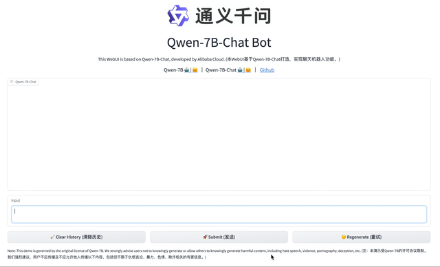
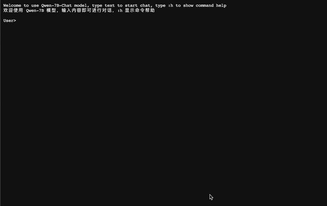
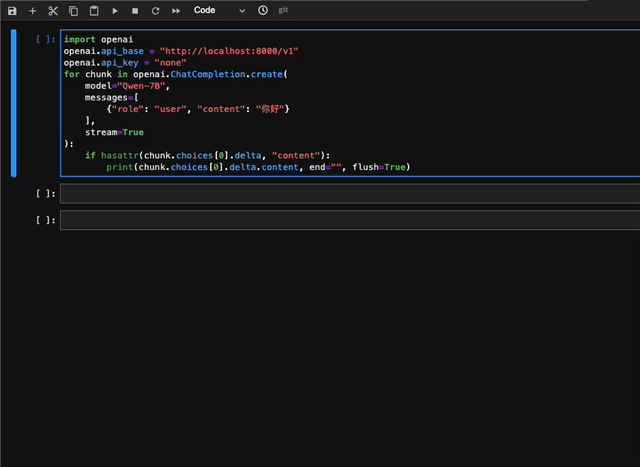
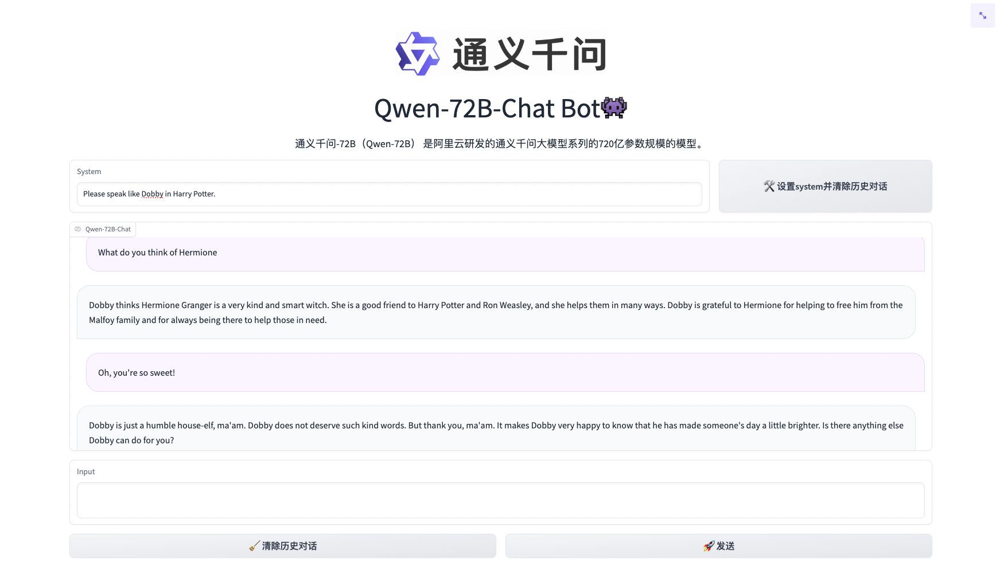
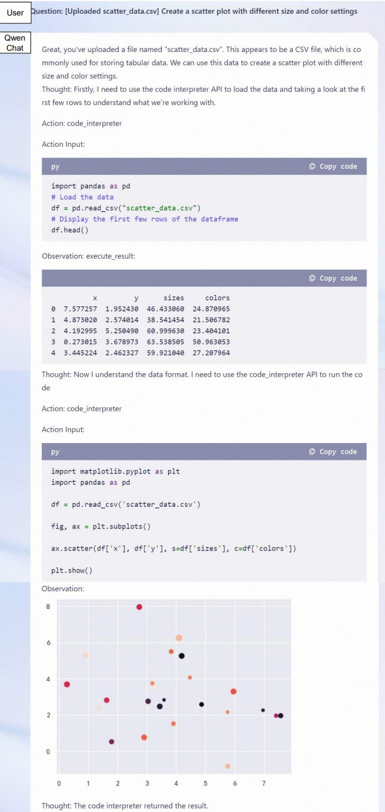
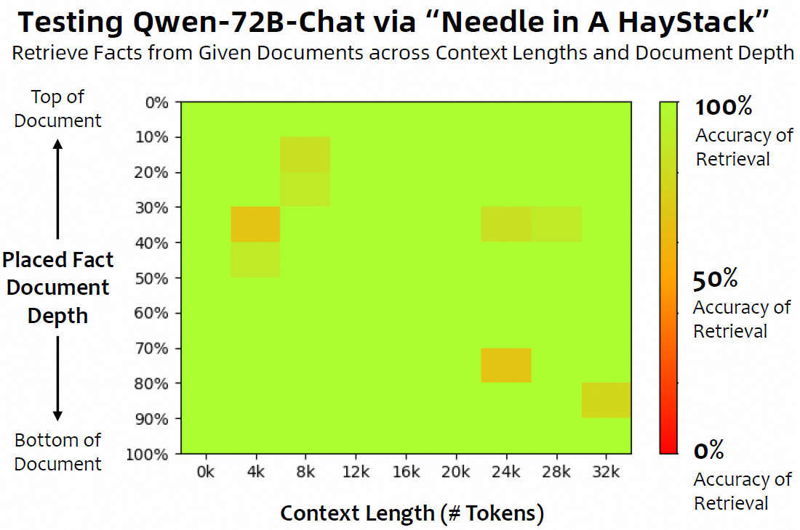

<p align="left">
    <a href="README_CN.md">中文</a>&nbsp ｜ &nbsp<a href="README.md">English</a>&nbsp ｜ &nbsp日本語 ｜ &nbsp<a href="README_FR.md">Français</a> ｜ &nbsp<a href="README_ES.md">Español</a>
</p>
<br><br>

<p align="center">
    
<p>
<br>

<p align="center">
        🤗 <a href="https://huggingface.co/Qwen">Hugging Face</a>&nbsp&nbsp | &nbsp&nbsp🤖 <a href="https://modelscope.cn/organization/qwen">ModelScope</a>&nbsp&nbsp | &nbsp&nbsp 📑 <a href="https://arxiv.org/abs/2309.16609">Paper</a> &nbsp&nbsp ｜ &nbsp&nbsp🖥️ <a href="https://modelscope.cn/studios/qwen/Qwen-72B-Chat-Demo/summary">Demo</a>
<br>
<a href="assets/wechat.png">WeChat (微信)</a>&nbsp&nbsp | &nbsp&nbsp<a href="https://discord.gg/z3GAxXZ9Ce">Discord</a>&nbsp&nbsp ｜  &nbsp&nbsp<a href="https://dashscope.aliyun.com">API</a> 
</p>
<br><br>

|     |                                                              Qwen-Chat                                                               |                                                                Qwen-Chat (Int4)                                                                |                        Qwen-Chat (Int8)                         |                                                            Qwen                                                            |
|-----|:------------------------------------------------------------------------------------------------------------------------------------:|:----------------------------------------------------------------------------------------------------------------------------------------------:|:---------------------------------------------------------------:|:--------------------------------------------------------------------------------------------------------------------------:|
| 1.8B  |  <a href="https://modelscope.cn/models/qwen/Qwen-1_8B-Chat/summary">🤖</a>  <a href="https://huggingface.co/Qwen/Qwen-1_8B-Chat">🤗</a>  |  <a href="https://modelscope.cn/models/qwen/Qwen-1_8B-Chat-Int4/summary">🤖</a>  <a href="https://huggingface.co/Qwen/Qwen-1_8B-Chat-Int4">🤗</a>  | <a href="https://modelscope.cn/models/qwen/Qwen-1_8B-Chat-Int8/summary">🤖</a>  <a href="https://huggingface.co/Qwen/Qwen-1_8B-Chat-Int8">🤗</a>  |  <a href="https://modelscope.cn/models/qwen/Qwen-1_8B/summary">🤖</a>  <a href="https://huggingface.co/Qwen/Qwen-1_8B">🤗</a>  |
| 7B  |  <a href="https://modelscope.cn/models/qwen/Qwen-7B-Chat/summary">🤖</a>  <a href="https://huggingface.co/Qwen/Qwen-7B-Chat">🤗</a>  |  <a href="https://modelscope.cn/models/qwen/Qwen-7B-Chat-Int4/summary">🤖</a>  <a href="https://huggingface.co/Qwen/Qwen-7B-Chat-Int4">🤗</a>  | <a href="https://modelscope.cn/models/qwen/Qwen-7B-Chat-Int8/summary">🤖</a>  <a href="https://huggingface.co/Qwen/Qwen-7B-Chat-Int8">🤗</a>  |  <a href="https://modelscope.cn/models/qwen/Qwen-7B/summary">🤖</a>  <a href="https://huggingface.co/Qwen/Qwen-7B">🤗</a>  |
| 14B | <a href="https://modelscope.cn/models/qwen/Qwen-14B-Chat/summary">🤖</a>  <a href="https://huggingface.co/Qwen/Qwen-14B-Chat">🤗</a> | <a href="https://modelscope.cn/models/qwen/Qwen-14B-Chat-Int4/summary">🤖</a>  <a href="https://huggingface.co/Qwen/Qwen-14B-Chat-Int4">🤗</a> | <a href="https://modelscope.cn/models/qwen/Qwen-14B-Chat-Int8/summary">🤖</a>  <a href="https://huggingface.co/Qwen/Qwen-14B-Chat-Int8">🤗</a> | <a href="https://modelscope.cn/models/qwen/Qwen-14B/summary">🤖</a>  <a href="https://huggingface.co/Qwen/Qwen-14B">🤗</a> |
| 72B | <a href="https://modelscope.cn/models/qwen/Qwen-72B-Chat/summary">🤖</a>  <a href="https://huggingface.co/Qwen/Qwen-72B-Chat">🤗</a> | <a href="https://modelscope.cn/models/qwen/Qwen-72B-Chat-Int4/summary">🤖</a>  <a href="https://huggingface.co/Qwen/Qwen-72B-Chat-Int4">🤗</a> | <a href="https://modelscope.cn/models/qwen/Qwen-72B-Chat-Int8/summary">🤖</a>  <a href="https://huggingface.co/Qwen/Qwen-72B-Chat-Int8">🤗</a> | <a href="https://modelscope.cn/models/qwen/Qwen-72B/summary">🤖</a>  <a href="https://huggingface.co/Qwen/Qwen-72B">🤗</a> |


**Qwen-1.8B**、**Qwen-7B**、**Qwen-14B**、**Qwen-72B**の基本言語モデルである**Qwen**と、**Qwen-1.8B-Chat**、**Qwen-7B-Chat**、**Qwen-14B-Chat**、**Qwen-72B-Chat**のチャットモデルである**Qwen-Chat**をオープンソース化します。上の表にリンクがあります。リンクをクリックして、モデルカードをご確認ください。また、**[テクニカルレポート](https://arxiv.org/abs/2309.16609)**も公開しています。論文リンクをクリックしてご覧ください！

簡単に説明すると、私たちは、ドメインや言語（中国語と英語を中心に）などを幅広くカバーする最大3兆トークンの多言語データに対して安定的に事前学習された強力なベース言語モデルを持っています。これらのモデルは、ベンチマークデータセットにおいて競争力のあるパフォーマンスを達成することができます。さらに、SFTとRLHFに基づく人間の嗜好に沿ったチャットモデル（まだリリースされていません）があり、チャット、コンテンツ作成、情報抽出、要約、翻訳、コーディング、数学の問題を解くなどが可能で、ツールを使ったり、エージェントとして遊んだり、コードインタプリタとして遊んだりすることもできます。


| モデル       |   発行日    | コンテキストの最大長 | システムプロンプトの強化 | 预训练されたトークンの数 | Finetuning（Q-Lora）の最小GPUメモリ使用量 | 2048トークン生成時の最小GPUメモリ使用量（Int4） | ツールの使用能力 |
|:----------|:--------:|:----------:|:------------:|:------------:|:------------------------------:|:-----------------------------:|:--------:|
| Qwen-1.8B | 23.11.30 |    32K     |      ✅       |     2.2T     |             5.8GB              |             2.9GB             |    ✅     |  
| Qwen-7B   | 23.08.03 |    32K     |      ❎       |     2.4T     |             11.5GB             |             8.2GB             |    ✅     |   
| Qwen-14B  | 23.09.25 |     8K     |      ❎       |     3.0T     |             18.7GB             |            13.0GB             |    ✅     |
| Qwen-72B  | 23.11.30 |    32K     |      ✅       |     3.0T     |             61.4GB             |            48.9GB             |    ✅     |   


このレポでは、それを把握することができる：

* Qwenのクイックスタート。
* 量子化モデルの詳細（使用量、メモリ、推論速度など）。比較のために、BF16モデルの統計も提供します。
* フルパラメーターチューニング、LoRA、Q-LoRAを含む、微調整に関するチュートリアル。
* vLLMとFastChatを例に、デプロイメントについて説明します。
* WebUI、CLIデモなど、デモの構築に関する説明。
* あなたのモデルのためのOpenAIスタイルのAPIを構築する手順。
* ツール使用、エージェント、コードインタプリタの Qwen の詳細。
* ロングコンテクスト理解評価の統計
* ライセンス契約
* ...

また、困ったことがあれば、まずは[FAQ](FAQ.md)を参照してほしい。まだ悩んでいますか？遠慮なく私たちに問題を送ってください（より多くの人が理解できるように、英語で）！私たちを助けたいなら、遠慮なくプルリクエストを送ってください！

私たちとチャットしたいですか？私たちのDiscordまたはWeChatグループへようこそ！
<br><br>

## ニュースとアップデート

* 2023.11.30 🔥 3T トークンで学習し、32k コンテキストをサポートする **Qwen-72B** と **Qwen-72B-Chat** を、 **Qwen-1.8B** と **Qwen-1.8B-Chat** とともに、ModelScope と Hugging Face 上でリリースしました。また、Qwen-72B-ChatとQwen-1.8B-Chatのシステム・プロンプト機能を強化しました。[サンプル・ドキュメント](examples/system_prompt.md)を参照してください。さらに、**Ascend 910** と **Hygon DCU** での推論をサポートしました。詳細は `ascend-support` と `dcu-support` を参照してください。
* 2023.10.17 Int8量子化モデル**Qwen-7B-Chat-Int8**と**Qwen-14B-Chat-Int8**をリリースしました。
* 2023.9.25 🔥 Qwen-14BとQwen-14B-ChatをModelScopeとHugging Faceでリリースしました。[qwen.cpp](https://github.com/QwenLM/qwen.cpp) と [Qwen-Agent](https://github.com/QwenLM/Qwen-Agent) もリリースされました。同時に、Qwen-7B と Qwen-7B-Chat も更新しました。Qwen-7B（オリジナル）と比較して、Qwen-7Bはより多くの学習トークンを使用し、2.2Tトークンから2.4Tトークンに増加し、コンテキスト長は2048から8192に拡張された。Qwen-7Bの中国語知識とコーディング能力はさらに向上しています。最新のコードとチェックポイントをお使いください！
* 2023.9.12 Qwen-7Bモデルにおいて、フルパラメーター・ファインチューニング、LoRA、Q-LoRAを含むファインチューニングをサポートしました。
* 2023.8.21 Qwen-7B-Chat 用 Int4 量子化モデル **Qwen-7B-Chat-Int4** をリリースしました。また、ベンチマーク評価においても大きな性能低下は見られませんでした。
* 2023.8.3 ModelScope と Hugging Face 上で **Qwen-7B** と **Qwen-7B-Chat** をリリースしました。また、トレーニングの詳細やモデルの性能など、モデルの詳細については技術メモを提供しています。
<br>

## 性能

Qwenモデルは、MMLU、C-Eval、GSM8K、MATH、HumanEval、MBPP、BBHなど、自然言語理解、数学的問題解決、コーディングなどに関するモデルの能力を評価する一連のベンチマークデータセットにおいて、同様のモデルサイズを持つベースラインモデルを上回る性能を発揮する。Qwen-72Bは全てのタスクでLLaMA2-70Bを上回り、10タスク中7タスクでGPT-3.5を上回った。


<p align="left">
    
<p>
<br>

| Model             |   MMLU   |  C-Eval  |  GSM8K   |   MATH   | HumanEval |   MBPP   |   BBH    |  CMMLU   |
|:------------------|:--------:|:--------:|:--------:|:--------:|:---------:|:--------:|:--------:|:--------:|
|                   |  5-shot  |  5-shot  |  8-shot  |  4-shot  |  0-shot   |  3-shot  |  3-shot  |  5-shot  |
| LLaMA2-7B         |   46.8   |   32.5   |   16.7   |   3.3    |   12.8    |   20.8   |   38.2   |   31.8   |
| LLaMA2-13B        |   55.0   |   41.4   |   29.6   |   5.0    |   18.9    |   30.3   |   45.6   |   38.4   |
| LLaMA2-34B        |   62.6   |    -     |   42.2   |   6.2    |   22.6    |   33.0   |   44.1   |    -     |
| ChatGLM2-6B       |   47.9   |   51.7   |   32.4   |   6.5    |     -     |    -     |   33.7   |    -     |
| InternLM-7B       |   51.0   |   53.4   |   31.2   |   6.3    |   10.4    |   14.0   |   37.0   |   51.8   |
| InternLM-20B      |   62.1   |   58.8   |   52.6   |   7.9    |   25.6    |   35.6   |   52.5   |   59.0   |
| Baichuan2-7B      |   54.7   |   56.3   |   24.6   |   5.6    |   18.3    |   24.2   |   41.6   |   57.1   |
| Baichuan2-13B     |   59.5   |   59.0   |   52.8   |   10.1   |   17.1    |   30.2   |   49.0   |   62.0   |
| Yi-34B      	  	  |   76.3   |   81.8   |   67.9   |   15.9   |   26.2    |   38.2   |   66.4   |   82.6   |
| XVERSE-65B      	 |   70.8   |   68.6   |   60.3   |    -     |   26.3    |    -     |    -     |    -     |
| **Qwen-1.8B**     |   45.3   |   56.1   |   32.3   |   2.3    |   15.2    |   14.2   |   22.3   |   52.1   |
| **Qwen-7B**       |   58.2   |   63.5   |   51.7   |   11.6   |   29.9    |   31.6   |   45.0   |   62.2   |
| **Qwen-14B**      |   66.3   |   72.1   |   61.3   |   24.8   |   32.3    |   40.8   |   53.4   |   71.0   |
| **Qwen-72B**      | **77.4** | **83.3** | **78.9** | **35.2** | **35.4**  | **52.2** | **67.7** | **83.6** |


比較されたすべてのモデルについて、公式に報告された結果と[OpenCompass](https://opencompass.org.cn/leaderboard-llm) の間の最高スコアを報告します。

より詳細な実験結果（より多くのベンチマークデータセットでの詳細なモデル性能）や詳細については、[こちら](TODO)をクリックして技術メモを参照してください。
<br><br>

## 必要条件

* python 3.8 以上
* pytorch 1.12 以上、2.0 以上を推奨
* transformers 4.32 以上
* CUDA 11.4 以上を推奨（GPU ユーザー、フラッシュアテンションユーザー向けなど）
<br>

## クイックスタート

以下では、Qwen-Chat と 🤖 ModelScope と 🤗 Transformers の簡単な使用例を示します。

詳しくはセクション["ビルド済みDockerイメージの使用"](#-docker)を参照してください。

Dockerを使用しない場合は、環境のセットアップと必要なパッケージのインストールが済んでいることを確認してください。上記の要件を満たしていることを確認してから、依存するライブラリをインストールしてください。

```bash
pip install -r requirements.txt
```

お使いのデバイスが fp16 または bf16 をサポートしている場合、[flash-attention](https://github.com/Dao-AILab/flash-attention) （flash attention 2に対応しました）をインストールすることで、より高い効率とメモリ使用量を抑えることができます。(**flash-attention はオプションであり、インストールしなくてもプロジェクトは正常に実行できます**)

```bash
git clone https://github.com/Dao-AILab/flash-attention
cd flash-attention && pip install .
# 以下はオプションです。インストールに時間がかかる場合があります。
# pip install csrc/layer_norm
# flash-attn のバージョンが 2.1.1 以降の場合、以下は必要ありません。
# pip install csrc/rotary
```

これで ModelScope か Transformers で始めることができます。

### 🤗 Transformers

Qwen-Chat を推論に使用するには、以下のように数行のコードを入力するだけです。Qwen/Qwen-7B-Chat "や "Qwen/Qwen-14B-Chat "のように、正しいモデル名やパスを渡すことを忘れないでください。**最新のコードを使用していることを確認してください。**

```python
from transformers import AutoModelForCausalLM, AutoTokenizer
from transformers.generation import GenerationConfig

# Model names："Qwen/Qwen-7B-Chat"、"Qwen/Qwen-14B-Chat"
tokenizer = AutoTokenizer.from_pretrained("Qwen/Qwen-7B-Chat", trust_remote_code=True)

# bf16 を使用
# model = AutoModelForCausalLM.from_pretrained("Qwen/Qwen-7B-Chat", device_map="auto", trust_remote_code=True, bf16=True).eval()
# fp16 を使用
# model = AutoModelForCausalLM.from_pretrained("Qwen/Qwen-7B-Chat", device_map="auto", trust_remote_code=True, fp16=True).eval()
# CPU のみ使用
# model = AutoModelForCausalLM.from_pretrained("Qwen/Qwen-7B-Chat", device_map="cpu", trust_remote_code=True).eval()
# オートモードを使用すると、デバイスに応じて自動的に精度が選択されます。
model = AutoModelForCausalLM.from_pretrained("Qwen/Qwen-7B-Chat", device_map="auto", trust_remote_code=True).eval()

# 生成のためのハイパーパラメータを指定。ただし、4.32.0 以上のトTransformerを使用している場合は、これを行う必要はありません。
# model.generation_config = GenerationConfig.from_pretrained("Qwen/Qwen-7B-Chat", trust_remote_code=True)

# 第一回対話ターン
response, history = model.chat(tokenizer, "你好", history=None)
print(response)
# 你好！很高兴为你提供帮助。

# 第二回対話ターン
response, history = model.chat(tokenizer, "给我讲一个年轻人奋斗创业最终取得成功的故事。", history=history)
print(response)
# 这是一个关于一个年轻人奋斗创业最终取得成功的故事。
# 故事的主人公叫李明，他来自一个普通的家庭，父母都是普通的工人。从小，李明就立下了一个目标：要成为一名成功的企业家。
# 为了实现这个目标，李明勤奋学习，考上了大学。在大学期间，他积极参加各种创业比赛，获得了不少奖项。他还利用课余时间去实习，积累了宝贵的经验。
# 毕业后，李明决定开始自己的创业之路。他开始寻找投资机会，但多次都被拒绝了。然而，他并没有放弃。他继续努力，不断改进自己的创业计划，并寻找新的投资机会。
# 最终，李明成功地获得了一笔投资，开始了自己的创业之路。他成立了一家科技公司，专注于开发新型软件。在他的领导下，公司迅速发展起来，成为了一家成功的科技企业。
# 李明的成功并不是偶然的。他勤奋、坚韧、勇于冒险，不断学习和改进自己。他的成功也证明了，只要努力奋斗，任何人都有可能取得成功。

# 第三轮对话 第三回対話ターン
response, history = model.chat(tokenizer, "给这个故事起一个标题", history=history)
print(response)
# 《奋斗创业：一个年轻人的成功之路》
```

Qwen の学習済みベースモデルの実行も簡単です。

<details>
  <summary>Qwen の実行</summary>

```python
from transformers import AutoModelForCausalLM, AutoTokenizer
from transformers.generation import GenerationConfig

# Model names："Qwen/Qwen-7B"、"Qwen/Qwen-14B"
tokenizer = AutoTokenizer.from_pretrained("Qwen/Qwen-7B", trust_remote_code=True)
# bf16 を使用
# model = AutoModelForCausalLM.from_pretrained("Qwen/Qwen-7B", device_map="auto", trust_remote_code=True, bf16=True).eval()
# fp16 を使用
# model = AutoModelForCausalLM.from_pretrained("Qwen/Qwen-7B", device_map="auto", trust_remote_code=True, fp16=True).eval()
# CPU のみ使用
# model = AutoModelForCausalLM.from_pretrained("Qwen/Qwen-7B", device_map="cpu", trust_remote_code=True).eval()
# オートモードを使用すると、デバイスに応じて自動的に精度が選択されます。
model = AutoModelForCausalLM.from_pretrained("Qwen/Qwen-7B", device_map="auto", trust_remote_code=True).eval()

# 生成のためのハイパーパラメータを指定。ただし、4.32.0 以上のトTransformerを使用している場合は、これを行う必要はありません。
# model.generation_config = GenerationConfig.from_pretrained("Qwen/Qwen-7B-Chat", trust_remote_code=True)

inputs = tokenizer('蒙古国的首都是乌兰巴托（Ulaanbaatar）\n冰岛的首都是雷克雅未克（Reykjavik）\n埃塞俄比亚的首都是', return_tensors='pt')
inputs = inputs.to(model.device)
pred = model.generate(**inputs)
print(tokenizer.decode(pred.cpu()[0], skip_special_tokens=True))
# 蒙古国的首都是乌兰巴托（Ulaanbaatar）\n冰岛的首都是雷克雅未克（Reykjavik）\n埃塞俄比亚的首都是亚的斯亚贝巴（Addis Ababa）...
```

</details>

<p id="DownloadModel">
HuggingFaceからモデルのチェックポイントとコードをダウンロードする際にネットワークの問題が発生した場合、ModelScopeからチェックポイントをダウンロードする方法はこちらでございます。
</p>

```python
from modelscope import snapshot_download
from transformers import AutoModelForCausalLM, AutoTokenizer

# Downloading model checkpoint to a local dir model_dir
# model_dir = snapshot_download('qwen/Qwen-7B')
# model_dir = snapshot_download('qwen/Qwen-7B-Chat')
# model_dir = snapshot_download('qwen/Qwen-14B')
model_dir = snapshot_download('qwen/Qwen-14B-Chat')

# Loading local checkpoints
# trust_remote_code is still set as True since we still load codes from local dir instead of transformers
tokenizer = AutoTokenizer.from_pretrained(model_dir, trust_remote_code=True)
model = AutoModelForCausalLM.from_pretrained(
    model_dir,
    device_map="auto",
    trust_remote_code=True
).eval()
```

### 🤖 ModelScope

ModelScope は、MaaS（Model-as-a-Service） のためのオープンソースプラットフォームであり、AI 開発者に柔軟で費用対効果の高いモデルサービスを提供します。同様に、以下のように ModelScope でモデルを実行することができます:

```python
from modelscope import AutoModelForCausalLM, AutoTokenizer
from modelscope import GenerationConfig

# Model names："Qwen/Qwen-7B-Chat"、"Qwen/Qwen-14B-Chat"
tokenizer = AutoTokenizer.from_pretrained("qwen/Qwen-7B-Chat", trust_remote_code=True)
model = AutoModelForCausalLM.from_pretrained("qwen/Qwen-7B-Chat", device_map="auto", trust_remote_code=True, fp16=True).eval()
model.generation_config = GenerationConfig.from_pretrained("Qwen/Qwen-7B-Chat", trust_remote_code=True) # 可指定不同的生成长度、top_p等相关超参

response, history = model.chat(tokenizer, "你好", history=None)
print(response)
response, history = model.chat(tokenizer, "浙江的省会在哪里？", history=history) 
print(response)
response, history = model.chat(tokenizer, "它有什么好玩的景点", history=history)
print(response)
```

### バッチ推論
Qwenはバッチ推論をサポートしている。フラッシュ・アテンションを有効にした場合、バッチ推論を使用することで40%のスピードアップが期待できる。以下にコード例を示す：
```python
import torch
from transformers import AutoModelForCausalLM, AutoTokenizer
from transformers import GenerationConfig
from qwen_generation_utils import make_context, decode_tokens, get_stop_words_ids

tokenizer = AutoTokenizer.from_pretrained(
    './',
    pad_token='<|extra_0|>',
    eos_token='<|endoftext|>',
    padding_side='left',
    trust_remote_code=True
)
model = AutoModelForCausalLM.from_pretrained(
    './',
    pad_token_id=tokenizer.pad_token_id,
    device_map="auto",
    trust_remote_code=True
).eval()
model.generation_config = GenerationConfig.from_pretrained('./', pad_token_id=tokenizer.pad_token_id)

all_raw_text = ["我想听你说爱我。", "今天我想吃点啥，甜甜的，推荐下", "我马上迟到了，怎么做才能不迟到"]
batch_raw_text = []
for q in all_raw_text:
    raw_text, _ = make_context(
        tokenizer,
        q,
        system="You are a helpful assistant.",
        max_window_size=model.generation_config.max_window_size,
        chat_format=model.generation_config.chat_format,
    )
    batch_raw_text.append(raw_text)

batch_input_ids = tokenizer(batch_raw_text, padding='longest')
batch_input_ids = torch.LongTensor(batch_input_ids['input_ids']).to(model.device)
batch_out_ids = model.generate(
    batch_input_ids,
    return_dict_in_generate=False,
    generation_config=model.generation_config
)
padding_lens = [batch_input_ids[i].eq(tokenizer.pad_token_id).sum().item() for i in range(batch_input_ids.size(0))]

batch_response = [
    decode_tokens(
        batch_out_ids[i][padding_lens[i]:],
        tokenizer,
        raw_text_len=len(batch_raw_text[i]),
        context_length=(batch_input_ids[i].size(0)-padding_lens[i]),
        chat_format="chatml",
        verbose=False,
        errors='replace'
    ) for i in range(len(all_raw_text))
]
print(batch_response)

response, _ = model.chat(tokenizer, "我想听你说爱我。", history=None)
print(response)

response, _ = model.chat(tokenizer, "今天我想吃点啥，甜甜的，推荐下", history=None)
print(response)

response, _ = model.chat(tokenizer, "我马上迟到了，怎么做才能不迟到", history=None)
print(response)
```

### CPU

Qwenとtiktokenの純粋なC++実装である [qwen.cpp](https://github.com/QwenLM/qwen.cpp) を使用することを強くお勧めします。詳細はレポを確認してください！

また、CPU上でモデルを直接実行することも簡単ですが、その場合はデバイスの指定が必要です：


```python
model = AutoModelForCausalLM.from_pretrained("Qwen/Qwen-7B-Chat", device_map="cpu", trust_remote_code=True).eval()
```

ただし、推論効率が極端に低下する可能性があります。

### 複数のGPU

GPUメモリ不足に悩まされ、1つ以上のGPUでモデルを実行したい場合、Transformersでサポートされるようになったデフォルトのロード方法を直接使うことができます。以前の `utils.py` に基づく方法は非推奨です。

しかし、この方法は簡単ですが、ネイティブ・パイプライン並列の効率は低いです。FastChatでvLLMを使用することをお勧めします。

### DashScope

APIを通じてQwenを利用する最も簡単な方法は、Alibaba Cloudを通じたDashScope APIサービスです。その使い方を紹介します。さらに、OpenAIスタイルのAPIをご自身のサーバーにデプロイするためのスクリプトも提供しています。

DashScopeはAlibaba Cloudが提供する大規模言語モデルAPIサービスで、今回Qwenに対応した。DashScopeの背後にあるモデルは、詳細が提供されていない一時的な社内バージョンであることに注意してください。サービスには `qwen-turbo` と `qwen-plus` があり、前者はより高速に動作し、後者はより優れたパフォーマンスを実現している。詳細はドキュメント [こちら](https://dashscope.aliyun.com) を参照。

公式サイト [link](https://help.aliyun.com/zh/dashscope/developer-reference/activate-dashscope-and-create-an-api-key?spm=a2c4g.11186623.0.0.6c2774fahtfXdn) で DashScope アカウントを作成し、API キー (AK) を取得してください。AK は環境変数で設定することをお勧めします：
```bash
export DASHSCOPE_API_KEY="YOUR_DASHSCOPE_API_KEY"
```
その後、パッケージをインストールし、ドキュメントは [こちら](https://help.aliyun.com/zh/dashscope/developer-reference/install-dashscope-sdk) をクリックしてください。Python をお使いの場合は、pip で DashScope をインストールできます：
```bash
pip install dashscope
```
JAVA SDKを使用する場合は、この方法でインストールできます：
```xml
<!-- https://mvnrepository.com/artifact/com.alibaba/dashscope-sdk-java -->
<dependency>
    <groupId>com.alibaba</groupId>
    <artifactId>dashscope-sdk-java</artifactId>
    <version>the-latest-version</version>
</dependency>
```
DashScope を使用する最も簡単な方法は、OpenAI API と同様のメッセージを使用する方法です。以下にその例を示す：
```python
import random
from http import HTTPStatus
from dashscope import Generation


def call_with_messages():
    messages = [{'role': 'system', 'content': 'You are a helpful assistant.'},
                {'role': 'user', 'content': '如何做西红柿鸡蛋？'}]
    gen = Generation()
    response = gen.call(
        Generation.Models.qwen_turbo,
        messages=messages,
        seed=random.randint(1, 10000),  # set the random seed, optional, default to 1234 if not set
        result_format='message',  # set the result to be "message" format.
    )
    return response


if __name__ == '__main__':
    response = call_with_messages()
    if response.status_code == HTTPStatus.OK:
        print(response)
    else:
        print('Request id: %s, Status code: %s, error code: %s, error message: %s' % (
            response.request_id, response.status_code,
            response.code, response.message
        ))
```
詳しい使い方は公式サイトをご覧ください。
<br><br>


## 量子化

### GPTQ

我々は、[AutoGPTQ](https://github.com/PanQiWei/AutoGPTQ)に基づいた解決策を提供し、Int4とInt8の量子化モデルをリリースすることで、ほぼ無損失なモデル効果を達成しつつ、メモリコストと推論速度の両方で性能を向上させた。

ここでは、量子化されたモデルを推論に使用する方法を説明する。始める前に、auto-gptqの要件を満たしていることを確認し（例：torch 2.0以上、transformers 4.32.0以上など）、必要なパッケージをインストールしてください：

```bash
pip install auto-gptq optimum
```

auto-gptq`のインストールに問題がある場合は、公式の[repo](https://github.com/PanQiWei/AutoGPTQ)をチェックして、ホイールを見つけることをお勧めする。

> 注意：コンパイル済みの `auto-gptq` パッケージは `torch` のバージョンと CUDA バージョンに強く依存しています。さらに、最近のアップデートにより 
> さらに、最近のアップデートにより、`transformers`、`optimum`、`peft` でサポートされていないバージョンのエラーが発生する可能性があります。
> 以下の要件を満たす最新バージョンの使用をお勧めします：
> - torch==2.1 auto-gptq>=0.5.1 transformers>=4.35.0 optimum>=1.14.0 peft>=0.6.1 > - torch==2.1 auto-gptq>=0.5.1 transformers>=4.35.0 optimum>=1.14.0 peft>=0.6.1
> - torch>=2.0, <2.1 auto-gptq<0.5.0 transformers<4.35.0  optimum<1.14.0 peft>=0.5.0,<0.6.0

そうすれば、量子化されたモデルを簡単にロードすることができ、いつもと同じように推論を実行することができる：

```python
model = AutoModelForCausalLM.from_pretrained(
    "Qwen/Qwen-7B-Chat-Int4",
    device_map="auto",
    trust_remote_code=True
).eval()
response, history = model.chat(tokenizer, "Hi", history=None)
```

ベンチマークにおける BF16 モデルと Int8、Int4 モデルの性能について説明します。その結果は以下に示します：

| Quantization         | MMLU | CEval (val) | GSM8K | Humaneval |
|----------------------|:----:|:-----------:|:-----:|:---------:|
| Qwen-1.8B-Chat (BF16)| 43.3 |    55.6     | 33.7  |   26.2    |
| Qwen-1.8B-Chat (Int8)| 43.1 |    55.8     | 33.0  |   27.4    |
| Qwen-1.8B-Chat (Int4)| 42.9 |    52.8     | 31.2  |   25.0    |
| Qwen-7B-Chat (BF16)  | 55.8 |    59.7     | 50.3  |   37.2    |
| Qwen-7B-Chat (Int8)  | 55.4 |    59.4     | 48.3  |   34.8    |
| Qwen-7B-Chat (Int4)  | 55.1 |    59.2     | 49.7  |   29.9    |
| Qwen-14B-Chat (BF16) | 64.6 |    69.8     | 60.1  |   43.9    |
| Qwen-14B-Chat (Int8) | 63.6 |    68.6     | 60.0  |   48.2    |
| Qwen-14B-Chat (Int4) | 63.3 |    69.0     | 59.8  |   45.7    |
| Qwen-72B-Chat (BF16) | 74.4 |    80.1     | 76.4  |   64.6    |
| Qwen-72B-Chat (Int8) | 73.5 |    80.1     | 73.5  |   62.2    |
| Qwen-72B-Chat (Int4) | 73.4 |    80.1     | 75.3  |   61.6    |

### KVキャッシュ量子化

> 注意: Hugging Faceの内部メカニズムにより、この機能のサポートファイル 
> (すなわち、`cache_autogptq_cuda_256.cpp`と`cache_autogptq_cuda_kernel_256.cu`)が欠落している可能性があります。以下を手動でダウンロードしてください。
> Hugging Face Hubから手動でダウンロードし、他のモジュールファイルと同じフォルダに入れてください。

アテンション KV キャッシュを量子化して圧縮して保存すると、サンプルのスループットが向上する。この機能を有効にするには、`config.json` に `use_cache_quantization` と `use_cache_kernel` という引数を指定する。
具体的な使用方法は以下の通りである：

```python
model = AutoModelForCausalLM.from_pretrained(
    "Qwen/Qwen-7B-Chat",
     device_map="auto",
     trust_remote_code=True,
     use_cache_quantization=True,
     use_cache_kernel=True,
     use_flash_attn=False
)
```

注意： 現在、KVキャッシュの量子化とフラッシュ・アテンションを同時に使用することはできない。
KV キャッシュの量子化とフラッシュ・アテンションを同時に有効にした場合（`use_flash_attn=True`, `use_cache_quantization=True`, `use_cache_kernel=True`）、デフォルトでは `use_flash_attn` は無効になる（`use_flash_attn=false`）。

量子化されたint8-kvcacheモデルを使用しても、下流の評価で大幅な性能低下がないことを確認しました。以下では、さまざまな条件下でのメモリフットプリントのプロファイリングに焦点を当てます。
プロファイリングは、PyTorch 2.0.1とCUDA 11.4を搭載したシングルA100-SXM4-80G GPUで実行しました。
デフォルトで1024トークンを生成するためにBF16モデルを使用し、"OOM "はメモリ不足エラーを示します。

KVキャッシュの量子化により、モデルはより大きなバッチサイズ（bs）で推論することができる。

| USE KV Cache |  bs=1  |  bs=4  | bs=16  | bs=32  | bs=64  | bs=100 |
|--------------|:------:|:------:|:------:|:------:|:------:|:------:|
| No           | 16.3GB | 24.1GB | 31.7GB | 48.7GB |  OOM   |  OOM   |
| Yes          | 15.5GB | 17.2GB | 22.3GB | 30.2GB | 48.2GB | 72.4GB |

KVキャッシュ量子化により、推論段階でより長いシーケンス（`sl`, シーケンス長、生成されるトークン数を指す）を生成する際、モデルはより多くのメモリを節約することができる。

| USE KV Cache | sl=512 | sl=1024 | sl=2048 | sl=4096 | sl=8192 |
|--------------|:------:|:-------:|:-------:|:-------:|:-------:|
| No           | 15.2GB | 16.3GB  | 17.6GB  | 19.5GB  | 23.2GB  |
| Yes          |  15GB  | 15.5GB  | 15.8GB  | 16.6GB  | 17.6GB  |

KVキャッシュ量子化モデルでは、layer-pastのフォーマットをfloatからint8に変換し、量子化された `layer-past` には量子化パラメータも格納される。

具体的な手順は以下の通り：

1. key/valueの量子化を行います。
```
    qv,scale,zero_point=quantize_cache_v(v)
```

2. `layer_past`に保存します。

量子化されたの`layer-past`は:
```
    layer_past=((q_key,key_scale,key_zero_point),
                (q_value,value_scale,value_zero_point))
```
`layer_past`の元のフォーマットは以下の通りである：
```
    layer_past=(key,value)
```
量子化されたアテンションKVを使用したい場合、 
Int8のkey/valueをfloatフォーマットに戻すには、以下のように逆量子化操作を使用します：
```
    v=dequantize_cache_torch(qv,scale,zero_point)
```
<br>

## 推論パフォーマンス

このセクションでは、さまざまな精度のモデルのスピードとメモリの統計情報を提供する。スピードとメモリーのプロファイリングは[このスクリプト](https://qianwen-res.oss-cn-beijing.aliyuncs.com/profile.py)を使用しています。

BF16、Int8、および Int4 のモデルを使用して 2048 を生成する際の平均推論速度 (トークン/秒) と GPU メモリ使用量を測定しました。

<table>
    <tr>
        <td>Model Size</td>
        <td>Quantization</td>
        <td>Speed (Tokens/s)</td>
        <td>GPU Memory Usage</td>
    </tr>
    <tr>
        <td rowspan="3">1.8B</td>
        <td>BF16</td>
        <td>54.09</td>
        <td>4.23GB</td>
    </tr>
    <tr>
        <td>Int8</td>
        <td>55.56</td>
        <td>3.48GB</td>
    </tr>
    <tr>
        <td>Int4</td>
        <td>71.07</td>
        <td>2.91GB</td>
    </tr>
    <tr>
        <td rowspan="3">7B</td>
        <td>BF16</td>
        <td>40.93</td>
        <td>16.99GB</td>
    </tr>
    <tr>
        <td>Int8</td>
        <td>37.47</td>
        <td>11.20GB</td>
    </tr>
    <tr>
        <td>Int4</td>
        <td>50.09</td>
        <td>8.21GB</td>
    </tr>
    <tr>
        <td rowspan="3">14B</td>
        <td>BF16</td>
        <td>32.22</td>
        <td>30.15GB</td>
    </tr>
    <tr>
        <td>Int8</td>
        <td>29.28</td>
        <td>18.81GB</td>
    </tr>
    <tr>
        <td>Int4</td>
        <td>38.72</td>
        <td>13.01GB</td>
    </tr>
    <tr>
        <td rowspan="3">72B</td>
        <td>BF16</td>
        <td>8.48</td>
        <td>144.69GB (2xA100)</td>
    </tr>
    <tr>
        <td>Int8</td>
        <td>9.05</td>
        <td>81.27GB (2xA100)</td>
    </tr>
    <tr>
        <td>Int4</td>
        <td>11.32</td>
        <td>48.86GB</td>
    </tr>
    <tr>
        <td>72B + vLLM</td>
        <td>BF16</td>
        <td>17.60</td>
        <td>2xA100</td>
    </tr>
</table>

プロファイリングは、PyTorch 2.0.1、CUDA 11.8、および Flash-Attendant 2 を備えた単一の A100-SXM4-80G GPU (2xA100 について言及されている場合を除く) で実行されます。(72B + vLLM は PyTorch 2.1.0 および Cuda 11.8 を使用します。) 推論速度 は、エンコードされ生成されたトークンの平均である。

注意：上記のInt4/Int8モデルの推論速度は、autogptqを使用しています。現在、``AutoModelForCausalLM.from_pretrained``で読み込まれるモデルの推論速度は約20%遅くなります。この問題はHuggingFaceチームに報告済みであり、解決策があれば即座に更新されます。

また、コンテキストと生成の長さ、Flash Attention バージョンのさまざまな設定で推論速度と GPU メモリ使用量も測定します。 結果は、Hugging Face または ModelScope の対応するモデルカードで確認できます。

## ファインチューニング

### 使用方法
現在、公式のトレーニングスクリプト `finetune.py` を提供しています。さらに、finetune.pyのシェルスクリプトを提供し、finetune.pyを実行することで、finetune.pyを起動することができる。さらに、安心してファインチューニングを開始するためのシェルスクリプトも提供しています。このスクリプトは、[DeepSpeed](https://github.com/microsoft/DeepSpeed) (注意：これはpydanticの最新バージョンとコンフリクトする可能性があるので、`pydantic<2.0`にする必要があります) および [FSDP](https://engineering.fb.com/2021/07/15/open-source/fsdp/) を使用したトレーニングをサポートします。弊社が提供するシェル・スクリプトは DeepSpeed と Peft を使用するため、事前に DeepSpeed と Peft をインストールすることをお勧めします：
```bash
pip install -r requirements_finetune.txt
```

学習データを準備するには、すべてのサンプルをリストにまとめ、jsonファイルに保存する必要があります。各サンプルはidと会話リストで構成される辞書です。以下は1つのサンプルを含む単純なリストの例です：

```json
[
  {
    "id": "identity_0",
    "conversations": [
      {
        "from": "user",
        "value": "你好"
      },
      {
        "from": "assistant",
        "value": "我是一个语言模型，我叫通义千问。"
      }
    ]
  }
]
```

データ準備の後、提供されているシェルスクリプトを使って微調整を実行することができる。データファイルのパス `$DATA` を忘れずに指定してください。

ファインチューニングのスクリプトを使用することで、以下のことが可能になる：
- フルパラメーター・ファインチューニング
- LoRA
- Q-LoRA

フルパラメータパラメータのファインチューニングを行うには、トレーニングプロセス全体ですべてのパラメータを更新する必要があります。トレーニングを開始するには、以下のスクリプトを実行します：

```bash
# 分散トレーニング。GPUメモリが不足するとトレーニングが破綻するため、シングルGPUのトレーニングスクリプトは提供していません。
bash finetune/finetune_ds.sh
```

シェルスクリプトでは、正しいモデル名またはパス、データパス、出力ディレクトリを指定することを忘れないでください。このスクリプトでは DeepSpeed ZeRO 3 を使用しています。変更したい場合は、引数 `--deepspeed` を削除するか、要件に基づいて DeepSpeed 設定 json ファイルを変更してください。さらに、このスクリプトは混合精度のトレーニングに対応しており、`--bf16 True` または `--fp16 True` を使用することができます。fp16を使用する場合は、混合精度のトレーニングのため、DeepSpeedを使用することを忘れないこと。経験的に、あなたのマシンがbf16をサポートしている場合、私たちのプリトレーニングとアライメントを整合させるためにbf16を使用することをお勧めします。

同様に、LoRAを実行するには、以下のように別のスクリプトを使って実行する。始める前に、`peft`がインストールされていることを確認してください。また、モデル、データ、出力へのパスを指定する必要があります。学習済みモデルには絶対パスを使用することをお勧めします。なぜなら、LoRAはアダプタのみを保存し、アダプタ設定jsonファイルの絶対パスは、ロードする事前学習済みモデルを見つけるために使用されるからです。また、このスクリプトはbf16とfp16の両方をサポートしている。

```bash
# シングルGPUトレーニング
bash finetune/finetune_lora_single_gpu.sh
# 分散トレーニング
bash finetune/finetune_lora_ds.sh
```

LoRA ([論文](https://arxiv.org/abs/2106.09685)) は、フルパラメーターによるファインチューニングと比較して、adapterのパラメーターを更新するだけで、元の大きな言語モデル層は凍結されたままである。そのため、メモリコストが大幅に削減でき、計算コストも削減できる。

なお、チャットモデル（Qwen-7B-Chatなど）ではなく、ベース言語モデル（Qwen-7Bなど）の微調整にLoRAを使用した場合、スクリプトは自動的に学習可能なパラメータとして埋め込み層と出力層を切り替えます。これは、ベースとなる言語モデルには、ChatMLフォーマットによってもたらされる特殊なトークンに関する知識がないためです。したがって、これらのレイヤーは、モデルがトークンを理解し予測するために更新される必要があります。別の言い方をすれば、もしLoRAで特殊なトークンを学習するのであれば、コード内で `modules_to_save` を設定することで、レイヤーを学習可能なパラメータに設定する必要があります。また、これらのパラメータが学習可能な場合、ZeRO 3 を使用することはできません。新しいトレーニング可能なパラメータがない場合は、DeepSpeed 設定ファイルを変更することで ZeRO 3 に切り替えることができます。さらに、LoRAのメモリフットプリントは、このような学習可能なパラメータがある場合とない場合で、大きな開きがあることがわかります。そのため、メモリに問題がある場合は、LoRAのChatモデルを微調整することをお勧めします。詳細は以下のプロファイルを参照してください。

しかし、それでもメモリ不足に悩む場合は、Q-LoRA（[論文](https://arxiv.org/abs/2305.14314)）を検討することができます。これは、量子化されたラージ言語モデルと、ページド・アテンションなどの他のテクニックを使用し、さらに少ないメモリコストで実行することができます。

注：シングル GPU Q-LoRA トレーニングを実行するには、`pip` または `conda` を使って `mpi4py` をインストールする必要があるかもしれない。

Q-LoRAを実行するには、以下のスクリプトを直接実行してください：

```bash
# シングルGPUトレーニング
bash finetune/finetune_qlora_single_gpu.sh
# 分散トレーニング
bash finetune/finetune_qlora_ds.sh
```

Q-LoRAについては、弊社が提供する量子化モデル、例えばQwen-7B-Chat-Int4をロードすることをお勧めします。BF16モデルは使用し**ない**でください！フルパラメータ・ファインチューニングやLoRAとは異なり、Q-LoRAではfp16のみがサポートされる。シングルGPUのトレーニングでは、トーチアンプによるエラーが観測されたため、混合精度のトレーニングにはDeepSpeedを使用する必要がある。また、Q-LoRAの場合、LoRAの特殊トークンの問題が残っています。しかし、Q-LoRAではチャットモデルとしてInt4モデルのみを提供しており、言語モデルはChatML形式の特殊トークンを学習しているため、レイヤーの心配はありません。なお、Int4モデルのレイヤーは学習できないはずなので、学習で特殊なトークンを導入すると、Q-LoRAが動作しなくなる可能性があります。

LoRAとQ-LoRAの学習は、フルパラメータによるファインチューニングとは異なり、アダプターパラメータのみを保存する。仮にQwen-7Bから学習を開始したとすると、以下のようにファインチューニングされたモデルを読み込んで推論を行うことができる：

```python
from peft import AutoPeftModelForCausalLM

model = AutoPeftModelForCausalLM.from_pretrained(
    path_to_adapter, # path to the output directory
    device_map="auto",
    trust_remote_code=True
).eval()
```

アダプターをマージし、微調整したモデルをスタンドアロンモデルとして保存したい場合は（これは LoRA でのみ可能で、Q-LoRA からパラメータをマージすることはできません）、以下のコードを実行します：

```python
from peft import AutoPeftModelForCausalLM

model = AutoPeftModelForCausalLM.from_pretrained(
    path_to_adapter, # path to the output directory
    device_map="auto",
    trust_remote_code=True
).eval()

merged_model = model.merge_and_unload()
# max_shard_size and safe serialization are not necessary. 
# They respectively work for sharding checkpoint and save the model to safetensors
merged_model.save_pretrained(new_model_directory, max_shard_size="2048MB", safe_serialization=True)
```

`new_model_directory` ディレクトリには、マージされたモデルの重みとモジュール ファイルが含まれます。 保存されたファイルに `*.cu` および `*.cpp` ファイルが存在しない可能性があることに注意してください。 KVキャッシュ機能を使用したい場合は、手動でコピーしてください。 また、このステップではトークナイザー ファイルは新しいディレクトリに保存されません。 トークナイザー ファイルをコピーするか、次のコードを使用できます。
```python
from transformers import AutoTokenizer

tokenizer = AutoTokenizer.from_pretrained(
    path_to_adapter, # path to the output directory
    trust_remote_code=True
)

tokenizer.save_pretrained(new_model_directory)
```

注意：マルチGPUトレーニングの場合、分散トレーニング用の適切なハイパーパラメータをマシンに応じて指定する必要があります。また、データ、メモリフットプリント、トレーニング速度を考慮して、引数 `--model_max_length` で最大シーケンス長を指定することをお勧めします。

### メモリと速度のプロファイリング
シングルGPUトレーニングのセットアップにおいて、LoRA (LoRA(emb)はembeddingと出力層を学習させるが、LoRAはembeddingと出力層を学習させない) とQ-LoRAのGPUメモリとトレーニング速度をプロファイリングする。このテストでは、シングルA100-SXM4-80G GPUで実験し、CUDA 11.8とPytorch 2.0を使用します。Flash attention 2を使用します。256、512、1024、2048、4096、8192という異なる長さの入力のメモリ（GB）と速度（s/iter）をプロファイリングします。また、2台のA100 GPUを用いたQwen-7Bによるフルパラメータ・ファインチューニングの統計量も報告する。GPUメモリの制限のため、256、512、1024トークンの統計のみを報告する。


Qwen-72B については、2 つの方法で実験します。1) 4 つの A100-SXM4-80G GPU での Lora 微調整 + DeepSpeed ZeRO 3、および 2) 1 つの A100-SXM4-80G GPU での QLora (int4) 微調整。 OOM は、LoRA (emb) 微調整と Deepspeed ZeRO 3 を使用しない LoRA 微調整の両方で 4 つの A100-SXM4-80G GPU で発生することに注意してください (`--deepspeedfinetune/ds_config_zero3.json` を [`finetune/finetune_lora_ds に渡すことができます) .sh`](finetune/finetune_lora_ds.sh) を使用して DeepSpeed ZeRO 3 を有効にします)。

統計量を以下に示す：

<table>
    <tr>
      <th rowspan="2">Model Size</th><th rowspan="2">Method</th><th colspan="6" align="center">Sequence Length</th>
    </tr>
    <tr>
        <th align="center">256</th><th align="center">512</th><th align="center">1024</th><th align="center">2048</th><th align="center">4096</th><th align="center">8192</th>
    </tr>
    </tr>
    </tr>
		<tr>
        <th rowspan="4">1.8B</th><td>LoRA</td><td align="center">6.7G / 1.0s/it</td><td align="center">7.4G / 1.0s/it</td><td align="center">8.4G / 1.1s/it</td><td align="center">11.0G / 1.7s/it</td><td align="center">16.2G / 3.3s/it</td><td align="center">21.8G / 6.8s/it</td>
    </tr>
    <tr>
        <td>LoRA (emb)</td><td align="center">13.7G / 1.0s/it</td><td align="center">14.0G / 1.0s/it</td><td align="center">14.0G / 1.1s/it</td><td align="center">15.1G / 1.8s/it</td><td align="center">19.7G / 3.4s/it</td><td align="center">27.7G / 7.0s/it</td>
    </tr>
    <tr>
        <td>Q-LoRA</td><td align="center">5.8G / 1.4s/it</td><td align="center">6.0G / 1.4s/it</td><td align="center">6.6G / 1.4s/it</td><td align="center">7.8G / 2.0s/it</td><td align="center">10.2G / 3.4s/it</td><td align="center">15.8G / 6.5s/it</td>
    </tr>
    <tr>
        <td>Full-parameter</td><td align="center">43.5G / 2.1s/it</td><td align="center">43.5G / 2.2s/it</td><td align="center">43.5G / 2.2s/it</td><td align="center">43.5G / 2.3s/it</td><td align="center">47.1G / 2.8s/it</td><td align="center">48.3G / 5.6s/it</td>
    </tr>
    <tr>
        <th rowspan="4">7B</th><td>LoRA</td><td align="center">20.1G / 1.2s/it</td><td align="center">20.4G / 1.5s/it</td><td align="center">21.5G / 2.8s/it</td><td align="center">23.8G / 5.2s/it</td><td align="center">29.7G / 10.1s/it</td><td align="center">36.6G / 21.3s/it</td>
    </tr>
    <tr>
        <td>LoRA (emb)</td><td align="center">33.7G / 1.4s/it</td><td align="center">34.1G / 1.6s/it</td><td align="center">35.2G / 2.9s/it</td><td align="center">35.1G / 5.3s/it</td><td align="center">39.2G / 10.3s/it</td><td align="center">48.5G / 21.7s/it</td>
    </tr>
    <tr>
        <td>Q-LoRA</td><td align="center">11.5G / 3.0s/it</td><td align="center">11.5G / 3.0s/it</td><td align="center">12.3G / 3.5s/it</td><td align="center">13.9G / 7.0s/it</td><td align="center">16.9G / 11.6s/it</td><td align="center">23.5G / 22.3s/it</td>
    </tr>
    <tr>
        <td>Full-parameter</td><td align="center">139.2G / 4.0s/it</td><td align="center">148.0G / 4.0s/it</td><td align="center">162.0G / 4.5s/it</td><td align="center">-</td><td align="center">-</td><td align="center">-</td>
    </tr>
    <tr>
        <th rowspan="3">14B</th><td>LoRA</td><td align="center">34.6G / 1.6s/it</td><td align="center">35.1G / 2.4s/it</td><td align="center">35.3G / 4.4s/it</td><td align="center">37.4G / 8.4s/it</td><td align="center">42.5G / 17.0s/it</td><td align="center">55.2G / 36.0s/it</td>
    </tr>
    <tr>
        <td>LoRA (emb)</td><td align="center">51.2 / 1.7s/it</td><td align="center">51.1G / 2.6s/it</td><td align="center">51.5G / 4.6s/it</td><td align="center">54.1G / 8.6s/it</td><td align="center">56.8G / 17.2s/it</td><td align="center">67.7G / 36.3s/it</td>
    </tr>
    <tr>
        <td>Q-LoRA</td><td align="center">18.7G / 5.3s/it</td><td align="center">18.4G / 6.3s/it</td><td align="center">18.9G / 8.2s/it</td><td align="center">19.9G / 11.8s/it</td><td align="center">23.0G / 20.1s/it</td><td align="center">27.9G / 38.3s/it</td>
    </tr>
	<tr>
        <th rowspan="2">72B</th><td>LoRA + Deepspeed Zero3</td><td align="center">215.4G / 17.6s/it</td><td align="center">217.7G / 20.5s/it</td><td align="center">222.6G / 29.4s/it</td><td align="center">228.8G / 45.7s/it</td><td align="center">249.0G / 83.4s/it</td><td align="center">289.2G / 161.5s/it</td>
    </tr>
    <tr>
        <td>Q-LoRA</td><td align="center">61.4G / 27.4s/it</td><td align="center">61.4G / 31.5s/it</td><td align="center">62.9G / 41.4s/it</td><td align="center">64.1G / 59.5s/it</td><td align="center">68.0G / 97.7s/it</td><td align="center">75.6G / 179.8s/it</td>
    </tr>
</table>
<br>

## デプロイ

### vLLM 
デプロイメントと高速推論のためには、vLLMを使用することをお勧めします。

cuda 12.1 および pytorch 2.1 を使用している場合は、次のコマンドを直接使用して vLLM をインストールできます。
```bash
# pip install vllm  # この行はより速いですが、量子化モデルをサポートしていません。

# 以下のはINT4の量子化をサポートします（INT8はまもなくサポートされます）。 インストールは遅くなります（〜10分）。
git clone https://github.com/QwenLM/vllm-gptq
cd vllm-gptq
pip install -e .
```

それ以外の場合は、公式 vLLM [インストール手順](https://docs.vllm.ai/en/latest/getting_started/installation.html) 、または[GPTQの量子化 vLLM レポ](https://github.com/QwenLM/vllm-gptq)を参照してください。

#### vLLM + Transformer Wrapper

[ラッパー コード](examples/vllm_wrapper.py) をダウンロードし、複数ラウンドの対話対話のために次のコマンドを実行できます。 (注: 現在は ``model.chat()`` メソッドのみをサポートしています。)

```python
from vllm_wrapper import vLLMWrapper

model = vLLMWrapper('Qwen/Qwen-7B-Chat', tensor_parallel_size=1)
# model = vLLMWrapper('Qwen/Qwen-7B-Chat-Int4', tensor_parallel_size=1, dtype="float16")

response, history = model.chat(query="你好", history=None)
print(response)
response, history = model.chat(query="给我讲一个年轻人奋斗创业最终取得成功的故事。", history=history)
print(response)
response, history = model.chat(query="给这个故事起一个标题", history=history)
print(response)
```
#### vLLM + Web デモ / OpenAI API
FastChat を使用して、Web デモまたは OpenAI API サーバーを起動できます。 まず、FastChat をインストールします。
```
pip install "fschat[model_worker,webui]"
```

vLLM および FastChat で Qwen を実行するには、次の方法でコントローラーを起動する必要があります。
```bash
python -m fastchat.serve.controller
```

それからmodel workerを起動し、推論のためにモデルをロードします。シングルGPU推論の場合は、直接実行できます：
```bash
python -m fastchat.serve.vllm_worker --model-path $model_path --trust-remote-code --dtype bfloat16
# python -m fastchat.serve.vllm_worker --model-path $model_path --trust-remote-code --dtype float16 # INT4モデルを実行します
```
しかし、より高速な推論や大容量メモリーのために複数のGPUでモデルを実行したい場合は、vLLMがサポートするテンソル並列を使用することができます。モデルを4GPUで実行するとすると、コマンドは以下のようになります：
```bash
python -m fastchat.serve.vllm_worker --model-path $model_path --trust-remote-code --tensor-parallel-size 4 --dtype bfloat16
# python -m fastchat.serve.vllm_worker --model-path $model_path --trust-remote-code --tensor-parallel-size 4 --dtype float16 # run int4 model # INT4モデルを実行します
```

モデルワーカーを起動した後、起動することができます：

* Web UI Demo
```bash
python -m fastchat.serve.gradio_web_server
```

* OpenAI API
```bash
python -m fastchat.serve.openai_api_server --host localhost --port 8000
```

ただし、vLLM と FastChat の使用が難しい場合は、Web デモ、CLI デモ、および API をデプロイするために提供されている最も簡単な方法を試すことができます。


### ウェブ UI

ウェブ UI デモを構築するためのコードを提供します（@wysaid に感謝）。これを始める前に、以下のパッケージがインストールされていることを確認してください:

```bash
pip install -r requirements_web_demo.txt
```

そして、以下のコマンドを実行し、生成されたリンクをクリックします:

```bash
python web_demo.py
```

<p align="center">
    <br>
    
    <br>
<p>

### CLI デモ

`cli_demo.py` に CLI のデモ例を用意しています。ユーザはプロンプトを入力することで Qwen-7B-Chat と対話することができ、モデルはストリーミングモードでモデルの出力を返します。以下のコマンドを実行する:

```
python cli_demo.py
```

<p align="center">
    <br>
    
    <br>
<p>
<br>

### API

OpenAI API をベースにローカルAPIをデプロイする方法を提供する（@hanpenggit に感謝）。始める前に、必要なパッケージをインストールしてください:

```bash
pip install fastapi uvicorn "openai<1.0" pydantic sse_starlette
```

それから、API をデプロイするコマンドを実行します:

```bash
python openai_api.py
```

チェックポイント名やパスには `-c`、CPU デプロイメントには `--cpu-only` など、引数を変更できます。API デプロイメントを起動する際に問題が発生した場合は、パッケージを最新バージョンに更新することで解決できる可能性があります。

API の使い方も簡単です。以下の例をご覧ください:

```python
import openai
openai.api_base = "http://localhost:8000/v1"
openai.api_key = "none"

# ストリーミングレスポンスを有効化するリクエストを作成する
for chunk in openai.ChatCompletion.create(
    model="Qwen",
    messages=[
        {"role": "user", "content": "你好"}
    ],
    stream=True
    # ストリーミング出力形式でのストップワードの指定はまだサポートされておらず、開発中です。
):
    if hasattr(chunk.choices[0].delta, "content"):
        print(chunk.choices[0].delta.content, end="", flush=True)

# ストリーミングレスポンスを有効化しないリクエストを作成する
response = openai.ChatCompletion.create(
    model="Qwen",
    messages=[
        {"role": "user", "content": "你好"}
    ],
    stream=False,
    stop=[] # 例えば、stop=["Observation:"] (ReAct プロンプトの場合)。
)
print(response.choices[0].message.content)
```

<p align="center">
    <br>
    
    <br>
<p>

**Function Calling** もサポートされています(ただし、今のところ `stream=False` の場合のみ)。使用例](examples/function_call_examples.py) を参照してください。
<br><br>

## 🐳 Docker

デプロイプロセスを簡素化するために、あらかじめ環境を構築した docker イメージを提供しています： [qwenllm/qwen](https://hub.docker.com/r/qwenllm/qwen)。ドライバを導入し、モデルファイルをダウンロードするだけで、デモを起動し、OpenAI APIをデプロイし、モデルを微調整することができます。

### 準備

1. 使用するイメージに応じて、正しいバージョンのNvidiaドライバをインストールしてください：
  - `qwenllm/qwen:cu117` (**recommend**): `>= 515.48.07`
  - `qwenllm/qwen:cu114` (w/o flash-attention): `>= 470.82.01`
  - `qwenllm/qwen:cu121`: `>= 530.30.02`
  - `qwenllm/qwen:latest`: same as `qwenllm/qwen:cu117`

2. [Docker](https://docs.docker.com/engine/install/) と [nvidia-container-toolkit](https://docs.nvidia.com/datacenter/cloud-native/container-toolkit/latest/install-guide.html) をインストールして設定します：

```bash
# configure docker
sudo systemctl start docker
# test if docker is correctly installed
sudo docker run hello-world

# configure nvidia-container-toolkit
sudo nvidia-ctk runtime configure --runtime=docker
sudo systemctl restart docker
# test if nvidia-container-toolkit is correctly installed
sudo docker run --rm --runtime=nvidia --gpus all ubuntu nvidia-smi
```

3. モデルのチェックポイントとコードを環境にダウンロードします（[こちら](#DownloadModel)を参照）。

### デプロイ

ここでは例として Qwen-7B-Chat を使用する。ウェブ・デモや API を起動する前に、以下のように設定を行います：

```bash
IMAGE_NAME=qwenllm/qwen:cu117
PORT=8901
CHECKPOINT_PATH=/path/to/Qwen-7B-Chat   # Path to downloaded model checkpoints and codes
```
以下のスクリプトがビルドに役立つ：

* OpenAI API
```bash
bash docker/docker_openai_api.sh -i ${IMAGE_NAME} -c ${CHECKPOINT_PATH} --port ${PORT}
```

* Web UI
```bash
bash docker/docker_web_demo.sh -i ${IMAGE_NAME} -c ${CHECKPOINT_PATH} --port ${PORT}
```

* CLI Demo
```bash
bash docker/docker_cli_demo.sh -i ${IMAGE_NAME} -c ${CHECKPOINT_PATH}
```

上記のコマンドは自動的に必要なイメージをダウンロードし、バックグラウンドでWeb UIデモを起動します（サービスは自動で再起動します）。デモを使用するには、ホスト上で `http://localhost:${PORT}` を開いてください。

以下の出力が表示されれば、デモは正常に起動しています：

```text
Successfully started web demo. Open '...' to try!
Run `docker logs ...` to check demo status.
Run `docker rm -f ...` to stop and remove the demo.
```

デモの状態を確認したい場合は、`docker logs qwen` を使って出力を表示できる。

docker rm -f qwen` でサービスを停止し、コンテナを削除できる。


### ファインチューニング

ビルド済みのDockerイメージを利用したファインチューニングの方法は、基本的に[前章](#Finetuning)と同じです(すでにイメージに依存関係がインストールされています)：

以下はシングルGPUのLoRAの例です：
```bash
IMAGE_NAME=qwenllm/qwen:cu117
CHECKPOINT_PATH=/path/to/Qwen-7B                # Path to downloaded model checkpoints and codes
#CHECKPOINT_PATH=/path/to/Qwen-7B-Chat-Int4     # Path to downloaded model checkpoints and codes (Q-LoRA)
DATA_PATH=/path/to/data/root                    # Prepare finetune data at ${DATA_PATH}/example.json
OUTPUT_PATH=/path/to/output/checkpoint          # Path to finetune outputs

# Use all host devices by default
DEVICE=all
# If you need to specify GPUs for training, set device as follow (NOTE: internal quotation marks cannot be omitted)
#DEVICE='"device=0,1,2,3"'

mkdir -p ${OUTPUT_PATH}

# Single-GPU LoRA finetuning
docker run --gpus ${DEVICE} --rm --name qwen \
    --mount type=bind,source=${CHECKPOINT_PATH},target=/data/shared/Qwen/Qwen-7B \
    --mount type=bind,source=${DATA_PATH},target=/data/shared/Qwen/data \
    --mount type=bind,source=${OUTPUT_PATH},target=/data/shared/Qwen/output_qwen \
    --shm-size=2gb \
    -it ${IMAGE_NAME} \
    bash finetune/finetune_lora_single_gpu.sh -m /data/shared/Qwen/Qwen-7B/ -d /data/shared/Qwen/data/example.json
```

例えばシングルGPUのQ-LoRAに変更するには、`docker run`内のbashコマンドを変更するだけでいい：
```bash
bash finetune/finetune_qlora_single_gpu.sh -m /data/shared/Qwen/Qwen-7B-Chat-Int4/ -d /data/shared/Qwen/data/example.json
```
<br>

## 🔥 システムプロンプト
Qwen-1.8-Chat と Qwen-72B-Chat は、複数回の複雑な対話を伴う多様なシステム プロンプトで完全にトレーニングされているため、さまざまなシステム プロンプトに従い、コンテキストに応じたモデルのカスタマイズを実現し、Qwen-Chat のスケーラビリティをさらに向上させることができます。

システム プロンプトを使用すると、Qwen-Chat は **ローリー プレイ**、**言語スタイルの転送**、**タスク設定**、**動作設定**を実現できます。




詳細については、[サンプルドキュメント](examples/system_prompt.md)を参照してください。

## ツールの使用

Qwen-Chat は、ツールの使用法と関数呼び出し機能に合わせて最適化されています。 ユーザーはエージェント、LangChain アプリケーションを開発し、Python コード インタープリターで Qwen を拡張することもできます。

ReAct プロンプトの原則に基づいてツール呼び出しを実装する方法に関するドキュメントを提供しています。[ReAct の例](examples/react_prompt.md) を参照してください。 この原則に基づいて、[openai_api.py](openai_api.py) で関数呼び出しのサポートを提供します。

オープンソースの中国語評価ベンチマークでモデルのツール呼び出し機能をテストしたところ、Qwen-Chat が一貫して良好なパフォーマンスを発揮することがわかりました。

<table>
    <tr>
        <th colspan="4" align="center">Chinese Tool-Use Benchmark (Version 20231206)</th>
    </tr>
    <tr>
        <th align="center">Model</th><th align="center">Tool Selection (Acc.↑)</th><th align="center">Tool Input (Rouge-L↑)</th><th align="center">False Positive Error↓</th>
    </tr>
    <tr>
        <td>GPT-4</td><td align="center">98.0%</td><td align="center">0.953</td><td align="center">23.9%</td>
    </tr>
    <tr>
        <td>GPT-3.5</td><td align="center">74.5%</td><td align="center">0.807</td><td align="center">80.6%</td>
    </tr>
    <tr>
        <td>Qwen-1_8B-Chat</td><td align="center">85.0%</td><td align="center">0.839</td><td align="center">27.6%</td>
    </tr>
    <tr>
        <td>Qwen-7B-Chat</td><td align="center">95.5%</td><td align="center">0.900</td><td align="center">11.6%</td>
    </tr>
    <tr>
        <td>Qwen-14B-Chat</td><td align="center">96.9%</td><td align="center">0.917</td><td align="center">5.6%</td>
    </tr>
    <tr>
        <td>Qwen-72B-Chat</td><td align="center">98.2%</td><td align="center">0.927</td><td align="center">1.1%</td>
    </tr>
</table>

数学的問題解決、データ視覚化、ファイル処理や Web スクレイピングなどのその他の汎用タスクに Python コード インタープリターを使用する Qwen の能力を評価するために、これらの能力を評価するために特別に設計されたベンチマークを作成し、オープンソース化しました。 。 ベンチマークはこの [リンク](https://github.com/QwenLM/Qwen-Agent/tree/main/benchmark) で見つけることができます。

Qwen は、コード生成時のコードの実行可能性と結果の精度の点で優れたパフォーマンスを発揮することがわかりました。

<table>
    <tr>
        <th colspan="5" align="center">Code Interpreter Benchmark (Version 20231206)</th>
    </tr>
    <tr>
        <th rowspan="2" align="center">Model</th>
        <th colspan="3" align="center">Accuracy of Code Execution Results (%)</th>
        <th colspan="1" align="center">Executable Rate of Code (%)</th>
    </tr>
    <tr>
        <th align="center">Math↑</th><th align="center">Visualization-Hard↑</th><th align="center">Visualization-Easy↑</th><th align="center">General↑</th>
    </tr>
    <tr>
        <td>GPT-4</td>
        <td align="center">82.8</td>
        <td align="center">66.7</td>
        <td align="center">60.8</td>
        <td align="center">82.8</td>
    </tr>
    <tr>
        <td>GPT-3.5</td>
        <td align="center">47.3</td>
        <td align="center">33.3</td>
        <td align="center">55.7</td>
        <td align="center">74.1</td>
    </tr>
    <tr>
        <td>LLaMA2-13B-Chat</td>
        <td align="center">8.3</td>
        <td align="center">1.2</td>
        <td align="center">15.2</td>
        <td align="center">48.3</td>
    </tr>
    <tr>
        <td>CodeLLaMA-13B-Instruct</td>
        <td align="center">28.2</td>
        <td align="center">15.5</td>
        <td align="center">21.5</td>
        <td align="center">74.1</td>
    </tr>
    <tr>
        <td>InternLM-20B-Chat</td>
        <td align="center">34.6</td>
        <td align="center">10.7</td>
        <td align="center">25.1</td>
        <td align="center">65.5</td>
    </tr>
    <tr>
        <td>ChatGLM3-6B</td>
        <td align="center">54.2</td>
        <td align="center">4.8</td>
        <td align="center">15.2</td>
        <td align="center">67.1</td>
    </tr>
    <tr>
        <td>Qwen-1.8B-Chat</td>
        <td align="center">25.6</td>
        <td align="center">21.4</td>
        <td align="center">22.8</td>
        <td align="center">65.5</td>
    </tr>
    <tr>
        <td>Qwen-7B-Chat</td>
        <td align="center">41.9</td>
        <td align="center">23.8</td>
        <td align="center">38.0</td>
        <td align="center">67.2</td>
    </tr>
    <tr>
        <td>Qwen-14B-Chat</td>
        <td align="center">58.4</td>
        <td align="center">31.0</td>
        <td align="center">45.6</td>
        <td align="center">65.5</td>
    </tr>
    <tr>
        <td>Qwen-72B-Chat</td>
        <td align="center">72.7</td>
        <td align="center">41.7</td>
        <td align="center">43.0</td>
        <td align="center">82.8</td>
    </tr>
</table>

<p align="center">
    <br>
    
    <br>
<p>

<br>

## 長い文脈の理解

コンテキスト長を拡張し、トレーニング シーケンス長のボトルネックを解消するために、NTK 対応補間、ウィンドウ アテンション、LogN アテンション スケーリングなどのいくつかの技術を導入し、Qwen-14B のコンテキスト長を 2K から 8K 以上に拡張します。 トークン、および Qwen-1.8B/7B は 8K から 32K トークンまで。

Qwen-72B では、より大きな回転ベースを備えたより長いコンテキストに RoPE を適応させます。 Qwen-72B は、32K トークンの最大コンテキスト長をサポートします。

私たちは、PPL 評価を使用して arXiv データセットで言語モデリング実験を実施し、Qwen が長いコンテキストのシナリオで優れたパフォーマンスを達成できることを発見しました。 結果を以下に示します。

<table>
    <tr>
        <th rowspan="2">Model</th><th colspan="6" align="center">Sequence Length</th>
    </tr>
    <tr>
        <th align="center">1024</th><th align="center">2048</th><th align="center">4096</th><th align="center">8192</th><th align="center">16384</th><th align="center">32768</th>
    </tr>
     <tr>
        <td>Qwen-7B (original)</td><td align="center">4.23</td><td align="center">3.78</td><td align="center">39.35</td><td align="center">469.81</td><td align="center">2645.09</td><td align="center">-</td>
    </tr>
    <tr>
        <td>+ dynamic_ntk</td><td align="center">4.23</td><td align="center">3.78</td><td align="center">3.59</td><td align="center">3.66</td><td align="center">5.71</td><td align="center">-</td>
    </tr>
    <tr>
        <td>+ dynamic_ntk + logn</td><td align="center">4.23</td><td align="center">3.78</td><td align="center">3.58</td><td align="center">3.56</td><td align="center">4.62</td><td align="center">-</td>
    </tr>
    <tr>
        <td>+ dynamic_ntk + logn + window_attn</td><td align="center">4.23</td><td align="center">3.78</td><td align="center">3.58</td><td align="center">3.49</td><td align="center">4.32</td><td align="center">-</td>
    </tr>
    <tr>
    <tr>
        <td>Qwen-1.8B</td><td align="center"><b>5.00</b></td><td align="center"><b>4.48</b></td><td align="center"><b>4.13</b></td><td align="center"><b>3.89</b></td><td align="center">17.42</td><td align="center">433.85</td>
    </tr>
    <tr>
        <td>+ dynamic_ntk + logn + window_attn</td><td align="center"><b>5.00</b></td><td align="center"><b>4.48</b></td><td align="center"><b>4.14</b></td><td align="center"><b>3.93</b></td><td align="center"><b>3.82</b></td><td align="center"><b>3.83</b></td>
    </tr>
    <tr>
        <td>Qwen-7B</td><td align="center"><b>4.23</b></td><td align="center"><b>3.81</b></td><td align="center"><b>3.52</b></td><td align="center"><b>3.31</b></td><td align="center">7.27</td><td align="center">181.49</td>
    </tr>
    <tr>
        <td>+ dynamic_ntk + logn + window_attn</td><td align="center"><b>4.23</b></td><td align="center"><b>3.81</b></td><td align="center"><b>3.52</b></td><td align="center"><b>3.33</b></td><td align="center"><b>3.22</b></td><td align="center"><b>3.17</b></td>
    </tr>
    <tr>
        <td>Qwen-14B</td><td align="center"><b>-</b></td><td align="center"><b>3.46</b></td><td align="center">22.79</td><td align="center">334.65</td><td align="center">3168.35</td><td align="center">-</td>
    </tr>
    <tr>
        <td>+ dynamic_ntk + logn + window_attn</td><td align="center"><b>-</b></td><td align="center"><b>3.46</b></td><td align="center"><b>3.29</b></td><td align="center"><b>3.18</b></td><td align="center">3.42</td><td align="center">-</td>
    </tr>
    <tr>
        <td>Qwen-72B</td><td align="center"><b>-</b></td><td align="center"><b>-</b></td><td align="center">-</td><td align="center"><b>2.83</b></td><td align="center"><b>2.73</b></td><td align="center"><b>2.72</b></td>
    </tr>
    </tr>
</table>

さらに、Qwen-72B-Chat の長文理解能力を検証するために、[L-Eval](https://arxiv.org/abs/2307.11088) (クローズドエンド タスク) でテストしました。 結果は次のとおりです。

| Model             | Input Length | Average   |  Coursera  |    GSM     |   QuALITY  |    TOEFL   |   CodeU    |  SFcition  |
|:------------------|:------------:|:---------:|:----------:|:----------:|:----------:|:----------:|:----------:|:----------:|
| ChatGPT-3.5-16k   |     16K      |   60.73   | **63.51**  | **84.00**  |   61.38    |    78.43   | **12.22**  |    64.84   |
| **Qwen-72B-Chat** |     32K      | **62.30** |   58.13    |   76.00    | **77.22**  |  **86.24** |    6.66    |  **69.53** |

私たちは、モデルが入力内のさまざまな位置で情報を取得できるかどうかをテストするために、「干し草の山の中の針」実験 (このアイデアは [@Greg Kamradt](https://twitter.com/GregKamradt/status/1727018183608193393) から来ました) を実施しました。 異なる長さの場合、結果は次のようになります。


上記の結果は、Qwen-72B-Chat が 32K の入力長内でさまざまな位置に配置された情報を正確に取得できることを示しており、その優れた長文理解能力を証明しています。

## トークナイザー

tiktoken に基づくトークナイザーは、他のトークナイザー、例えばセンテンスピーストークナイザーとは異なります。特にファインチューニングの際には、特殊なトークンに注意を払う必要があります。トークナイザに関する詳細な情報や、ファインチューニングにおける使用方法については、[ドキュメント](tokenization_note_ja.md)を参照してください。
<br><br>

## 再現

ベンチマークデータセットでのモデル性能の再現のために、結果を再現するスクリプトを提供しています。詳しくは [eval/EVALUATION.md](eval/EVALUATION.md) を確認してください。なお、再現の結果、我々の報告結果と若干異なる場合があります。
<br><br>

## FAQ

問題が発生した場合は、まずは [FAQ](FAQ_ja.md) や issue を参照し、新しい issue を立ち上げる前に解決策を探してください。
<br><br>

## 引用
私たちの仕事が役に立ったと思ったら、遠慮なく引用してください。

```
@article{qwen,
  title={Qwen Technical Report},
  author={Jinze Bai and Shuai Bai and Yunfei Chu and Zeyu Cui and Kai Dang and Xiaodong Deng and Yang Fan and Wenbin Ge and Yu Han and Fei Huang and Binyuan Hui and Luo Ji and Mei Li and Junyang Lin and Runji Lin and Dayiheng Liu and Gao Liu and Chengqiang Lu and Keming Lu and Jianxin Ma and Rui Men and Xingzhang Ren and Xuancheng Ren and Chuanqi Tan and Sinan Tan and Jianhong Tu and Peng Wang and Shijie Wang and Wei Wang and Shengguang Wu and Benfeng Xu and Jin Xu and An Yang and Hao Yang and Jian Yang and Shusheng Yang and Yang Yao and Bowen Yu and Hongyi Yuan and Zheng Yuan and Jianwei Zhang and Xingxuan Zhang and Yichang Zhang and Zhenru Zhang and Chang Zhou and Jingren Zhou and Xiaohuan Zhou and Tianhang Zhu},
  journal={arXiv preprint arXiv:2309.16609},
  year={2023}
}
```
<br>

## ライセンス契約

<https://github.com/QwenLM/Qwen>で提供されるソースコードは、ルートディレクトリにある[Apache 2.0 License](./LICENSE)の下でライセンスされています。

研究者や開発者は、QwenとQwen-Chatのコードとモデルウェイトを自由に使用することができます。商用利用については、各モデルに添付されている使用許諾契約書をご確認ください。

- Qwen-72B、Qwen-14B、Qwen-7Bは、対応するHuggingFaceとModelScopeのリポジトリにある[Tongyi Qianwen LICENSE AGREEMENT](./Tongyi%20Qianwen%20LICENSE%20AGREEMENT)に基づいてライセンスされています。商用利用の場合は、フォーム([72B](https://dashscope.console.aliyun.com/openModelApply/Qwen-72B-Chat), [14B](https://dashscope.console.aliyun.com/openModelApply/Qwen-14B-Chat), [7B](https://dashscope.console.aliyun.com/openModelApply/qianwen))に記入して申請してください。

- Qwen-1.8Bは、対応するHuggingFaceとModelScopeのリポジトリにある[Tongyi Qianwen RESEARCH LICENSE AGREEMENT](./Tongyi%20Qianwen%20RESEARCH%20LICENSE%20AGREEMENT)に基づいてライセンスされています。商用利用については、私たちにご連絡ください。
<br><br>

## お問い合わせ

研究チームまたは製品チームへのメッセージは、qianwen_opensource@alibabacloud.com までお気軽にお送りください。

