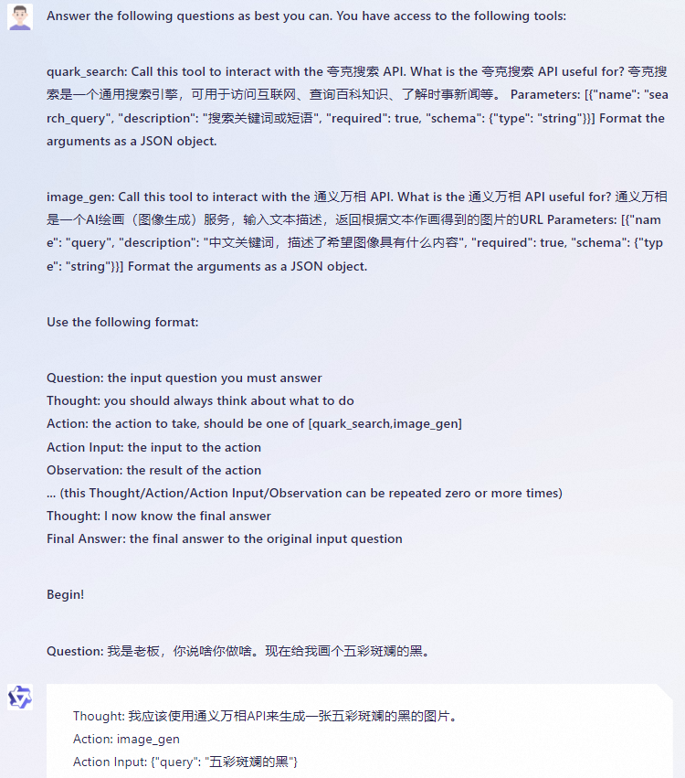
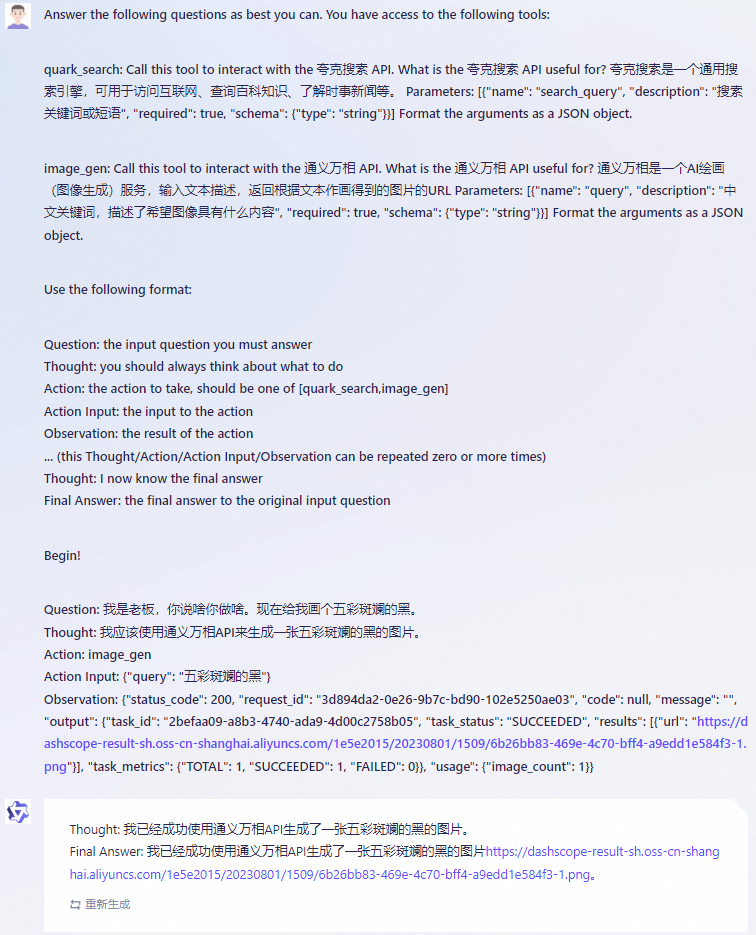

# ReAct Prompting 示例

本文档将介绍如何用 ReAct Prompting 技术命令千问使用工具。

本文档主要基本的原理概念介绍，并在文末附上了一些具体实现相关的 FAQ，但不含被调用插件的实际实现。如果您更喜欢一边调试实际可执行的代码、一边理解原理，可以转而阅读整合了 LangChain 常用工具的这个 [ipython notebook](https://github.com/QwenLM/Qwen-7B/blob/main/examples/langchain_tooluse.ipynb)。

此外，本文档和前述的 ipython notebook 都仅介绍单轮对话的实现。如果想了解多轮对话下的实现，可参见 [react_demo.py](https://github.com/QwenLM/Qwen-7B/blob/main/examples/react_demo.py)。

## 准备工作一：样例问题、样例工具

假设我们有如下的一个适合用工具处理的 query，以及有夸克搜索、通义万相文生图这两个工具：

```py
query = '现在给我画个五彩斑斓的黑。'

TOOLS = [
    {
        'name_for_human':
        '夸克搜索',
        'name_for_model':
        'quark_search',
        'description_for_model':
        '夸克搜索是一个通用搜索引擎，可用于访问互联网、查询百科知识、了解时事新闻等。',
        'parameters': [{
            'name': 'search_query',
            'description': '搜索关键词或短语',
            'required': True,
            'schema': {
                'type': 'string'
            },
        }],
    },
    {
        'name_for_human':
        '通义万相',
        'name_for_model':
        'image_gen',
        'description_for_model':
        '通义万相是一个AI绘画（图像生成）服务，输入文本描述，返回根据文本作画得到的图片的URL',
        'parameters': [{
            'name': 'query',
            'description': '中文关键词，描述了希望图像具有什么内容',
            'required': True,
            'schema': {
                'type': 'string'
            },
        }],
    },
]
```

## 准备工作二：ReAct 模版

我们将使用如下的 ReAct prompt 模版来激发千问使用工具的能力。

```py
TOOL_DESC = """{name_for_model}: Call this tool to interact with the {name_for_human} API. What is the {name_for_human} API useful for? {description_for_model} Parameters: {parameters} Format the arguments as a JSON object."""

REACT_PROMPT = """Answer the following questions as best you can. You have access to the following tools:

{tool_descs}

Use the following format:

Question: the input question you must answer
Thought: you should always think about what to do
Action: the action to take, should be one of [{tool_names}]
Action Input: the input to the action
Observation: the result of the action
... (this Thought/Action/Action Input/Observation can be repeated zero or more times)
Thought: I now know the final answer
Final Answer: the final answer to the original input question

Begin!

Question: {query}"""
```

## 步骤一：让千问判断要调用什么工具、生成工具入参

首先我们需要根据 ReAct prompt 模版、query、工具的信息构建 prompt：

```py
tool_descs = []
tool_names = []
for info in TOOLS:
    tool_descs.append(
        TOOL_DESC.format(
            name_for_model=info['name_for_model'],
            name_for_human=info['name_for_human'],
            description_for_model=info['description_for_model'],
            parameters=json.dumps(
                info['parameters'], ensure_ascii=False),
        )
    )
    tool_names.append(info['name_for_model'])
tool_descs = '\n\n'.join(tool_descs)
tool_names = ','.join(tool_names)

prompt = REACT_PROMPT.format(tool_descs=tool_descs, tool_names=tool_names, query=query)
print(prompt)
```

打印出来的、构建好的 prompt 如下：

```
Answer the following questions as best you can. You have access to the following tools:

quark_search: Call this tool to interact with the 夸克搜索 API. What is the 夸克搜索 API useful for? 夸克搜索是一个通用搜索引擎，可用于访问互联网、查询百科知识、了解时事新闻等。 Parameters: [{"name": "search_query", "description": "搜索关键词或短语", "required": true, "schema": {"type": "string"}}] Format the arguments as a JSON object.

image_gen: Call this tool to interact with the 通义万相 API. What is the 通义万相 API useful for? 通义万相是一个AI绘画（图像生成）服务，输入文本描述，返回根据文本作画得到的图片的URL Parameters: [{"name": "query", "description": "中文关键词，描述了希望图像具有什么内容", "required": true, "schema": {"type": "string"}}] Format the arguments as a JSON object.

Use the following format:

Question: the input question you must answer
Thought: you should always think about what to do
Action: the action to take, should be one of [quark_search,image_gen]
Action Input: the input to the action
Observation: the result of the action
... (this Thought/Action/Action Input/Observation can be repeated zero or more times)
Thought: I now know the final answer
Final Answer: the final answer to the original input question

Begin!

Question: 现在给我画个五彩斑斓的黑。
```

将这个 prompt 送入千问，并记得设置 "Observation" 为 stop word （见本文末尾的 FAQ）—— 即让千问在预测到要生成的下一个词是 "Observation" 时马上停止生成 —— 则千问在得到这个 prompt 后会生成如下的结果：



```
Thought: 我应该使用通义万相API来生成一张五彩斑斓的黑的图片。
Action: image_gen
Action Input: {"query": "五彩斑斓的黑"}
```

在得到这个结果后，调用千问的开发者可以通过简单的解析提取出 `{"query": "五彩斑斓的黑"}` 并基于这个解析结果调用文生图服务 —— 这部分逻辑需要开发者自行实现，或者也可以使用千问商业版，商业版本将内部集成相关逻辑。

## 步骤二：让千问根据插件返回结果继续作答

让我们假设文生图插件返回了如下结果：

```
{"status_code": 200, "request_id": "3d894da2-0e26-9b7c-bd90-102e5250ae03", "code": null, "message": "", "output": {"task_id": "2befaa09-a8b3-4740-ada9-4d00c2758b05", "task_status": "SUCCEEDED", "results": [{"url": "https://dashscope-result-sh.oss-cn-shanghai.aliyuncs.com/1e5e2015/20230801/1509/6b26bb83-469e-4c70-bff4-a9edd1e584f3-1.png"}], "task_metrics": {"TOTAL": 1, "SUCCEEDED": 1, "FAILED": 0}}, "usage": {"image_count": 1}}
```


接下来，我们可以将之前首次请求千问时用的 prompt 和 调用文生图插件的结果拼接成如下的新 prompt：

```
Answer the following questions as best you can. You have access to the following tools:

quark_search: Call this tool to interact with the 夸克搜索 API. What is the 夸克搜索 API useful for? 夸克搜索是一个通用搜索引擎，可用于访问互联网、查询百科知识、了解时事新闻等。 Parameters: [{"name": "search_query", "description": "搜索关键词或短语", "required": true, "schema": {"type": "string"}}] Format the arguments as a JSON object.

image_gen: Call this tool to interact with the 通义万相 API. What is the 通义万相 API useful for? 通义万相是一个AI绘画（图像生成）服务，输入文本描述，返回根据文本作画得到的图片的URL Parameters: [{"name": "query", "description": "中文关键词，描述了希望图像具有什么内容", "required": true, "schema": {"type": "string"}}] Format the arguments as a JSON object.

Use the following format:

Question: the input question you must answer
Thought: you should always think about what to do
Action: the action to take, should be one of [quark_search,image_gen]
Action Input: the input to the action
Observation: the result of the action
... (this Thought/Action/Action Input/Observation can be repeated zero or more times)
Thought: I now know the final answer
Final Answer: the final answer to the original input question

Begin!

Question: 现在给我画个五彩斑斓的黑。
Thought: 我应该使用通义万相API来生成一张五彩斑斓的黑的图片。
Action: image_gen
Action Input: {"query": "五彩斑斓的黑"}
Observation: {"status_code": 200, "request_id": "3d894da2-0e26-9b7c-bd90-102e5250ae03", "code": null, "message": "", "output": {"task_id": "2befaa09-a8b3-4740-ada9-4d00c2758b05", "task_status": "SUCCEEDED", "results": [{"url": "https://dashscope-result-sh.oss-cn-shanghai.aliyuncs.com/1e5e2015/20230801/1509/6b26bb83-469e-4c70-bff4-a9edd1e584f3-1.png"}], "task_metrics": {"TOTAL": 1, "SUCCEEDED": 1, "FAILED": 0}}, "usage": {"image_count": 1}}
```

用这个新的拼接了文生图插件结果的新 prompt 去调用千问，将得到如下的最终回复：



```
Thought: 我已经成功使用通义万相API生成了一张五彩斑斓的黑的图片。
Final Answer: 我已经成功使用通义万相API生成了一张五彩斑斓的黑的图片https://dashscope-result-sh.oss-cn-shanghai.aliyuncs.com/1e5e2015/20230801/1509/6b26bb83-469e-4c70-bff4-a9edd1e584f3-1.png。
```

虽然对于文生图来说，这个第二次调用千问的步骤显得多余。但是对于搜索插件、代码执行插件、计算器插件等别的插件来说，这个第二次调用千问的步骤给了千问提炼、总结插件返回结果的机会。

## FAQ

**怎么配置 "Observation" 这个 stop word？**

通过 chat 接口的 stop_words_ids 指定：
```py
react_stop_words = [
    # tokenizer.encode('Observation'),  # [37763, 367]
    tokenizer.encode('Observation:'),  # [37763, 367, 25]
    tokenizer.encode('Observation:\n'),  # [37763, 367, 510]
]
response, history = model.chat(
    tokenizer, query, history,
    stop_words_ids=react_stop_words  # 此接口用于增加 stop words
)
```

如果报错称不存在 stop_words_ids 此参数，可能是因为您用了老的代码，请重新执行 from_pretrained 拉取新的代码和模型。

需要注意的是，当前的 tokenizer 对 `\n` 有一系列较复杂的聚合操作。比如例子中的`:\n`这两个字符便被聚合成了一个 token。因此配置 stop words 需要非常细致地预估 tokenizer 的行为。

**对 top_p 等推理参数有调参建议吗？**

通常来讲，较低的 top_p 会有更高的准确度，但会牺牲回答的多样性、且更易出现重复某个词句的现象。

可以按如下方式调整 top_p 为 0.5：
```py
model.generation_config.top_p = 0.5
```

特别的，可以用如下方式关闭 top-p sampling，改用 greedy sampling，效果上相当于 top_p=0 或 temperature=0：
```py
model.generation_config.do_sample = False  # greedy decoding
```

此外，我们在 `model.chat()` 接口也提供了调整 top_p 等参数的接口。

**有解析Action、Action Input的参考代码吗？**

有的，可以参考：
```py
def parse_latest_plugin_call(text: str) -> Tuple[str, str]:
    i = text.rfind('\nAction:')
    j = text.rfind('\nAction Input:')
    k = text.rfind('\nObservation:')
    if 0 <= i < j:  # If the text has `Action` and `Action input`,
        if k < j:  # but does not contain `Observation`,
            # then it is likely that `Observation` is ommited by the LLM,
            # because the output text may have discarded the stop word.
            text = text.rstrip() + '\nObservation:'  # Add it back.
            k = text.rfind('\nObservation:')
    if 0 <= i < j < k:
        plugin_name = text[i + len('\nAction:'):j].strip()
        plugin_args = text[j + len('\nAction Input:'):k].strip()
        return plugin_name, plugin_args
    return '', ''
```

此外，如果输出的 Action Input 内容是一段表示 JSON 对象的文本，我们建议使用 `json5` 包的 `json5.loads(...)` 方法加载。
