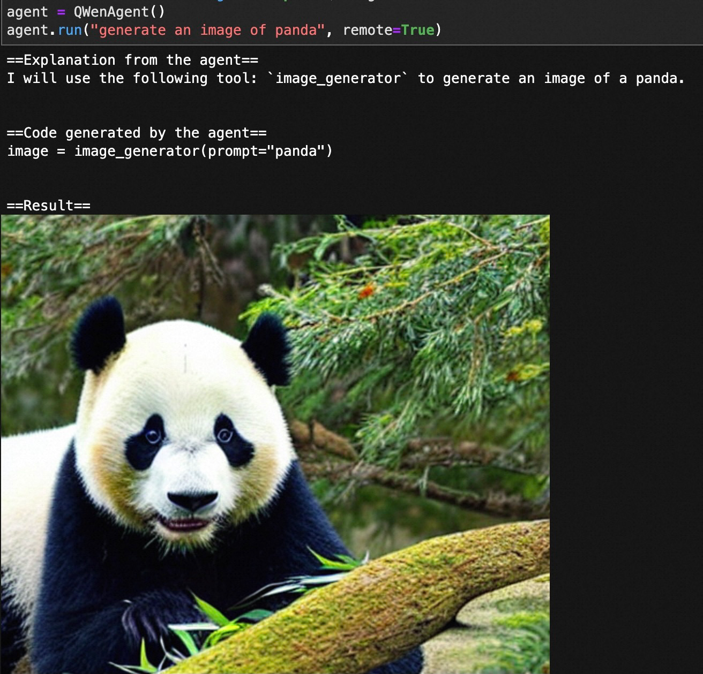
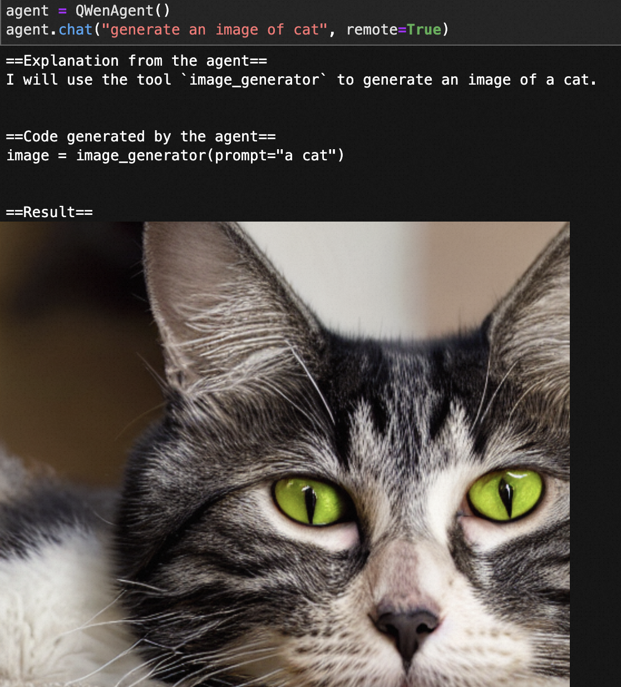
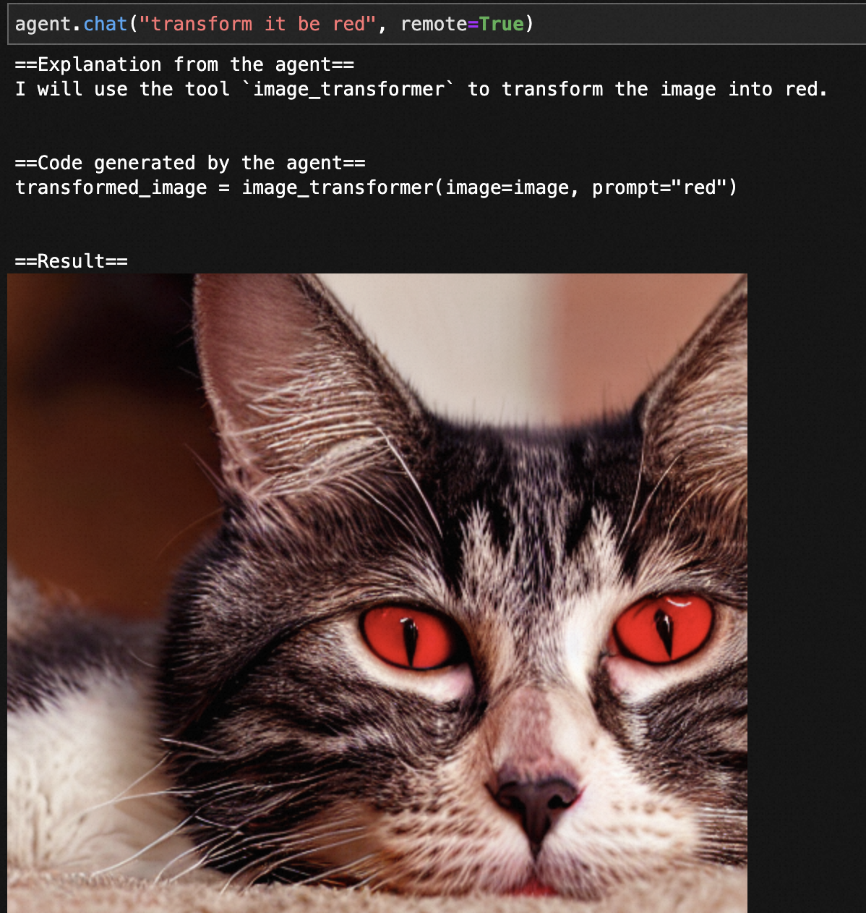

## 什么是HuggingFace Agent
使用大模型作为Agent，仅需自然语言就可调用HuggingFace中的模型，目前支持两种模式：

- run模式：单轮对话，没有上下文，单个prompt多tool组合调用能力好
- chat模式：多轮对话，有上下文，单次调用能力好，可能需要多次prompt实现多tool组合调用
> 详见官方文档：[Transformers Agents](https://huggingface.co/docs/transformers/transformers_agents)

## 使用通义千问作为Agent
### 安装依赖
```
pip install transformers
```
### 构建QWenAgent
以下代码便可实现QWenAgent：
```python
import torch
from transformers import AutoModelForCausalLM, AutoTokenizer, Agent
from transformers.generation import GenerationConfig


class QWenAgent(Agent):
    """
    Agent that uses QWen model and tokenizer to generate code.

    Args:
        chat_prompt_template (`str`, *optional*):
            Pass along your own prompt if you want to override the default template for the `chat` method. Can be the
            actual prompt template or a repo ID (on the Hugging Face Hub). The prompt should be in a file named
            `chat_prompt_template.txt` in this repo in this case.
        run_prompt_template (`str`, *optional*):
            Pass along your own prompt if you want to override the default template for the `run` method. Can be the
            actual prompt template or a repo ID (on the Hugging Face Hub). The prompt should be in a file named
            `run_prompt_template.txt` in this repo in this case.
        additional_tools ([`Tool`], list of tools or dictionary with tool values, *optional*):
            Any additional tools to include on top of the default ones. If you pass along a tool with the same name as
            one of the default tools, that default tool will be overridden.

    Example:

    ```py
    agent = QWenAgent()
    agent.run("Draw me a picture of rivers and lakes.")
    ```
    """
    def __init__(self, chat_prompt_template=None, run_prompt_template=None, additional_tools=None):
        checkpoint = "Qwen/Qwen-7B-Chat"
        self.tokenizer = AutoTokenizer.from_pretrained(checkpoint, trust_remote_code=True)
        self.model = AutoModelForCausalLM.from_pretrained(checkpoint, device_map="auto", trust_remote_code=True).cuda().eval()
        self.model.generation_config = GenerationConfig.from_pretrained(checkpoint, trust_remote_code=True) # 可指定不同的生成长度、top_p等相关超参
        self.model.generation_config.do_sample = False  # greedy
        
        super().__init__(
            chat_prompt_template=chat_prompt_template,
            run_prompt_template=run_prompt_template,
            additional_tools=additional_tools,
        )

    def generate_one(self, prompt, stop):
        # "Human:" 和 "Assistant:" 曾为通义千问的特殊保留字，需要替换为 "_HUMAN_:" 和 "_ASSISTANT_:"。这一问题将在未来版本修复。
        prompt = prompt.replace("Human:", "_HUMAN_:").replace("Assistant:", "_ASSISTANT_:")
        stop = [item.replace("Human:", "_HUMAN_:").replace("Assistant:", "_ASSISTANT_:") for item in stop]

        result, _ = self.model.chat(self.tokenizer, prompt, history=None)
        for stop_seq in stop:
            if result.endswith(stop_seq):
                result = result[: -len(stop_seq)]

        result = result.replace("_HUMAN_:", "Human:").replace("_ASSISTANT_:", "Assistant:")
        return result


agent = QWenAgent()
agent.run("Draw me a picture of rivers and lakes.")
```
### 使用示例
```python
agent = QWenAgent()
agent.run("generate an image of panda", remote=True)
```



> 更多玩法参考HuggingFace官方文档[Transformers Agents](https://huggingface.co/docs/transformers/transformers_agents)

## Tools
### Tools支持
HuggingFace Agent官方14个tool：

- **Document question answering**: given a document (such as a PDF) in image format, answer a question on this document (Donut)
- **Text question answering**: given a long text and a question, answer the question in the text (Flan-T5)
- **Unconditional image captioning**: Caption the image! (BLIP)
- **Image question answering**: given an image, answer a question on this image (VILT)
- **Image segmentation**: given an image and a prompt, output the segmentation mask of that prompt (CLIPSeg)
- **Speech to text**: given an audio recording of a person talking, transcribe the speech into text (Whisper)
- **Text to speech**: convert text to speech (SpeechT5)
- **Zero-shot text classification**: given a text and a list of labels, identify to which label the text corresponds the most (BART)
- **Text summarization**: summarize a long text in one or a few sentences (BART)
- **Translation**: translate the text into a given language (NLLB)
- **Text downloader**: to download a text from a web URL
- **Text to image**: generate an image according to a prompt, leveraging stable diffusion
- **Image transformation**: transforms an image
- **Text to video**: generate a small video according to a prompt, leveraging damo-vilab
### Tools模型部署
部分工具涉及的模型HuggingFace已进行在线部署，仅需设置remote=True便可实现在线调用：
> agent.run(xxx, remote=True)

HuggingFace没有在线部署的模型会自动下载checkpoint进行本地inference
网络原因偶尔连不上HuggingFace，请多次尝试
