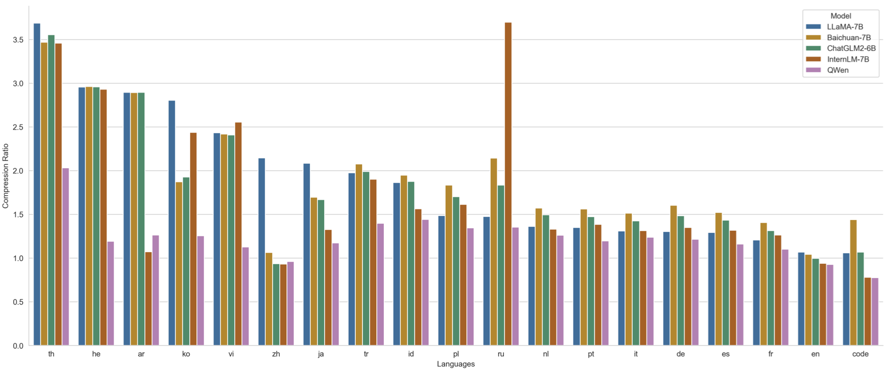

# Introducing Qwen-7B: Open foundation and human-aligned models (of the state-of-the-arts)

Large language models have recently attracted an extremely large amount of
attention.
The boom of [ChatGPT](https://openai.com/blog/chatgpt) rocketed the development of artificial general intelligence and indicates that large language models compress world knowledge into neural networks, and the alignment to human cognition can lead to powerful conversational agents that can provide assistance by interacting with human users.
Now, the latest version of ChatGPT based on [GPT-4](https://arxiv.org/abs/2303.08774) demonstrates tremendously exciting performance across unlimited capabilities, say, language understanding, logical reasoning, planning, etc., and its incorporation with external tools, including tools and models, releases the power of an agent capable of understanding instructions, executing code, using tools, and so on, to reach the objectives set up by human users.

These significant progresses indicate the importance of large language models as _the foundation of AI services_.

We are happy to release the 7B-parameter models of our large pretrained model series Qwen (abbr. Tongyi Qianwen), Qwen-7B.
This release includes model weights and codes for pretrained and human-aligned language models of 7B parameters:

- `Qwen-7B` is the pretrained language model, and `Qwen-7B-Chat` is fine-tuned to align with human intent.
- `Qwen-7B` is pretrained on over 2.2 trillion tokens with a context length of 2048. On the series of benchmarks we tested, Qwen-7B generally performs better than existing open models of similar scales and appears to be on par with some of the larger models.
- `Qwen-7B-Chat` is fine-tuned on curated data, including not only task-oriented data but also specific security- and service-oriented data, which seems insufficient in existing open models.
- Example codes for fine-tuning, evaluation, and inference are included. There are also guides on long-context and tool use in inference.

**Goal of release**:
We believe that while the recent waves of releases of LLMs may have deepened our understanding of model behaviors under standard regimes, it is yet to be revealed how the accompanied techniques of nowadays LLMs, such as 1) quantization and fine-tuning after quantization, 2) training-free long-context inference, and 3) fine-tuning with service-oriented data, including search and tool uses, affect the models as a whole.
The open release of Qwen-7B marks our first step towards fully understanding the real-world application of such techniques.
It is our hope that it will enable the community to analyze and continue to improve the safety of those models, striving to establish responsible development and deployment of LLMs.

> **Disclaimer**:
> We must note that even though the weights and codes are released in an open manner and commercial use is not prohibited, similar to other pretrained language models, Qwen-7B comes with potential risks influenced by complex factors, including but not limited to over-diversified, inaccurate, or misleading generation.
> Developers and stakeholders should perform their own red teaming and provide related security measures before deployment, and they must abide by and comply with local governance and regulations.
> In no event shall the authors be held liable for any claim, damages, or other liability arising from the use of the released weights or codes.

The remainder of this document describes our pretraining and fine-tuning methodology.

## Pretraining

Qwen-7B is a transformer-based decoder-only language model with an architecture similar to the [LLaMA](https://github.com/facebookresearch/llama) series of models.
It is pretrained on over 2.2 trillion tokens with 2048 context length from publicly available data, covering general and professional fields with a focus on the English and Chinese languages.

### Data

**Pretraining data**:
Our training data includes a mix of data from publicly available sources, consisting mainly of web documents and code files.
Besides, the data are multilingual, with most of them in English and Chinese.
We made an effort and employed an ensemble of models to exclude data of low quality or deemed unfit for pretraining, such as NSFW content.
For math reasoning, we include RFT data from [gsm8k-ScRel](https://github.com/OFA-Sys/gsm8k-ScRel).
The final data underwent global fuzzy deduplication.
The mix of pretraining corpora has been optimized through numerous ablation experiments.

**Tokenization**:
Compared to the current mainstream open models based on Chinese and English vocabularies, we use a vocabulary of 151,851 tokens.
It first considers efficient encoding of Chinese, English, and code data, and is also more friendly to multilingual languages, enabling users to directly enhance the capability of some languages without expanding the vocabulary.
It segments numbers by single digits and calls the [tiktoken](https://github.com/openai/tiktoken) tokenizer library for efficient tokenization.
After tokenization, the data amounts to over 2.2 trillion tokens.

<figure>
    
    <figcaption>We randomly selected 1 million document corpora of each language to test and compare the encoding compression rates of different models (with XLM-R, which supports 100 languages, as the base value 1, not shown in the figure). As can be seen, while ensuring the efficient decoding of Chinese, English, and code, Qwen-7B also achieves a high compression rate for many other languages (such as th, he, ar, ko, vi, ja, tr, id, pl, ru, nl, pt, it, de, es, fr etc.), equipping the model with strong scalability as well as high training and inference efficiency in these languages.</figcaption>
</figure>

### Model

**Model architecture**:
Qwen-7B is built with architecture similar to LLaMA.
The following are the main differences from the standard transformer: 1) using untied embedding, 2) using rotary positional embedding, 3) no biases except for QKV in attention, 4) RMSNorm instead of LayerNorm, 5) SwiGLU instead of ReLU, and 6) adopting flash attention to accelerate training.
The model has 32 layers, the embedding dimension is 4096, and the number of attention heads is 32.

**Training details**:
The model is trained using the AdamW optimizer, with $\beta_1=0.9, \beta_2=0.95, \epsilon=10^{-6}$.
The sequence length is 2048, and the batch size is 2048, which means each optimization step accumulates over 4 million tokens.
We use a cosine learning rate schedule, with a warm-up of 2000 steps, a peak learning rate of $3 \times 10^{-4}$, and a minimum learning rate of 10% of the peak learning rate.
We use a weight decay of 0.1 and gradient clipping of 1.0.
The training adopts mixed precision training with `bfloat16`.

### Evaluation

We report results of Qwen-7B on standard benchmarks.

#### World knowledge

[C-Eval](https://arxiv.org/abs/2305.08322) is a common evaluation benchmark for testing the common-sense capability of pretrained models in Chinese. It covers 52 subjects in four major directions: humanities, social sciences, STEM, and other specialties. According to standard practice, we use the development set samples as the source of few-shot prompts to evaluate the 5-shot validation set and test set accuracy of the Qwen-7B pretrained model.

The accuracy comparison of the Qwen-7B model and other models on the C-Eval validation set is as follows:

| Model       |  Average |
| :---------- | -------: |
| Alpaca-7B   |     28.9 |
| Vicuna-7B   |     31.2 |
| ChatGLM-6B  |     37.1 |
| Baichuan-7B |     42.7 |
| ChatGLM2-6B |     50.9 |
| InternLM-7B |     53.4 |
| ChatGPT     |     53.5 |
| Claude-v1.3 |     55.5 |
| **Qwen-7B** | **60.8** |

The performance comparison of the Qwen-7B pretrained model and other models on the C-Eval test set is shown in the following table:

| Model                   | Avg.     | Avg. (Hard) | STEM | Social Sciences | Humanities | Others |
| :---------------------- | -------- | ----------: | ---: | --------------: | ---------: | -----: |
| ChatGLM-6B              | 38.9     |        29.2 | 33.3 |            48.3 |       41.3 |   38.0 |
| Chinese-Alpaca-Plus-13B | 41.5     |        30.5 | 36.6 |            49.7 |       43.1 |   41.2 |
| Baichuan-7B             | 42.8     |        31.5 | 38.2 |            52.0 |       46.2 |   39.3 |
| WestlakeLM-19B          | 44.6     |        34.9 | 41.6 |            51.0 |       44.3 |   44.5 |
| AndesLM-13B             | 46.0     |        29.7 | 38.1 |            61.0 |       51.0 |   41.9 |
| BatGPT-15B-sirius       | 47.0     |        31.9 | 42.7 |            57.5 |       48.6 |   43.6 |
| ChatGLM2-6B             | 51.7     |        37.1 | 48.6 |            60.5 |       51.3 |   49.8 |
| InternLM-7B             | 52.8     |        37.1 | 48.0 |            67.4 |       55.4 |   45.8 |
| Baichuan-13B            | 53.6     |        36.7 | 47.0 |            66.8 |       57.3 |   49.8 |
| Claude-v1.3             | 54.2     |        39.0 | 51.9 |            61.7 |       52.1 |   53.7 |
| ChatGPT                 | 54.4     |        41.4 | 52.9 |            61.8 |       50.9 |   53.6 |
| **Qwen-7B**             | **59.6** |        41.0 | 52.8 |            74.1 |       63.1 |   55.2 |

As can be seen, Qwen-7B achieves the best performance out of all existing models of similar scale and even surpasses larger-scale models.

MMLU is currently one of the most recognized benchmarks for evaluating English comprehension abilities, covering 57 subtasks across different academic fields and difficulty levels. The MMLU 5-shot accuracy performance of the Qwen-7B is shown in the following table:

| Model        |  Average | STEM | Social Sciences | Humanities | Others |
| :----------- | -------: | ---: | --------------: | ---------: | -----: |
| LLaMA-7B     |     35.1 | 30.5 |            38.3 |       34.0 |   38.1 |
| Baichuan-7B  |     42.3 | 35.6 |            48.9 |       38.4 |   48.1 |
| LLaMA2-7B    |     45.3 | 36.4 |            51.2 |       42.9 |   52.2 |
| LLaMA-13B    |     46.9 | 35.8 |            53.8 |       45.0 |   53.3 |
| ChatGLM2-6B  |     47.9 | 41.2 |            54.4 |       43.7 |   54.5 |
| InternLM-7B  |     51.0 |    - |               - |          - |      - |
| Baichuan-13B |     51.6 | 41.6 |            60.9 |       47.4 |   58.5 |
| LLaMA2-13B   |     54.8 | 44.1 |            62.6 |       52.8 |   61.1 |
| ChatGLM2-12B |     56.2 | 48.2 |            65.1 |       52.6 |   60.9 |
| **Qwen-7B**  | **56.7** | 47.6 |            65.9 |       51.5 |   64.7 |

In terms of English, Qwen-7B also surpasses other similar open pretrained models, and is competitive when compared to larger versions of other models.

#### Coding

We compared the code capabilities of pretrained models on [HumanEval](https://github.com/openai/human-eval), and the results are as follows:

| Model        |   Pass@1 |
| :----------- | -------: |
| Baichuan-7B  |      9.2 |
| ChatGLM2-6B  |      9.2 |
| InternLM-7B  |     10.4 |
| LLaMA-7B     |     10.5 |
| LLaMA2-7B    |     12.8 |
| Baichuan-13B |     12.8 |
| LLaMA-13B    |     15.8 |
| MPT-7B       |     18.3 |
| LLaMA2-13B   |     18.3 |
| **Qwen-7B**  | **24.4** |

#### Math

We compared the math capabilities of pretrained models on [GSM8K](https://github.com/openai/grade-school-math) (8-shot), and the results are as follows:

| Model        | Accuracy |
| :----------- | -------: |
| MPT-7B       |      6.8 |
| Falcon-7B    |      6.8 |
| Baichuan-7B  |      9.7 |
| LLaMA-7B     |     11.0 |
| LLaMA2-7B    |     14.6 |
| LLaMA-13B    |     17.8 |
| Baichuan-13B |     26.6 |
| LLaMA2-13B   |     28.7 |
| InternLM-7B  |     31.2 |
| ChatGLM2-6B  |     32.4 |
| ChatGLM2-12B |     40.9 |
| **Qwen-7B**  | **51.6** |

#### Natural language processing

We compared the translation capabilities of pre-trained models on WMT22 zh-en and en-zh (5-shot BLEU), and the results are as follows:

| Model       |  Average |    zh-en |    en-zh |
| :---------- | -------: | -------: | -------: |
| InternLM-7B |     11.8 |      9.0 |     14.5 |
| LLaMA-7B    |     12.7 |     16.7 |      8.7 |
| LLaMA-13B   |     15.8 |     19.5 |     12.0 |
| LLaMA2-7B   |     19.9 |     21.9 |     17.9 |
| Bloom-7B    |     20.3 |     19.1 |     21.4 |
| LLaMA2-13B  |     23.3 |     22.4 |     24.2 |
| PolyLM-13B  |     23.6 |     20.2 |     27.0 |
| Baichuan-7B |     24.6 |     22.6 |     26.6 |
| **Qwen-7B** | **27.5** | **24.3** | **30.6** |

#### Long-context inference

We include support for training-free long-context inference based on ntk-aware interpolation, LogN attention scaling, and local window attention.
The context can be expanded from 2048 to over 8192.
The following are the test results on arXiv in terms of perplexity (PPL).

<table>
	<tr>
        <th rowspan="2">Model</th><th colspan="5" align="center">Sequence Length</th>
    </tr>
    <tr>
        <th align="center">1024</th><th align="center">2048</th><th align="center">4096</th><th align="center">8192</th><th align="center">16384</th>
    </tr>
    <tr>
        <td>Qwen-7B</td><td align="right"><b>4.23</b></td><td align="right"><b>3.78</b></td><td align="right">39.35</td><td align="right">469.81</td><td align="right">2645.09</td>
    </tr>
    <tr>
        <td>+ dynamic_ntk</td><td align="right"><b>4.23</b></td><td align="right"><b>3.78</b></td><td align="right">3.59</td><td align="right">3.66</td><td align="right">5.71</td>
    </tr>
    <tr>
        <td>+ dynamic_ntk + logn</td><td align="right"><b>4.23</b></td><td align="right"><b>3.78</b></td><td align="right"><b>3.58</b></td><td align="right">3.56</td><td align="right">4.62</td>
    </tr>
    <tr>
        <td>+ dynamic_ntk + logn + local_attn</td><td align="right"><b>4.23</b></td><td align="right"><b>3.78</b></td><td align="right"><b>3.58</b></td><td align="right"><b>3.49</b></td><td align="right"><b>4.32</b></td>
    </tr>
</table>

## Fine-tuning

`Qwen-7B-Chat` embodies our practice in alignment with human intents, ensuring internalized safety, and building intelligent agents for services.

### Data

**Alignment data**:
The data includes common instruction-style conversations, and security- and service-oriented data, which involves substantial annotation efforts.
Instruction data covers broad abilities, such as writing, question answering, brainstorming and planning, content understanding, summarization, natural language processing, and coding.
Security data tries to prevent the model from generating harmful and inappropriate content.
Service data tries to enhance the model with specific conversation patterns that can be parsed to invoke and incorporate external systems.

**Data formatting**:
Since the data consists of conversation turns, we arrange them into texts using the [ChatML](https://github.com/openai/openai-python/blob/main/chatml.md) format, which is a meta language that can describe both the metadata (e.g., roles) and the content of a turn.
Currently, existing roles include system, user, and assistant.

### Model

**Training details**:
The causal language modeling objective is used to fine-tune the model, except for the tokens in the content of user's turns.
The model is trained using the AdamW optimizer, with $\beta_1=0.9, \beta_2=0.95, \epsilon=10^{-6}$.
The sequence length is limited to 2048, and the batch size is 128.
The model is trained for 4000 steps, and over the first 1430 steps, the learning rate is warmed up to $1 \times 10^{-5}$.
We use weight decay of 0.1, dropout of 0.1, and gradient clipping of 1.0.

### Evaluation

Evaluation of human-aligned models is non-trivial and often non-standardized, since such models often target specific applications.
We evaluate Qwen-7B-Chat from multiple perspectives.

#### World knowledge

As fine-tuning uses a much smaller dataset than pretraining and humans' understanding of world knowledge may be limited, we also evaluate the world knowledge of Qwen-7B-Chat using C-Eval and MMLU in a zero-shot and generative manner.

We demonstrate the zero-shot accuracy of Qwen-7B-Chat on the C-Eval validation set.

| Model                   | Avg. Acc. |
| :---------------------- | --------: |
| LLaMA2-7B-Chat          |      31.9 |
| LLaMA2-13B-Chat         |      40.6 |
| Chinese-Alpaca-2-7B     |      41.3 |
| Chinese-Alpaca-Plus-13B |      43.3 |
| Baichuan-13B-Chat       |      50.4 |
| ChatGLM2-6B-Chat        |      50.7 |
| InternLM-7B-Chat        |      53.2 |
| **Qwen-7B-Chat**        |  **54.2** |

The zero-shot accuracy of Qwen-7B-Chat on C-Eval testing set is provided below

| Model                   |     Avg. | STEM | Social Sciences | Humanities | Others |
| :---------------------- | -------: | ---: | --------------: | ---------: | -----: |
| Chinese-Alpaca-Plus-13B |     41.5 | 36.6 |            49.7 |       43.1 |   41.2 |
| Chinese-Alpaca-2-7B     |     40.3 |    - |               - |          - |      - |
| ChatGLM2-6B-Chat        |     50.1 | 46.4 |            60.4 |       50.6 |   46.9 |
| Baichuan-13B-Chat       |     51.5 | 43.7 |            64.6 |       56.2 |   49.2 |
| **Qwen-7B-Chat**        | **54.6** | 47.8 |            67.6 |       59.3 |   50.6 |

Compared with other models with comparable model sizes, the human-aligned Qwen-7B-Chat performs well in C-Eval accuracy.

The zero-shot accuracy of Qwen-7B-Chat on MMLU is provided below.
The performance of Qwen-7B-Chat is still on top among other human-aligned models with comparable size.

| Model             | Avg. Acc. |
| :---------------- | --------: |
| ChatGLM2-6B-Chat  |      45.5 |
| LLaMA2-7B-Chat    |      47.0 |
| InternLM-7B-Chat  |      50.8 |
| Baichuan-13B-Chat |      52.1 |
| ChatGLM2-12B-Chat |      52.1 |
| **Qwen-7B-Chat**  |  **53.9** |

#### Coding

The zero-shot Pass@1 of Qwen-7B-Chat on [HumanEval](https://github.com/openai/human-eval) is demonstrated below

| Model             |   Pass@1 |
| :---------------- | -------: |
| LLaMA2-7B-Chat    |     12.2 |
| InternLM-7B-Chat  |     14.0 |
| Baichuan-13B-Chat |     16.5 |
| LLaMA2-13B-Chat   |     18.9 |
| **Qwen-7B-Chat**  | **24.4** |

#### Math

The accuracy of Qwen-7B-Chat on GSM8K is shown below

| Model             | Zero-shot Acc. | 4-shot Acc. |
| :---------------- | -------------: | ----------: |
| ChatGLM2-6B-Chat  |              - |        28.0 |
| LLaMA2-7B-Chat    |           20.4 |        28.2 |
| LLaMA2-13B-Chat   |           29.4 |        36.7 |
| InternLM-7B-Chat  |           32.6 |        34.5 |
| Baichuan-13B-Chat |              - |        36.3 |
| ChatGLM2-12B-Chat |              - |        38.1 |
| **Qwen-7B-Chat**  |       **41.1** |    **43.5** |

#### Service

LLMs have shown capability in coordinating multiple external systems to achieve the given instructions, which creates new opportunities in traditional online services, the most notable being web search.

Qwen supports calling plugins/tools/APIs through [ReAct Prompting](https://arxiv.org/abs/2210.03629).
ReAct is also one of the main approaches used by the [LangChain](https://python.langchain.com/) framework.
For how to write and use prompts for ReAct Prompting, please refer to [the ReAct examples](examples/react_prompt.md).
In our evaluation [benchmark](eval/EVALUATION.md) for assessing tool usage capabilities, Qwen's performance is as follows:

| Model       | Tool Selection (Acc.↑)      | Tool Input (Rouge-L↑)      | False Positive Error↓      |
| :---------- | --------------------------: | -------------------------: | -------------------------: |
| GPT-4       |                         95% |                   **0.90** |                      15.0% |
| GPT-3.5     |                         85% |                       0.88 |                      75.0% |
| **Qwen-7B** |                     **99%** |                       0.89 |                   **9.7%** |

> The plugins that appear in the evaluation set do not appear in the training set of Qwen.
> This benchmark evaluates the accuracy of the model in selecting the correct plugin from multiple candidate plugins, the rationality of the parameters passed into the plugin, and the false positive rate.
> False Positive: Incorrectly invoking a plugin when it should not have been called when responding to a query.

Qwen also has the capability to be used as a [HuggingFace Agent](https://huggingface.co/docs/transformers/transformers_agents).
Its performance on the benchmark provided by HuggingFace is as follows:

| Model           | Tool Selection↑      | Tool Used↑      | Code↑      |
| :-------------- | -------------------: | --------------: | ---------: |
| GPT-4           |           **100.00** |      **100.00** |  **97.41** |
| GPT-3.5         |                95.37 |           96.30 |      87.04 |
| StarCoder-15.5B |                87.04 |           87.96 |      68.89 |
| **Qwen-7B**     |                90.74 |           92.59 |      74.07 |

## Conclusion

In this document, we describe Qwen-7B, including a pretrained model and a human-aligned model.
These models have demonstrated exciting performance compared to existing open models of similar or even larger scales.
As part of our ongoing commitment to the concept of Model as a Service, the release also includes practical pieces such as long context inference and external system integration, which we hope would facilitate developers realizing their own ideas and concepts.
We believe that the open release of Qwen-7B models would further our understanding of variables and techniques introduced in realistic settings and help to drive progress in this important area together with the community.
